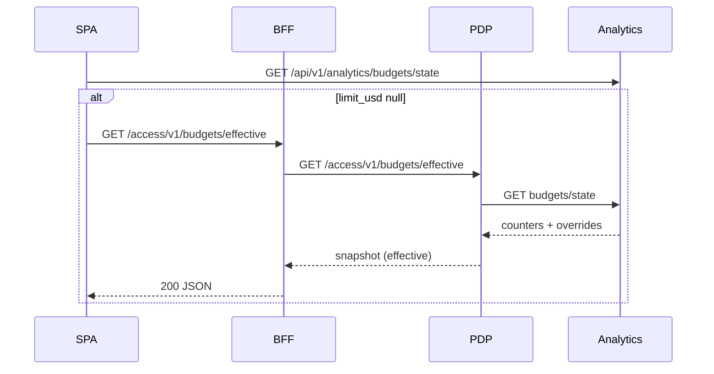

## Targets (guidance)

- Widget bundle: < 50 KB gzipped
- Page bundle: < 100 KB gzipped
- First render: < 1s on baseline hardware

## Tips

- Dynamic import for heavy components; lazy routes
- Memoize expensive trees; virtualize long lists
- Prefer lightweight charts/libs; tree‑shakable ESM only
- Cache data with React Query; tune stale times per view

## Checks

- Add a build step to report bundle sizes; fail CI on regressions
- Measure with Lighthouse or RUM in staging before rollout

See also: Quickstart `./quickstart`, Error & Loading Patterns `./error-loading-patterns`.

## AI Spend – Effective Budgets (UI integration)

- Fetch counters from Analytics first; when `limit_usd` is null, call the PDP Effective Budgets endpoint via the BFF to render the policy‑derived effective limit and remaining.

See also: `services/pdp/reference/effective-budgets.md`.

