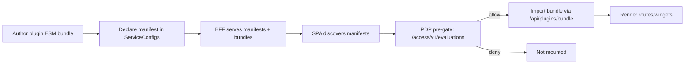

### Overview
This step‑by‑step focuses on wiring and verification. For the shortest path, start with the Quickstart `./quickstart`. For full architecture and ops, see the canonical reference `./experience_plugins`. It assumes the reader understands why a CSP‑safe, same‑origin plugin model is needed:

- Many vendor "extension" models require cross‑origin scripts or iframes which weaken CSP and make per‑plugin governance hard
- UI‑only extensions often bypass centralized authorization; we pre‑gate via AuthZEN decisions before mounting
- Experience enforces per‑plugin allow‑lists and rate limits in the BFF and stamps `X‑Plugin‑Id` for auditability



### 1) Author your plugin bundle
Goal: produce an ESM module that exports component records for routes/widgets.

- Minimal ESM (hello plugin) example:
```javascript
// hello-plugin.js (must be same-origin; served by BFF bundle proxy)
const React = (window && window.React) || undefined;

const Hello = () =>
  React ? React.createElement('div', { className: 'glass-card p-4' }, 'Hello Plugin') : null;

export const routes = { Hello };
export const widgets = {}; // or { HelloWidget }

export default { routes, widgets };
```

Notes:
- The loader imports same-origin via `/api/plugins/bundle?entry={id}&id={id}` to preserve CSP `script-src 'self'`.
- Bundle should not fetch external dependencies during import.
- Keep code size small and avoid heavy peer deps; the host supplies `window.React`.

Subject normalization (AuthZEN): When evaluating permissions from the SPA, use the canonical subject shape `{ type: 'account', id: 'auth:account:{provider}:{user_id}' }`.

### 2) Declare the plugin in ServiceConfigs
Create/update `ServiceConfigs/BFF/config/plugins.yaml`:
```yaml
tenants:
  experience.ocg.labs.empowernow.ai:
    - id: hello
      version: "1.0.0"
      engine:
        experience: ">=1.0.0"
      # integrity: "sha256:<optional_hex_hash>"  # adds bundle integrity checking
      permissions:
        api:
          - method: GET
            path: /api/plugins/secure-echo
          - method: POST
            path: /api/plugins/telemetry
        sse: []
      contributions:
        routes:
          - path: /hello
            component: Hello
            resource: plugin.route
            action: view
        widgets: []
```

Key fields:
- `tenants`: host-based scoping for multi-tenant.
- `engine.experience`: semver range; SPA checks against `VITE_EXPERIENCE_VERSION`.
- `permissions`: API and SSE allow-lists enforced in BFF middleware.
- `contributions.routes|widgets`: component mapping and optional PDP hints.

### 3) BFF integration (already wired)
Touch points:
- `ms_bff_spike/ms_bff/src/api/v1/endpoints/plugins.py`
  - `GET /api/plugins/manifests`: reads manifests from `plugins.yaml`.
  - `GET /api/plugins/bundle?entry={id}&id={id}`: serves ESM bundle, sets `ETag`, `Cache-Control`, and verifies optional sha256.
  - `POST /api/plugins/refresh`: reloads registry from disk.
  - `POST /api/plugins/telemetry`: ingests plugin telemetry (counts).

- `ms_bff_spike/ms_bff/src/services/plugin_registry.py`
  - Loads `plugins.yaml` and provides manifests and integrity hints.

- Middleware enforcement:
  - `ms_bff_spike/ms_bff/src/middleware/plugin_enforcer.py`: enforces allow-lists for API and SSE with `X-Plugin-Id`.
  - `ms_bff_spike/ms_bff/src/middleware/rate_limit_plugin.py`: per-plugin rate limiting.

No changes needed for new plugins; BFF reads from `plugins.yaml`.

Security notes:

- Per‑plugin allow‑lists cover API and SSE routes; violations return 403 and are logged
- Optional integrity hash (`sha256`) ensures tamper‑evident bundles in production

### 4) SPA integration (already wired)
Touch points:
- `experience/frontend/src/plugins/loader.ts`
  - Imports bundles via `/api/plugins/bundle` and enforces semver with `VITE_EXPERIENCE_VERSION`.

- `experience/frontend/src/plugins/DynamicRoutes.tsx`
  - Discovers manifests → batch PDP pre-gates via `/access/v1/evaluations` → mounts allowed routes.
  - Wraps plugin routes in `PluginErrorBoundary`.
  - Denied routes are not mounted; widgets hidden

- `experience/frontend/src/pages/Dashboard.tsx`
  - Loads plugin widgets → batch PDP pre-gates → renders allowed widgets.
  - Wraps widget renders in `PluginErrorBoundary`.

- `experience/frontend/src/plugins/sdk.ts`
  - Stamps `X-Plugin-Id`, has `sse.unsubscribeAll`, sends fire-and-forget telemetry for API calls/errors.

- `experience/frontend/src/plugins/registry.ts`
  - Shared loader cache for routes & widgets.

- `experience/frontend/src/main.tsx`
  - Exposes `window.React` for same-origin plugin bundles.
  - Ensure:
    - `VITE_BFF_BASE_URL` (optional)
    - `VITE_EXPERIENCE_VERSION` (e.g. `1.0.0`)

### 5) Configure environment variables
In the Experience SPA `env.local`:
- `VITE_BFF_BASE_URL`: '' (same-origin) or `https://bff.host` (for dev)
- `VITE_EXPERIENCE_VERSION`: `1.0.0` (used for plugin semver checks)

BFF environment:
- Ensure `config/` points to ServiceConfigs (already standard).
- If needed, mount `ServiceConfigs/BFF/config` into `/app/config` in your compose.

### 6) Deploy
- Ensure Traefik routes the Experience host to the SPA container (static) and to BFF for `/api/**` and streams.
- Copy your `hello-plugin.js` code into BFF’s bundle handler (for demo we inline). In a production setup you can:
  - Serve from BFF filesystem or dynamically from a registry but always via `/api/plugins/bundle`.
- Update `plugins.yaml`, then call:
  - `POST /api/plugins/refresh` to reload at runtime.

Operational guidance:

- Monitor plugin errors via telemetry endpoint; set per‑plugin rate limits conservatively at first
- Keep a runbook entry for quickly disabling a plugin by id in `plugins.yaml`

### 7) Verify
- GET `https://experience.ocg.labs.empowernow.ai/api/plugins/manifests` returns the `hello` manifest (requires correct Host).
- Navigate to `/hello`:
  - PDP batch check should allow (by default), route renders “Hello Plugin”.
- Call `/api/plugins/secure-echo` without `X-Plugin-Id`:
  - Should return 403 (middleware enforcement).
- With `X-Plugin-Id: hello`, call `/api/plugins/secure-echo`:
  - Should return 200 with plugin echo payload.

### 8) E2E tests (Playwright)
- Example test (already added):
  - `ms_bff_spike/e2e/plugin-hello.spec.ts`
    - Verifies `/hello` renders.
    - Verifies API enforcement (403 without header).

To run E2E locally (example):
- Ensure the stack is running and DNS/hosts map `experience.ocg.labs.empowernow.ai` to your Traefik gateway.
- From repo root (or Playwright config path), run:
```bash
# PowerShell: adjust to your setup
pwsh -NoProfile -Command "cd ms_bff_spike; npx playwright test e2e/plugin-hello.spec.ts"
```

### 9) Troubleshooting checklist
- Manifest not loaded:
  - Check Host header; ensure `plugins.yaml` has the correct tenant host.
  - Call `/api/plugins/refresh` after updating `plugins.yaml`.

- Route not rendering:
  - Check PDP decisions (batch pre-gate). Ensure `/access/v1/evaluations` is reachable and returns allow.
  - Confirm `engine.experience` satisfies `VITE_EXPERIENCE_VERSION`.

- 403 when calling plugin APIs:
  - Ensure `X-Plugin-Id` header is present from the plugin SDK.
  - Check `permissions.api` allow-list covers the method and path.

- CSP violations:
  - Ensure bundle loaded from `/api/plugins/bundle` (same-origin only). No external URLs.

### 10) Example end-to-end flow (quick demo)
1) Add this manifest to `ServiceConfigs/BFF/config/plugins.yaml` under your tenant (shown earlier).
2) Reload registry:
```bash
# curl example
curl -X POST https://experience.ocg.labs.empowernow.ai/api/plugins/refresh
```
3) Visit `https://experience.ocg.labs.empowernow.ai/hello`:
   - Expected: “Hello Plugin” glass card.
4) Verify enforcement:
```bash
# Without header -> 403
curl -i https://experience.ocg.labs.empowernow.ai/api/plugins/secure-echo

# With header -> 200
curl -i -H "X-Plugin-Id: hello" https://experience.ocg.labs.empowernow.ai/api/plugins/secure-echo
```

This covers all touch points: ServiceConfigs (`plugins.yaml`), BFF routes/middleware/registry, SPA loader/routes/widgets/PDP gating, and test coverage.

### See also
- Experience → Plugins reference: ./plugins.md
- Experience → React app overview: ./overview.md