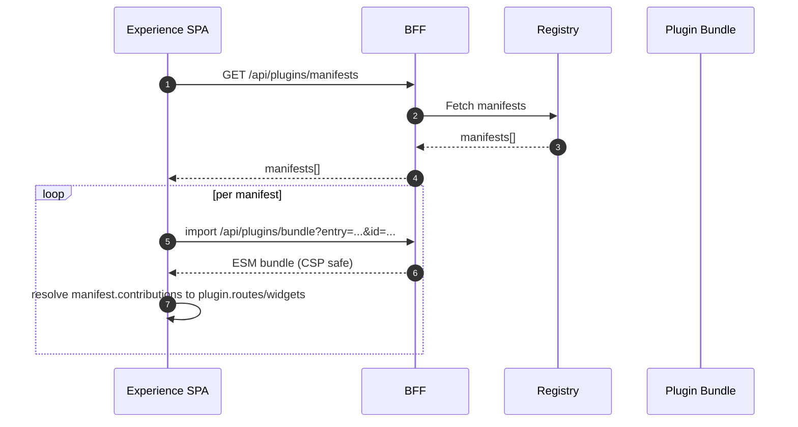
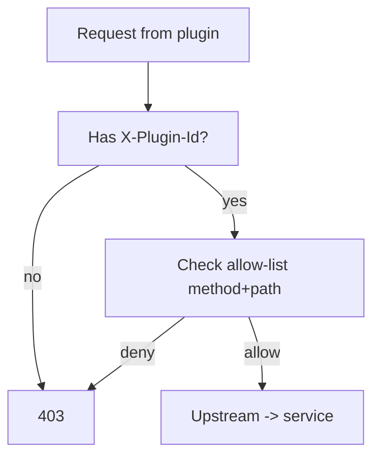

This page distills and formalizes the Experience plugin content into a production‑ready reference.

## Goals

- Secure, extensible end‑user pages/widgets integrated into Experience SPA
- Same‑origin ESM bundles via BFF proxy (CSP `script-src 'self'`)
- Server‑side enforcement by BFF of per‑plugin permissions

## High‑level flow

## Contract

- Manifest
  - `id`, `version`, `engine.experience` (semver range)
  - `contributions.routes[{ path, component }]`, `contributions.widgets[{ slot, component }]`
  - `permissions.api[{ method, path }]`, `permissions.sse[string]`
- Runtime loader
  - Discovery: `/api/plugins/manifests`
  - Bundle import: `/api/plugins/bundle?entry=<url>&id=<pluginId>`
  - Resolve `manifest` → `plugin.routes/widgets` records
- SDK (per plugin)
  - `api.fetch`, `api.useQuery`, `sse.subscribe`, `authz.evaluate`, `logger`, `telemetry`
  - Stamps `X-Plugin-Id` on every request

## BFF enforcement (required)

- Allow‑list per plugin id: method + path prefixes
- Require `X‑Plugin‑Id`; attach tenant/context; rate‑limit per plugin
- SSE: only declared channels; close unauthorized streams

## CSP & routing

- CSP remains strict: only same‑origin scripts via BFF bundle proxy
- Traefik SPA router excludes `/api/`, `/auth/`, `/events/`, `/configs/stream`, `/stream/`

## DX

- Simple SDK; clear errors; telemetry hooks
- Dev mode (optional): allow localhost plugin URLs only in development

## Testing

- Unit: loader resolution, SDK stamps header
- E2E: hello‑plugin renders; 403 without `X‑Plugin-Id`; widget slot; SSE gated

## Appendices

- Performance caching in loader, telemetry example, health endpoints, migration helper, plugin harness checks

See also: Experience React App — Overview & Spec, BFF routes and middleware.

