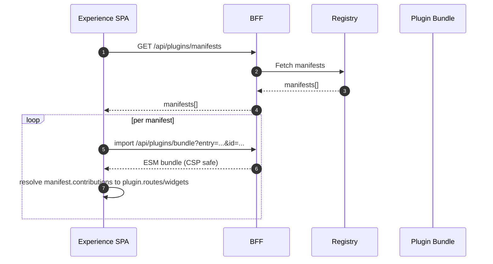
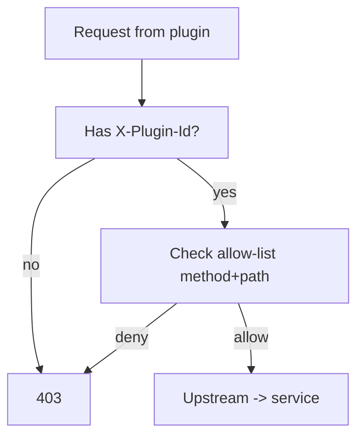
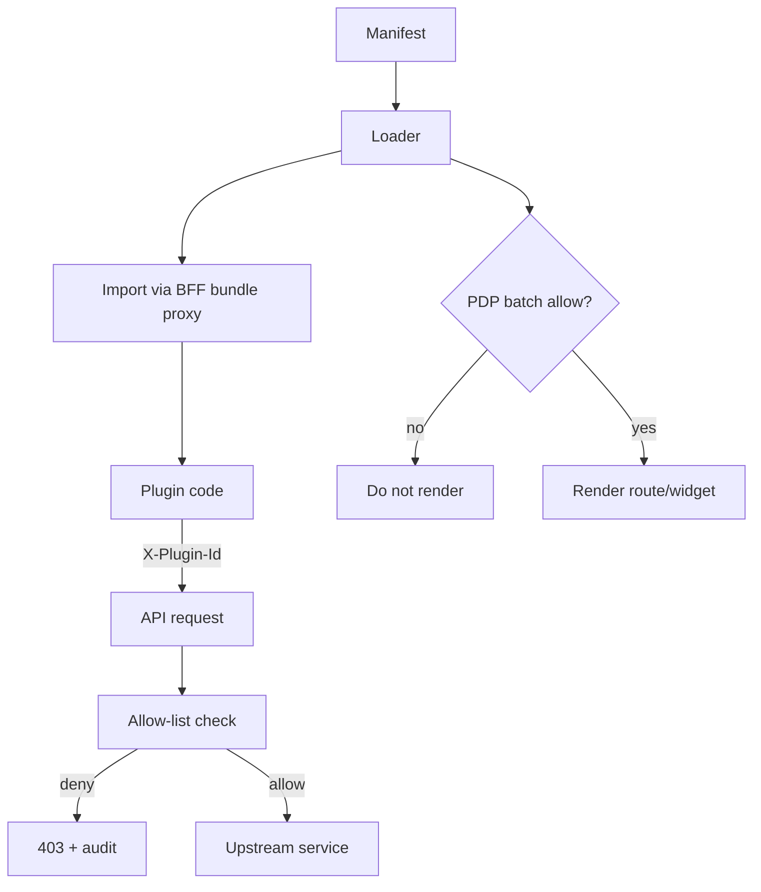
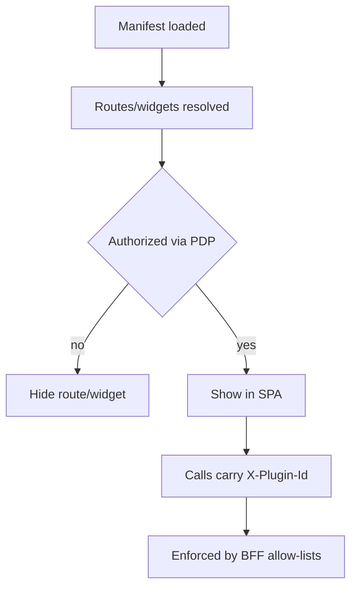

This is a concise primer. For the full canonical architecture and operations, see `./experience_plugins`. Development steps are in `./quickstart` and the full ops/security/API/versioning references are linked from the Experience index.

## Background & context

Most enterprise portals bolt on extensions with iframes or cross‑origin script tags. That breaks CSP, complicates zero‑trust headers, and circumvents centralized authorization. The Experience plugin system takes a stricter path:

- Same‑origin, BFF‑proxied bundle import keeps CSP `script‑src 'self'`
- BFF enforces per‑plugin method/path allow‑lists and SSE channels, stamping `X‑Plugin‑Id` for every request
- The SPA pre‑gates routes/widgets with OpenID AuthZEN batch evaluations so unauthorized contributions never render

Compared to market leaders:

- SSO launchers (Okta/ForgeRock) expose tiles; they don’t ship a PDP‑aware extension model for actions and widgets
- ITSM portals allow UI widgets but often rely on cross‑origin scripts; Experience maintains strict CSP and centralized policy
- We emphasize observability (telemetry endpoint, OTEL) and governance (allow‑lists, rate limits), not just DX

## Goals

- Secure, extensible end‑user pages/widgets integrated into Experience SPA
- Same‑origin ESM bundles via BFF proxy (CSP `script-src 'self'`)
- Server‑side enforcement by BFF of per‑plugin permissions

## High‑level flow



## Contract

- Manifest
  - `id`, `version`, `engine.experience` (semver range)
  - `contributions.routes[{ path, component }]`, `contributions.widgets[{ slot, component }]`
  - `permissions.api[{ method, path }]`, `permissions.sse[string]`
- Runtime loader
  - Discovery: `/api/plugins/manifests`
  - Bundle import: `/api/plugins/bundle?entry=<url>&id=<pluginId>`
  - Resolve `manifest` → `plugin.routes/widgets` records
- SDK (per plugin)
  - `api.fetch`, `api.useQuery`, `sse.subscribe`, `authz.evaluate`, `logger`, `telemetry`
  - Stamps `X-Plugin-Id` on every request

> Subject normalization: When showing PDP examples, use the canonical subject
> `{ "type": "account", "id": "auth:account:{provider}:{user_id}" }`. Older
> `{ "type": "user" }` forms are deprecated in the SPA.

## BFF enforcement (required)

- Allow‑list per plugin id: method + path prefixes
- Require `X‑Plugin‑Id`; attach tenant/context; rate‑limit per plugin
- SSE: only declared channels; close unauthorized streams

### Allow‑list templates (updated)

- Rules are templated by method + path with optional param shapes; paths are normalized and compiled to regex
- Examples:

```yaml
permissions:
  api:
    - method: GET
      path: /api/plugins/secure-echo
    - method: POST
      path: /api/crud/tasks/{uuid}
    - method: GET
      path: /api/workflow/status/{id}
  sse:
    - /api/events/tasks/summary
```

- Violations return 403 with header `X-Allowlist-Violation: 1`

### Quarantine (kill switch)

- Immediate ops control to disable a plugin without redeploy
- Endpoints:
  - `POST /api/plugins/quarantine/{plugin_id}`
  - `POST /api/plugins/unquarantine/{plugin_id}`
- When quarantined, bundle and API/SSE calls are blocked with `X-Plugin-Quarantined: 1`

### Response hygiene

- `Vary: Cookie, X-Plugin-Id` on `/api/plugins/manifests` and `/api/plugins/bundle`



## CSP & routing

- CSP remains strict: only same‑origin scripts via BFF bundle proxy
- Traefik SPA router excludes `/api/`, `/auth/`, `/events/`, `/configs/stream`, `/stream/`
 - SSE prefixes are normalized; API routing is template‑aware for precise matching

## DX

- Simple SDK; clear errors; telemetry hooks
- Dev mode (optional): allow localhost plugin URLs only in development
 - Import maps groundwork: peer deps (react, react-dom, @empowernow/ui) can be pinned and served same‑origin under `/vendor/*` (externals planned)

## Testing

- Unit: loader resolution, SDK stamps header
- E2E: hello‑plugin renders; 403 without `X‑Plugin-Id`; widget slot; SSE gated

## Appendices

- Performance caching in loader, telemetry example, health endpoints, migration helper, plugin harness checks

See also: Canonical reference `./experience_plugins`, Quickstart `./quickstart`, React App Overview `./overview`, BFF routes & middleware `../bff/devops/experience_routing`.

## Visual: end‑to‑end governance



## Reference snippets (ready to drop in)

Loader with base URL and caching:

```typescript
// src/plugins/loader.ts
import type { LoadedPlugin, PluginManifest } from './types';

export class PluginRegistry {
  private loaded = new Map<string, LoadedPlugin>();
  private bundleCache = new Map<string, Promise<any>>();

  async discover(): Promise<PluginManifest[]> {
    const base = (import.meta as any).env?.VITE_BFF_BASE_URL || '';
    const res = await fetch(`${base}/api/plugins/manifests`, { credentials: 'include' });
    return res.json();
  }

  private importBundle(url: string) {
    if (!this.bundleCache.has(url)) {
      this.bundleCache.set(url, import(/* @vite-ignore */ url));
    }
    return this.bundleCache.get(url)!;
  }

  async load(manifest: PluginManifest): Promise<LoadedPlugin> {
    const base = (import.meta as any).env?.VITE_BFF_BASE_URL || '';
    const url = `${base}/api/plugins/bundle?entry=${encodeURIComponent(manifest.id)}&id=${encodeURIComponent(manifest.id)}`;
    const mod = await this.importBundle(url);
    const plugin: LoadedPlugin = {
      id: manifest.id,
      manifest,
      routes: mod.default?.routes ?? mod.routes ?? {},
      widgets: mod.default?.widgets ?? mod.widgets ?? {},
    };
    this.loaded.set(manifest.id, plugin);
    return plugin;
  }

  getLoaded() { return Array.from(this.loaded.values()); }
}
```

Shared registry and PDP‑gated routes:

```typescript
// src/plugins/registry.ts
import type { LoadedPlugin, PluginManifest } from './types';
import { PluginRegistry } from './loader';

let cached: Promise<LoadedPlugin[]> | null = null;
export function getLoadedPlugins(): Promise<LoadedPlugin[]> {
  if (cached) return cached;
  const reg = new PluginRegistry();
  cached = (async () => {
    const manifests: PluginManifest[] = await reg.discover();
    return Promise.all(manifests.map(m => reg.load(m)));
  })();
  return cached;
}

// src/plugins/DynamicRoutes.tsx (excerpt)
const routeGuard = useAuthorization('plugin.route', 'view', true);
useEffect(() => {
  (async () => {
    const plugins = await getLoadedPlugins();
    const routes = plugins
      .flatMap(p => (p.manifest.contributions?.routes || []).map(r => ({
        path: r.path,
        element: routeGuard.authorized ? React.createElement(p.routes?.[r.component] || (() => null)) : null
      })))
      .filter(r => r.element);
    setElements(routes);
  })();
}, []);
```

Dashboard widgets from plugins:

```typescript
// src/pages/Dashboard.tsx (excerpt)
import { getLoadedPlugins } from '../plugins/registry';

useEffect(() => {
  (async () => {
    const plugins = await getLoadedPlugins();
    const widgets = plugins.flatMap(p => Object.entries(p.widgets || {}).map(([name, Comp]) => ({
      id: `${p.id}:${name}`,
      title: name,
      resource: 'plugin.widget',
      action: 'view',
      render: () => <Comp />,
    })));
    setPluginWidgets(widgets);
  })();
}, []);
```

Plugin SDK with stamped requests and SSE:

```typescript
// src/plugins/sdk.ts (excerpt)
export function createPluginSdk(pluginId: string, qc: QueryClient) {
  const base = (import.meta as any).env?.VITE_BFF_BASE_URL || '';
  const apiFetch = async (path: string, init?: RequestInit) => {
    const res = await fetch(`${base}/api${path.startsWith('/') ? path : '/' + path}` , {
      ...(init || {}),
      credentials: 'include',
      headers: { 'X-Plugin-Id': pluginId, ...(init?.headers || {}) }
    });
    if (!res.ok) throw new Error(`${res.status}`);
    return res;
  };
  const subscribe = (path: string, onMessage: (data: any) => void) => {
    const url = `${base}/api${path}`;
    const es = new EventSource(url, { withCredentials: true } as any);
    es.onmessage = (e) => onMessage(JSON.parse(e.data));
    return () => es.close();
  };
  return { /* api, sse, authz ... as described above */ };
}
```

## Gating flow (visual)




