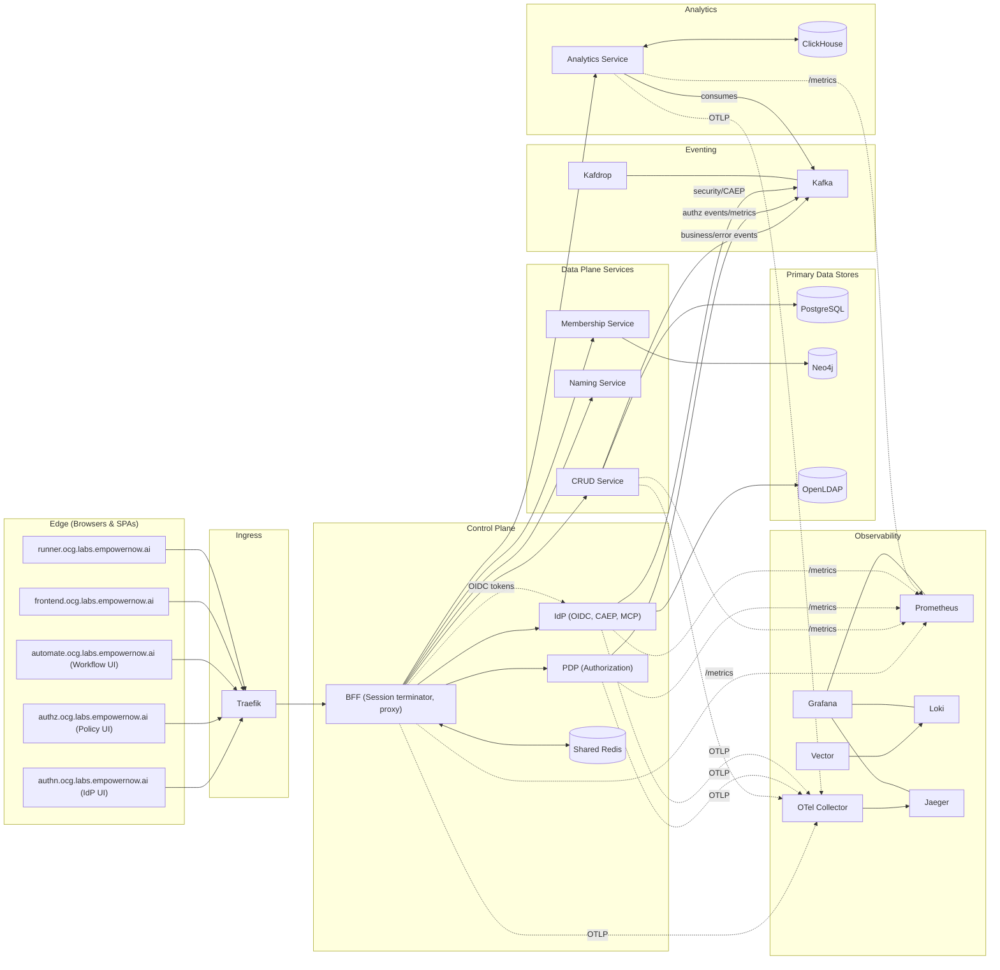

The EmpowerNow Identity Fabric is a modular suite that provides identity, policy, workflow/CRUD execution, eventing, analytics, and observability. This page shows how the pieces fit together end‑to‑end.

### Key roles at a glance

- BFF: Terminates SPA sessions; proxies to backends using audience‑bound access tokens minted by the IdP.
- IdP: OIDC provider (tokens, introspection); emits CAEP/security events; exposes MCP.
- PDP: Central authorization decisions; emits authz events/metrics.
- CRUD Service: Executes workflow/CRUD commands; emits business/error events.
- Membership: Graph of identities/relationships (Neo4j).
- Analytics: Consumes Kafka events, persists to ClickHouse, serves analytics APIs.
- Traefik: Ingress routing for SPAs and BFF.
- Observability: OTEL traces (Jaeger), metrics (Prometheus), logs (Vector→Loki), dashboards (Grafana).

### Core hostnames (examples)

- Ingress/edge: `traefik.ocg.labs.empowernow.ai`
- BFF/API: `api.ocg.labs.empowernow.ai`
- SPAs: `authn.ocg.labs.empowernow.ai`, `authz.ocg.labs.empowernow.ai`, `automate.ocg.labs.empowernow.ai`, `frontend.ocg.labs.empowernow.ai`, `runner.ocg.labs.empowernow.ai`
- Backends: `idp.ocg.labs.empowernow.ai`, `crud.ocg.labs.empowernow.ai`, `pdp.ocg.labs.empowernow.ai`, `analytics.ocg.labs.empowernow.ai`, `naming.ocg.labs.empowernow.ai`
- Observability: `prometheus.ocg.labs.empowernow.ai`, `grafana.ocg.labs.empowernow.ai`, `jaeger.ocg.labs.empowernow.ai`, `kafdrop.ocg.labs.empowernow.ai`, `clickhouse.ocg.labs.empowernow.ai`, `tabix.ocg.labs.empowernow.ai`

See service‑specific sections for deep dives, configuration, and runbooks.

### Hybrid connectivity to on‑premises systems

Some deployments require cloud/containerized services to communicate with on‑premises services (for example, enterprise LDAP/Active Directory or SAP LDAP) without opening inbound firewall ports. The recommended approach is to use Azure Relay with the Azure Relay Bridge (azbridge) to create secure outbound tunnels from the on‑premises network.

- See: [Azure Relay Bridge (azbridge)](/docs/services/identity-fabric/azure-relay-bridge) for architecture, Docker Compose examples, connection patterns (LDAP/LDAPS), security notes, and troubleshooting.
- Example consumers: `crud-service` (workflows needing LDAP), `idp` (directory lookups), or any service on the same Docker network as the bridge containers.
