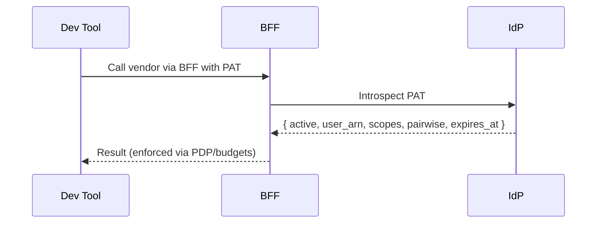

Personal Access Tokens are EmpowerNow‑issued opaque tokens for dev tools. The IdP issues, stores salted hashes, and introspects PATs; the BFF proxies vendor APIs and enforces policy/budgets using identity‑first ARNs derived from PATs.

Key points
- IdP stores `sha256(token)` and a prefix; raw token is shown once
- Introspection is service‑to‑service, cached briefly, and rate‑limited
- BFF builds `user_arn` and `agent:devtool:{client_id|generic}:{pairwise}`

See also
- How‑to: `services/idp/how-to/manage-pats.md`
- API: `services/idp/reference/pats-api.md`
- BFF proxy auth: `services/bff/explanation/vendor-proxy-auth.md`

