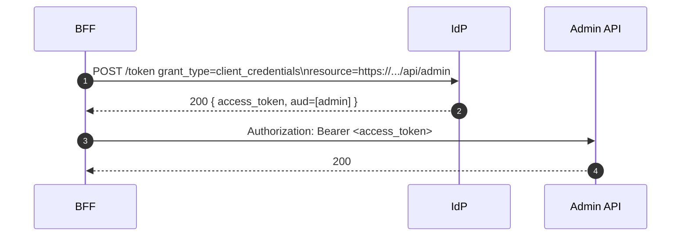

Enable RFC 8707 so access tokens carry the intended audience per resource server. The BFF sends `resource=<audience>` on client_credentials (and optionally token exchange) to obtain precise `aud` values.

Behavior
- When enabled and `resource` is present, IdP sets `aud = [resource]`
- `resource` takes precedence over `audience` if both provided
- Admin API should validate the canonical audience explicitly

Config
- IdP: `FEATURE_FLAGS__ENABLE_RFC8707=true`; set `TOKEN__*_AUDIENCE` (e.g., admin)
- BFF: `BFF_CC_USE_RESOURCE=true` to prefer resource over legacy audience

See also
- BFF per‑route token policy: `services/bff/explanation/per-route-token-policy.md`

