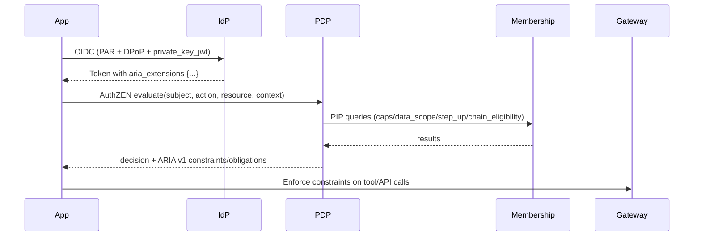
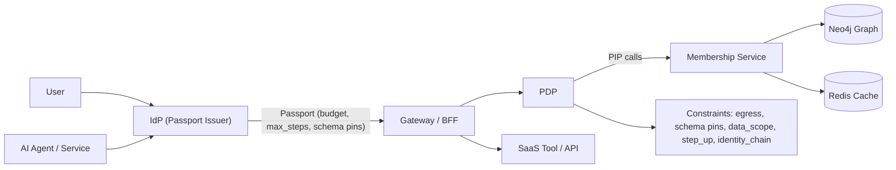
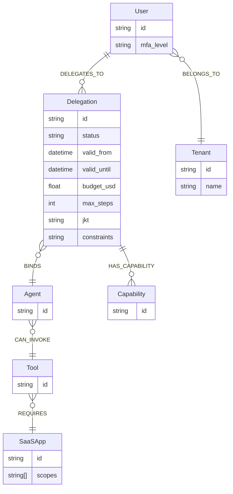
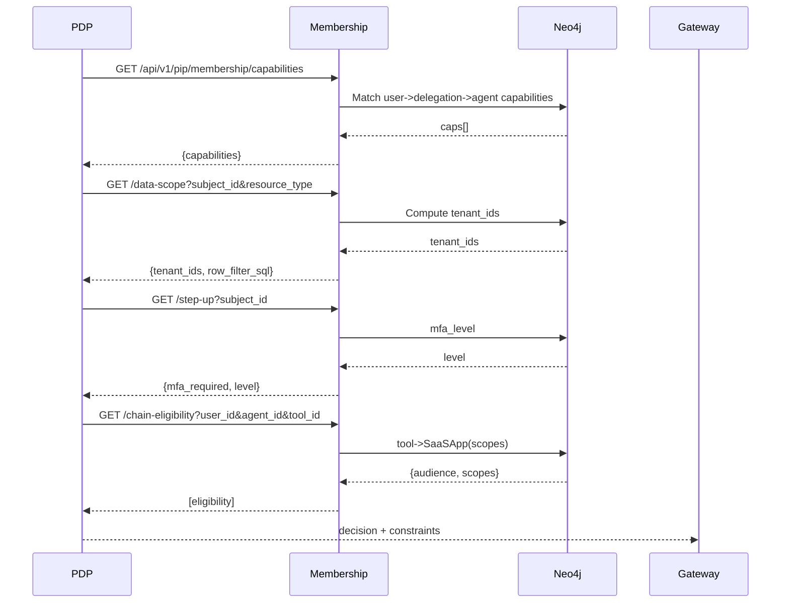
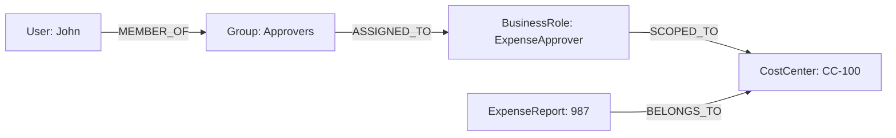

# Membership Service Reviewer's Guide

This guide helps evaluators trial the EmpowerNow Membership Service with a focus on AI authorization, user-bound identities, spending/budget controls, and graph-powered delegation. It provides business context, architecture, data/schema overview, key APIs, and a real-world case study with hands-on steps.

## Executive introduction: what you’re reviewing and why it’s different

- What this is: an authoritative graph (FastAPI + Neo4j) for identities, delegations, capabilities, tenant/data scope, step-up hints, and identity-chaining eligibility. It exposes PIP endpoints to the PDP and is consulted by the IdP when issuing passports; Redis accelerates hot paths.
- ARIA profile and extensions: ARIA (Agent Relationship-based Identity & Authorization) defines how rich authorization context is carried and enforced. In our system, the IdP emits OIDC tokens with `aria_extensions` (e.g., `budget`, `max_steps`, `schema_pins`, `call_id`), the PDP returns an ARIA v1 context (constraints/obligations), and the Gateway/BFF enforces them.
- Enterprise AI problems addressed:
  - On-behalf-of execution: bind agents to specific users/services with explicit capabilities and lifetimes.
  - Data scope and tenancy: constrain which tenants/rows/columns an agent can access for safe RAG.
  - Prompt/content safety: enforce egress allowlists and schema pins via PDP constraints.
  - Cost control: attach budget_usd and max_steps to delegations to bound spend and chain length.
  - Downstream calls: express identity-chaining eligibility (audiences/scopes) for provider tokens.
- How it works (Authzen-aligned extensions implemented):
  - PIP under `/api/v1/pip/membership`: `capabilities`, `delegations` (includes `budget_usd`, `max_steps`), `data-scope`, `step-up`, `chain-eligibility`.
  - Governance endpoints now available:
    - CONTROLLED_BY: `PUT /api/v1/agent/agents/{agent_id}/control`, `GET /api/v1/agent/agents/{agent_id}/controllers`, `DELETE /api/v1/agent/agents/{agent_id}/control`
    - Resource ownership: `POST /api/v1/resources/{resource_id}/owners`, `GET /api/v1/resources/{resource_id}/owners`, `DELETE /api/v1/resources/{resource_id}/owners`
    - RTR authoring: `POST /api/v1/rtrs/assign`, `POST /api/v1/rtrs/assign-at`
  - IdP passports embed `aria_extensions.budget` and `aria_extensions.max_steps` derived from active delegations.
  - PDP composes decision + constraints; Gateway/BFF enforces egress/schema/data_scope/step_up/identity_chain.
  - Graph storage: `DELEGATES_TO` carries `budget_usd` and `max_steps`; delegations link to `Capability`; tenants attach to users; tools map to SaaS apps with required scopes.
- What’s unique vs typical IAM:
  - Delegation-first, relationship-centric model purpose-built for AI agents (user-bound behavior).
  - Cost and step limits on the delegation edge, not just coarse account quotas.
  - Identity-chaining eligibility as a first-class API for safe provider-scoped tokens.
  - Data-scope computed and returned in enforcement-ready form (e.g., SQL filter + tenant_ids).
  - Reproducible evaluation: seeds, unit/integration tests, and Postman collection included.
- How to evaluate quickly:
  - Seed Neo4j with `membership/seeds/pip_minimal.cypher` and run `membership/scripts/seed_neo4j.py`.
  - Exercise the PIP endpoints with the sample IDs (see examples below) via curl/Postman.
  - Compare PDP constraints output with your enforcement layer to validate fit.

ARIA at a glance (where it shows up):
- PDP: returns ARIA v1 rich context under `context.constraints` and `context.obligations` (AuthZEN request semantics).
- Membership: PIP supplies the graph truth PDP needs (capabilities, data_scope, step_up, chain_eligibility).
- Gateway/BFF: enforces constraints (egress allowlist, schema pins, budget, step_up, identity_chain).



Glossary (quick):
- ARIA: Agent Relationship-based Identity & Authorization; rich context carried in `aria_extensions` and PDP responses.
- AuthZEN: authorization request semantics `{subject, action, resource, context}` used by our PDP.
- Actor (act) claim: standard OIDC claim indicating on‑behalf‑of principal for user‑bound agents.
- ID‑JAG: Identity Assertion JWT used as a JWT Bearer grant (RFC 7523) after Token Exchange (RFC 8693) per the Identity & Authorization Chaining profile.

Cross‑App Access (Identity & Authorization Chaining) – Membership’s role:
- Why it matters: eliminates per‑app interactive consent for AI tools while centralizing policy at the IdP.
- Membership tie‑in: `chain-eligibility` PIP returns allowed audiences/scopes for safe chaining; PDP consumes this to constrain downstream token issuance by resource providers.

Industry momentum & naming:
- Vendors (e.g., Okta) describe this profile as “Cross‑App Access.” Our implementation follows the same RFC pattern (8693 + 7523) with a dedicated Identity Assertion endpoint and Membership PIP `chain-eligibility` to bound audiences/scopes.
- Names vary, but the flow is the same: IdP sits in the middle, issues a short‑lived assertion, resource app AS validates and mints its own token.

## 1. Why this matters: AI authorization in the enterprise

- Problem: AI agents operate “on behalf of” users and services, touching sensitive data, systems, and budgets.
- Risks addressed:
  - Identity binding: ensure an agent is truly acting for a specific user/service pair.
  - Delegation clarity: explicitly constrain what an agent can do (capabilities) and for how long.
  - Data scope: enforce tenant/row/column restrictions for safe retrieval-augmented generation.
  - Prompt/content security: prevent data exfiltration, schema drift, and over-permissive calls.
  - Spend control: bound per-call, per-plan budgets and chain-token issuance.
- Outcome: auditable authorization decisions with graph truth and policy overlays, enabling safe AI adoption.

## 2. Architecture at a glance

- Membership Service (FastAPI + Neo4j): source of truth for identities, delegations, capabilities, and metadata.
- PDP (AuthZ engine): computes allow/deny with constraints; calls Membership PIP for data_scope, step_up, and identity_chain.
- IdP: issues passports with budget and max_steps based on active delegations.
- BFF/Gateway: enforces constraints (egress allowlist, schema pins, budget, data_scope) at runtime.
- Redis: caching for hot paths; Kafka (optional) for events and audit.



## 3. Neo4j schema (core nodes/edges)

- Nodes: `User` (Identity), `Agent` (AI/service principal), `Delegation`, `Capability`, `Tenant`, `Tool`, `SaaSApp`.
- Relationships:
  - `(:User)-[:DELEGATES_TO]->(:Delegation)-[:BINDS]->(:Agent)`
  - `(:Delegation)-[:HAS_CAPABILITY]->(:Capability)`
  - `(:User)-[:BELONGS_TO]->(:Tenant)`
  - `(:Agent)-[:CAN_INVOKE]->(:Tool)-[:REQUIRES]->(:SaaSApp {scopes: [...]})`
- Indices/constraints: see `ServiceConfigs/membership/config/neo4j_indices.yaml`.

Model invariants and lifecycles:
- Labels: `Identity` is the root label; `User`/`Agent` are specializations; `Account`, `Tenant`, `Tool`, `SaaSApp` as typed nodes.
- Uniqueness: `Identity.id`, `Agent.id`, `Tool.id`, `MCPService.id`, and `DELEGATES_TO.id` are unique; see `storage/graph_modules/graph_schema.py` and `storage/graph_store.py`.
- `DELEGATES_TO` lifecycle: `status in {active, revoked, expired}`; validity checked as `d.expires_at IS NULL OR d.expires_at > datetime()`; expiry sweeper marks overdue edges (APOC with fallback).


Common Cypher snippets:

```cypher
// Active capabilities for a user-bound agent
MATCH (u:User {id:$user_id})-[:DELEGATES_TO]->(d:Delegation {status:'active'})-[:BINDS]->(a:Agent {id:$agent_id})
MATCH (d)-[:HAS_CAPABILITY]->(c:Capability)
RETURN collect(DISTINCT c.id) AS capabilities;

// Delegations with budget/steps
MATCH (u:User {id:$user_id})-[:DELEGATES_TO]->(d:Delegation)-[:BINDS]->(a:Agent {id:$agent_id})
RETURN d.id AS delegation_id, d.status, d.budget_usd, d.max_steps, d.expires_at;

// Tenants for data scope
MATCH (u:User {id:$sid})-[:BELONGS_TO]->(t:Tenant)
OPTIONAL MATCH (u)-[:ASSIGNED_TO]->(:Project)-[:OWNED_BY]->(tp:Tenant)
WITH collect(DISTINCT t.id) + collect(DISTINCT tp.id) AS tids
RETURN [x IN tids WHERE x IS NOT NULL] AS tenant_ids;
```

## 4. Key features mapped to business needs

- User-bound identities and delegation
  - Why: bind an agent to a specific user; avoid “loose” service accounts.
  - How: `DELEGATES_TO` with capabilities, status, time bounds, budget_usd, max_steps.
- Data scope and tenancy
  - Why: ensure agents only query/see allowed tenants/rows/columns.
  - How: derive `tenant_ids` and `row_filter_sql` (fail-closed to 1=0).
- Step-up hints
  - Why: trigger MFA for sensitive actions.
  - How: compute from user’s `mfa_level` or policy.
- Identity chaining (downstream API calls)
  - Why: safely exchange the agent-user binding into provider-scoped tokens.
  - How: return allowable audiences/scopes for a tool’s provider.
- Spend and budget controls
  - Why: prevent runaway cost; enforce plan budgets and step limits.
  - How: aggregate budget across delegations; IdP embeds `budget.initial` and `max_steps` in JWT.
- Prompt/content security (via PDP + Gateway)
  - Why: block secret leakage, unsafe egress, schema violations.
  - How: PDP returns constraints (egress allowlist, schema pins, disallowed phrases) that gateway enforces.

## 5. PIP endpoints (Membership → PDP)

Base prefix: `/api/v1/pip/membership`

- `GET /capabilities?user_id=&agent_id=` → `{ capabilities: ["mcp:flights:search", ...] }`
- Example (seeded demo):
```json
{ "capabilities": ["mcp:flights:book", "mcp:flights:search"] }
```
- `GET /delegations?user_id=&agent_id=&status=active` → list with `budget_usd`, `max_steps`.
- Pagination: `limit` (1–500, default 50), `offset` (>=0). Server caps large responses.
- Example (seeded demo):
```json
[
  { "delegation_id": "delegation:demo1-to-agent1", "status": "active", "max_steps": 5, "budget_usd": 25.0, "expires_at": null }
]
```
- `GET /data-scope?subject_id=&resource_type=` → `{ tenant_ids: [...], row_filter_sql, column_mask }`
- Example (seeded demo):
```json
{ "tenant_ids": ["tenant:acme"], "row_filter_sql": "tenant_id IN ('tenant:acme')", "column_mask": {} }
```
- `GET /step-up?subject_id=` → `{ mfa_required, level }`
- Example (seeded demo; default strong when mfa_level is none):
```json
{ "mfa_required": true, "level": "strong" }
```
- `GET /chain-eligibility?user_id=&agent_id=&tool_id=` → `[ { audience, scopes } ]`
- Example (seeded demo):
```json
[{ "audience": "api.flights.com", "scopes": ["flights.read", "flights.write"] }]
```

## 6. Core APIs (search and identity)

- `/api/v1/identity_nodes/search` → search by `node_type`, `search`, `system`, optional filters; pagination.
- Example request (seeded demo):
```
/api/v1/identity_nodes/search?node_type=Person&search=John&system=active_directory&limit=10&skip=0
```
- Returns: list of nodes; optional filters excluded when unset.
- `/api/v1/identity_nodes/search/with-metadata` → adds `total`, `has_more`, and optional `relationships`.
- Example response shape:
```json
{
  "nodes": [ { "id": "person1", "name": "John", "relationships": { } } ],
  "total": 1,
  "limit": 10,
  "skip": 0,
  "has_more": false,
  "relationships": {}
}
```
- `/api/v1/identity_nodes/count` → count by `node_type`/`search`/`system`.
- Example query params are normalized in routes to exclude nulls.

All routes accept only non-null parameters; optional filters are excluded when unset.

Search semantics:
- Filters are ANDed.
- Substring matches are case-insensitive by default (implementation-specific in graph layer).
- Use `use_fulltext=true` (metadata route) when relevance scoring and fuzzy matching are desirable.

Indexes and constraints (selection):
- From `ServiceConfigs/membership/config/neo4j_indices.yaml`:
  - `pip_support`: `Tenant(id,name)`, `MCPService(id,api_endpoint)`, `Tool(id)`
  - `identity_pk`: `Person(id)`, `Account(id)`, `Group(id)`, etc.
  - `identity_search`: `Identity(job_title,email,country,telephone)`
  - Full-text: labels `Identity, Person, AIAgent, Group, Account` on properties `name, display_name, email, job_title, country, telephone`

## 7. Hands-on: trial setup

- Seed Neo4j with a minimal dataset:
  - `python membership/scripts/seed_neo4j.py --uri bolt://localhost:7687 --user neo4j --password test`
  - Or against the compose container: `bolt://localhost:7688`, password `password123`.
- Verify seeds:
  - `membership/scripts/quick_check.py` prints counts and sample relations.
- Run focused tests:
  - PIP router unit/integration tests in `membership/tests` (see README snippets).
  - Identity search unit tests (routes/services) should pass as of this guide.

## 8. Case study: Travel booking copilot

- Scenario: A travel copilot agent books flights “on behalf of” employees.
- Identities:
  - `user:demo1` belongs to tenant `tenant:acme`.
  - Agent `agent:svc-123:for:demo1` bound by an active delegation with capabilities `mcp:flights:search`, `mcp:flights:book`, budget `$25`, max_steps `5`.
- Flow:
  1) IdP issues a token with `aria_extensions.budget={"unit":"usd","amount":25}`, `aria_extensions.max_steps=5` and schema pins.
  2) PDP calls Membership PIP: verifies capability for `mcp:flights:search`; returns `data_scope` and `step_up` (strong if needed); returns `identity_chain` for `api.flights.com` with scopes.
  3) Gateway enforces egress allowlist, budget, schema pins; tool call proceeds.
- Why it matters:
  - The agent is strictly constrained on actions, data, and cost.
  - Auditability: all decisions logged with graph truth and constraints.

## 9. Observability & ops

- Health: `/health` endpoints from services.
- Metrics: Prometheus counters/histograms for key operations.
- Logs: structured logs on request start/success/error with correlation IDs.
- Kafka (optional): delegation events for audit and analytics.

## 10. Review checklist

- Identity binding:
  - [ ] Active `DELEGATES_TO` edges exist with status/ttl/jkt as appropriate
  - [ ] Capabilities anchored on delegations
- Data scope:
  - [ ] `data_scope` returns correct tenant_ids and fail-closed when unknown
- Policy integration:
  - [ ] PDP includes constraints for egress/schema/prompt rules
- Budget/steps:
  - [ ] Token includes `aria_extensions.budget` and `aria_extensions.max_steps` per delegations
- Tool chaining:
  - [ ] `chain-eligibility` lists correct audiences/scopes for target tool
- Search UX:
  - [ ] Search endpoints perform as expected; metadata endpoints return `total`/`has_more` and optional `relationships`

## 11. Reference

- Config:
  - `ServiceConfigs/membership/config/settings.yaml`
  - `ServiceConfigs/membership/config/neo4j_indices.yaml`
- Seeds/tests:
  - `membership/seeds/pip_minimal.cypher`
  - `membership/scripts/seed_neo4j.py`, `membership/scripts/quick_check.py`
  - `membership/tests/*`
- Design docs:
  - `mcp_gateway/docs/________newdesign10_membership.md`
  - PDP and IdP design counterparts for constraints and passport flows

---

For questions or deep-dive sessions, contact the engineering team and reference decision logs with correlation IDs from your trial runs.

## Appendix A: PIP evaluation sequence



## Appendix B: PDP decision/constraints example

## Appendix F: Query cookbook (with DDL)

- Capability check (user→agent): uses `DELEGATES_TO` with `status='active'` and validity window; indexed by relationship properties. See `storage/graph_modules/graph_delegation.py` and `storage/graph_store.py` for constraints and indexes.
- Data scope: `MATCH (u {id:$sid}) OPTIONAL MATCH (u)-[:BELONGS_TO]->(t:Tenant) OPTIONAL MATCH (u)-[:ASSIGNED_TO]->(:Project)-[:OWNED_BY]->(tp:Tenant) ... LIMIT 1` – backed by `Tenant(id)` and full‑text indices for identity search.
- Chain eligibility: `MATCH (t:Tool {id:$tool_id})<-[:PROVIDES]-(s:MCPService) RETURN s.api_endpoint, s.auth_config_metadata LIMIT 1` – backed by `Tool(id)` and `MCPService(id)`.

Tip: Run `EXPLAIN` on these queries against the seeded dataset; indexes are declared in code (see `graph_mcp.py`, `graph_agent.py`, `graph_store.py`).

## Appendix G: Audit and lineage

- Events: delegation add/update/revoke and relation changes emit Kafka events when configured; see `services/membership.py`.
- Logs: `structured_log` around delegation and identity operations with correlation IDs; use these to reconstruct decision trails.

## Appendix H: PIP data contracts and error taxonomy

- Version: responses include stable shapes; future changes will add a `version` field. Suggested consumer default is strict field validation.
- Error taxonomy (minimum):
  - 200 + empty/safe default when no relationship: `{capabilities: []}`, `{tenant_ids: [], row_filter_sql: "1=0"}`, `[]` for chain eligibility.
  - 4xx for validation errors (missing params), 5xx for backend errors (Neo4j/Redis unavailable).
```json
{
  "decision": true,
  "context": {
    "constraints": {
      "egress": {"allow": ["api.openai.com:443", "tools.example.com:443"]},
      "schema_pins": {"tool:flights": {"schema_version": "1.0", "schema_hash": "sha256:..."}},
      "data_scope": {"tenant_ids": ["tenant:acme"], "row_filter_sql": "tenant_id IN ('tenant:acme')", "column_mask": {}},
      "step_up": {"mfa_required": false, "level": "strong"},
      "identity_chain": {"allowed_audiences": ["api.flights.com"], "allowed_scopes": ["flights.read","flights.write"], "max_token_ttl_seconds": 300}
    },
    "obligations": [{"id": "emit_receipt"}],
    "decision_id": "..."
  }
}
```

## Appendix C: Identity chain example

Eligibility response:
```json
[{"audience": "api.flights.com", "scopes": ["flights.read", "flights.write"]}]
```
Provider token request (conceptual):
```http
POST /oauth/token
audience=api.flights.com&scope=flights.read%20flights.write&act_sub=agent:svc-123:for:...
```

## Appendix D: Quickstart (curl) and Postman

curl examples:
```bash
# Capabilities
curl -s "https://membership.ocg.labs.empowernow.ai/api/v1/pip/membership/capabilities?user_id=user:demo1&agent_id=agent:svc-123:for:demo1"

# Data scope
curl -s "https://membership.ocg.labs.empowernow.ai/api/v1/pip/membership/data-scope?subject_id=user:demo1&resource_type=record"

# Search
curl -s "https://membership.ocg.labs.empowernow.ai/api/v1/identity_nodes/search?node_type=Person&search=John&system=active_directory&limit=10&skip=0"
```

Postman: import the collection from `docs/services/membership/reference/postman/membership_review.postman_collection.json` and set the `baseUrl` variable.

## Appendix E: ReBAC walk‑through and policy sketch

ReBAC example: “John can approve expense in cost center CC-100”

Graph walk (conceptual):



Cypher check (illustrative):

```cypher
MATCH (u:User {id:$user_id})-[:MEMBER_OF]->(:Group)-[:ASSIGNED_TO]->(br:BusinessRole {name:'ExpenseApprover'})
MATCH (br)-[:SCOPED_TO]->(cc:CostCenter {id:$cost_center_id})
MATCH (r:ExpenseReport {id:$report_id})-[:BELONGS_TO]->(cc)
RETURN r.id AS report_id LIMIT 1;
```

Policy sketch (conceptual) – PDP combines graph truth with authored conditions:

```yaml
allow:
  when: action == "expense.approve"
  and: constraints.capabilities contains "expense:approve"
  and: data_scope.tenant_ids contains resource.tenant_id
  and: rebac.expense_approver_for(resource.cost_center_id) == true
obligations:
  - id: emit_receipt
  - id: tee_analytics
```

Notes:
- The Membership PIP can expose helper endpoints to answer specific relationship predicates, but most trials use PDP orchestration to merge constraints (capabilities + data_scope) with authored rules.
- Keep ReBAC queries narrow and index-backed (CostCenter.id, BusinessRole.name).
