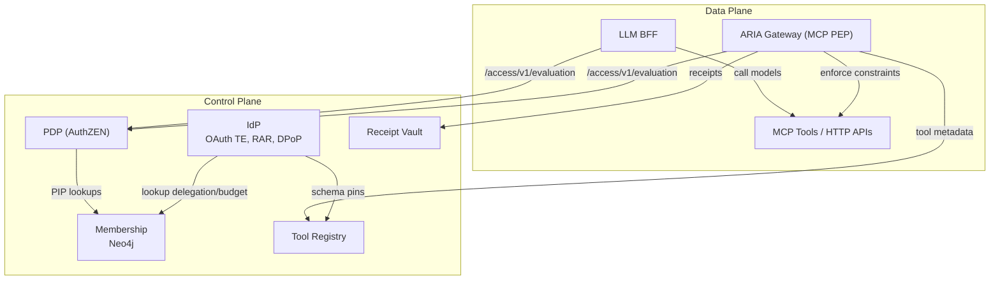
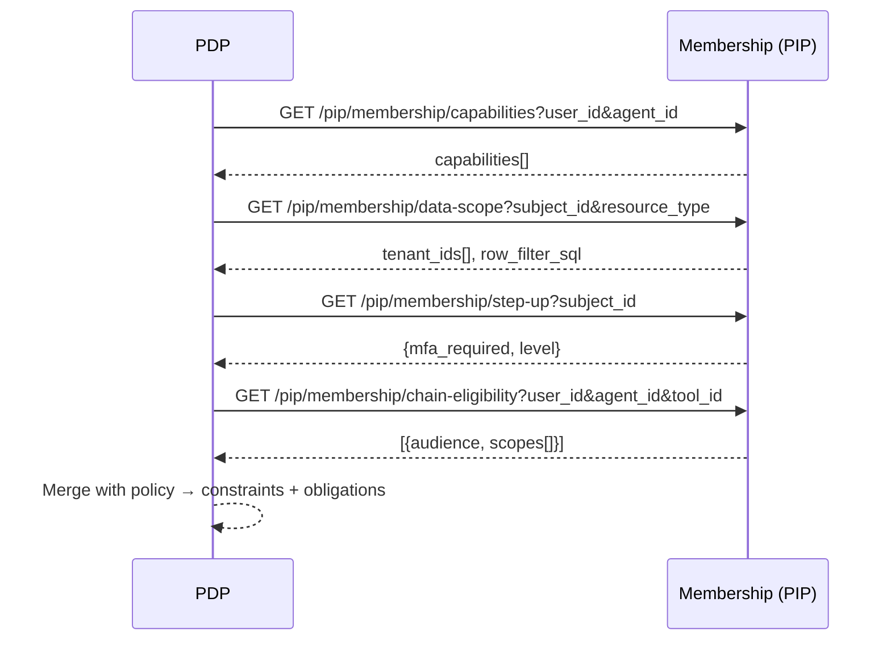

# Membership Service — Graph Schema and PIP Endpoints

This page condenses and formalizes the schema and endpoint catalogue. It is sourced from `docs/source_content/membership_service_schema_and_endpoints.md`.

## System overview



## Graph model (essentials)

- Nodes: `Identity` (Person, Account, AIAgent, Service, MCPService), `Group`, `BusinessRole`, `Location`, `Resource`, `RTR`, `Tool`, `Policy`, `Tenant`, `SaaSApp`, plus MCP nodes: `MCPResource`, `MCPPrompt`, `MCPPolicyBinding`
- Edges: `BELONGS_TO`, `MEMBER_OF`, `DELEGATES_TO`, `GRANTS_ACCESS`, `HAS_RTR`, `HAS_RTR_AT`, `LOCATED_IN`, `POLICY_REF`, `PROVIDES`, `HAS_CAPABILITY`, plus MCP: `PROVIDES_RESOURCE`, `OFFERS_PROMPT`; recommended: `CONTROLLED_BY`, `OWNS_RESOURCE`, `USES_TENANT`, `REQUIRES`

### Neo4j DDL (selected)

```cypher
CREATE CONSTRAINT unique_identity_id IF NOT EXISTS FOR (n:Identity) REQUIRE n.id IS UNIQUE;
CREATE CONSTRAINT unique_delegation_id IF NOT EXISTS FOR ()-[d:DELEGATES_TO]-() REQUIRE d.id IS UNIQUE;
CREATE CONSTRAINT tool_id_unique IF NOT EXISTS FOR (t:Tool) REQUIRE t.id IS UNIQUE;
CREATE CONSTRAINT mcp_service_id_unique IF NOT EXISTS FOR (s:MCPService) REQUIRE s.id IS UNIQUE;

// MCP Resources
CREATE CONSTRAINT mcp_resource_id_unique IF NOT EXISTS FOR (r:MCPResource) REQUIRE r.id IS UNIQUE;
CREATE INDEX mcp_resource_name_idx IF NOT EXISTS FOR (r:MCPResource) ON (r.name);
CREATE INDEX mcp_resource_uri_idx IF NOT EXISTS FOR (r:MCPResource) ON (r.uri);
CREATE INDEX mcp_resource_mime_idx IF NOT EXISTS FOR (r:MCPResource) ON (r.mime_type);

// MCP Prompts
CREATE CONSTRAINT mcp_prompt_id_unique IF NOT EXISTS FOR (p:MCPPrompt) REQUIRE p.id IS UNIQUE;
CREATE INDEX mcp_prompt_name_idx IF NOT EXISTS FOR (p:MCPPrompt) ON (p.name);
CREATE INDEX mcp_prompt_version_idx IF NOT EXISTS FOR (p:MCPPrompt) ON (p.version);

// MCP Policy Binding (reference data for PDP)
CREATE CONSTRAINT mcp_policy_binding_id_unique IF NOT EXISTS FOR (b:MCPPolicyBinding) REQUIRE b.id IS UNIQUE;

CREATE CONSTRAINT tenant_id_unique IF NOT EXISTS FOR (t:Tenant) REQUIRE t.id IS UNIQUE;
CREATE CONSTRAINT saasapp_id_unique IF NOT EXISTS FOR (a:SaaSApp) REQUIRE a.id IS UNIQUE;
```

## PIP surface (stable v1)

Base prefix: `/api/v1/pip/membership`

- `GET /capabilities?user_id=&agent_id=` → `{"capabilities":["mcp:flights:search","mcp:flights:book"]}`
- `GET /delegations?user_id=&agent_id=&status=active` → `[{"delegation_id":"...","status":"active","max_steps":20,"budget_usd":100.0,"expires_at":"..."}]`
- `GET /data-scope?subject_id=&resource_type=` → `{"tenant_ids":["acme"],"row_filter_sql":"tenant_id IN ('acme')","column_mask":{}}`
- `GET /step-up?subject_id=` → `{"mfa_required":false,"level":"strong"}`
- `GET /chain-eligibility?user_id=&agent_id=&tool_id=` → `[{"audience":"okta:app:crm","scopes":["contacts.read","contacts.write"]}]`

### PDP x Membership call flow



## Reference queries (Cypher)

```cypher
// Capabilities
MATCH (u:Identity {id:$user_id})-[:DELEGATES_TO {status:'active'}]->(:AIAgent {id:$agent_id})-[:HAS_CAPABILITY]->(t:Tool)
RETURN collect(DISTINCT t.id) AS capabilities;

// Data scope
MATCH (u:Identity {id:$subject_id})-[:BELONGS_TO]->(a:Account)-[:MEMBER_OF*0..2]->(ten:Tenant)
WITH collect(DISTINCT ten.id) AS tids
RETURN {tenant_ids: [x IN tids WHERE x IS NOT NULL],
        row_filter_sql: CASE WHEN size(tids)>0
            THEN 'tenant_id IN (''' + apoc.text.join(tids, ''',''') + ''')'
            ELSE '1=0' END,
        column_mask: {}} AS scope;

// Chain eligibility
MATCH (u:Identity {id:$user_id})-[:DELEGATES_TO {status:'active'}]->(:AIAgent {id:$agent_id})-[:HAS_CAPABILITY]->(tool:Tool {id:$tool_id})
MATCH (tool)-[:REQUIRES]->(app:SaaSApp)
RETURN collect({audience: app.audience, scopes: app.scopes}) AS elig;
```

## MCP HTTP endpoints (summary)

Base: `/api/v1/mcp`
- `POST /services` · `GET /services/{service_id}` · `GET /services/by-name/{name}` · `GET /services` · `DELETE /services/{service_id}`
- `POST /services/{service_id}/tools` · `GET /services/{service_id}/tools` · `GET /tools/{tool_id}` · `GET /tools/by-name/{tool_name}` · `DELETE /tools/{tool_id}`
- `POST /services/{service_id}/resources` · `POST /services/{service_id}/prompts`

## Health & diagnostics

- `GET /api/v1/health`
- Counts and relationships: `node-label-counts`, `relationship-type-counts`, `orphan-node-counts`
- Graph utilities: `relationship-connections`, `related-nodes`, `shortest-path`

## Source

- Full source copy: `docs/source_content/membership_service_schema_and_endpoints.md`
