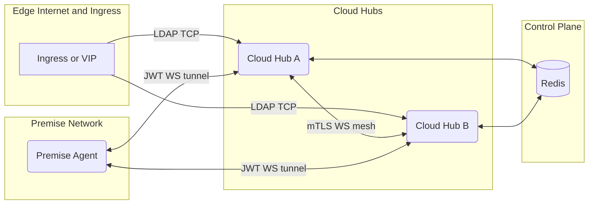
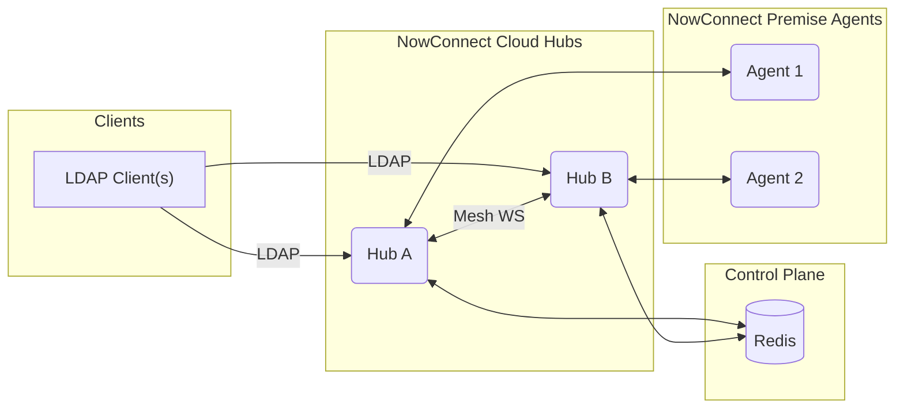
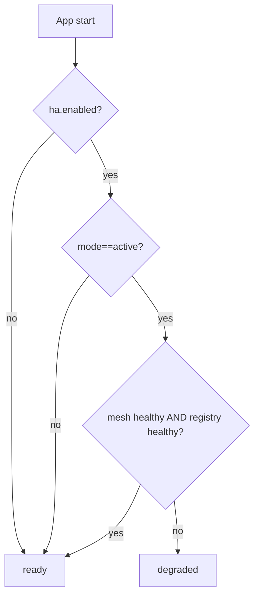
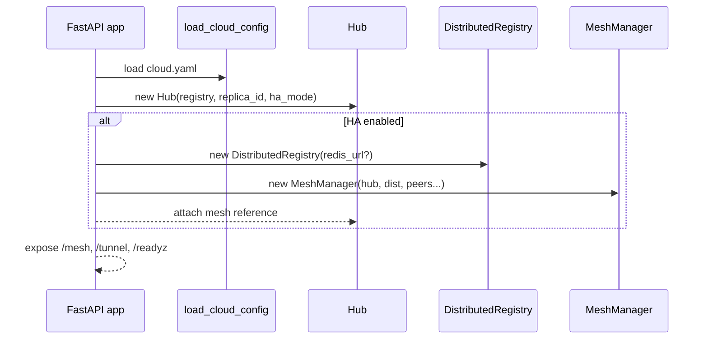
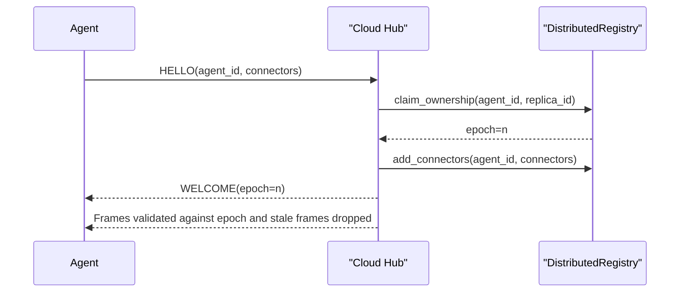
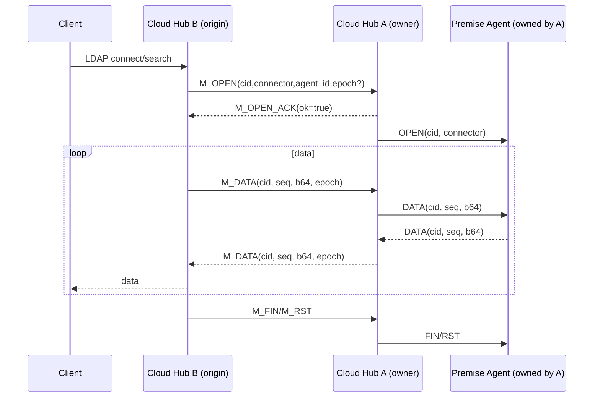
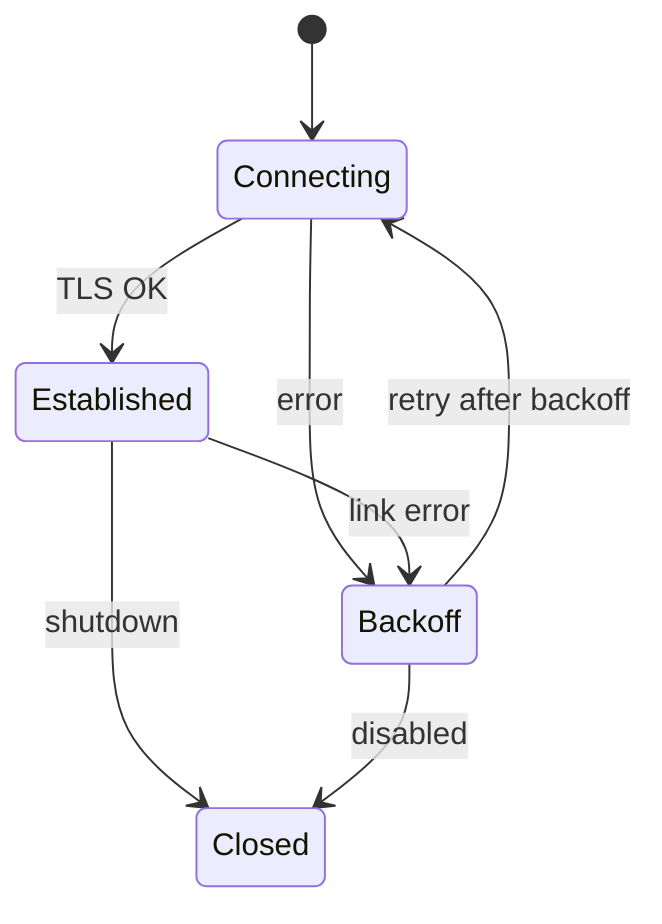

## NowConnect High Availability

- Security controls: Inbound mesh mTLS at ingress, outbound mesh mTLS support, JWT on agent tunnels, cert rotation runbook, masked logs, and platform secret storage guidance.
- Resilience: multi‑replica hubs with epoch‑fenced ownership, bounded queues, backpressure, and degrade behavior when Redis or mesh is impaired.
- Observability: readiness reflects HA state; mesh link and epoch safety metrics; golden dashboards and alerts provided below.
- Operability: feature‑flagged rollout (off → shadow → active), safe rollback, capacity tuning guidance, and perf validation runners.

### Trust boundaries and controls



Controls at a glance

- Mesh (inbound): mTLS is enforced at ingress/proxy. When `require_mtls=true`, the app expects TLS‑terminated traffic and can validate protocol headers in dev.
- Mesh (outbound): the dialer supports mTLS via configured CA/cert/key; permessage‑deflate disabled; bounded send queues and inflight caps.
- Tunnel: JWT `aud=nowconnect`, connector scopes optional; short token TTL; TLS at ingress.
- Secrets: store certs/keys via secure mounts or your platform secret manager; app does not integrate Vault directly.
- Logs: PII masked; security events emitted; retention follows platform policy.

## Overview

- Goals: multi‑replica Cloud hubs that can forward flows across replicas, with ownership fencing, backpressure bounds, and observability.
- Modes (configurable):
  - `off` (default): single‑replica behavior; HA code paths not active
  - `shadow`: HA plumbing enabled but traffic continues using local ownership (observe mesh/registry)
  - `active`: cross‑replica delivery via mesh

### High‑level architecture



## Configuration

File: `ServiceConfigs/NowConnect/config/cloud.yaml` (set `NC_CONFIG=/app/config/cloud.yaml`).

Minimal (single listener + HA shadow):

```yaml
listeners:
  - { name: l1, bind: '0.0.0.0:389', connector: 'ldap' }
ha:
  enabled: true
  mode: shadow  # off|shadow|active
  replica_id: hub-a
  redis_url: redis://shared_redis:6379/0
  mesh:
    listen: 0.0.0.0:400        # optional server-side WS endpoint (ingress forwards to /mesh)
    peers: ["wss://cloud-b.ocg.labs.empowernow.ai/mesh"]
    require_mtls: true
    tls:
      ca_bundle: /app/certs/ca.pem
      cert_file: /app/certs/hub-a.crt
      key_file: /app/certs/hub-a.key
    send_queue_depth: 1000
    per_link_max_inflight_bytes: 8388608
    connect_backoff_max_sec: 30
```

Parsing: `nowconnect_cloud/config_loader.py` → `HAConfig`, `HAMeshConfig`, `HAMeshTLS`.

### Readiness decision flow



## Cloud wiring

File: `nowconnect_cloud/app.py`

- Loads config (`load_cloud_config`); instantiates `RouterRegistry`
- If `ha.enabled`, creates `DistributedRegistry` (`redis_url` if present; in‑memory fallback)
- Creates `Hub` with `replica_id` and `ha_mode`
- If `ha.enabled`, creates `MeshManager` with peers/TLS/backpressure settings; attaches to Hub and app state
- Starts optional `RegistrySweeper` when Redis is used
- Exposes `/mesh` (WS) and `/tunnel` (agent WS), plus `/readyz` and `/healthz`

Readiness (`/readyz`):

- If `ha.enabled && mode==active`: returns `{ "status": "degraded" }` if mesh missing or distributed registry unhealthy; else `ready`. Otherwise returns `ready`.



## Control plane – DistributedRegistry

File: `nowconnect_cloud/distributed_registry.py`

- Redis‑backed registry (ownership and connector presence), in‑memory fallback when `redis_url` absent.
- Owned by Cloud; Premise ownership is claimed during agent `HELLO` (epoch‑based fencing).
- Registry Sweeper (`registry_sweeper.py`) periodically prunes stale entries.

Key functions (intent): `claim_ownership(agent_id, replica_id) -> epoch`, `add_connectors(agent_id, connectors)`, `list_agents(connector)`, `get_owner(agent_id) -> (owner_replica_id, epoch)`, `is_healthy()`.

### Ownership and epoch fencing



## Data plane – Mesh WS between hubs

File: `nowconnect_cloud/mesh.py`

- One persistent WS link per peer (outbound dialer); accept inbound links via `/mesh` handler
- Backpressure: per‑link writer queue (`send_queue_depth`), per‑link inflight bytes cap (`per_link_max_inflight_bytes`)
- Circuit breaker/backoff on failures (`connect_backoff_max_sec`)
- Dedup: per‑CID LRU `last_seq` with cap; epoch fencing validates `epoch` to reject stale frames

Frames: `M_OPEN/M_OPEN_ACK`, `M_DATA`, `M_FIN`, `M_RST` carrying `{cid, connector, agent_id, seq, epoch}`

Cross‑replica flow (origin=Hub B, owner=Hub A):



### Mesh link state machine



## Listener selection and forwarding

File: `nowconnect_cloud/listeners.py`

- If HA off or registry absent → local router
- If HA shadow/active and distributed registry present: prefer a locally owned agent; otherwise use mesh and register an origin sink for return frames

## Endpoints and security

- `/mesh` (WS): For hub↔hub; enforce mTLS when `ha.mesh.require_mtls=true` (TLS often terminated at ingress)
- `/tunnel` (WS): For Premise agents; JWT with `aud=nowconnect`
- `/healthz`: Always `ok`
- `/readyz`: HA‑aware readiness (see above)

## Metrics (Prometheus)

From `mesh.py` and design:

- `nowconnect_mesh_links{peer,state}` (MESH_LINKS)
- `nowconnect_mesh_frames_total{dir,type}` (MESH_FRAMES_TOTAL)
- `nowconnect_mesh_rtt_seconds_*` histogram (MESH_RTT_SECONDS)
- `nowconnect_owner_epoch_mismatch_total` (OWNER_EPOCH_MISMATCH_TOTAL)
- `nowconnect_cid_dedup_dropped_total` (CID_DEDUP_DROPPED_TOTAL)
- `nowconnect_mesh_backpressure_drops_total{peer,reason}` (MESH_BACKPRESSURE_DROPS_TOTAL)
- `nowconnect_mesh_link_reconnects_total` (MESH_LINK_RECONNECTS_TOTAL)
- `nowconnect_mesh_link_errors_total` (MESH_LINK_ERRORS_TOTAL)
- Gauges in writer loop: per‑link queue size and inflight bytes

Alert ideas: Mesh P95 RTT > 20ms (5m); any queue overflow/backpressure drop > 0 (5m); epoch mismatches > 0 (5m); mesh link down > 60s. For cross‑replica share, base alerts on ingress/proxy connection metrics as the denominator.

## Failure modes (degrade behavior)

- Redis down: serve local‑only; reject cross‑replica; `/readyz` reports degraded
- Mesh down: only cross‑replica flows fail; local ownership unaffected
- Owner crash: existing flows drop; agent reconnects; new flows can be owned by surviving hub

## Test matrix and QA guidance

- Single‑replica regression (HA disabled) – ensure no side effects
- HA happy path (2 hubs + 1 agent): M_OPEN/ACK, bidirectional DATA, FIN/RST
- Owner crash; mesh partition; epoch fence; dedup; degrade scenarios as described
- Perf: use `CRUDService/tools/perf_nowconnect_ldap.py`; assert p99 and error budget

## DevOps notes (enablement & rollout)

Enable HA (shadow → active):

1. Deploy Redis; set `ha.enabled=true`, `mode=shadow`, `replica_id` per hub; configure `mesh.peers` and mTLS
2. Validate `/readyz` and mesh link metrics
3. Switch to `mode=active` per hub
4. Add LB/VIP for client traffic; scale hubs

Certificates: configure `ha.mesh.tls` with CA and per‑hub cert/key; enforce `require_mtls=true` in production.

Scaling: add replicas and peers; ensure queue and inflight caps fit workload.

Runbooks: link down (check metrics/TLS); Redis degraded (local‑only mode, `/readyz` degraded).

## SLOs, capacity, and dashboards

SLOs (starting points)

- Availability: 99.9% per month for Cloud hubs
- Mesh RTT p95: ≤ 20 ms
- Cross‑replica share: ≤ 40% sustained (investigate if higher)

Capacity tuning

- Per‑link send_queue_depth: 500–2000 depending on RTT and throughput
- per_link_max_inflight_bytes: 4–16 MiB
- Redis: size for agent count and connector updates (use eviction disabled; monitor memory)

Golden dashboards (Grafana)

- Mesh health: links by state; RTT p50/p95; frames and bytes by dir
- Safety: owner epoch mismatches; dedup drops; backpressure counters
- Throughput: TCP connections and bytes (from existing metrics)

Alerts (Prometheus rules examples)

```yaml
- alert: NowConnectMeshHighRTT
  expr: histogram_quantile(0.95, rate(nowconnect_mesh_rtt_seconds_bucket[5m])) > 0.02
  for: 5m
  labels: { severity: warning }
  annotations: { summary: "Mesh RTT p95 high" }

# Cross‑replica share requires a denominator from ingress/proxy metrics; example intentionally omitted
```

## Certificate rotation and secrets

- Store mesh CA/cert/key via secure mounts or your platform secret manager; restrict read permissions
- Rotate certificates per policy; restart the hub processes or containers to pick up new files (hot reload is not supported)
- JWT for agent tunnels issued by your IdP or configured signing service; rotate per your security policy; short token TTL recommended

## Validation and evidence

- Runner: `CRUDService/tools/perf_nowconnect_ldap.py`
- Guide: `CRUDService/tools/perf_nowconnect_ldap_guide.md`
- Sample report: `CRUDService/tools/perf_nowconnect_report.md`

## Code pointers

- Config parsing: `nowconnect_cloud/config_loader.py`
- App wiring/endpoints: `nowconnect_cloud/app.py`
- Mesh manager: `nowconnect_cloud/mesh.py`
- Listener selection: `nowconnect_cloud/listeners.py`
- Distributed registry: `nowconnect_cloud/distributed_registry.py`
- Registry sweeper: `nowconnect_cloud/registry_sweeper.py`
- Hub (frame routing): `nowconnect_cloud/hub.py`

## Known gaps & future work

- Shadow mode coverage/metrics; peer discovery; multi‑tenant selection; extended soak/chaos in CI/CD


