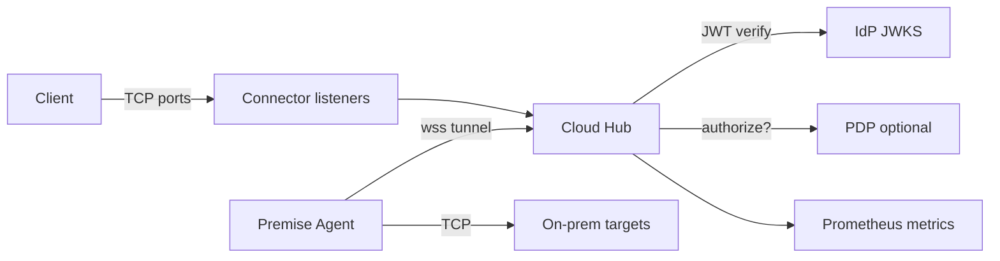
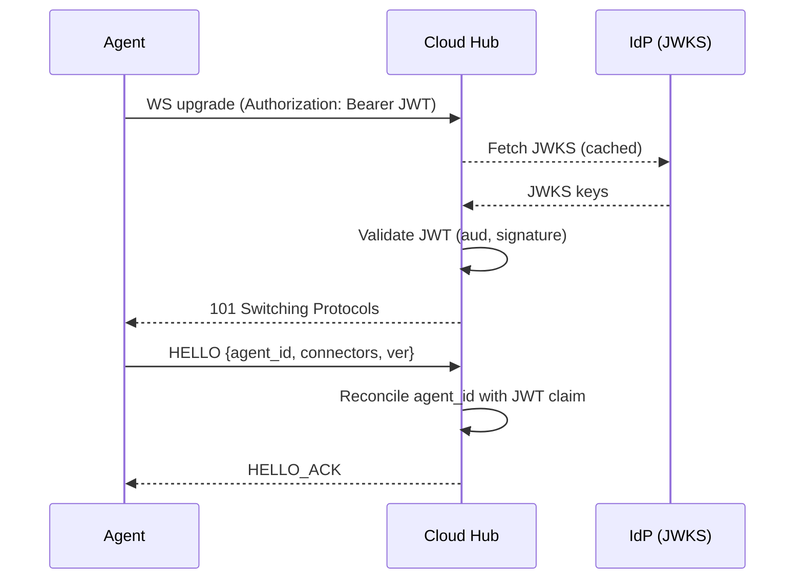
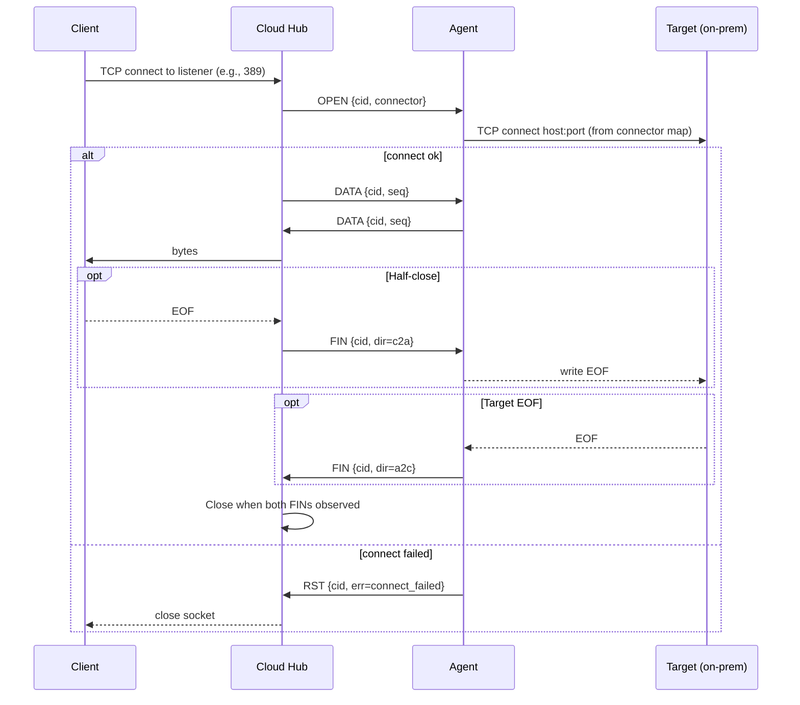
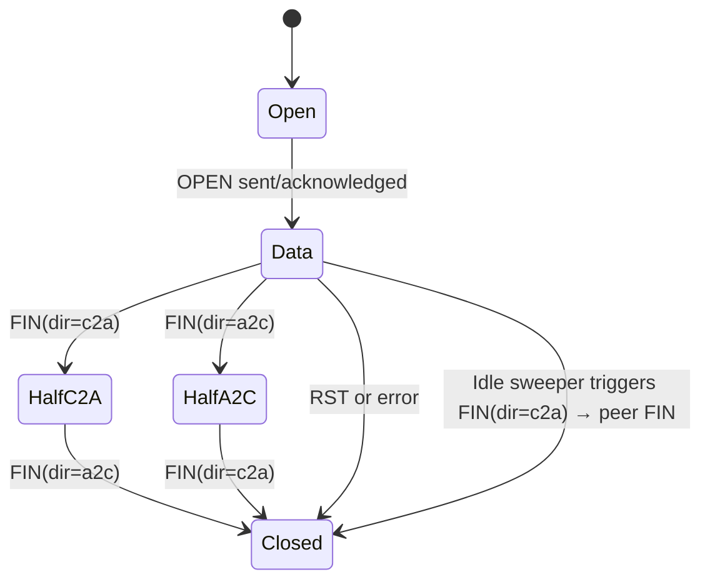
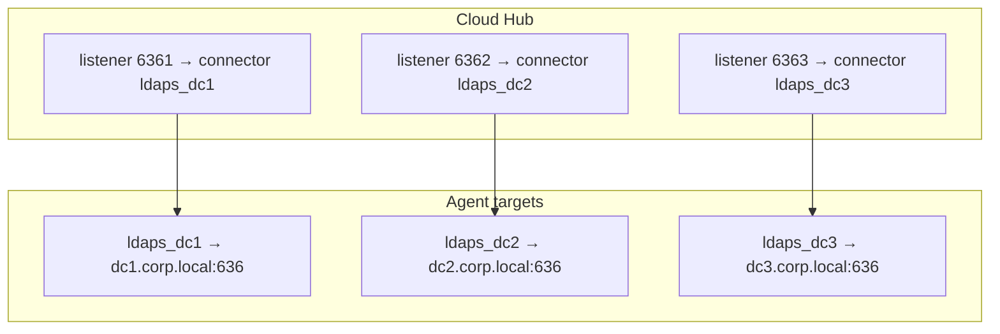
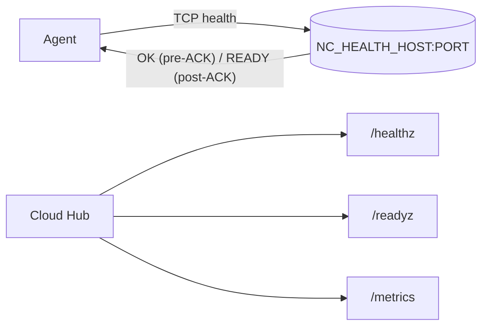

## NowConnect — Visual Guide

This page gives a visual overview of how NowConnect works, from tunnel setup to data flow and connection lifecycle.

### Components and Data Flow

### Tunnel Establishment (Auth + HELLO)

### Handling a New TCP Connection (Multiplexed stream)

### Connection Lifecycle (per `cid`)

### Mapping Many Backends (example: LDAPS)

### Health and Readiness

Tips:
- Keep `max_ws_payload` modest (e.g., 8KB) and queues bounded for stable memory.
- Enable connector scopes and PDP only when needed; both are feature‑flagged.
- Use `NC_CA_BUNDLE` and `NC_TRUST_ENV=true` for corporate proxy/TLS interception environments.

