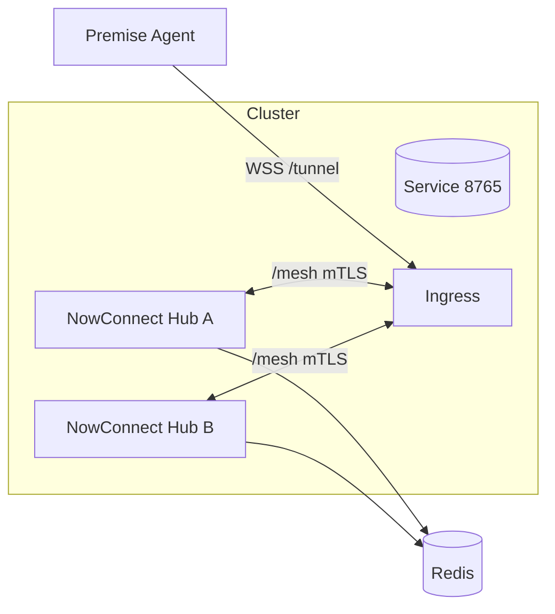

## Kubernetes Deployment Guide (Helm/Kustomize)

This guide provides Helm and Kustomize blueprints for deploying NowConnect Cloud Hub with optional HA mesh and ingress mTLS for `/mesh`. Includes capacity notes and recommended settings.

### Prerequisites

- Namespace created; Ingress Controller (Traefik or Nginx)
- Secrets for `cloud.yaml`, JWKS URL/audience, and optional mesh CA/cert/key
- Redis (managed or in-cluster) for HA Registry

### Helm (template-style values)

```yaml
replicaCount: 2
image:
  repository: your-registry/nowconnect-cloud
  tag: latest
env:
  NC_CONFIG: /app/config/cloud.yaml
volumeMounts:
  - name: config
    mountPath: /app/config
  - name: mesh-certs
    mountPath: /app/certs
volumes:
  - name: config
    secret:
      secretName: nowconnect-config
  - name: mesh-certs
    secret:
      secretName: nowconnect-mesh-certs
service:
  ports:
    - name: tunnel
      port: 8765
      targetPort: 8765
    - name: ldap
      port: 389
      targetPort: 389
ingress:
  enabled: true
  className: traefik
  hosts:
    - host: api.example.com
      paths:
        - path: /tunnel
          pathType: Prefix
          serviceName: nowconnect
          servicePort: 8765
        - path: /mesh
          pathType: Prefix
          serviceName: nowconnect
          servicePort: 8765
  annotations:
    traefik.ingress.kubernetes.io/router.tls: "true"
    traefik.ingress.kubernetes.io/router.tls.options: mtls@file
```

Traefik dynamic options ConfigMap (referenced by `mtls@file`):

```yaml
apiVersion: v1
kind: ConfigMap
metadata:
  name: traefik-dynamic
  namespace: kube-system
data:
  traefik_dynamic.yml: |
    tls:
      options:
        mtls:
          clientAuth:
            clientAuthType: RequireAndVerifyClientCert
            caFiles:
              - /etc/traefik/mesh/mesh_ca.pem
```

### Kustomize overlay (example)

```yaml
resources:
  - deployment.yaml
  - service.yaml
  - ingress.yaml
  - config-secret.yaml
  - mesh-certs-secret.yaml

patches:
  - path: replicas-patch.yaml
```

`replicas-patch.yaml`:

```yaml
apiVersion: apps/v1
kind: Deployment
metadata:
  name: nowconnect
spec:
  replicas: 2
```

### Capacity and sizing notes

- Start with 0.5–1 vCPU and 512–1024 MiB RAM per hub, then size by:
  - Agents and concurrent connections
  - RTT between hubs (impacts `send_queue_depth` and inflight bytes)
  - Throughput per connector
- Redis: provision for registry size and updates; enable HA in production.

### Diagram (k8s topology)




