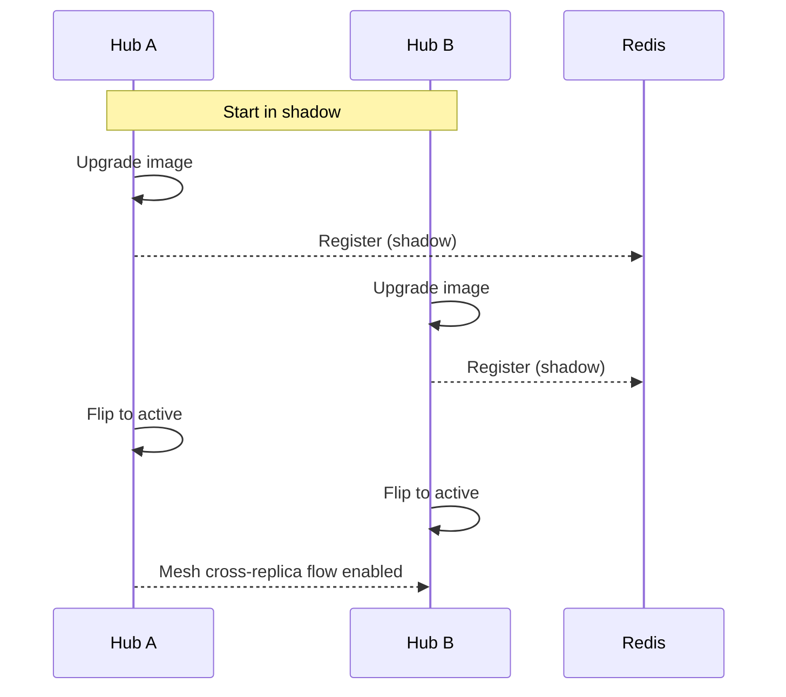

## Upgrade and Rollback Guide (HA Safe Sequencing)

This guide describes safe sequencing to upgrade the Cloud Hub and to roll back if needed, with HA mesh modes `off | shadow | active`.

### Upgrade sequencing (minor/patch releases)

1. Pre-checks
   - Review release notes; verify config compatibility.
   - Ensure Redis healthy; mesh links stable.
2. Set `ha.mode: shadow` on all hubs.
3. Upgrade one hub (blue/green or rolling) and verify:
   - `/readyz` = `ready`.
   - Mesh links established; no increase in `nowconnect_mesh_link_errors_total`.
4. Upgrade remaining hubs.
5. Switch `ha.mode: active` on all hubs.
6. Monitor SLOs and error budgets.

### Rollback sequencing

1. Set `ha.mode: shadow` to avoid cross-replica delivery.
2. Roll back pods to previous image/config.
3. Verify `/readyz` and mesh health.
4. Return `ha.mode: active` when stable.

### Visual: shadow → active rollout

### Compatibility

- Mesh frames are versioned; minor versions are wire-compatible. If a breaking change is planned, upgrade windows will note ordering.

### Backout triggers

- Elevated `nowconnect_mesh_backpressure_drops_total` or link errors.
- PDP error bursts with deny-fast impacts.
- Redis instability causing `/readyz` degraded in active mode.

