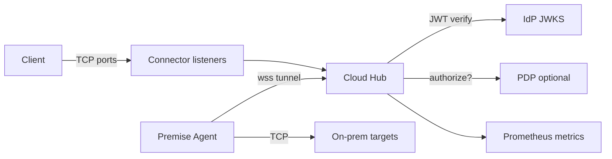
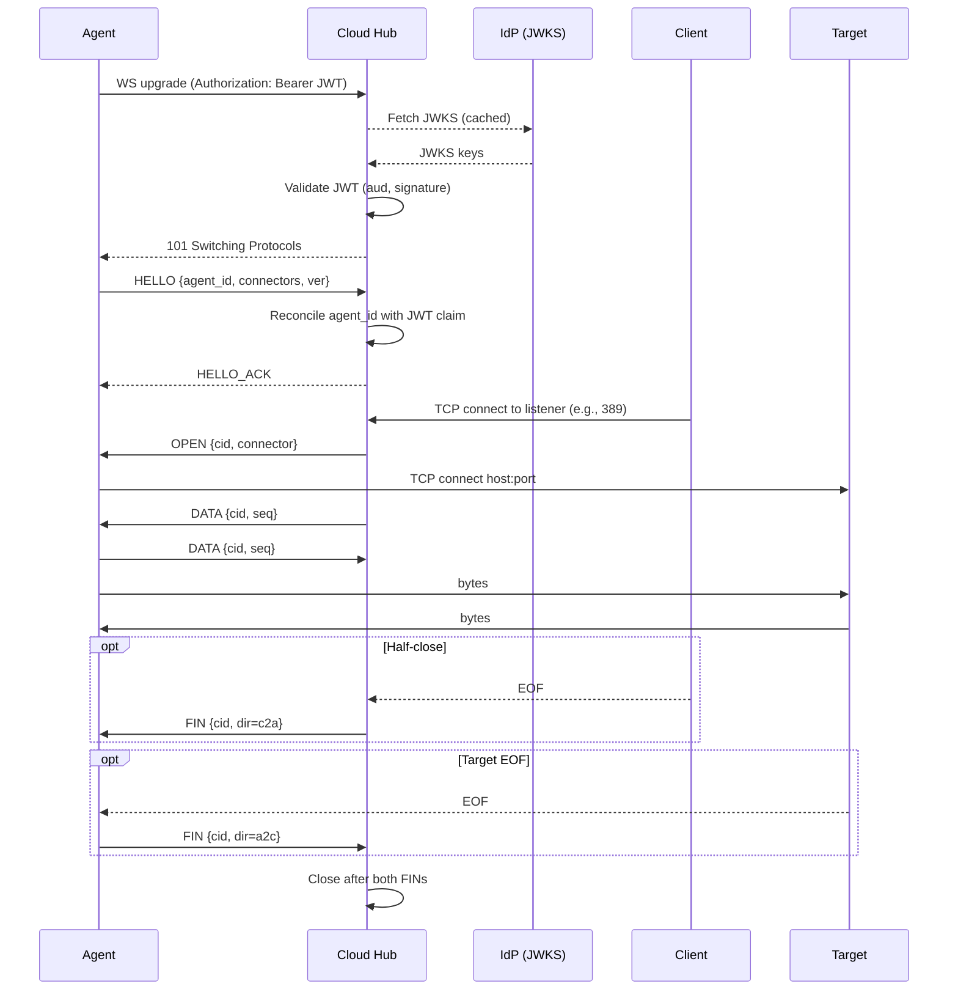

NowConnect enables outbound‑only, agent‑mediated connectivity from on‑premises networks to cloud services, used here to access systems like LDAP without opening inbound firewall ports.

See How‑to for operational validation and health guidance.

## NowConnect

NowConnect is a secure TCP tunneling service that lets cloud apps reach specific on‑prem systems without opening inbound firewall ports. A lightweight agent on‑prem makes a single outbound WebSocket to the Cloud Hub; the hub exposes TCP listeners (e.g., 389/636/22/1433) and relays bytes over that tunnel. TLS for end‑protocols (LDAPS/HTTPS/TCPS) remains end‑to‑end.

### At a glance
- Protocol‑agnostic TCP: LDAP/LDAPS/GC, Kerberos (TCP), SSH, Telnet, ODBC (SQL Server/Oracle/Postgres/MySQL), and internal REST
- Single outbound `wss://` tunnel from premise through corporate proxies (proxy/CA supported)
- Multiplexed streams with bounded queues, backpressure, FIN/RST, and idle sweeper
- Auth: JWT on WS upgrade (audience, JWKS), `HELLO.agent_id` reconciliation
- Optional AuthZ: PDP on `OPEN(connector)` and/or connector scopes in JWT (feature‑flagged)
- Ops: Prometheus metrics, JSON logs (no payload), `/healthz` `/readyz`, agent TCP health (OK→READY)

### Visual overview

### Session flow (happy path)

### Key docs
- How-to: Premise Agent setup: [how-to/premise-agent](how-to/premise-agent.md)
- How-to: Cloud Hub deployment: [how-to/cloud-hub-deploy](how-to/cloud-hub-deploy.md)
- Reference: Configuration (YAML/env): [reference/configuration](reference/configuration.md)
- Reference: Wire protocol: [reference/wire-protocol](reference/wire-protocol.md)
- Reference: Metrics & Observability: [reference/metrics](reference/metrics.md)
- Reference: Security model: [reference/security](reference/security.md)
- Reference: IdP support and auth: [reference/idp-and-auth](reference/idp-and-auth.md)
- Reference: Security overview: [reference/security-overview](reference/security-overview.md)
- Explanation: Architecture & design: [explanation/architecture](explanation/architecture.md)
- Explanation: Visual guide: [explanation/visual-guide](explanation/visual-guide.md)
- How-to: Connect common protocols: [how-to/connect-common-protocols](how-to/connect-common-protocols.md)
- How-to: LDAPS with multiple backends: [how-to/ldaps-multi-backend](how-to/ldaps-multi-backend.md)

