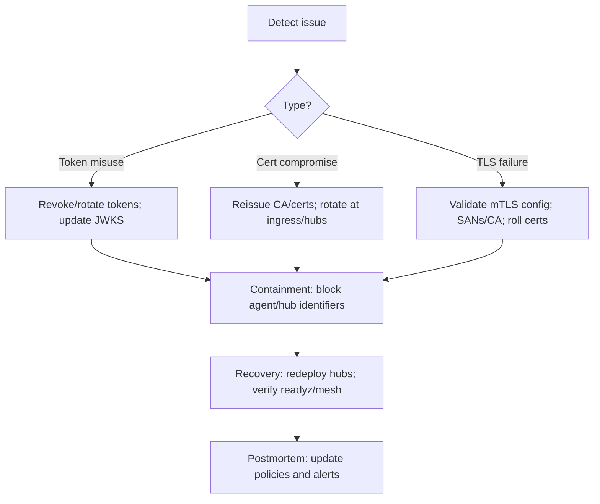

## Compliance Mapping (CIS, NIST 800-53, ISO 27001, SOC 2)

This page summarizes how NowConnect's security posture, controls, and operational guidance map to common frameworks. Responsibilities are shared: the platform provides controls; customers configure and operate them within their environment.

See also: [Security Overview](./security-overview.md), [Security Model](./security.md), [PKI Guidance](./pki-guidance.md), and Metrics/alerts in [HA architecture](../explanation/ha-v2-architecture.md).

### Scope and responsibility model

| Area | Platform responsibility | Customer responsibility |
|---|---|---|
| Software security | Code quality, dependency scanning, SBOM publication, release notes | Image provenance validation, admission policies, patch rollout cadence |
| Transport security | TLS/WSS everywhere; optional mTLS at ingress; JWT validation | Ingress configuration, CA management, certificate issuance/rotation |
| Identity & access | JWT `aud` enforcement, `agent_id` reconciliation, optional PDP | IdP configuration, token issuance/rotation, PDP policy management |
| Logging & monitoring | Structured logs, metrics, recommended dashboards/alerts | Centralized log retention/SIEM, alert routing/on-call |
| Availability | HA mesh, readiness, backpressure bounds | Topology (single/HA/multi-region), Redis HA, capacity planning |
| Data protection | No payload bytes logged; metadata only | Data classification and log retention policies |

### Framework mapping (selected controls)

| Control area | CIS IG 1-3 | NIST 800-53 | ISO 27001 Annex A | SOC 2 TSC | Implementation notes |
|---|---|---|---|---|---|
| Transport encryption | IG1 3.11, IG2 3.12 | SC-8, SC-12, SC-13 | A.8.24 | CC6.7 | TLS for all tunnels; mTLS for `/mesh`; end-protocol TLS preserved |
| Authentication | IG1 4.3 | IA-2, IA-5 | A.8.2, A.8.3 | CC6.1 | JWT on WS upgrade, `aud=nowconnect`, JWKS validation |
| Authorization | IG2 4.5 | AC-2, AC-3 | A.8.2, A.8.9 | CC6.1 | Optional PDP on `OPEN(connector)`; connector scopes |
| Secrets mgmt | IG1 3.4 | IA-5, SC-12 | A.8.22 | CC6.1, CC6.8 | Tokens as files/secrets; CA/cert/key via secrets; rotation guidance |
| Logging & monitoring | IG1 8.1, 8.2 | AU-2, AU-6, AU-12 | A.8.15 | CC7.2, CC7.3 | Structured logs, metrics, golden dashboards and alerts |
| Configuration mgmt | IG1 4.4 | CM-2, CM-6 | A.8.9 | CC8.1 | Declarative config; HA mode flags; change notes in releases |
| Availability/Resilience | IG2 11.2 | CP-2, CP-10 | A.5.29, A.8.16 | A1.2 | HA mesh, readiness degrade behavior, DR guidance |
| Vulnerability mgmt | IG1 7.1 | RA-5, SI-2 | A.5.23 | CC7.1 | SBOM; CVE triage; patch cadence recommendations |
| Incident response | IG2 17.1 | IR-4, IR-5 | A.5.24 | CC7.4 | IR swimlane and runbooks for token/cert compromise |

### Evidence artifacts

- SBOM: recommended for internal builds; provide via your CI pipeline if required.
- Release notes: include security fixes and dependency upgrades where applicable.
- Architecture diagrams: trust boundaries and control points.
- Runbooks: token and certificate rotation, ingress mTLS configuration.

### IR scenarios and responsibilities (guidance)

### DR/RTO/RPO checkpoints (guidance)

- Define RTO/RPO objectives for Cloud Hub and Redis appropriate to your environment. Suggested starting points: RTO ≤ 15m (Cloud Hub), RPO 0 (stateless). Redis HA per your platform.
- Validate failovers regularly: hub crash, mesh partition, Redis outage. Capture metrics and outcomes.

Note: This page provides implementation-aligned guidance, not a formal attestation. Map and validate controls within your organization’s GRC program.

