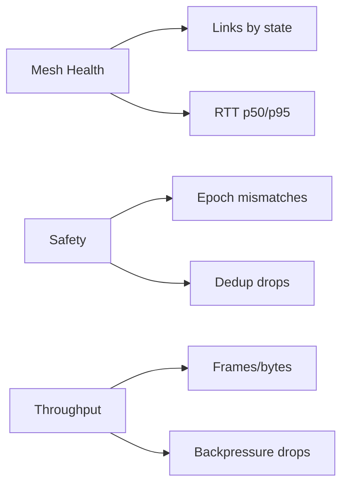

## Dashboards and Alerts

This page consolidates the metric catalog, example Grafana panels, and Prometheus alert rules for NowConnect.

### Metric catalog (selected)

| Metric | Type | Labels | Description |
|---|---|---|---|
| `nowconnect_mesh_links` | gauge | `peer,state` | Mesh link count by state |
| `nowconnect_mesh_frames_total` | counter | `dir,type` | Mesh frames by direction and type |
| `nowconnect_mesh_rtt_seconds_bucket` | histogram | `peer` | Mesh RTT distribution |
| `nowconnect_mesh_backpressure_drops_total` | counter | `peer,reason` | Drops due to backpressure |
| `nowconnect_mesh_link_reconnects_total` | counter | `peer` | Reconnect attempts |
| `nowconnect_mesh_link_errors_total` | counter | `peer` | Link errors |
| `nowconnect_owner_epoch_mismatch_total` | counter |  | Safety: epoch mismatches |
| `nowconnect_cid_dedup_dropped_total` | counter |  | Safety: dedup drops |

### Example Grafana layout



### Prometheus alert rules

```yaml
- alert: NowConnectMeshHighRTT
  expr: histogram_quantile(0.95, rate(nowconnect_mesh_rtt_seconds_bucket[5m])) > 0.02
  for: 5m
  labels: { severity: warning }
  annotations: { summary: "Mesh RTT p95 high" }

- alert: NowConnectMeshBackpressureDrops
  expr: increase(nowconnect_mesh_backpressure_drops_total[5m]) > 0
  for: 5m
  labels: { severity: warning }
  annotations: { summary: "Backpressure drops observed" }

- alert: NowConnectMeshLinkDown
  expr: absent_over_time(nowconnect_mesh_links{state="established"}[1m])
  for: 1m
  labels: { severity: critical }
  annotations: { summary: "Mesh link not established" }

- alert: NowConnectMeshTLSIssues
  expr: rate(nowconnect_mesh_link_errors_total[5m]) > 0 or rate(nowconnect_mesh_link_reconnects_total[5m]) > 3
  for: 10m
  labels: { severity: warning }
  annotations: { summary: "Mesh TLS errors or frequent reconnects" }
```


