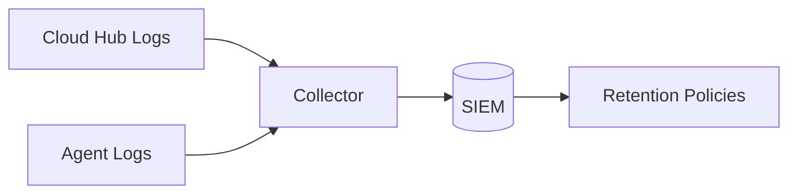

## Logging, Data Classification, and Retention

NowConnect does not log payload bytes. Logs contain metadata required for operations, security, and auditability. This page defines data classes, default retention suggestions, and where to configure retention.

### What we log (metadata only)

| Category | Examples |
|---|---|
| Connection lifecycle | agent connect/disconnect, JWT validation result, HELLO/ACK, OPEN/FIN/RST |
| Connector activity | connector name, CID counts, local vs mesh routing, backpressure events |
| Errors/security | JWT failures, TLS/mTLS errors, PDP decision failures/timeouts |
| Metrics (Prometheus) | mesh links state, RTT histograms, frames counters, backpressure, errors |

Excluded by design: TCP payload bytes, LDAP/DB queries, credentials. Headers with secrets (e.g., Authorization) should be excluded at ingress.

### Data classification

| Class | Description | Examples | Suggested retention |
|---|---|---|---|
| Operational | routine lifecycle and metrics | connect/disconnect, counts | 30–90 days |
| Security-relevant | auth failures, mTLS errors, PDP denies | JWT fail, mesh TLS error | 90–365 days (per policy) |
| Audit | config change, HA mode changes, certificate rotations | mode flips, cert reloads | 1–3 years (per policy/regulatory) |

### Configuring log output

- Cloud Hub: structured JSON to stdout; control via environment `LOG_LEVEL` (or YAML `observability.log_level`).
- Premise Agent: `NC_LOG_FORMAT=json` recommended for centralized ingestion; `NC_LOG_LEVEL` controls verbosity.

### Retention configuration points

- Centralized log platform (SIEM) owns retention and access policies. Ship logs from stdout/stderr using your collectors (e.g., Fluent Bit, Vector).
- At the edge, ensure access logs exclude secrets and are rotated per policy.

### SIEM integration pattern

### PII considerations

- Agent identifiers and connector names may be sensitive in some contexts. Use SIEM field-level retention or redaction as required.

### Metrics retention

- Prometheus: retain raw TS per your infra; recommended 15–30 days locally; long-term store via Thanos/Cortex with downsampling.

