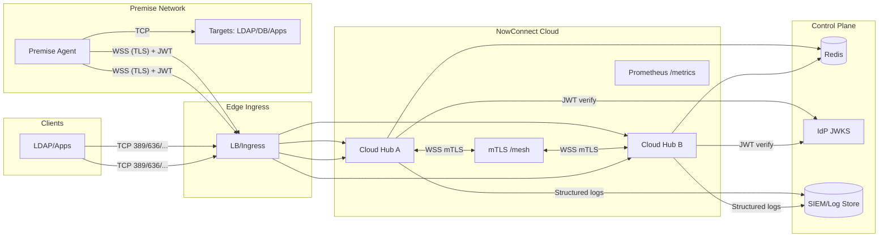

## NowConnect Security Overview

This page summarizes authentication, authorization, secrets, logging, transport security, and observability for the NowConnect Cloud Hub and Premise Agent. See also: [IdP support and auth](./idp-and-auth.md), [Security model](./security.md), and [Configuration](./configuration.md).

### Components
- **Cloud Hub (FastAPI)**: WebSocket `/tunnel`, `/healthz`, `/readyz`, Prometheus `/metrics`, TCP listeners per connector.
- **Premise Agent (asyncio)**: outbound‑only `wss://` tunnel, local health TCP, no data‑plane listeners.

### End‑to‑end data flow and trust boundaries



Trust boundaries: TLS at all external hops; mTLS enforced at ingress for `/mesh`; agent tunnels use TLS + JWT by default (agent mTLS optional).

### Authentication (Agent → Cloud)
- WebSocket upgrade requires `Authorization: Bearer <JWT>` (a development bypass is available for local testing).
- JWT validated against IdP JWKS and `audience`.
- `HELLO` reconciliation: `HELLO.agent_id` must match the JWT `agent_id`.
- Configure via env or YAML:
  - Env: `NOWCONNECT_JWKS_URL`, `NOWCONNECT_AUDIENCE`
  - YAML: `security.jwks_url`, `security.audience`

### Authorization (Cloud)
- Optional PDP authorization on each `OPEN(connector)`:
  - Toggle via `pdp.url` (YAML) or `NOWCONNECT_PDP_URL` (env). If set, Cloud calls PDP with `subject=agent_id`, `action=connect`, `resource={type:connector,id}`.
  - Decision cache TTL and timeout configurable (`pdp.cache_ttl_sec`, `pdp.timeout_ms`).
  - Fail‑open/closed via `pdp.fail_open` (default false).
- Optional connector scope enforcement on HELLO:
  - Toggle `security.require_connector_scopes=true` or `NOWCONNECT_REQUIRE_CONNECTOR_SCOPES=true`.
  - JWT must include connector names (via a `connectors` claim or `scp` scope list).

### Transport Security
- Tunnel: `wss://` from premise to cloud (TLS). Corporate proxies supported with `NC_TRUST_ENV=true` on the agent; system proxy envs are honored.
- CA bundle: agent can trust corporate CA via `NC_CA_BUNDLE` SSL context.
- Protocol payloads: raw TCP; application TLS (e.g., LDAPS/HTTPS) remains end‑to‑end.
- Agent↔Cloud mTLS: optional and off by default; baseline is TLS (WSS) + JWT. If required, enforce client mTLS at ingress; the app continues to validate JWT.

### Security profiles

| Control | Baseline | Enterprise Hardened |
|---|---|---|
| Mesh hub↔hub | TLS with mTLS enforced at ingress in prod | Same + cert rotation SLOs + SAN allowlist |
| Agent↔Cloud | TLS (WSS) + JWT | Optional client mTLS at ingress; device identity policies |
| JWT | `aud=nowconnect`, JWKS, `agent_id` reconciliation | + Connector scopes, short TTL, key rotation alerts |
| AuthZ | Optional PDP off | PDP on `OPEN(connector)` with deny-fast and cache |
| Inbound listeners | TLS where applicable; CIDR allowlists optional | Strict CIDR allowlists + dedicated VIPs |
| TLS profile | TLS 1.2/1.3, secure ciphers | TLS 1.3 preferred, FIPS images where required |
| Observability | Metrics/logs shipped to SIEM | Baseline + dashboards + SLO/alert pack |
| Secrets | Files/Secrets, no payload logs | HSM/KMS-backed secrets, automated rotation |

### Compliance overview

- See compliance mapping for CIS, NIST 800‑53, ISO 27001, and SOC 2 alignment: [Compliance Mapping](./compliance-mapping.md).
  - FIPS: Achieved via your base image/OS and crypto modules; NowConnect runs on that foundation and honors system TLS libraries.

### Incident response (high level)

Common scenarios: tunnel token abuse, hub cert/key exposure, mesh mTLS failure.

```mermaid
sequenceDiagram
  participant Det as Detect
  participant Con as Contain
  participant Era as Eradicate
  participant Rec as Recover
  participant Lrn as Lessons

  Det->>Det: Alert: JWT failures/mTLS errors/anomalous traffic
  Det-->>Con: Triage: identify scope (agent/hub/ingress)
  Con->>Con: Block: revoke token/cert; tighten ingress; scale down affected pods
  Con-->>Era: Forensic snapshot; rotate secrets
  Era->>Era: Re-issue keys/certs; invalidate tokens; update JWKS
  Era-->>Rec: Redeploy hubs; verify mesh/readyz; validate traffic
  Rec->>Rec: Monitor SLOs/alerts; confirm eradication
  Rec-->>Lrn: Postmortem; improve controls/runbooks
```

Runbook references: token rotation, cert rotation, and ingress mTLS examples in hardening/PKI guidance.

### DR, RTO/RPO guidance

- Targets (starting points): RTO ≤ 15 minutes for Cloud Hub; RPO 0 for runtime state (stateless hubs). Redis availability per your HA deployment.
- Validate: failover tests for hub crash, mesh partition, and Redis loss; verify `/readyz` and traffic continuity.
- Backups: configuration and secrets only; no payload storage. Redis persistence optional; size for registry usage.

### Health and Observability
- Agent: TCP health on `NC_HEALTH_HOST:NC_HEALTH_PORT` responds `OK` pre‑ACK, `READY` after `HELLO_ACK`.
- Cloud: `/healthz`, `/readyz`, and Prometheus metrics.
- Metrics (Cloud): connections, bytes, FIN/RST, queue overflow, PDP decisions; optional FAPI (DPoP) reject counter when enabled.
- Logging: structured JSON on Cloud by default; agent supports `NC_LOG_FORMAT=json`. Logs metadata only (no payload bytes).

### Secrets
- Agent token: `NC_TOKEN_FILE` path, mounted read‑only (Kubernetes Secret or host file). Rotate and restart the agent to pick up a new token.
- Avoid logging secrets; `Authorization` header should be excluded from access logs at the edge.

### FAPI (optional)
- Modes: `security.fapi_mode` (YAML) or `NOWCONNECT_FAPI_MODE`/`FAPI_MODE` (env). Default `0` (off).
- Mode 2 (planned): DPoP verification on WS upgrade with replay protection. Prefer enforcing client mTLS at ingress when required.

### Single‑tenant posture
- No tenant claims or tenant indexing at runtime. Connector index keyed by `connector` only. `HELLO` reconciliation uses `agent_id` only.

