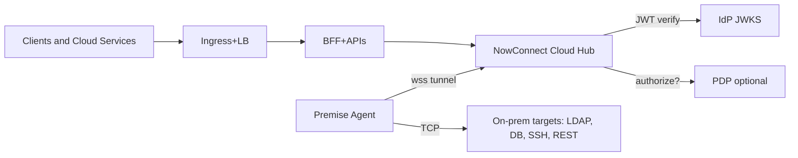
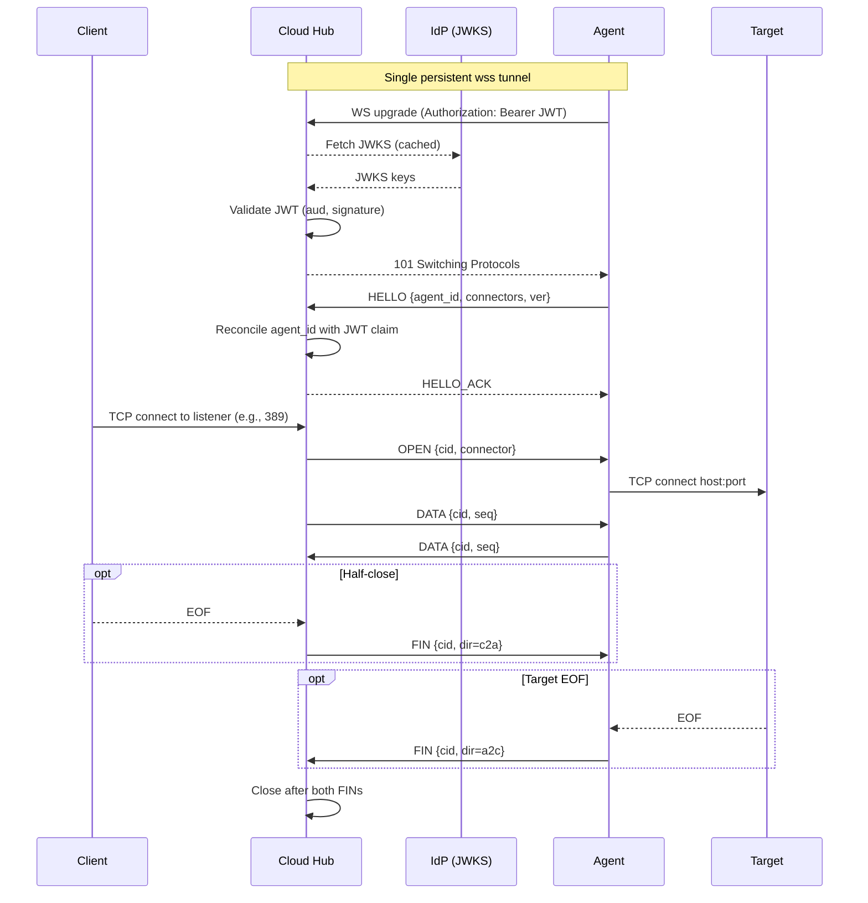

### NowConnect: an identity‑anchored, vendor‑agnostic tunnel for secure on‑prem access

### One‑page purpose
- Enable cloud workloads to reach on‑prem identity systems (LDAP/AD), databases, and internal services securely, without opening inbound firewall ports.
- Bind access to identity and policy: authenticate the on‑prem connector via your IdP; optionally authorize each “open connection” via your PDP.
- Remain vendor‑neutral: any OIDC/OAuth IdP (JWKS) and any OpenID/AuthZEN‑style PDP.

### Visual 1 — Where it sits in your IGA/security fabric

### Visual 2 — Identity‑anchored session flow

### What it is
- Cloud Hub
  - A small FastAPI service exposing:
    - `/tunnel` (WebSocket) for premise connectors
    - TCP listeners (e.g., 389/636/22/1433/…)
    - `/healthz`, `/readyz`, `/metrics` (Prometheus)
  - Validates the connector’s JWT against your IdP’s JWKS; reconciles HELLO.agent_id with token.
  - Optionally calls your PDP to authorize each OPEN(connector) before relaying any bytes.
- Premise Agent (on‑prem)
  - A lightweight process that opens a single outbound `wss://` to the Cloud Hub.
  - Proxies TCP from the hub to local targets (LDAP/AD, databases, SSH, REST).
  - No inbound ports; supports corporate proxies and CA bundles.

### Why it matters for IGA
- Modernizes identity plumbing without ripping and replacing:
  - Cloud services can read directories (LDAP/AD), call on‑prem REST, or reach DBs for identity data—over a single identity‑anchored path.
- Policy‑first access:
  - Who can open which connector is decided by your PDP (AuthZEN style), not by static networking.
- Strong auditability:
  - Identity and connector names are logged; metrics expose connections, bytes, and allow/deny decisions.

### Security at a glance
- Authentication
  - Any IdP issuing JWTs with JWKS; audience enforced; `agent_id` reconciliation on HELLO.
- Authorization (optional)
  - PDP decision on `connect` to a `connector`; short TTL cache; deny fast on failure.
  - Optional connector scope enforcement in the JWT.
- Transport
  - Outbound‑only from premise, `wss://` tunnel; local TCP to targets.
  - Application TLS remains end‑to‑end (LDAPS/HTTPS/TCPS).
- Observability
  - JSON logs (no payload), Prometheus metrics, health/readiness endpoints.
- Secrets
  - Short token file mounted read‑only; rotation by reconnect; never logged.

### Vendor‑agnostic Identity Fabric
- IdP: Azure AD/Entra, Okta, Auth0, Keycloak, Ping, etc. via JWKS—no lock‑in.
- PDP: Any OpenID/AuthZEN‑style PDP for policy decisions.
- Protocols: Works with any TCP service—LDAP/LDAPS/AD, SSH, RDP, ODBC/JDBC (SQL Server/Oracle/Postgres/MySQL), REST, custom TCP.

### Business problem solved
- Challenge: Cloud apps need on‑prem data, but inbound firewall holes, VPN sprawl, and bespoke relays slow delivery and increase risk.
- NowConnect outcome:
  - Security: No inbound exposure; identity‑ and policy‑gated access; clear telemetry.
  - Speed: Configure connectors and go—no app protocol changes.
  - Cost/control: Reuses your IdP and PDP; portable across vendors and clouds.

### Deployment snapshot
- Cloud Hub: container/K8s service; bind required TCP ports; point to IdP JWKS and (optionally) PDP URL.
- Edge Connector: Docker/systemd/Windows service on‑prem; `NC_CONNECTORS` and per‑connector host:port; supports proxies/CA bundles.

### Executive takeaway
- NowConnect is a simple, identity‑anchored tunnel that integrates cleanly with your existing IdP and PDP, delivering secure, auditable, vendor‑neutral connectivity from cloud to on‑prem identity and application systems—without opening inbound ports.