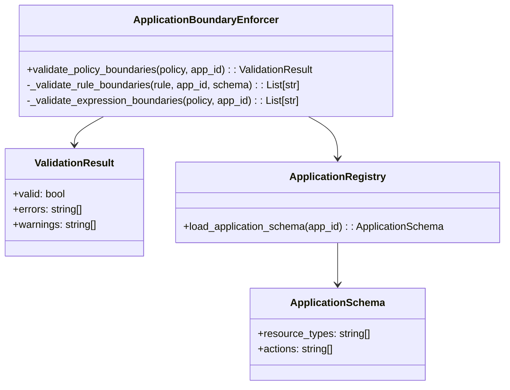
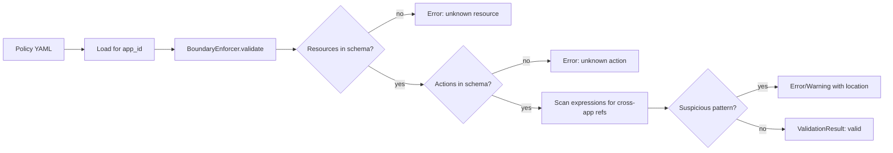

# Application Boundary Enforcement — Prevent Cross-App Leakage

> Canonical reference: `scoped_policy_design.md`. This doc explains how we enforce application boundaries during policy authoring and loading.

## Responsibilities
- Validate resources/actions belong to the application schema
- Detect suspicious cross-application references in expressions
- Produce actionable errors/warnings for authors

## Components & relations

## Validation flow

## Best practices for authors
- Keep application schemas accurate and minimal
- Avoid hardcoding IDs from other applications in expressions
- Prefer `MATCHES` with path attributes over ad-hoc path checks

## Typical validation errors (and how to fix)
- Resource not in schema:
  - Error: `Resource 'hr_salary_data' not defined in application 'sharepoint-prod'`
  - Fix: add to app schema if legitimate, or move rule to correct application.
- Action not in schema:
  - Error: `Action 'purge' not defined in application 'sharepoint-prod'`
  - Fix: add action to schema or rename to an allowed action.
- Suspicious cross-app reference:
  - Error: `Expression may contain cross-application reference: 'resource.properties.hr_ssn ...'`
  - Fix: remove cross-app attribute or route through an approved PIP that exposes allowed data.
