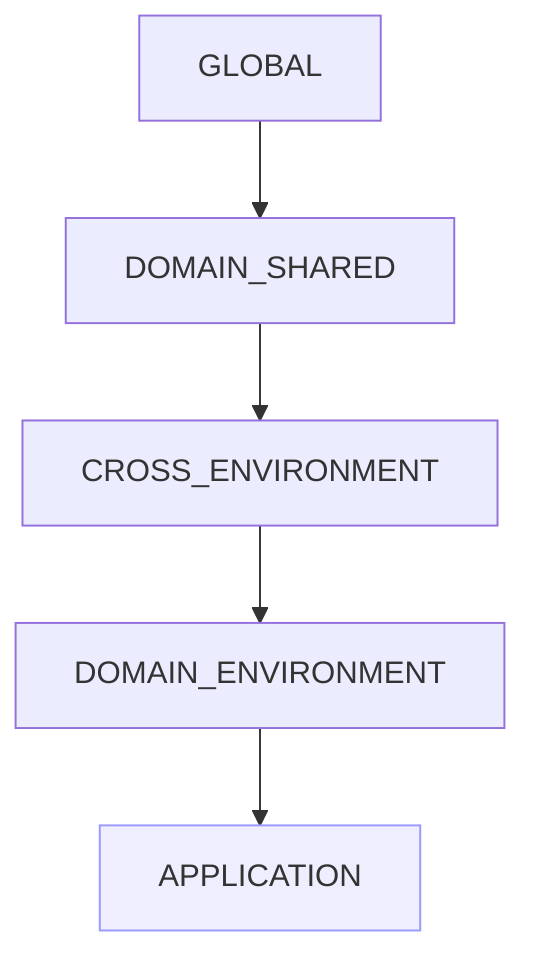
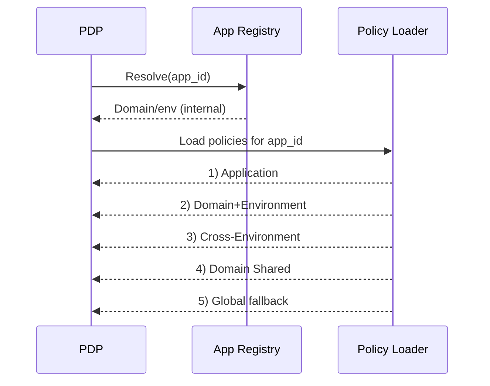

# Application Policy Loading — Inheritance & Priority

> Canonical reference: `scoped_policy_design.md`. This doc explains the 5-level inheritance model and load order.

## Inheritance levels (most specific wins)
1. APPLICATION (Level 1)
2. DOMAIN_ENVIRONMENT (Level 2)
3. CROSS_ENVIRONMENT (Level 3)
4. DOMAIN_SHARED (Level 4)
5. GLOBAL (Level 5)



## Directory structure (example)
```text
config/policies/
├── global/
├── domains/
│   └── sharepoint/
│       ├── shared/
│       ├── cross-environment/
│       └── environments/
│           ├── production/
│           └── staging/
└── applications/
    ├── sharepoint-prod/
    └── sharepoint-stage/
```

## Load order & combination
- Load in priority order: APPLICATION → DOMAIN_ENVIRONMENT → CROSS_ENVIRONMENT → DOMAIN_SHARED → GLOBAL
- Rules are additive; more specific overrides general when conflicts arise
- Deny-override is preserved at evaluation time



## Conflict resolution examples
### Example 1: Application overrides domain shared
```yaml
# domains/sharepoint/shared/document-actions.yaml
rules:
  - resource: document
    action: delete
    effect: permit

# applications/sharepoint-prod/site-permissions.yaml
rules:
  - resource: document
    action: delete
    effect: deny
    description: No deletion in production
```
Result: Most-specific (application) rule wins; delete is denied.

### Example 2: Deny-override across levels
```yaml
# global/authentication.yaml
rules:
  - resource: "*"
    action: "*"
    denyIf: subject.status == 'suspended'

# application rule (permit)
rules:
  - resource: document
    action: read
    effect: permit
```
Result: Global deny matches → final decision DENY.

## Author guidance
- Put broad safety nets in Global/Domain Shared; narrow allowances in Application.
- Prefer explicit application overrides to implicit precedence.
- Use traces (debug_tracing.md) to verify which level provided each rule.

## Notes
- Missing or invalid `pdp_application` falls back to GLOBAL path.
- Caching: request-level and registry-level TTLs recommended (see `performance_caching.md`).
- Effect normalization occurs at load time for consistency.

