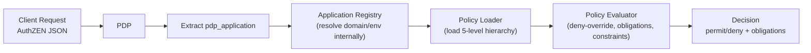
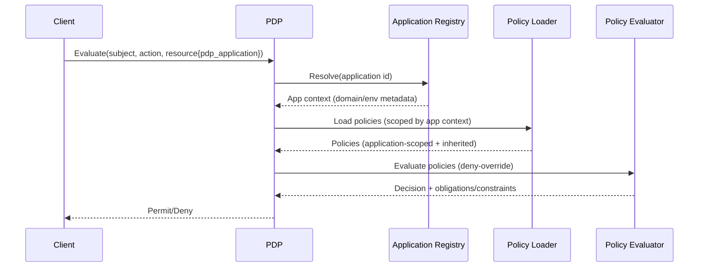

# Application-Scoped PDP — Overview & Mental Model

> Canonical reference: see `scoped_policy_design.md`. This overview distills the major design changes and serves as an entry point to the deeper docs.

## What changed (at a glance)
- **Single external identifier**: Callers specify only `resource.properties.pdp_application`; all domain/environment resolution is internal.
- **Scoped policy loading**: Policies load via a 5-level inheritance model (Global → Domain Shared → Cross-Environment → Domain Environment → Application), with specificity overriding general rules.
- **Evaluator hardening**: Normalized effects, deny-override semantics, and secure expression evaluation.
- **Security boundaries**: Application boundary enforcement prevents cross-app leakage.
- **DX & Ops**: Hot reload, lint CLI, scaffolding, debug traces, and cache strategy for latency reduction.

## End-to-end request flow (high level)


## Resolution and evaluation sequence


## Why `pdp_application` (not `application`)
- Avoids collisions with user-defined resource metadata.
- Clear namespace for PDP-only routing while still AuthZEN-compliant (all properties accepted; only `pdp_application` used for policy resolution).

## Quickstart for policy authors
1. Add the application identifier to the caller request:
   ```json
   {
     "subject": {"id": "alice"},
     "action": {"name": "read"},
     "resource": {
       "type": "document",
       "id": "doc-1",
       "properties": {"pdp_application": "sharepoint-prod"}
     }
   }
   ```
2. Organize policies (see full structure in application_policy_loading.md):
   ```text
   config/policies/
   └── applications/sharepoint-prod/
       └── document-access.yaml
   ```
3. Author a guarded-permit rule (use `when` for permit-only-on-match):
   ```yaml
   id: sharepoint-doc-access
   rules:
     - resource: document
       action: read
       effect: permit
       when: "resource.properties.classification <= subject.properties.clearance"
   ```
4. Validate and test:
   - Lint: `python scripts/lint_policies.py`
   - Evaluate with trace: see debug_tracing.md

## Mental model for authors and reviewers
- **Applicability first**: A rule must match `resource` + `action` before any condition/sugar matters.
- **Guarded permits**: Use `when` for true guards (false → `not_applicable`). Avoid `allowIf + effect: permit` when you mean a guard.
- **Deny-override**: Any matching deny cancels all permits.
- **Default**: If nothing applicable permits, result is deny.

## FAQ
- Where do I put `pdp_application`?  In `resource.properties.pdp_application` of the AuthZEN request.
- What if it’s missing or invalid?  The PDP falls back to global policies (see application_policy_loading.md).
- Should I use `allowIf` or `when`?  Use `when` to guard permits; `allowIf` changes the effect to permit but does not guard applicability.
- How do I match paths?  Use `MATCHES` with a named path-attribute and `resource.properties.full_path` (see policy_dsl_cheatsheet.md).

## Read next
- Architecture details: `application_policy_loading.md`
- Expression evaluation: `expression_evaluator_architecture.md`
- Boundary enforcement: `application_boundary_enforcement.md`
- Debug & tracing: `debug_tracing.md`
- Performance & caching: `performance_caching.md`
- Dev tools & workflow: `developer_tools.md`
- API contract: `rest_api_contract.md`
- Migration path: `migration_guide.md`
