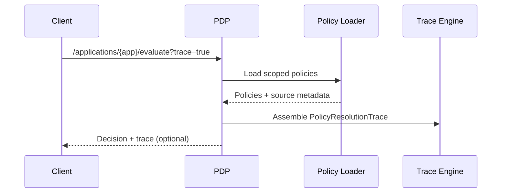
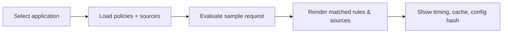

# Debug & Tracing — Understanding Policy Resolution

> Canonical reference: `scoped_policy_design.md`. This doc shows how to trace policy loading and evaluation, and the endpoints available.

## What you can trace
- Policy source resolution (which directories contributed which policies)
- Load order and inheritance source
- Matched rules and reasons
- Timing, cache hits, config hash

## Resolution trace (sequence)


## Example trace schema (simplified)
```jsonc
{
  "request_id": "uuid",
  "application_id": "sharepoint-prod",
  "policies_loaded": [
    {"policy_id": "global-auth", "source_type": "global_fallback", "path": "policies/global/auth.yaml", "load_order": 5},
    {"policy_id": "sp-doc-actions", "source_type": "domain_shared", "path": "policies/domains/sharepoint/shared/document-actions.yaml", "load_order": 4}
  ],
  "matched_rules": [
    {"policy_id": "sp-doc-actions", "rule_id": "view-doc", "reason": "subject.role in ['employee']"}
  ],
  "resolution_time_ms": 17.2,
  "cache_hit": false,
  "config_hash": "ab12cd34ef56"
}
```

## HTTP endpoints (suggested)
- `GET /api/v1/applications/{app_id}` – application metadata
- `GET /api/v1/applications/{app_id}/policies` – policy list with source info
- `GET /api/v1/debug/applications/{app_id}/policy-resolution` – policy source paths by priority
- `POST /api/v1/debug/evaluate/trace` – full evaluation trace for a request

## How to enable tracing
1. Set environment flags (optional, for verbose logs):
   ```bash
   export TRACE_POLICY_LOADING=true
   export TRACE_POLICY_EVALUATION=true
   ```
2. Call evaluation with trace endpoint or UI toggle.
3. Inspect `policies_loaded` for source/priority and `matched_rules` for reasons.

## Interpreting results
- A deny in `matched_rules` explains a final DENY even if permits exist (deny-override).
- If no rules match, expect `matched_rules: []` and a DENY default.
- Use `config_hash` to correlate with cache invalidation and deployment versions.

## UI hints

