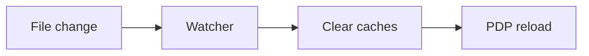

# Developer Tools — Watch, Lint, Scaffold

> Canonical reference: `scoped_policy_design.md`. This doc collects DX helpers for faster iteration.

## Hot reload watcher
- Script: `scripts/dev_watch.py`
- Watches `config/policies` and `config/applications`; triggers reload

```bash
python scripts/dev_watch.py &
python -m uvicorn src.app.main:app --reload --reload-dir config/policies
```



## Policy validation CLI
- Script: `scripts/lint_policies.py`
- Validates YAML schema and basic structure; prints errors with file paths

```bash
python scripts/lint_policies.py
python scripts/lint_policies.py --verbose || exit 1  # pre-commit
```

### Pre-commit hook (example)
```bash
cat > .git/hooks/pre-commit << 'EOF'
#!/usr/bin/env bash
python scripts/lint_policies.py --verbose || exit 1
EOF
chmod +x .git/hooks/pre-commit
```

## Application scaffolding
- Script: `scripts/new_app.py`
- Creates application schema and starter policy with README

```bash
python scripts/new_app.py sharepoint "SharePoint Online"
```

## Env toggles for development
```bash
export USE_APP_SCOPED_POLICIES=true
export TRACE_POLICY_LOADING=true
export TRACE_POLICY_EVALUATION=true
```

## Initial setup checklist
- Create `config/applications/global.yaml` if missing
- Create `config/policies/applications/global/` for fallback policies
- Verify Python deps (see scoped_policy_design.md for requirements)
