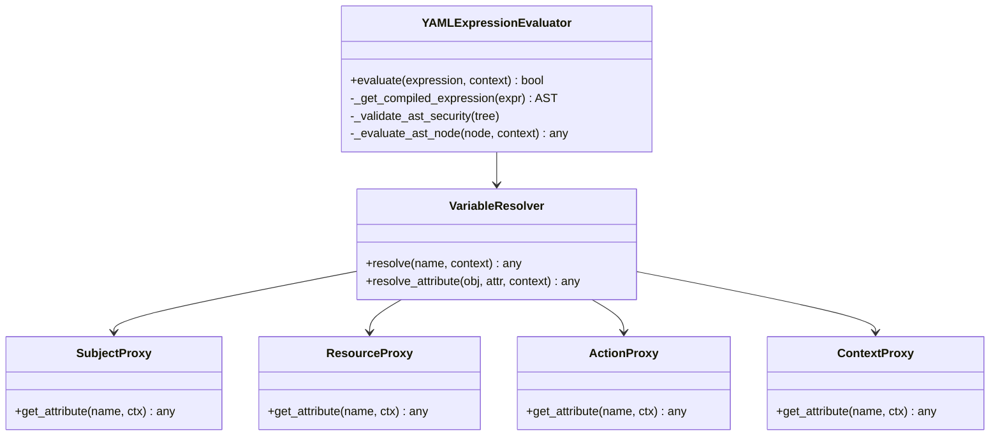
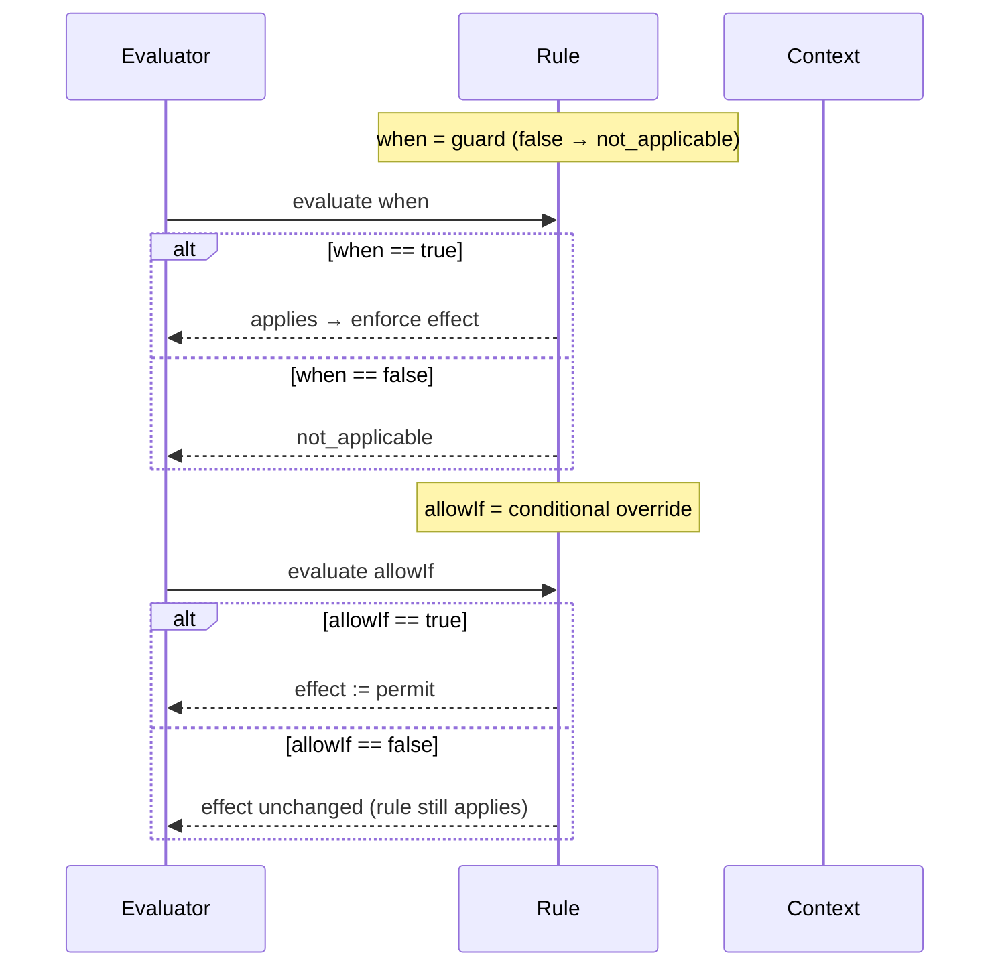

# Expression Evaluator Architecture — Secure, Predictable Semantics

> Canonical reference: `scoped_policy_design.md`. This doc explains evaluator components, guard semantics, and supported operators.

## Components


## Guard semantics: `when` vs `allowIf`


## Supported operators (string form)
`==  !=  >  <  >=  <=  IN  NOT IN  LIKE  NOT LIKE  MATCHES  NOT MATCHES`

Dict-only helpers: `contains`, `startswith`, `endswith`, `path_match`, `path_match_any`, `cidr_match`, `ip_range`, `date_range`, `money_*`, `velocity_within`.

Logical connectors: `AND`, `OR`, `NOT`.

## Safety guarantees
- Safe AST subset only; deny imports, eval/exec, and magic attributes
- Type-stable evaluation; normalization for ALLOW/DENY → permit/deny (at load time)
- Attribute resolution restricted to `subject.*`, `resource.*`, `action.*`, `context.*`, `environment.*`

## Authoring tips
- Prefer `when` for permit-only-on-match (false → `not_applicable`)
- Keep custom attributes under `subject.properties.*` and `resource.properties.*`
- Avoid `conditions` (plural); use `condition` or sugar (`when`, `allowIf`, `denyIf`)

## Practical examples
```yaml
# Guarded permit (recommended)
- resource: document
  action: read
  effect: permit
  when: "subject.properties.clearance >= resource.properties.classification"

# Conditional override (be careful)
- resource: document
  action: read
  effect: deny
  allowIf: "subject.properties.is_break_glass == true"

# IP-based condition using dict helper
- resource: api
  action: call
  effect: permit
  when:
    any:
      - { operator: cidr_match, scope: context, attribute: request_ip, value: "10.0.0.0/8" }
      - { operator: cidr_match, scope: context, attribute: request_ip, value: "192.168.1.0/24" }
```

## Common pitfalls (and fixes)
- Using Pythonisms in strings (e.g., `is not None`) → use `!= None` per DSL.
- Forgetting `.properties.` in attribute paths → ensure `subject.properties.*` / `resource.properties.*`.
- Mixing `allowIf` and `when` in the same rule → prefer one style; `when` for guards.
