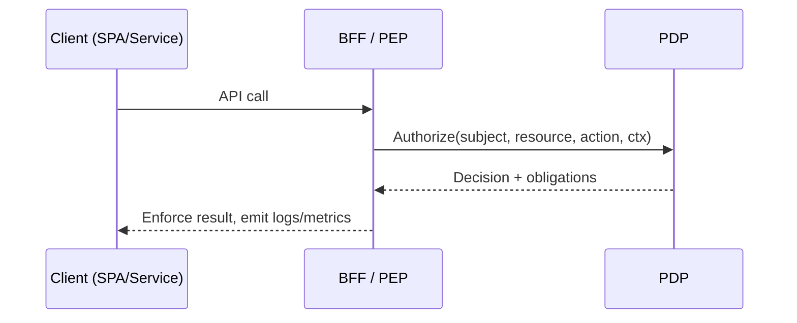

The Policy Decision Point (PDP) evaluates authorization policies and returns allow/deny decisions along with obligations/advices as needed. Integrate via the BFF or directly from services that require centralized authorization.

### Decision sequence (high level)


### Secrets policy integration
The CRUDService’s `VaultService` acts as a PEP for secrets. It:
- Normalizes pointers into Canonical Secret URIs and computes non‑leaky `resource_ref` identifiers
- Obtains short‑lived, sender‑bound grants from the Secret Policy Service (PDP client)
- Enforces anti‑replay (`jti`) and DPoP/mTLS binding
- Honors provider semantics (KVv2 version pins; deleted/destroyed mapping; leases)
- Emits non‑leaky audits and integrates with egress secret slots

See CRUD Service → Secrets enforcement for architecture, flows, and error codes.

### Batch authorization example
Request
```json
{
  "subject": {"sub":"auth:acct:github:octocat"},
  "tenant_id":"t-123",
  "aud":["crud.secrets"],
  "jti":"1a2b3c",
  "resources":[
    {"type":"secret","action":"use","id":"auth:v1:resource:secret:openbao-X:abc"},
    {"type":"secret","action":"use","id":"auth:v1:resource:secret:openbao-X:def"}
  ]
}
```

Response
```json
{
  "decisions":[
    {"id":"auth:v1:resource:secret:openbao-X:abc","effect":"Permit","obligations":{"ttl_s":300,"max_uses":1}},
    {"id":"auth:v1:resource:secret:openbao-X:def","effect":"Deny"}
  ],
  "decision_id":"d-789",
  "policy_version":"p-42"
}
```

Decision flow at a glance:

- SPA → BFF `/api/...` → BFF maps path/method → `resource`/`action` (+ optional `id`/`props`)
- BFF calls PDP with subject, resource, action, context
- PDP returns allow/deny (+ obligations) → BFF enforces and logs/metrics

Read next:

- Configure PDP: `/docs/services/pdp/how-to/configure`
- PDP route mapping in BFF: `/docs/services/bff/reference/pdp-mapping`
- Observability: `/docs/services/pdp/how-to/observability`


