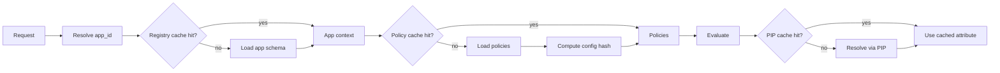

# Performance & Caching — Fast, Deterministic PDP

> Canonical reference: `scoped_policy_design.md`. This doc covers request caching, registry caching, and PIP caching strategies.

## Caching layers
- **Registry cache**: Application registry context (e.g., domain/env) — TTL ~300s
- **Policy load cache**: Scoped policy sets per app/config hash — TTL ~60s
- **PIP attribute cache**: Attribute lookups by app/subject — TTL ~300s

## Keys & invalidation
- Registry cache key: `schema:{app_id}`
- Policy cache key: `policies:{app_id}:{config_hash}`
- PIP cache key: `{app_id}:{attribute_path}:{subject_id}`

Invalidate on:
- Application schema changes
- Policy file changes (config hash changes)
- PIP configuration changes

Author impact:
- After editing policies, config hash changes → next request repopulates cache automatically.
- For hot reload, run watcher (developer_tools.md) to clear caches proactively.

## Metrics to track
- Hit/miss rates per layer
- Average compilation/evaluation time
- Cache sizes and TTL expirations

Operational alerts:
- Low hit-rate sustained > X minutes → check watcher or frequent config changes.
- High evaluation time spikes → investigate PIP backends and attribute cache size.

## Recommended defaults
- Registry TTL: 300s
- Policy TTL: 60s
- PIP TTL: 300s, max 1000 entries
