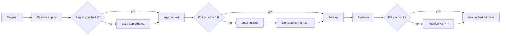

# Performance & Caching — Fast, Deterministic PDP

> Canonical reference: `scoped_policy_design.md`. This doc covers request caching, registry caching, and PIP caching strategies.

See also: `../reference/settings-flags.md#caching-and-performance` for runtime knobs and TTL anchors.

## Caching layers
- **Registry cache**: Application registry context (e.g., domain/env) — TTL ~300s
- **Policy load cache**: Scoped policy sets per app/config hash — TTL ~60s
- **PIP attribute cache**: Attribute lookups by app/subject — TTL ~300s
- **EPS cache (Effective Policy Set)**: Per subject + application compiled state
  - L1 in‑process; optional L2 shared (Redis) when configured
  - Coarse invalidation by subject across all apps
  - Persisted to LKG (Last‑Known‑Good) and reused within a staleness window when upstream is unavailable
- **Graph‑Eval L1 decision cache**: Short‑lived cache of final decisions for graph mode; skipped for delegation resource types
- **Membership PIP delegation caches**: Verify/capabilities caches keyed by delegator, delegate, service_id, and JKT

### Visual overview of caches

```mermaid
flowchart TB
  subgraph EPS_Cache["EPS cache (subject + application)"]
    L1["L1: In‑process MemoryCache (TTL ~300s)"]
    L2["L2: Optional Redis (shared)"]
    LKG["LKG: Last‑Known‑Good (disk)"]
    HE["Hard‑Evict registry (disables LKG for TTL)"]
    L1 <-- promote on hit/miss --> L2
    L2 -. fallback on failure .- LKG
    HE -. blocks .- LKG
  end

  subgraph GraphEval["Graph‑Eval path"]
    GE_L1["Graph L1 decision cache (TTL ~10s)"]
    Skip["Skip for delegation types"]
    GE_L1 -->|store/read| Decision
    Skip -.->|res.type in {delegation,*}| GE_L1
  end

  subgraph MembershipPIP["Membership PIP caches"]
    V["delegation_verify:{delegator}:{delegate}:{service_id|default}:{jkt|no-jkt} (TTL ~3600s)"]
    C["delegation_capabilities:{delegator}:{delegate}:{service_id|default}:{jkt|no-jkt} (TTL ~3600s)"]
  end
```

```mermaid
flowchart LR
  A[Request] --> B[Resolve app_id]
  B --> C{Registry cache hit?}
  C -- yes --> D[App context]
  C -- no --> E[Load app schema] --> D
  D --> F{Policy cache hit?}
  F -- yes --> G[Policies]
  F -- no --> H[Load policies] --> I[Compute config hash] --> G
  G --> J[Evaluate]
  J --> K{PIP cache hit?}
  K -- yes --> L[Use cached attribute]
  K -- no --> M[Resolve via PIP] --> L
```

## Keys & invalidation
- Registry cache key: `schema:{app_id}`
- Policy cache key: `policies:{app_id}:{config_hash}`
- PIP cache key: `{app_id}:{attribute_path}:{subject_id}`

- EPS key: `eps:{subject_arn}:{application_id}` (L1/L2)
- Delegation verify key: `delegation_verify:{delegator}:{delegate}:{service_id|default}:{jkt|no-jkt}`
- Delegation capabilities key: `delegation_capabilities:{delegator}:{delegate}:{service_id|default}:{jkt|no-jkt}`

Invalidate on:
- Application schema changes
- Policy file changes (config hash changes)
- PIP configuration changes
- CDC topics that impact authorization state (e.g., `delegates_to.created|updated|revoked`, `delegation.add|update|revoke|expire`, `policy_ref.added|removed`, role edges). See `../reference/kafka-eventing.md#inbound-cdc-and-cache-invalidation`.
- Delegation revocation: prefix delete delegation caches; apply hard‑evict to suppress LKG

### EPS and Graph‑Eval request lifecycle

```mermaid
flowchart LR
  Req[Evaluate(subject, app, resource, action)] --> K{Graph mode?}
  K -- yes --> G1{res.type is delegation?}
  G1 -- yes --> Eval[Evaluate (no GE L1 cache)]
  G1 -- no --> GEHit{GE L1 hit?}
  GEHit -- yes --> Decision[Return cached decision]
  GEHit -- no --> Eval

  K -- no --> EPS{EPS L1 hit?}
  EPS -- yes --> UseL1[Use L1 EPS]
  EPS -- no --> EPS2{EPS L2 hit?}
  EPS2 -- yes --> Promote[Promote to L1] --> UseL1
  EPS2 -- no --> Fetch[Fetch/compile EPS] --> StoreL1[L1 store] --> UseL1

  UseL1 --> Decision

  Fail[Upstream fetch fails] -.-> LKGfresh{LKG fresh?}
  LKGfresh -- yes --> UseLKG[Use LKG EPS] --> Decision
  LKGfresh -- no --> Degraded[Degraded/deny per failure policy]

  HEmark[Hard‑evict active?] -.->|blocks| UseLKG
```

### Delegation caches: keys and lifecycle

```mermaid
flowchart LR
  subgraph Keys
    V["delegation_verify:{delegator}:{delegate}:{service_id|default}:{jkt|no-jkt}"]
    C["delegation_capabilities:{delegator}:{delegate}:{service_id|default}:{jkt|no-jkt}"]
  end

  Create[create_delegation(..., service_id, jkt)] --> Upsert[Upsert V key]
  Verify[verify_delegation(...)] --> Hit{V hit?}
  Hit -- yes --> FastReturn[Return cached verify]
  Hit -- no --> Call[Call Membership API] --> SetV[Set V with TTL ~3600s]

  Revoke[revoke_delegation(delegator, delegate)] --> Prefix["delete_prefix(V & C for delegator:delegate:*)"]
  Prefix -.-> V
  Prefix -.-> C
```

Author impact:
- After editing policies, config hash changes → next request repopulates cache automatically.
- For hot reload, run watcher (developer_tools.md) to clear caches proactively.

## Metrics to track
- Hit/miss rates per layer
- Average compilation/evaluation time
- Cache sizes and TTL expirations

Operational alerts:
- Low hit-rate sustained > X minutes → check watcher or frequent config changes.
- High evaluation time spikes → investigate PIP backends and attribute cache size.

## Recommended defaults
- Registry TTL: 300s
- Policy TTL: 60s
- PIP TTL: 300s, max 1000 entries
- EPS TTL: 300s (subject+application)
- LKG freshness window: 300s
- Graph‑Eval L1 TTL: 10s (disabled by default)
- Delegation verify/capabilities TTL: 3600s

## Runtime knobs
- Graph‑Eval L1 decisions: enable via `PDP_L1_CACHE_ENABLED` and set `PDP_L1_CACHE_TTL` (see `../reference/settings-flags.md#caching-and-performance`).
- EPS L2 (Redis): configure a shared Redis for cross‑instance propagation; keys are prefixed per deployment.
- Hard‑evict registry TTL is fixed at service startup; used to suppress LKG during sensitive revocations.

## Troubleshooting
- Decision tree

```mermaid
flowchart TB
  A[Stale deny after provisioning] --> B{CDC emitted?}
  B -- no --> Evict[Manually evict EPS subject‑wide] --> Retest[Retest]
  B -- yes --> C{Graph L1 enabled?}
  C -- yes --> TTL10[Lower TTL or disable temporarily] --> Retest
  C -- no --> D{Verify key parity (service_id/jkt) correct?}
  D -- no --> FixKey[Align service_id/jkt] --> Retest
  D -- yes --> E{L2 Redis enabled?}
  E -- no --> EnableL2[Enable Redis for cross‑instance EPS] --> Retest
  E -- yes --> Done[Recompute EPS; confirm CDC flow]
```

- Provisioning to Allow timeline

```mermaid
gantt
  dateFormat  X
  title Provisioning to Allow Timeline (relative seconds)
  section Delegation verify cache
  verify_set              :done, 0, 5
  verify_ttl(3600s)       :active, 5, 3600
  section EPS caches
  EPS_L1/L2 precompiled   :crit, 0, 300
  CDC eviction (ideal)    :milestone, 2, 0
  EPS recompute           : 3, 5
  LKG freshness(300s)     : 0, 300
  section Graph L1 (if enabled)
  prior deny reused       : 0, 10
```

## Immediate consistency after provisioning

When the PDP auto‑provisions a delegation (via ProvisionInterceptor):
- Bypass or evict Graph‑Eval L1 for this request/subject to avoid reusing a prior deny.
- Evict EPS subject‑wide for the delegator so the next EPS fetch recompiles with the new edge.
- Optionally emit CDC (`delegation.add` or `delegates_to.created`) so other instances evict EPS.
- Ensure the decision returned includes the `delegation_id` in `context.attributes.delegation` so clients don’t need an immediate follow‑up verify.

These steps eliminate the most common sources of stale denies right after a successful create.
- Deny persists right after provisioning a delegation: ensure a CDC event emitted for the delegator (evicts EPS subject‑wide) and, if using graph mode, temporarily disable L1 or lower TTL while testing. Confirm delegation verify key parity (`service_id` and `jkt`).
- Works on one instance but not others: enable L2 Redis for EPS so evictions propagate across instances.
- Revocation appears ignored: verify revoke/expire CDC and confirm hard‑evict applied; ensure both `delegation_verify:` and `delegation_capabilities:` prefixes were deleted.
