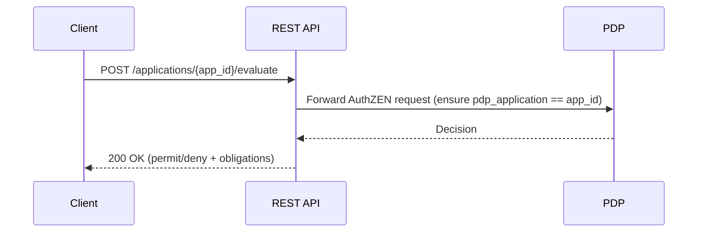

# REST API Contract — Application-Only Pattern

> Canonical reference: `scoped_policy_design.md`. This document describes the clean REST surface using a single application identifier.

## Principles
- Single request pattern: client provides `resource.properties.pdp_application`
- Accept arbitrary properties (AuthZEN-compliant); only `pdp_application` used for policy resolution
- Domain/environment are internal metadata

## Endpoints
- `GET /api/v1/applications` — list apps (optional filters for power users)
- `GET /api/v1/applications/{app_id}` — app detail (domain/env metadata optional)
- `GET /api/v1/applications/{app_id}/policies` — policies with source info
- `POST /api/v1/applications/{app_id}/evaluate` — evaluate authorization for app
- `GET /api/v1/debug/applications/{app_id}/policy-resolution` — debug policy sources

## Request example (only pattern)
```json
{
  "subject": {"id": "user123"},
  "resource": {
    "type": "document",
    "id": "doc-123",
    "properties": {"pdp_application": "sharepoint-prod"}
  },
  "action": {"name": "read"}
}
```

## Response examples
```json
{
  "allowed": true,
  "obligations": [
    {"id": "log_access", "attributes": {"level": "detailed"}}
  ],
  "constraints": []
}
```

Error codes:
- 400 — invalid request schema
- 404 — unknown application id
- 409 — configuration integrity error (refer to debug endpoints)
- 500 — evaluation error (check logs / tracing)

## Evaluate sequence


## UI integration hint
- Single dropdown to pick application; all policy inheritance handled by backend
