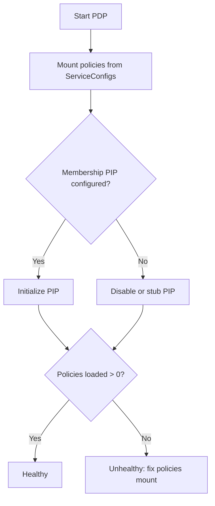

## Policies

- Place policy files under `ServiceConfigs/pdp/config/policies/**`
- Mount the directory read‑only into the PDP container
- On startup, logs should list loaded policy IDs (> 0)

## Minimal demo policies

Grant allow for common Experience surfaces (scope to real subjects in non‑demo setups):

- Pages list → resource: `pages`, action: `view_all`
- Workflow quick execute → resource: `workflows`, action: `execute_quick`
- Plugin views → resource: `plugin.*`, action: `view`

Subjects should use canonical ARNs: `auth:account:{provider}:{user_id}`

## Membership PIP

- If not configured, disable the Membership PIP to avoid runtime errors
- Symptoms of misconfiguration:
  - Logs: `MembershipServiceAPI instance not available in the loaded PIP`
  - Health shows unhealthy; evaluations may 5xx

## Health checklist

- Policy count > 0 in logs after startup
- Health endpoint reports healthy
- `/access/v1/evaluation(s)` return decisions for both allow and deny test cases

## Startup lifecycle

## See also

- Experience → Authorization (AuthZEN): `../../experience/authorization-authzen`

