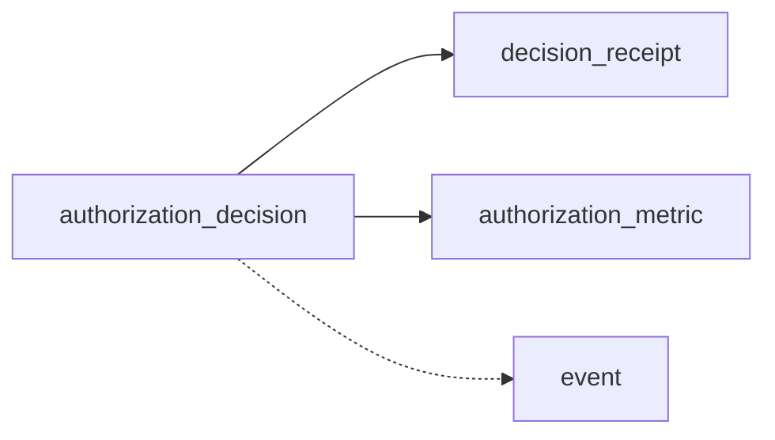

Topics
- `${KAFKA_TOPIC_PREFIX}.decisions` (default `authz.decisions`)
- `${KAFKA_TOPIC_PREFIX}.metrics` (default `authz.metrics`)
- `${KAFKA_TOPIC_PREFIX}.events` (default `authz.events`)
- `${KAFKA_TOPIC_PREFIX}.receipts` (default `authz.receipts`)

Keys & ordering
- Decisions: key `${subject_id}:${resource_id}:${action}` (ordered per key)
- Metrics: metric type
- Events/Receipts: `correlation_id`



Event shapes (selected)
- authorization_decision
```
{ "event_type":"authorization_decision", "correlation_id":"uuid", "data": { "decision":true, "subject_id":"user:123", "resource_id":"doc:456", "action":"read", "evaluation_time_ms":10.5 } }
```
- authorization_metric
```
{ "event_type":"authorization_metric", "data": { "metric_type":"authorization_performance", "values": { "evaluation_time_ms":10.5 } } }
```
- decision_receipt
```
{ "event_type":"decision_receipt", "data": { "decision_id":"uuid", "eps_etag":"W/\"...\"", "graph_snapshot_id":null, "policy_refs":["policy:...@rev"], "degraded":false } }
```

Configuration
| Setting | Default | Meaning |
|---------|---------|---------|
| ENABLE_KAFKA_PRODUCER | false | Enable producer |
| KAFKA_BOOTSTRAP_SERVERS | (unset) | Broker list |
| KAFKA_CLIENT_ID | pdp-authz-producer | Client id |
| KAFKA_TOPIC_PREFIX | authz | Namespace |
| KAFKA_LINGER_MS | 10 | Producer linger |
| KAFKA_BATCH_SIZE | 16384 | Batch size |
| KAFKA_COMPRESSION_TYPE | gzip | Compression |

Validation & consumers
- Validate via Kafdrop; correlate by `correlation_id`.
- Analytics can subscribe to decisions/receipts; security to events.

See also
- Settings & flags: `services/pdp/reference/settings-flags.md`

