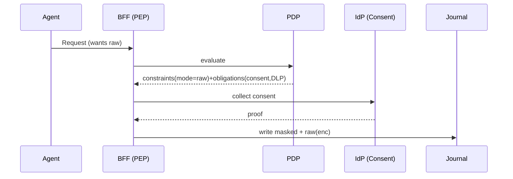

## Goal
Allow raw storage under strict consent, retention, and DLP obligations.

## Steps
1. Policy: enable `prompt_archive.mode=raw` with retention caps and DLP obligation.
2. IdP: collect user consent (JARM) and attach proof; PEP validates or downgrades to sanitized.
3. Journal: encrypt raw fragments/blobs with tenant keys; avoid Kafka for raw.

## See also
- BFF enforcement: `services/bff/reference/BFF_PDP_Enforcement.md`

