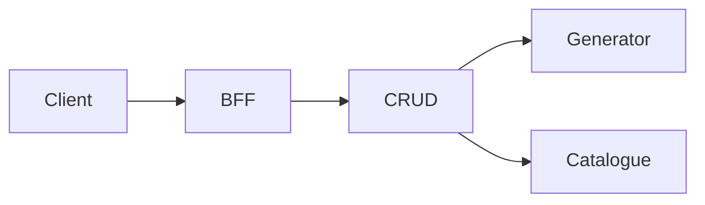

## Diagram style guide (Mermaid)

Use Mermaid for architecture and flow diagrams. Keep labels concise; wrap with ` ` for line breaks. Avoid custom colors; rely on defaults for consistency.

### Patterns
- Flowchart LR for transport and catalog flows
- Graph TD for high‑level component diagrams

### Example

