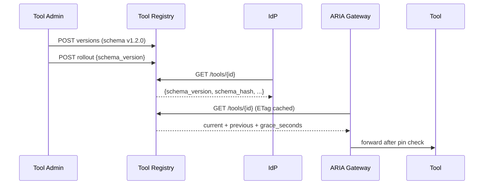

V1 provides a catalog of tools with hash‑pinned schemas, atomic CURRENT flips, rollout grace windows, and ETag‑friendly reads. IdP embeds pins in ARIA passports; ARIA verifies pins before egress.

Principles
- One CURRENT version per tool (atomic pointer)
- Deterministic `schema_hash` from canonical JSON
- `grace_seconds` allows previous version acceptance during rollout
- ETag + Cache‑Control for efficient reads

See also
- Index: `services/tool-registry/index.md`

