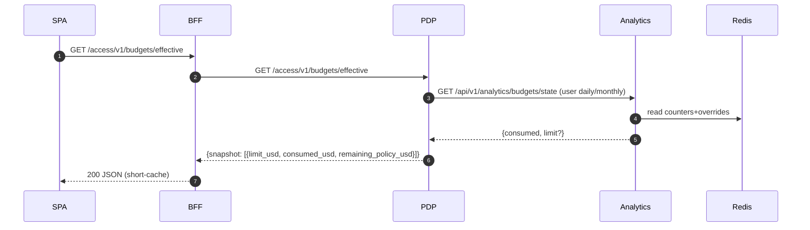

# AI Spend – Effective Budgets (Policy + Analytics)

## Goal
- Unify policy-defined budget limits with Analytics counters so users always see a budget even when no explicit override exists.
- Prefer Analytics overrides when configured; otherwise, derive defaults from PDP policies.
- Provide a fast, cache-friendly endpoint for UIs to fetch the “effective” limit and remaining.

## What changed
- PDP now exposes `GET /access/v1/budgets/effective` returning a snapshot of the effective budgets for the authenticated subject.
- PDP spend enforcement prefers Analytics override limits when present; otherwise uses policy defaults. The decision’s context includes the effective limit used.
- BFF proxies the PDP endpoint. Frontend falls back to policy-derived limits when Analytics returns null for `limit_usd`.

## High-level design
- Source of truth for usage (consumed) remains Analytics. Limits can come from either:
  - Explicit Analytics overrides (`PUT /api/v1/analytics/budgets/limit`)
  - Policy defaults (`spend_budget` constraints in PDP policies)
- PDP merges these inputs and computes the effective limit and remaining. The UI reads this via the new endpoint.

### Components
- Analytics: stores counters and optional per-subject limits in Redis; exposes `budgets/state`.
- PDP: evaluates `spend_budget` constraints and consults Analytics via BudgetState PIP; computes effective limit.
- BFF: proxies the new PDP endpoint for the SPA.



## Endpoint contract
- `GET /access/v1/budgets/effective`
  - Auth: session
  - Query: `scope?=user|team|tenant` (default user), `period?=daily|monthly` (optional)
  - Response:
```json
{
  "snapshot": [
    {
      "scope": "user",
      "period": "monthly",
      "selector": { "category": null, "provider": null, "model": null },
      "limit_usd": 50.0,
      "consumed_usd": 12.34,
      "remaining_policy_usd": 37.66,
      "decision": "allow|deny",
      "reason": null
    }
  ]
}
```
- Notes:
  - `limit_usd` is the effective limit (Analytics override if present, else policy default).
  - `remaining_policy_usd` is computed as `max(limit_usd - consumed, 0)`.
  - Multiple entries may appear when policies include provider/model/category selectors.

## Policy model
- Constraints use `type: "spend_budget"`. Examples:
```yaml
# User monthly default
parameters: { scope: "user", period: "monthly", limit_usd: 50.0 }
# Category-specific
parameters: { scope: "user", period: "monthly", limit_usd: 20.0, category: "dev" }
# Provider-specific
parameters: { scope: "user", period: "monthly", limit_usd: 25.0, provider: "openai" }
# Model-specific
parameters: { scope: "user", period: "monthly", limit_usd: 15.0, model: "gpt-4o-mini" }
```

## PDP behavior (effective limit selection)
- Query Analytics via BudgetState PIP for each relevant pool (overall, category, provider, model).
- If `state.limit_usd` is not null, treat as override (effective limit = `state.limit_usd`).
- Else use policy’s `limit_usd` for that pool. Compute remaining accordingly.

```mermaid
flowchart TD
  A[Policy spend_budget entries] --> B[BudgetState PIP fetch per pool]
  B --> C{state.limit_usd present?}
  C -- yes --> D[effective_limit = state.limit_usd]
  C -- no --> E[effective_limit = policy.limit_usd]
  D --> F[remaining = max(effective_limit - consumed, 0)]
  E --> F
  F --> G[Attach spend_snapshot / return to UI]
```

## Configuration
- BFF route (ServiceConfigs/BFF/config/routes.yaml):
```yaml
- id: "authzen-effective-budgets"
  path: "/access/v1/budgets/effective"
  target_service: "pdp_service"
  upstream_path: "/access/v1/budgets/effective"
  methods: ["GET", "OPTIONS"]
  auth: "session"
  preserve_path: true
  authz: "none"
```
- PDP PIP registry: ensure BudgetState PIP is enabled and `analytics_url` points at Analytics.
- Policies: place `spend_budget` constraints under appropriate policies (global, app, or domain) with merge strategy = most-restrictive (default).

## Frontend usage
- Call `GET /api/v1/analytics/budgets/state` as before; if `limit_usd` is null, call `/access/v1/budgets/effective` and display the effective limit/remaining for the overall pool.
- The SPA already performs this fallback in `AISpendPage`.

## Operations
- To set an explicit override: `PUT /api/v1/analytics/budgets/limit { tenant_id, scope, subject_id, period, limit_usd }`.
- To adjust defaults: update PDP policies (`spend_budget` constraints) and deploy.
- To verify end-to-end:
```bash
# 1) Check Analytics state (will be null for limit if no override)
curl -sS "$BFF/api/v1/analytics/budgets/state?tenant_id=default&scope=user&period=monthly" | jq

# 2) Check effective budgets (should reflect policy default)
curl -sS "$BFF/access/v1/budgets/effective" | jq
```

## Error handling and caching
- PDP endpoint returns 200 with `snapshot: []` when no applicable constraints exist.
- BudgetState PIP uses short timeouts (~300ms) and a 2s in-memory TTL cache to keep the endpoint fast under load.
- BFF route is session-authenticated and not cached by proxies; the SPA may use a short SWR (5–10s) if desired.

---

## Appendix: Example snapshots
```json
{
  "snapshot": [
    { "scope": "user", "period": "daily", "selector": {}, "limit_usd": 5.0,  "consumed_usd": 0.66, "remaining_policy_usd": 4.34 },
    { "scope": "user", "period": "monthly", "selector": {}, "limit_usd": 50.0, "consumed_usd": 7.88, "remaining_policy_usd": 42.12 },
    { "scope": "user", "period": "monthly", "selector": {"category": "dev"}, "limit_usd": 20.0, "consumed_usd": 1.25, "remaining_policy_usd": 18.75 }
  ]
}
```
