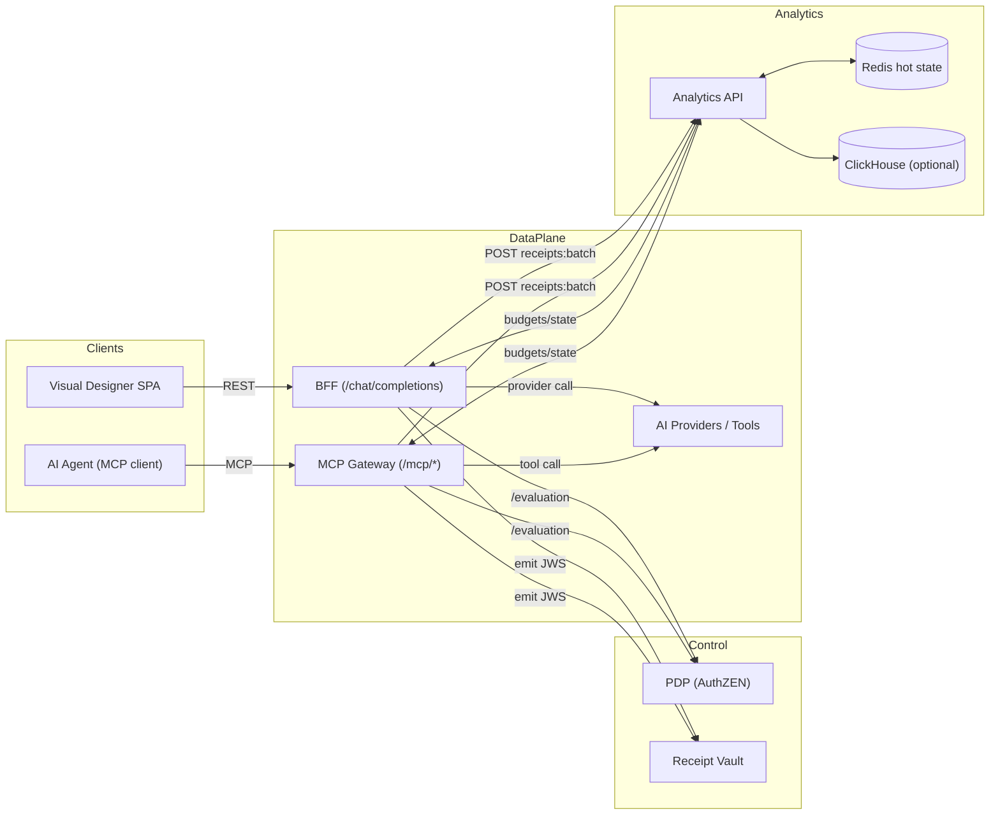
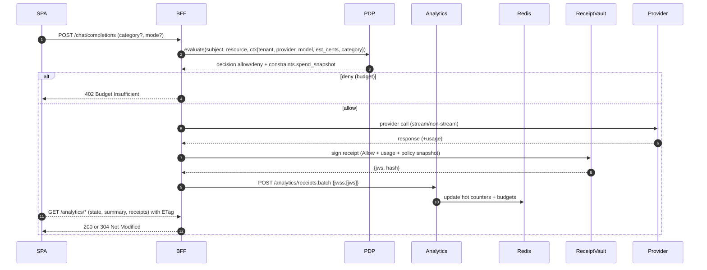
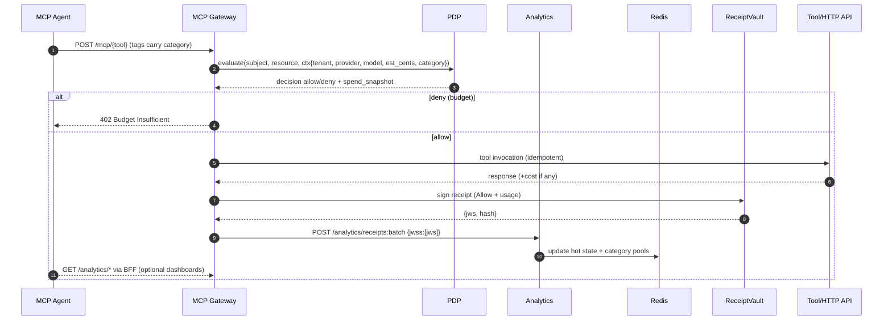

# AI Spend – North Star (Endpoints + UX Mapping)

## Personas and UX goals
- End users: instant view of my remaining budget, category breakdown, recent activity
- Managers: team rollups, leaders, category hotspots
- Security/AI admins: org-wide trends, per‑model/provider spend, budget config, classification queue

## Caching strategy for SPA
- ETag + Last-Modified on all high-traffic GETs; support 304 Not Modified
- Cache-Control: public, short max-age (30–120s) with must-revalidate
- SPA uses SWR (stale-while-revalidate) 5–10s window to render cached data instantly

---

## Endpoint inventory (single source of truth)

### 1) Budget state
- GET /api/v1/analytics/budgets/state
  - q: tenant_id, scope=(user|team|tenant), subject_id?, period=(daily|monthly)
  - rsp: { period_key, consumed_usd, limit_usd, remaining_usd }
  - cache: Cache-Control: public, max-age=60, must-revalidate; ETag + Last-Modified

- GET /api/v1/analytics/budgets/state/bulk
  - q: tenant_id, period, scope, subject_ids[]=… (≤ N)
  - rsp: [{ subject_id, period_key, consumed_usd, limit_usd, remaining_usd }]
  - cache: public, max-age=30; ETag + Last-Modified

- GET /access/v1/budgets/effective
  - q: scope?, period?
  - rsp: { snapshot: [{ scope, period, selector: {category?,provider?,model?}, limit_usd, consumed_usd, remaining_policy_usd }] }
  - cache: private, short; served by PDP using BudgetState PIP with 2s cache

- GET /api/v1/analytics/budgets/limits
  - q: tenant_id, scope, subject_id?, include_dims=(category|provider|model)?
  - rsp: [{ scope, subject_id, period, limit_usd, selector?: {category|provider|model} }]
  - cache: public, max-age=120; ETag + Last-Modified

- PUT /api/v1/analytics/budgets/limit
  - body: { tenant_id, scope, subject_id?, period, limit_usd }
  - rsp: { ok: true }

### 2) Spend summary and trends
- GET /api/v1/analytics/spend/summary
  - q: tenant_id, subject_id?, scope=(user|team|tenant), period=(daily|monthly), dims=(category|provider|model)?
  - rsp: { total_usd, by_category?: [{ name, usd }], by_provider?: […], by_model?: […] }
  - cache: public, max-age=30; ETag + Last-Modified

- GET /api/v1/analytics/spend/timeseries
  - q: tenant_id, subject_id?, dim=(total|category|provider|model), key?=dev|openai|gpt-4o-mini, bucket=(daily|monthly), window=30d
  - rsp: [{ t: "2025-09-02", usd: 12.34 }]
  - cache: public, max-age=30; ETag + Last-Modified

- GET /api/v1/analytics/spend/leaders
  - q: tenant_id, scope=(team|tenant), dim=(subject|category|model|provider), window=7d, limit=10
  - rsp: [{ key, label, usd }]
  - cache: public, max-age=60; ETag + Last-Modified

### 3) Receipts (thin, list-first)
- GET /api/v1/analytics/receipts/recent
  - q: tenant_id, subject_id?, limit=25, before_ts?
  - rsp: [{ id, ts, usd, resource:{type,id}, category?, provider?, model? }]
  - cache: private, max-age=15; ETag + Last-Modified

- GET /api/v1/analytics/receipts/{id}
  - rsp: { id, ts, usd, resource, policy_snapshot?, params_hash?, chain_ok }
  - cache: private, max-age=60; ETag + Last-Modified

- POST /api/v1/analytics/receipts:batch (existing)
  - rsp: { accepted, results: [{ call_id, agent_id, chain_ok, cost_usd }] }

### 4) Classification (inline and lazy)
- GET /api/v1/analytics/classifications/pending
  - q: tenant_id, limit=100, before_ts?
  - rsp: [{ id, ts, subject_id, proposed_category?, usd, resource }]
  - cache: private, max-age=10; ETag + Last-Modified

- POST /api/v1/analytics/classifications/apply (stub exists)
  - body: { tenant_id, subject_id, category, period=(daily|monthly), since_ts?, until_ts? }
  - rsp: { ok: true }

- POST /api/v1/analytics/classifications/bulk
  - body: { tenant_id, items: [{ subject_id, category, since_ts?, until_ts? }, …] }
  - rsp: { ok: true, updated: N }

### 5) Catalogs and filters
- GET /api/v1/analytics/catalog/categories
  - rsp: [{ id: "dev", label: "Development" }, …]
  - cache: public, max-age=600; ETag + Last-Modified

- GET /api/v1/analytics/catalog/models
  - rsp: [{ id, provider, label }]
  - cache: public, max-age=600; ETag + Last-Modified

- GET /api/v1/analytics/catalog/providers
  - rsp: [{ id, label }]
  - cache: public, max-age=600; ETag + Last-Modified

- GET /api/v1/analytics/subjects/search
  - q: tenant_id, q=prefix, scope=(user|team), limit=10
  - rsp: [{ id, label }]
  - cache: private, max-age=30; ETag + Last-Modified

### 6) Forecasts and alerts
- GET /api/v1/analytics/forecasts/spend
  - q: tenant_id, subject_id?, period=(monthly), model=(simple|holtwinters)
  - rsp: { forecast_usd, conf90?: [lo, hi] }
  - cache: private, max-age=60; ETag + Last-Modified

- GET /api/v1/analytics/alerts
  - q: tenant_id, active=true|false, type=(budget_threshold|anomaly), subject_id?
  - rsp: [{ id, type, created_ts, subject_id?, detail }]
  - cache: private, max-age=15; ETag + Last-Modified

### 7) Hot/runtime (extended)
- GET /api/v1/analytics/runtime/hot
  - q: tenant_id, subject_id?, category?
  - rsp: { tenant_id, daily_spend_usd, user_daily_spend_usd?, category_daily_spend_usd? }
  - cache: private, max-age=10; ETag + Last-Modified

---

## UX mapping: pages, components, API calls

### A) End User – "AI Spend"
- MyBudgetWidget
  - GET budgets/state (scope=user, period=daily & monthly)
  - SWR: 10s; show remaining_usd prominently
- CategoryBreakdown
  - GET spend/summary?dims=category (scope=user)
  - SWR: 15s; small bar/pie chart
- RecentActivity
  - GET receipts/recent (subject_id=user)
  - SWR: 10–15s; paginate with before_ts

### B) Manager – "Team Spend"
- TeamOverview
  - GET spend/summary (scope=team, dims=category|provider|model)
  - GET spend/leaders dim=subject
- TeamTrends
  - GET spend/timeseries (bucket=daily, window=30d)
- TeamMembersBudgets
  - GET budgets/state/bulk (scope=user, period=monthly, subject_ids from search)

### C) Admin – "Org Spend & Budgets"
- OrgOverview
  - GET spend/summary (scope=tenant, dims=category|provider|model)
  - GET spend/leaders dim=category|model|provider
- ModelProviderTabs
  - GET catalog/models, GET catalog/providers
  - GET spend/summary, GET spend/timeseries per tab
- BudgetsEditor
  - GET budgets/limits; PUT budgets/limit to update
- ClassificationQueue
  - GET classifications/pending; POST classifications/apply

---

## Response examples

```json
// budgets/state (user monthly)
{
  "period_key": "202509",
  "consumed_usd": 12.34,
  "limit_usd": 50.0,
  "remaining_usd": 37.66
}
```

```json
// spend/summary (dims=category)
{
  "total_usd": 42.91,
  "by_category": [
    { "name": "dev", "usd": 21.1 },
    { "name": "entertainment", "usd": 5.3 },
    { "name": "research", "usd": 16.5 }
  ]
}
```

```json
// receipts/recent
[
  { "id": "r-1", "ts": 1735872000, "usd": 0.15, "resource": {"type": "model", "id": "gpt-4o-mini"}, "category": "dev" }
]
```

---

## SPA client notes (SWR + conditional GET)
- For each GET, store { value, etag, lastModified, fetchedAt }
- Send If-None-Match / If-Modified-Since when cache is present
- Respect 304 and reuse cached JSON; revalidate in background within SWR window

---

## Implementation notes (current)
- Alias added: `GET /api/v1/analytics/receipts/{id}` delegates to `receipts/detail/{id}`.
- Classification modes:
  - Inline: PEP accepts `X-Category` or body `category`; pass `x-category-mode=inline`.
  - Lazy: PEP omits or sets `x-category-mode=lazy`; receipt includes `proposed_category`; queue exposed via `classifications/pending`.
  - Receipts include `category`, `category_pending`, `proposed_category` when available.
- BFF proxying allows `PUT /api/v1/analytics/budgets/limit` from SPA.
- Caching: ETag/Last-Modified applied to high-traffic GETs including `runtime/hot` to enable 304s; SPA uses short SWR windows.

## Architecture (Mermaid)



## Step-by-step flows (Mermaid)





## Rollout checklist
- [x] Add ETag/Last-Modified to AI Spend GET endpoints (incl. runtime/hot)
- [x] Implement summary/timeseries/leaders and catalogs
- [x] Ship Visual Designer AI Spend section (End User, Manager, Admin)
- [x] Add tests for 304 paths on key endpoints (state, limits, summary, runtime, receipts, catalog)
- [x] Document lazy vs inline classification UX

## Gap analysis tracker (to be updated)
| Area | Endpoint | Implemented | Tests | FE wired |
|---|---|---|---|---|
| Budgets | GET budgets/state | ✅ | ✅ | ✅ |
| Budgets | GET budgets/state/bulk | ✅ | ⬜ | ⬜ |
| Spend | GET spend/summary | ✅ | ✅ | ✅ |
| Spend | GET spend/timeseries | ✅ | ⬜ | ✅ |
| Spend | GET spend/leaders | ✅ | ⬜ | ✅ |
| Receipts | GET receipts/recent | ✅ | ✅ | ✅ |
| Classify | GET classifications/pending | ✅ | ⬜ | ✅ |
| Classify | POST classifications/apply | ✅ (stub) | ⬜ | ✅ |
| Catalog | GET catalog/* | ✅ | ✅ | ✅ |
| Runtime | GET runtime/hot (extended) | ✅ | ✅ | ⬜ |

