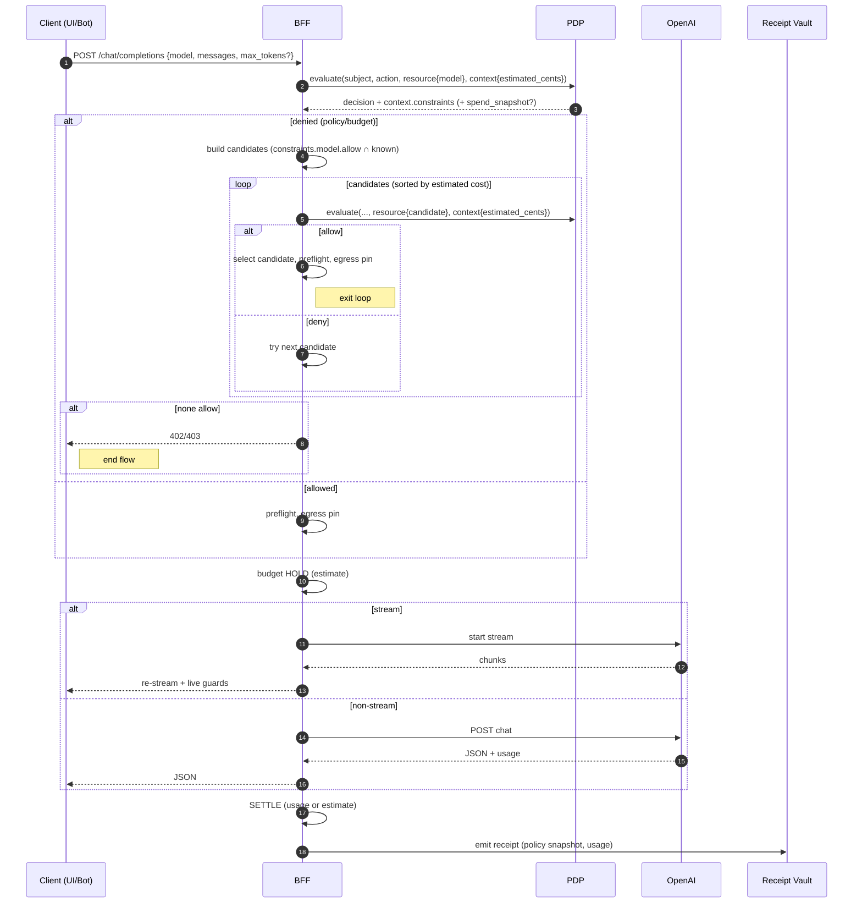
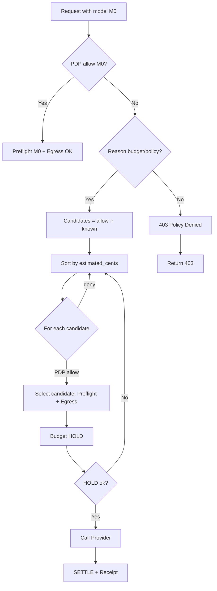
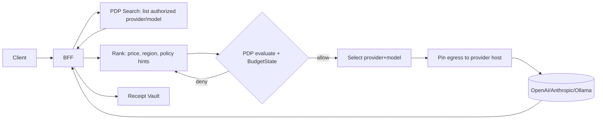

## EmpowerNow Dynamic AI Model Routing (v1)

<!-- Doc‑builder map: use this source to generate typed docs -->

```yaml
doc_builder:
  source: docs/source_content/Dynamic_Model_Routing.md
  version: v1
  tags: [service:bff, area:llm, feature:dynamic-model-routing]
  outputs:
    - type: explanation
      title: "Dynamic AI Model Routing — How It Works"
      target: "/docs/services/bff/explanation/llm-dynamic-model-routing"
      sections:
        - Overview
        - How it works (v1)
        - Key properties
        - Real scenarios
        - Algorithm details (v1)
        - Roadmap (v2)
    - type: tutorial
      title: "LLM Routing Quickstart"
      target: "/docs/services/bff/tutorials/llm-routing-quickstart"
      sections:
        - Quickstart
        - Validate
    - type: how-to
      title: "Enable Dynamic Model Routing"
      target: "/docs/services/bff/how-to/llm-routing-enable"
      sections:
        - How to: Enable routing (PDP + env)
    - type: how-to
      title: "Override Model Pricing"
      target: "/docs/services/bff/how-to/llm-routing-pricing"
      sections:
        - How to: Pricing overrides
    - type: how-to
      title: "Configure Budgets"
      target: "/docs/services/bff/how-to/llm-routing-budgets"
      sections:
        - How to: Budget holds and receipts
    - type: how-to
      title: "Observe & Troubleshoot Routing"
      target: "/docs/services/bff/how-to/llm-routing-observability"
      sections:
        - Observability
        - Troubleshooting
    - type: reference
      title: "LLM Routing: Configuration Reference"
      target: "/docs/services/bff/reference/llm-routing-config"
      sections:
        - Configuration
        - Headers
        - Code entry points
    - type: reference
      title: "LLM Routing: PDP Fields"
      target: "/docs/services/bff/reference/llm-routing-pdp"
      sections:
        - Policy examples
        - Sample PDP requests and responses
```

### Quickstart

Prerequisites

- BFF deployed with `/chat/completions` endpoint enabled
- PDP reachable with policy that returns `constraints.model.allow`, `constraints.tokens`, and `constraints.egress`
- Redis available for budget holds (prod) or in‑process stub (dev)

Steps

1) Ensure PDP policy returns model/egress allowlists and (optionally) budgets. See "Policy examples (PDP)" below.
2) Configure pricing and budgets:
   - `LLM_PRICING_JSON` or `LLM_PRICING_PATH` (JSON map of model prices)
   - `REDIS_URL` (enterprise budget holds)
   - `RECEIPT_VAULT_URL` (optional receipts)
3) Call the API with a potentially disallowed/expensive model:

```bash
curl -sS -X POST "$BFF/api/chat/completions" \
  -H "Content-Type: application/json" \
  --data '{
    "model": "gpt-4.1",
    "messages": [{"role":"user","content":"Summarize our budget policy"}],
    "max_tokens": 256
  }' -i
```

Validate

- Response headers include `x-aria-model-selected` and `x-aria-model-rerouted: true|false`.
- 402 indicates budget denial (no affordable allowed model). 403 indicates policy denial.

### How‑to tasks

#### Enable dynamic model routing

1) Add/verify PDP policy for `llm:openai:chat` with model and egress allowlists.  
2) Provide pricing via `LLM_PRICING_JSON` or `LLM_PRICING_PATH`.  
3) Set `REDIS_URL` for production budget holds (optional in dev).  
4) Deploy BFF; confirm headers on responses for rerouted calls.

#### Override model pricing for an environment

Use `LLM_PRICING_JSON` to inject a map at runtime:

```json
{
  "gpt-4o-mini": { "in": 0.00015, "out": 0.0006 },
  "gpt-4.1":     { "in": 0.0005,  "out": 0.0015 }
}
```

#### Configure budgets with PDP

Return a `spend_budget` constraint and enable the BudgetState PIP:

```yaml
rules:
  - effect: permit
    resource: "llm:openai:chat"
    action: "invoke"
    on_permit:
      constraints:
        spend_budget: { scope: "user", period: "monthly", limit_usd: 25.0 }
```

#### Observe rerouting and receipts

- Check headers: `x-aria-model-selected`, `x-aria-model-rerouted`.
- Enable receipts to verify captured `decision_id`, usage, and policy snapshot.
- Add metric counters (suggested): `bff_llm_model_downgrades_total{reason}`.

#### Troubleshoot

- 403 with `deny`: verify PDP allowlist (`constraints.model.allow`) and egress pins.  
- 402: pricing or budgets make all candidates unaffordable; lower `max_tokens` or adjust pricing/budget.  
- No reroute header: requested model was allowed within budget; no routing occurred.

### Reference cheat sheet

Endpoints

- `POST /chat/completions` — chat request entry point

Environment

- `LLM_PRICING_JSON` or `LLM_PRICING_PATH` — pricing map for estimation
- `REDIS_URL` — budget holds (prod)
- `RECEIPT_VAULT_URL` — receipt logging (optional)

Headers

- Response: `x-aria-decision-id`, `x-aria-model-selected`, `x-aria-model-rerouted`

PDP context fields (request)

- `provider`, `model`, `estimated_cents`, optional `tenant_id`, `category`

Code touchpoints

- Endpoint: `ms_bff/src/api/v1/endpoints/llm.py`
- Enforcement: `ms_bff/src/services/llm_enforcement.py`
- Budget: `ms_bff/src/services/llm_budget.py`
- Receipts: `ms_bff/src/services/llm_receipts.py`

### FAQ

Q: Why 402 vs 403?  
A: 402 = budget insufficient for any allowed candidate. 403 = policy denial (no allowed candidates or egress blocked).

Q: How do I disable rerouting?  
A: Constrain policy so only one model is allowed (no cheaper candidates). A feature flag can be introduced later if strict failures are desired.

Q: Does rerouting ever widen policy?  
A: No. Candidates must be within PDP `constraints.model.allow` and `constraints.egress.allow`.


### Overview

Dynamic Model Routing lets the BFF transparently select an allowed, affordable LLM model when the requested model is disallowed by policy or unaffordable given live budgets. In v1, routing is model-only within a single provider (OpenAI); v2 will add dynamic provider switching (e.g., OpenAI ⇄ Anthropic ⇄ Ollama) using the same policy and budget semantics.

Why this matters:
- Cost control: keep calls under per-user/tenant budgets without hard failures.
- Policy compliance: enforce model allowlists and egress pins while preserving user intent.
- Better UX: avoid 403/402 errors by offering a viable alternative automatically.

### How it works (v1)

1) BFF receives a chat request with a requested `model`.
2) BFF evaluates PDP (AuthZEN/ARIA v1): gets `constraints` (e.g., `model.allow`, `tokens.*`, `egress.allow`) and optional `spend_snapshot`.
3) Preflight enforcement applies prompt guard, masking, and token clamps.
4) Budget hold is attempted based on a local cost estimate.
5) If the model is disallowed, or if budget hold fails, BFF sorts candidate models by estimated cost and re-evaluates PDP per candidate with `estimated_cents`; the first allowed candidate becomes the selected model.
6) Egress is re-pinned and preflight re-applied for the selected model; request proceeds, settle/receipt emitted.

Key properties:
- Always PDP-driven: BFF never bypasses policy; it queries PDP per candidate.
- Live budget-aware: takes `estimated_cents` into account; deny → try next candidate.
- Transparent: headers `x-aria-model-selected` and `x-aria-model-rerouted` signal routing.

### Real scenarios

- Developer hits a monthly cap on `gpt-4.1`: BFF downgrades to `gpt-4o-mini` and completes the request.
- Tenant policy only allows `gpt-4o-mini`: requests to `gpt-4.1` are routed to `gpt-4o-mini` automatically.
- High-traffic hours (budget tight): PDP denies expensive model; BFF finds a cheaper model that fits remaining budget.

### Policy examples (PDP)

Allow only specific models (BFF normalizes typed constraints to bucketed):
```yaml
rules:
  - effect: permit
    resource: "llm:openai:chat"
    action: "invoke"
    on_permit:
      constraints:
        model:   { allow: ["gpt-4o-mini", "gpt-4.1"] }
        tokens:  { max_output: 1500, max_stream: 4096 }
        egress:  { allow: ["api.openai.com:443"] }
```

With budgets (AI Spend integration):
- PDP BudgetState PIP checks live Analytics counters and may deny with `budget_insufficient_for_request` or return `spend_snapshot` for observability.
- BFF includes `provider`, `model`, `estimated_cents`, and (optionally) `tenant_id`, `category` in the PDP context.

#### Realistic policy pack (prod-like)

```yaml
# applications/aria-bff/openai-chat.yaml
id: openai-chat-prod
rules:
  - id: allow-openai
    resource: "llm:openai:chat"
    action: "invoke"
    effect: permit
    when:
      all:
        - resource.properties.pdp_application == 'aria-bff'
    on_permit:
      constraints:
        # overall allowlist
        model: { allow: [ 'gpt-4o-mini', 'gpt-4.1' ] }
        tokens: { max_output: 1500, max_stream: 4096 }
        egress: { allow: [ 'api.openai.com:443' ] }
        # (optional) policy-driven daily/monthly budgets evaluated by BudgetState PIP
        spend_budget:
          scope: 'user'
          period: 'monthly'
          limit_usd: 25.0

  - id: deny-secret-models
    resource: 'llm:*'
    action: '*'
    denyIf: resource.properties.model in ['gpt-secret']
```

Notes:
- If you use typed constraints in your PDP, the BFF’s `policy_client` will normalize them into the bucketed shape above.
- The `spend_budget` entry is evaluated server-side by the PDP BudgetState PIP (see AI Spend doc); it does not require BFF changes.

### Sample PDP requests and responses

#### Allow path

Request (BFF → PDP):
```json
{
  "subject": { "type": "account", "id": "auth:account:empowernow:alice" },
  "action": { "name": "invoke" },
  "resource": {
    "type": "llm:openai:chat",
    "properties": {
      "pdp_application": "aria-bff",
      "model": "gpt-4.1",
      "stream": false
    }
  },
  "context": {
    "tenant_id": "acme",
    "provider": "openai",
    "model": "gpt-4.1",
    "estimated_cents": 180,
    "category": "dev"
  }
}
```

Response (PDP → BFF):
```json
{
  "decision": true,
  "context": {
    "constraints": {
      "model": { "allow": ["gpt-4o-mini", "gpt-4.1"] },
      "tokens": { "max_output": 1500, "max_stream": 4096 },
      "egress": { "allow": ["api.openai.com:443"] }
    },
    "decision_id": "d8f2d2c9-3f0a-4f60-8dff-6d1cc6a3e5f3",
    "spend_snapshot": {
      "remaining_cents": 1180,
      "limit_cents": 2500,
      "period": "monthly",
      "scope": "user",
      "decision_basis": "pdp_budget_check_v1"
    }
  }
}
```

#### Deny path (budget)

Request (BFF → PDP):
```json
{
  "subject": { "type": "account", "id": "auth:account:empowernow:alice" },
  "action": { "name": "invoke" },
  "resource": {
    "type": "llm:openai:chat",
    "properties": { "pdp_application": "aria-bff", "model": "gpt-4.1", "stream": false }
  },
  "context": { "tenant_id": "acme", "provider": "openai", "model": "gpt-4.1", "estimated_cents": 2200 }
}
```

Response (PDP → BFF):
```json
{
  "decision": false,
  "context": {
    "reason": "budget_insufficient_for_request",
    "spend_snapshot": { "remaining_cents": 90, "limit_cents": 1000, "period": "daily", "scope": "user" },
    "decision_id": "2f87b2b1-4a72-4e3b-8b53-50b5a9a4b1f1"
  }
}
```

In this case, v1 routing kicks in: the BFF evaluates cheaper candidates (e.g., `gpt-4o-mini`) with updated `estimated_cents`. If PDP allows, the BFF reroutes and proceeds; otherwise it returns 402.

#### Optional: provider/model/category budgets (v1.x)

Typed constraints example (PDP returns typed objects; BFF normalizes):
```yaml
rules:
  - effect: permit
    resource: "llm:openai:chat"
    action: "invoke"
    on_permit:
      constraints:
        # overall
        spend_budget: { scope: "user", period: "monthly", limit_usd: 50.0 }
        # provider scoped
        spend_budget: { scope: "user", period: "monthly", limit_usd: 20.0, provider: "openai" }
        # model scoped
        spend_budget: { scope: "user", period: "monthly", limit_usd: 10.0, model: "gpt-4o-mini" }
        # category scoped
        spend_budget: { scope: "user", period: "monthly", limit_usd: 8.0, category: "entertainment" }
```

Request context additions used by BFF:
```json
{
  "tenant_id": "acme",
  "provider": "openai",
  "model": "gpt-4o-mini",
  "category": "dev",
  "estimated_cents": 95
}
```

PDP evaluates all applicable pools (overall/provider/model/category) and denies if any remaining is insufficient; BFF reports the reroute headers when a cheaper allowed model is selected.


### Configuration

Pricing map (used for estimates during routing):
- Env: `LLM_PRICING_JSON` or `LLM_PRICING_PATH` (JSON: `{ "gpt-4o-mini": {"in": <usd/token>, "out": <usd/token>}, ... }`).
- Defaults exist in `LlmEnforcer` and can be overridden per environment.

Redis budget holds (dev/test stub in BFF, enterprise Redis in prod):
- Env: `REDIS_URL` (enterprise path), keys `bff:budget:{subject}`, `bff:hold:{id}`.
- Holds settle on response (usage if available, else estimate).

Receipts:
- Env: `RECEIPT_VAULT_URL` (optional in dev).
- Emit per call with policy snapshot, usage, and hash-chain continuity.

Headers:
- Response: `x-aria-decision-id` (from PDP), `x-aria-model-selected`, `x-aria-model-rerouted` (true|false).

### Code entry points

- Endpoint: `ms_bff/src/api/v1/endpoints/llm.py` (`/chat/completions`).
  - PDP evaluate, preflight, model fallback on deny, egress pin, budget hold/settle, receipts.
- Enforcement: `ms_bff/src/services/llm_enforcement.py`.
  - Model allow check, prompt guard, masking, token caps, cost estimate.
- Budget: `ms_bff/src/services/llm_budget.py`.
  - Hold/settle/release (enterprise Redis in prod).
- Receipts: `ms_bff/src/services/llm_receipts.py`.
  - JWS sign (when configured), hash chain continuity in Redis.

### Algorithm details (v1)

Given request `model=M0`, messages, and optional `max_tokens`:
- Evaluate PDP with `{provider=openai, model=M0, estimated_cents}` → if allow proceed.
- If deny with reason budget/policy:
  - Build candidates `C = (constraints.model.allow ∩ known_pricing_models)`.
  - Sort `C` by `estimate_cents(candidate)` ascending.
  - For each `m ∈ C`:
    - Evaluate PDP with `{provider=openai, model=m, estimated_cents}`.
    - If allow: re-run preflight with `m`; re-check egress; attempt budget hold; proceed.
  - If none allow: return 402 (budget) or 403 (policy) as appropriate.

### Test coverage

- Endpoint tests: allow path, egress deny, budget 402, streaming path, model reroute with headers (`src/tests/api/endpoints/test_llm_endpoint.py`).
- Service test: budget-hold fallback selects cheaper model with in-test Redis/receipt patches (`src/tests/services/test_llm_budget_receipts.py`).

### Ops notes

- Default behavior is transparent rerouting. If you want strict failure on disallowed/expensive models, add a feature flag (future) or simplify policies so only one model is allowed.
- Observability: add metrics `bff_llm_model_downgrades_total{reason}` and continue existing budget/receipt counters.
- Security: routing never widens egress or models beyond PDP `constraints.model.allow` and `constraints.egress.allow`.

### Roadmap (v2)

Provider switching (OpenAI ⇄ Anthropic ⇄ Ollama):
- Expand PDP context to include `{provider, model}` candidates and use PDP Search to shortlist authorized provider/model pairs.
- Add provider-native clients and routing preferences (e.g., family, region, compliance tier).
- BudgetState evaluation per provider/model pool; pick cheapest that passes.
- Pre-warm and cache PDP Search results (short TTL) to reduce latency.

Dynamic factors:
- Geolocation, time-of-day, category/provider/model-specific budgets (already covered by PDP v1.x design).
- Admin policy knobs to express preferred order (e.g., `model.prefer`) or soft caps by tenant/team.

### TL;DR

Dynamic Model Routing v1 makes the BFF resilient and cost-aware without changing PDP or DSL. It uses the existing model allowlists, egress pins, token caps, and the BudgetState PIP to pick a compliant, affordable model automatically. v2 will extend this to provider switching with the same guardrails.


### Mermaid: v1 request flow (sequence)



### Mermaid: v1 routing decision (flowchart)



### Mermaid: v2 concept (provider switching)




