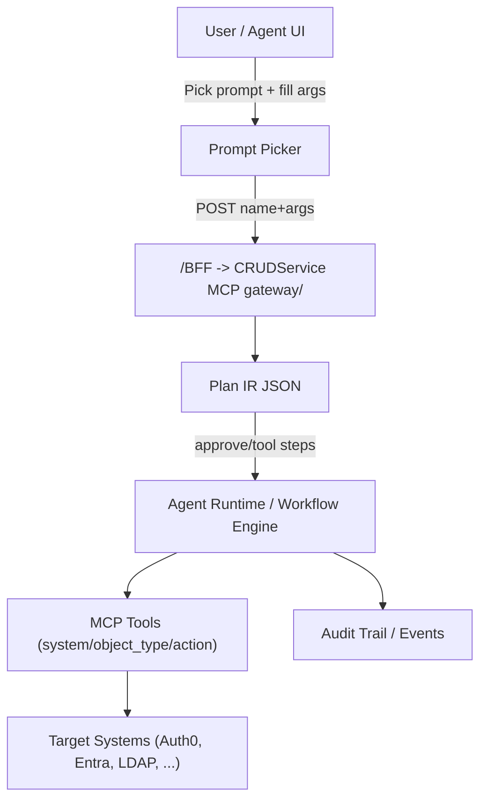
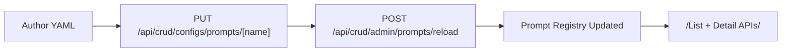
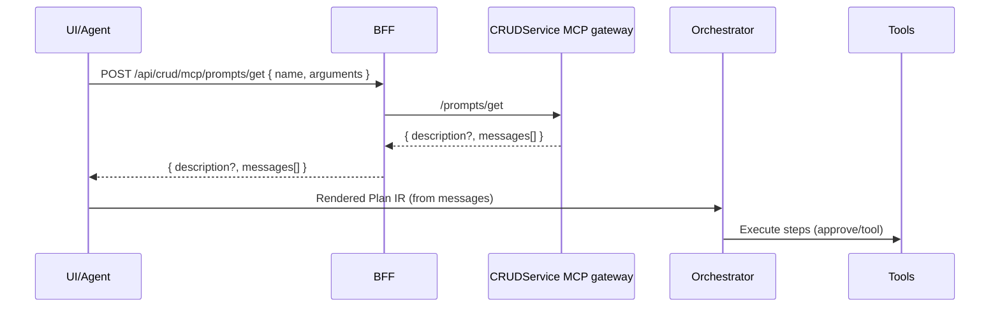

# MCP Prompts: Role, Value, and How We Use Them

This guide explains what MCP Prompts are, why we use them, how they connect our UI/Agents/Workflows/Tools, and how to author, render, and operate them in CRUDService.

---

## 1) Why MCP Prompts? The synergy
MCP Prompts are the connective tissue between people, UI, and execution. They let us capture intent in a reusable, testable asset that downstream systems can execute deterministically.

- Consistency: one canonical definition per action (e.g., “Add roles to Auth0 user”).
- Discoverability: prompts are listed, filtered by tags/provider, and previewable.
- Safety & governance: structured arguments, approvals, sensitivity tags, and audit-friendly plans.
- Composability: the same prompt powers Agents, UI actions, and graph workflows.

### Big picture


Key idea: Prompts render to a Plan IR (JSON). The orchestrator executes the plan by invoking MCP tools that wrap our backend commands.

---

## 2) Real‑world scenarios we support
- Identity lifecycle
  - Create user, reset password, add/remove roles, move group memberships
  - Approvals embedded in the plan; tools invoke CRUDService actions safely
- HR/IT automation
  - Open/change tickets, escalate incidents, classify and summarize events
- Data access approvals
  - Prompts output a plan for multi‑step approval/gating before execution
- Knowledge/OPS support
  - Summarize conversations; generate change templates with guardrails

Example (already shipped): “Add roles to Auth0 user” – prompt renders a Plan IR with:
- An `approve` step asking a human to confirm
- A `tool` step calling the role‑membership command with typed params

---

## 3) How we implement prompts in CRUDService

### 3.1 Where prompts are stored
The loader searches these paths (first found wins):
- `/app/config/CRUDService/config/prompts`
- `/app/config/config/prompts`
- `/app/config/prompts`

Files may be `.yaml` or `.yml`.
Prompts participate in virtual views similar to tools. You can expose a dedicated prompts view or mix prompts with tools in provider‑scoped views. See `mcp_virtual_views.md`.

### 3.2 Authoring and lifecycle
- Browse/Test/Create: SPA at `/prompts`
- Focused editing: `/admin/prompt/:name` (YAML editor with validation, rename, duplicate, delete, ETag conflict handling)
- Hot reload: `POST /api/crud/admin/prompts/reload`

Authoring flow:


### 3.3 Rendering flow (runtime)


Endpoints:
- List: `GET /api/crud/admin/prompts` (ETag/Last‑Modified aware)
- Detail: `GET /api/crud/admin/prompts/{name}`
- Save/Delete: `PUT/DELETE /api/crud/configs/prompts/{name}`
- Reload: `POST /api/crud/admin/prompts/reload`
- Render: `POST /api/crud/mcp/prompts/get`
  - Via virtual views: `POST /api/crud/mcp/{view}/jsonrpc` with `prompts/list` and `prompts/get` methods; streamable clients can use `GET /api/crud/mcp/{view}/jsonrpc` (SSE bridge).

Optional: “views” constrain which prompts can render in a given virtual environment.

---

## 4) YAML deep‑dive
A prompt is a single YAML file. Minimal fields:

```yaml
name: auth0.user.add_roles            # Stable ID; we recommend file stem == name
title: Auth0 – Add roles to user      # Human‑readable title
description: Assign roles with approval.
metadata:
  provider: ["auth0"]                # Provider(s); string or list
  tags: ["auth0", "role", "membership", "add"]
arguments:                            # Named inputs; used for validation + interpolation
  system:
    description: Auth0 system name (e.g., auth0_eid)
    required: true
  SystemIdentifier:
    description: Auth0 user ID
    required: true
  membersToAdd:
    description: Array of role IDs
    required: true
messages:                             # Prompt messages fed to the LLM in order
  - role: user
    content: |
      Produce STRICT JSON only (Plan IR v1).
      {
        "version":"plan/v1",
        "meta": { "prompt_id": "auth0.user.add_roles@1.0.0" },
        "steps": [
          {"kind":"approve","id":"gate","params":{"message":"Add roles to Auth0 user {SystemIdentifier}?"}},
          {"kind":"tool","id":"add",
           "params":{ "system":"{system}", "object_type":"role-membership",
                      "action":"AddRolesToUser", "SystemIdentifier":"{SystemIdentifier}",
                      "membersToAdd":"{membersToAdd}" },
           "allow_tags":["auth0","role","membership","add"],
           "dry_run": false
          }
        ]
      }
```

Important semantics:
- Interpolation: `{argName}` expands from `arguments`. The UI enforces required fields before render.
- `metadata.tags`: used for filtering and sensitivity policies (e.g., hide logs for `secret`).
- Messages: ordered; in our patterns, the first user message produces a Plan IR for deterministic execution.
- Versioning: embed a `meta.prompt_id` (e.g., `name@semver`) inside your plan for auditability.

Common pitfalls:
- YAML indentation matters; prefer 2 spaces; quote strings with `{`/`}` when needed.
- Keep arguments typed in descriptions; consumers treat everything as strings unless tools coerce types.

---

## 5) Using prompts in our platform

### 5.1 In the UI / Agents
- Edit Agent → “Use MCP Prompt…” to pick and render into the system prompt.
- Test Agent → “Use Prompt…” to pick, fill args, and preview the result quickly.
- Prompts page → browse/test; shows JSON validity and required‑args preflight.

### 5.2 From code (cURL example)
```bash
curl -sS -X POST \
  -H "Content-Type: application/json" \
  -H "X-CSRF-Token: $(curl -s /auth/csrf | jq -r .csrf)" \
  /api/crud/mcp/prompts/get \
  -d '{
        "name":"auth0.user.add_roles",
        "arguments":{
          "system":"auth0_eid",
          "SystemIdentifier":"user_123",
          "membersToAdd":["role_a","role_b"]
        }
      }'
```

### 5.3 How prompts drive MCP tools and workflows
Prompts typically return a Plan IR with steps like `approve` and `tool`.
- `approve` → the orchestrator surfaces a human confirmation gate
- `tool` → the orchestrator invokes an MCP tool that maps to CRUDService commands

Mapping example (conceptual):
```json
{
  "kind": "tool",
  "params": {
    "system": "auth0_eid",
    "object_type": "role-membership",
    "action": "AddRolesToUser",
    "SystemIdentifier": "user_123",
    "membersToAdd": ["role_a"]
  }
}
```
The orchestrator converts this to our `execute` endpoint or internal tool call; PDP/BFF routes enforce authz.

---

## 6) Operations, governance, and best practices
- Deploy via ConfigMap/volume into one of the supported `prompts` paths; hot‑reload.
- Keep one action per prompt; name as `provider.domain.action`.
- Tag with provider/object_type/verb/sensitivity for clean catalogs.
- Use required arguments; avoid free‑text inputs for IDs where possible.
- Validate JSON (Plan IR) during authoring; the UI shows a validity badge.
- Security: session + CSRF required on mutating calls; MCP proxy paths are Bearer‑token only and exempt from CSRF/DPoP under `PREFIX:/api/crud/mcp`; sensitive prompts may be redacted in logs.

---

## 7) Quick reference
- List: `GET /api/crud/admin/prompts`
- Detail: `GET /api/crud/admin/prompts/{name}`
- Save/Delete: `PUT/DELETE /api/crud/configs/prompts/{name}`
- Reload: `POST /api/crud/admin/prompts/reload`
- Render: `POST /api/crud/mcp/prompts/get`

For examples, see `ServiceConfigs/CRUDService/config/prompts/` and the SPA at `/prompts` and `/admin/prompt/:name`.
