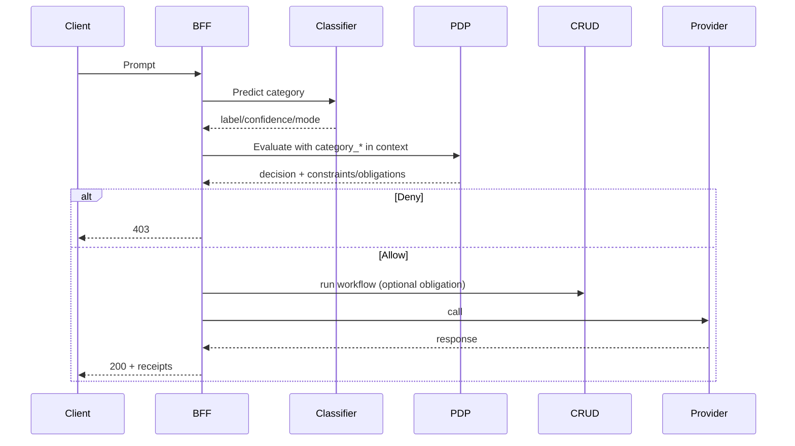

## Product Overview

### AI Gateway capabilities (updated)
- MCP Gateway: exposes tools, resources, and prompts; supports virtual views with provider/tag filters.
- Prompt catalog (YAML-backed): users trigger prompts that produce strict Plan IR; the gateway validates, simulates, and executes deterministically.
- Safety & governance:
  - Classifier-first: BFF classifies prompts and exports categories to PDP; PDP policy decides Allow/Deny, budgets, and attaches obligations.
  - Obligation dispatcher: `audit_log` (Kafka business audit) and `run_workflow` (CRUDService graph workflows), with correlation and ARNs.
  - Allow-lists per prompt, idempotency keys on create/update, and human approval gates.
- Observability: run receipts link prompt → plan → workflow/tool executions.
- Transport/security:
  - Optional mTLS between clients and the MCP Gateway; BFF proxy uses Bearer tokens when fronting CRUDService. PDP evaluates tool/workflow execution. See `docs/source_content/E2E_mTLS_PDP_Integration_Technical_Guide.md`.
  - Streamable HTTP: BFF exposes an SSE GET bridge for JSON‑RPC at `/api/crud/mcp/{view}/jsonrpc` for clients like Cursor.
- Discovery & pagination: large catalogs are paginated per view via `limit`/`cursor`. See `docs/source_content/mcp_virtual_views.md` and examples in `docs/source_content/mcp_tool_recipes.md`.

### End-to-end flow (prompt → plan → workflow)
1. Discover/render prompt (via MCP or HTTP proxy)
2. Classification-first; export to PDP; PDP decides Allow/Deny, returns constraints/obligations
3. Obligation processing (audit/workflow) and one‑shot planning (strict JSON Plan IR)
4. Approval/dry-run
5. Deterministic execution via workflows/tools
6. Status, receipts, and audit

### See also
- `docs/source_content/mcp_virtual_views.md` – virtual views, discovery, pagination, and BFF proxying
- `docs/source_content/mcp_tool_recipes.md` – JSON‑RPC recipes and real‑world scenarios
- `docs/source_content/mcp_prompts.md` and `docs/source_content/MCP_PROMPTS_GUIDE.md` – prompt catalog, Plan IR, and execution model
- `docs/source_content/mcp_loopback_howto.md` – in‑process MCP server and operational tips
