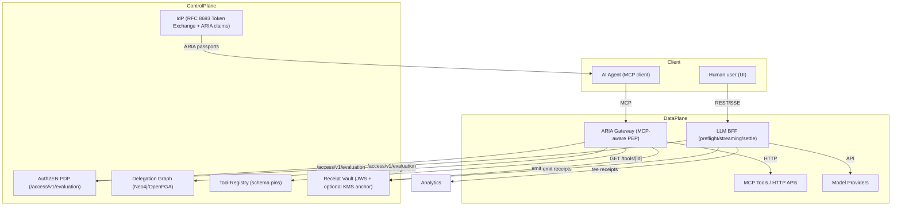
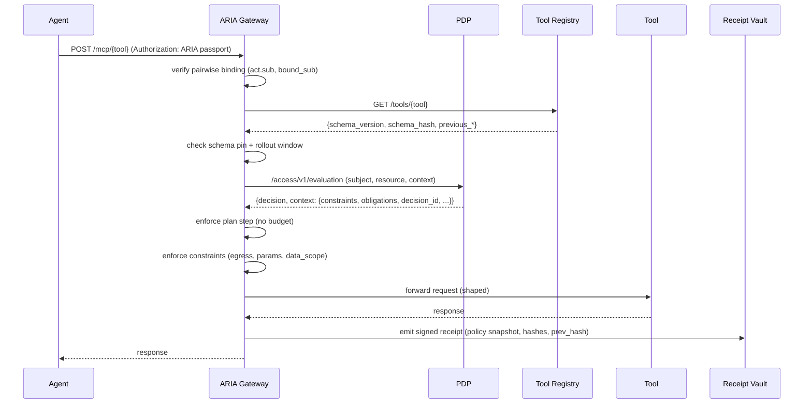
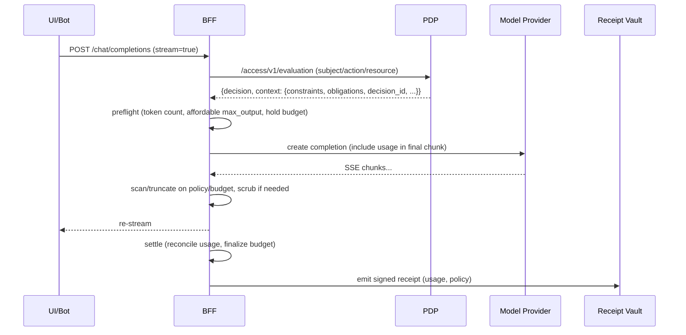

Below is a **developer‑to‑developer, end‑to‑end ARIA v1 design** that folds in the lean “market wedge” delta and removes the low‑value/deferred features from the older draft. It includes **mermaid diagrams**, **clearly defined data models**, and **complete, runnable code stubs** (FastAPI + httpx + Redis) for the **IdP extension**, **PDP (AuthZEN profile)**, **ARIA Gateway (MCP‑aware PEP)**, **Tool Registry**, **BFF (LLM proxy with stream‑time enforcement)**, and **Receipt Vault**.

> **Scope (v1):** user‑bound agent identities, AuthZEN PDP with constraints, plan contracts, MCP‑aware PEP (schema pins, param allowlists, egress), BFF stream‑time enforcement + hard budgets, signed hash‑chained receipts (+ optional KMS anchor).
> **Deferred:** vendor‑signed schema attestations (use schema pins), Merkle capability proofs (use RAR + policy), context‑root/DPoP binding, BDNA gating (telemetry only if instrumented), OAuth chaining (feature‑flagged add‑on).

---

## 0) Big picture

### 0.1 Architecture (v1)



### 0.2 Request flow sequences

**A. Agent → Tool via ARIA (MCP)**



**B. Human/Bot → LLM via BFF (stream‑time enforcement)**



---

## 1) Data models (wire formats)

### 1.1 ARIA Passport (IdP‑issued JWT; minimal v1)

```json
{
  "iss": "https://idp.example.com",
  "sub": "pairwise:9a7b1c2d3e4f5a6b",             // pairwise for user+service
  "aud": "aria.gateway",
  "exp": 1735689600,
  "jti": "be0bfe61-2c36-4b72-9d8a-34a5f3c2a108",
  "act": { "sub": "agent:svc-123:for:9a7b1c2d3e4f5a6b" },
  "authorization_details": [{
    "type": "agent_delegation",
    "tools": ["mcp:flights:search","mcp:flights:book"],
    "locations": ["https://tools.example.com/mcp/flights"]
  }],
  "aria": {
    "bound_sub": "pairwise:9a7b1c2d3e4f5a6b",
    "tenant": "acme",
    "schema_pins": {
      "mcp:flights:search": {"schema_version":"1.2.0","schema_hash":"sha256:..."},
      "mcp:flights:book":   {"schema_version":"1.2.0","schema_hash":"sha256:..."}
    },
    "plan_contract_jws": "<JWS string or null>",
    "call_id": "79dfe9b6-5d0e-4b6e-ae9a-d68a1f0c0e0f",
    "budget": { "initial": 100.00, "currency": "USD" }
  }
}
```

### 1.2 Plan Contract (JWS payload)

```json
{
  "plan_id": "c8f5a1b2c3d4e5f6",
  "agent_id": "agent:svc-123:for:9a7b1c2d3e4f5a6b",
  "total_budget": 42.50,
  "steps": [
    {"index":0,"tool":"mcp:flights:search","params_fingerprint":"sha256:...","max_cost":0.50},
    {"index":1,"tool":"mcp:flights:book","params_fingerprint":"sha256:...","max_cost":42.00}
  ],
  "created_at": "2025-08-10T15:42:01Z",
  "expires_at": "2025-08-10T16:42:01Z"
}
```

### 1.3 Receipt (JWS payload, hash‑chained)

```json
{
  "id": "e7b3b6f9-8d0a-4b7b-927f-7c2fd149e98e",
  "ts": "2025-08-10T15:43:12.251Z",
  "agent_id": "agent:svc-123:for:9a7b1c2d3e4f5a6b",
  "call_id": "79dfe9b6-5d0e-4b6e-ae9a-d68a1f0c0e0f",
  "resource": {"type":"tool","id":"mcp:flights:search"},
  "decision": "Allow",
  "policy_snapshot": {"tokens":{"max_output":1024},"egress":{"allow":["api.openai.com:443"]}},
  "schema_hash": "sha256:...",
  "params_hash": "sha256:...",
  "usage": {"input_tokens": 466, "output_tokens": 927, "cost_usd": 0.0042},
  "reason": null,
  "prev_hash": "0000000000000000000000000000000000000000000000000000000000000000"
}
```

### 1.4 Tool Registry entry

```json
{
  "id": "mcp:flights:search",
  "endpoint": "https://tools.example.com/mcp/flights/search",
  "schema_version": "1.2.0",
  "schema_hash": "sha256:3b4c5d6e7f8a9b0c1d2e3f4a5b6c7d8e",
  "previous_version": "1.1.9",
  "previous_hash": "sha256:abc...def",
  "updated_at": 1735670000,
  "risk_tier": "med",
  "auth_mode": "api_key"
}
```

---

## 2) Repositories & service layout

```
repo/
├─ idp/                      # IdP extension (ARIA token exchange)
│  └─ main.py
├─ pdp/                      # AuthZEN PDP
│  └─ main.py
├─ aria/                     # ARIA Gateway (MCP PEP)
│  ├─ main.py
│  ├─ clients/
│  │  ├─ authzen_client.py
│  │  └─ tool_registry_client.py
│  └─ util/
│     ├─ budget.py
│     ├─ receipts.py
│     └─ plan.py
├─ tool_registry/            # Tool registry (schema pins)
│  └─ main.py
├─ bff/                      # LLM proxy (preflight/stream/settle)
│  ├─ main.py
│  └─ provider_client.py
├─ receipt_vault/            # JWS signing + KMS anchor stub
│  └─ main.py
├─ docker-compose.yml
└─ tests/
   ├─ test_schema_pin.py
   ├─ test_plan_enforcement.py
   └─ test_budget_idempotency.py
```

---

## 3) Code — IdP (ARIA passports)

**idp/main.py**

```python
from fastapi import FastAPI, HTTPException
from pydantic import BaseModel
import os, time, json, uuid, hashlib, jwt

app = FastAPI(title="IdP (ARIA extension)")

# --- helpers (replace with real keystore / JWKS)
PRIVATE_KEY = os.environ.get("IDP_PRIVATE_KEY_PEM", None)
if not PRIVATE_KEY:
    raise RuntimeError("IDP_PRIVATE_KEY_PEM must be set")

PAIRWISE_SALT = os.environ.get("ARIA_PAIRWISE_SALT", "dev-salt")
ISSUER = os.environ.get("ARIA_ISSUER", "https://idp.example.com")

# --- models
class ExchangeRequest(BaseModel):
    subject_token: str     # user token (already verified upstream)
    actor_token: str       # service token
    requested_tools: list[str]
    plan: dict | None = None
    tenant: str = "default"

# --- dependencies (stubs replace with real)
async def get_delegation(user_id: str, agent_id: str) -> dict | None:
    # TODO: read from Neo4j/OpenFGA
    return {
        "status": "active",
        "capabilities": ["mcp:flights:search","mcp:flights:book"],
        "budget": 100.0,
        "max_steps": 20
    }

async def get_tool_pin(tool_id: str) -> dict:
    # In real impl, call tool registry
    return {"schema_version":"1.2.0", "schema_hash":"sha256:deadbeef"}

def pairwise(user_id: str, service_id: str) -> str:
    raw = f"pairwise:v1:{user_id}:{service_id}:{PAIRWISE_SALT}".encode()
    return "pairwise:" + hashlib.sha256(raw).hexdigest()[:16]

def sign_jwt(payload: dict) -> str:
    return jwt.encode(payload, PRIVATE_KEY, algorithm="RS256",
                      headers={"alg":"RS256","kid":"idp-aria-001","typ":"JWT"})

def canonical_hash(obj: dict) -> str:
    return "sha256:" + hashlib.sha256(json.dumps(obj, sort_keys=True).encode()).hexdigest()

def sign_plan_contract(plan: dict, agent_id: str) -> str:
    steps = []
    total = 0.0
    for i, s in enumerate(plan.get("steps", [])):
        pf = canonical_hash(s.get("params", {}))
        cost = float(s.get("cost", 0))
        total += cost
        steps.append({"index": i, "tool": s["tool"], "params_fingerprint": pf, "max_cost": cost})
    payload = {
        "plan_id": hashlib.sha256(json.dumps(plan, sort_keys=True).encode()).hexdigest()[:16],
        "agent_id": agent_id,
        "total_budget": round(total, 2),
        "steps": steps,
        "created_at": time.strftime("%Y-%m-%dT%H:%M:%SZ", time.gmtime()),
        "expires_at": time.strftime("%Y-%m-%dT%H:%M:%SZ", time.gmtime(time.time()+3600)),
    }
    return sign_jwt(payload)

@app.post("/oauth/aria/token")
async def aria_token_exchange(req: ExchangeRequest):
    # In production, verify subject/actor tokens cryptographically.
    user_id = "user:123"     # from subject_token claims
    service_id = "svc-123"   # from actor_token claims

    pw = pairwise(user_id, service_id)
    agent_id = f"agent:{service_id}:for:{pw.split(':')[1]}"

    delegation = await get_delegation(user_id, agent_id)
    if not delegation or delegation["status"] != "active":
        raise HTTPException(403, "consent_required")

    # Build schema pins from registry
    schema_pins = {}
    for t in req.requested_tools:
        pin = await get_tool_pin(t)
        schema_pins[t] = pin

    plan_jws = sign_plan_contract(req.plan, agent_id) if req.plan else None

    now = int(time.time())
    passport = {
        "iss": ISSUER,
        "sub": pw,
        "aud": "aria.gateway",
        "iat": now,
        "exp": now + 3600,
        "jti": str(uuid.uuid4()),
        "act": {"sub": agent_id},
        "authorization_details": [{
            "type":"agent_delegation",
            "tools": req.requested_tools,
            "locations": []  # optional
        }],
        "aria": {
            "bound_sub": pw,
            "tenant": req.tenant,
            "schema_pins": schema_pins,
            "call_id": str(uuid.uuid4()),
            "max_steps": delegation.get("max_steps", 20),
            "plan_contract_jws": plan_jws,
            "budget": {"initial": delegation.get("budget", 10.0), "currency": "USD"}
        }
    }
    return {
        "access_token": sign_jwt(passport),
        "token_type": "Bearer",
        "expires_in": 3600,
        "agent_id": agent_id
    }
```

---

## 4) Code — PDP (AuthZEN profile)

**pdp/main.py**

```python
from fastapi import FastAPI, HTTPException
from pydantic import BaseModel
from typing import Dict, Any

app = FastAPI(title="AuthZEN PDP (ARIA profile)")

class Subject(BaseModel):
    type: str
    id: str
    properties: Dict[str, Any] = {}

class Action(BaseModel):
    name: str

class Resource(BaseModel):
    type: str
    id: str
    properties: Dict[str, Any] = {}

class EvaluationRequest(BaseModel):
    subject: Subject
    action: Action
    resource: Resource
    context: Dict[str, Any] | None = None

# --- policy/data stubs (replace with Neo4j/OpenFGA lookups)
def get_delegation_by_agent(agent_id: str) -> dict | None:
    # Example policy row
    return {
        "status": "active",
        "capabilities": ["mcp:flights:search","mcp:flights:book"],
        "model_allow": ["gpt-4o-mini","gpt-4.1"],
        "max_input_tokens": 8192,
        "max_output_tokens": 2048,
        "max_stream_tokens": 4096,
        "egress_allow": ["tools.example.com:443","api.openai.com:443"],
        "url_allowlist": ["*.corp.example"],
        "param_allowlist": {"amount": ["^\\d+(\\.\\d{1,2})?$"]},
        "max_transaction_value_cents": 5000,
        "consent_threshold_cents": 2000,
        "tenant_id": "acme"
    }

def compute_constraints(delegation: dict) -> dict:
    tenant_id = delegation.get("tenant_id", "default")
    return {
        "model": {"allow": delegation.get("model_allow", [])},
        "tokens": {
            "max_input": delegation.get("max_input_tokens", 6000),
            "max_output": delegation.get("max_output_tokens", 1500),
            "max_stream": delegation.get("max_stream_tokens", 4096)
        },
        "egress": {"allow": delegation.get("egress_allow", [])},
        "prompt_rules": {
            "disallowed_phrases": ["ignore all previous", "system override"],
            "url_allowlist": delegation.get("url_allowlist", []),
            "block_markdown_external_links": True,
            "block_system_prompt_leakage": True
        },
        "params": {"allowlist": delegation.get("param_allowlist", {})},
        "spend": {
            "max_cents": delegation.get("max_transaction_value_cents", 0),
            "consent_threshold_cents": delegation.get("consent_threshold_cents", 0)
        },
        "data_scope": {
            "tenant_ids": [tenant_id],
            "row_filter_sql": f"tenant_id = '{tenant_id}'"
        },
        "step_up": {"mfa_required": False}  # example
    }

def check_binding(subject: Subject, resource: Resource) -> bool:
    # Optional binding checks; for tool calls we usually validate in ARIA
    return True

def check_capability(delegation: dict, requested_capability: str) -> bool:
    return requested_capability in set(delegation.get("capabilities", []))

@app.post("/access/v1/evaluation")
def evaluation(req: EvaluationRequest):
    # Minimal validation
    if req.subject.type != "agent":
        raise HTTPException(400, "subject.type must be 'agent'")

    delegation = get_delegation_by_agent(req.subject.id)
    if not delegation or delegation.get("status") != "active":
        return {"decision": False, "context": {}}

    # Capability = action.name or context.capability
    capability = (req.context or {}).get("capability", req.action.name)
    if not check_capability(delegation, capability):
        return {"decision": False, "context": {}}

    constraints = compute_constraints(delegation)
    obligations = [
        {"id": "emit_receipt"},
        {"id": "tee_analytics", "attributes": {"include": ["usage", "limits"]}}
    ]
    return {
        "decision": True,
        "context": {
            "constraints": constraints,
            "obligations": obligations,
            "policy_version": "2025-08-10.3",
            "constraints_schema": "aria.constraints.v1",
            "ttl_ms": 1500
        }
    }
```

---

## 5) Code — Tool Registry (schema pins)

**tool\_registry/main.py**

```python
from fastapi import FastAPI, HTTPException
import time

app = FastAPI(title="Tool Registry")

TOOLS = {
    "mcp:flights:search": {
        "id": "mcp:flights:search",
        "endpoint": "https://tools.example.com/mcp/flights/search",
        "schema_version": "1.2.0",
        "schema_hash": "sha256:deadbeef",
        "previous_version": "1.1.9",
        "previous_hash": "sha256:cafebabe",
        "updated_at": int(time.time()) - 1800,
        "risk_tier": "med",
        "auth_mode": "api_key"
    },
    "mcp:flights:book": {
        "id": "mcp:flights:book",
        "endpoint": "https://tools.example.com/mcp/flights/book",
        "schema_version": "1.2.0",
        "schema_hash": "sha256:deadbeef",
        "previous_version": "1.1.9",
        "previous_hash": "sha256:cafebabe",
        "updated_at": int(time.time()) - 1800,
        "risk_tier": "high",
        "auth_mode": "api_key"
    }
}

@app.get("/tools/{tool_id}")
def get_tool(tool_id: str):
    if tool_id not in TOOLS:
        raise HTTPException(404, "tool not found")
    return TOOLS[tool_id]
```

---

## 6) Code — Receipt Vault (JWS signing + optional KMS anchor)

**receipt\_vault/main.py**

```python
from fastapi import FastAPI
from pydantic import BaseModel
import os, jwt, hashlib, time

app = FastAPI(title="Receipt Vault")

PRIVATE_KEY = os.environ.get("RECEIPT_PRIVATE_KEY_PEM")
if not PRIVATE_KEY:
    raise RuntimeError("RECEIPT_PRIVATE_KEY_PEM required")

class ReceiptIn(BaseModel):
    payload: dict

@app.post("/v1/receipts/sign")
def sign_receipt(body: ReceiptIn):
    jws = jwt.encode(body.payload, PRIVATE_KEY, algorithm="RS256",
                     headers={"alg":"RS256","kid":"rv-001","typ":"JWT"})
    h = hashlib.sha256(jws.encode()).hexdigest()
    # Optional: push hash to KMS/transparency log daily
    return {"jws": jws, "hash": h, "anchored": False, "ts": int(time.time())}
```

---

## 7) Code — ARIA Gateway (MCP‑aware PEP)

**aria/clients/authzen\_client.py**

```python
import httpx
from typing import Dict, Any, List

class AuthZENClient:
    def __init__(self, base_url: str, timeout: float = 1.5):
        self.base = base_url.rstrip("/")
        self.http = httpx.AsyncClient(timeout=timeout)

    async def evaluate(self, subject: Dict[str, Any], action: Dict[str, Any],
                       resource: Dict[str, Any], context: Dict[str, Any] | None = None) -> Dict[str, Any]:
        payload = {"subject": subject, "action": action, "resource": resource}
        if context: payload["context"] = context
        r = await self.http.post(f"{self.base}/access/v1/evaluation", json=payload)
        r.raise_for_status()
        return r.json()
```

**aria/clients/tool\_registry\_client.py**

```python
import httpx

class ToolRegistryClient:
    def __init__(self, base_url: str, timeout: float = 1.5):
        self.base = base_url.rstrip("/")
        self.http = httpx.AsyncClient(timeout=timeout)

    async def get_tool(self, tool_id: str) -> dict:
        r = await self.http.get(f"{self.base}/tools/{tool_id}")
        r.raise_for_status()
        return r.json()
```

**aria/util/plan.py**

```python
import jwt, json, hashlib

def params_fingerprint(params: dict) -> str:
    return "sha256:" + hashlib.sha256(json.dumps(params, sort_keys=True).encode()).hexdigest()

def verify_plan_step(plan_jws: str, step_idx: int, tool: str, params: dict) -> bool:
    plan = jwt.decode(plan_jws, options={"verify_signature": False})
    steps = plan.get("steps", [])
    if step_idx >= len(steps): return False
    step = steps[step_idx]
    if step["tool"] != tool: return False
    return step["params_fingerprint"] == params_fingerprint(params)
```

**aria/util/budget.py**

```python
import aioredis
from typing import Tuple

# debit with idempotency via seen(call_id) key and atomic decr
async def debit_budget(redis: aioredis.Redis, call_id: str, agent_id: str, cost: float) -> Tuple[bool, float, float]:
    seen_key = f"budget:seen:{call_id}"
    if await redis.get(seen_key):
        remaining = float(await redis.get(f"budget:{agent_id}") or 0)
        return True, 0.0, remaining

    budget_key = f"budget:{agent_id}"
    async with redis.pipeline(transaction=True) as pipe:
        while True:
            try:
                await pipe.watch(budget_key)
                current_raw = await pipe.get(budget_key)
                current = float(current_raw.decode()) if current_raw else 0.0
                if cost > current:
                    await pipe.reset()
                    return False, 0.0, current
                pipe.multi()
                pipe.set(budget_key, current - cost, ex=86400)
                pipe.setex(seen_key, 600, "1")
                await pipe.execute()
                return True, cost, current - cost
            except aioredis.WatchError:
                continue
```

**aria/util/receipts.py**

```python
import httpx, hashlib, time, uuid, json

class ReceiptEmitter:
    def __init__(self, vault_base: str):
        self.http = httpx.AsyncClient(timeout=1.5)
        self.base = vault_base.rstrip("/")

    async def emit(self, payload: dict) -> dict:
        # link with prev hash per agent
        prev = payload.pop("_prev_hash", "0"*64)
        payload["prev_hash"] = prev
        payload.setdefault("ts", time.strftime("%Y-%m-%dT%H:%M:%SZ", time.gmtime()))
        r = await self.http.post(f"{self.base}/v1/receipts/sign", json={"payload": payload})
        r.raise_for_status()
        out = r.json()
        out["prev_hash"] = prev
        return out
```

**aria/main.py**

```python
from fastapi import FastAPI, Request, Header, HTTPException
from typing import Optional, Dict, Any
import os, time, json, hashlib, jwt, httpx, aioredis

from clients.authzen_client import AuthZENClient
from clients.tool_registry_client import ToolRegistryClient
from util.plan import verify_plan_step
from util.budget import debit_budget
from util.receipts import ReceiptEmitter

app = FastAPI(title="ARIA Gateway v1")

PDP_URL = os.environ.get("PDP_URL", "http://pdp:8000")
REGISTRY_URL = os.environ.get("REGISTRY_URL", "http://tool-registry:8081")
RECEIPT_VAULT = os.environ.get("RECEIPT_VAULT_URL", "http://receipt-vault:8084")
JWKS = None  # load real JWKS in prod

pdp = AuthZENClient(PDP_URL)
registry = ToolRegistryClient(REGISTRY_URL)
receipts = ReceiptEmitter(RECEIPT_VAULT)

@app.on_event("startup")
async def startup():
    app.state.redis = await aioredis.from_url(os.environ.get("REDIS_URL","redis://redis:6379"))

def verify_user_binding(passport: Dict[str, Any]) -> bool:
    try:
        bound_sub = passport["aria"]["bound_sub"]
        user_sub = passport["sub"]
        agent_id = passport["act"]["sub"]
        if ":for:" not in agent_id: return False
        agent_bound = agent_id.split(":for:")[1]
        pairwise = bound_sub.split(":")[-1]
        return (bound_sub == user_sub and agent_bound == pairwise)
    except Exception:
        return False

async def verify_schema_pin(tool: str, pin: Dict[str, str]) -> bool:
    if not pin: return False
    meta = await registry.get_tool(tool)
    if pin["schema_version"] == meta["schema_version"] and pin["schema_hash"] == meta["schema_hash"]:
        return True
    if (meta.get("previous_version") == pin["schema_version"] and
        meta.get("previous_hash") == pin["schema_hash"] and
        time.time() - meta.get("updated_at", 0) < 4*3600):
        return True
    return False

def canonical_params_hash(body: dict) -> str:
    return "sha256:" + hashlib.sha256(json.dumps(body, sort_keys=True).encode()).hexdigest()

async def enforce_preconditions(constraints: dict, request: Request):
    step_up = (constraints.get("step_up") or {})
    spend = (constraints.get("spend") or {})
    if step_up.get("mfa_required") and request.headers.get("X-ARIA-MFA") != "ok":
        raise HTTPException(401, "MFA step-up required")
    ct = spend.get("consent_threshold_cents")
    if ct is not None:
        granted = int(request.headers.get("X-ARIA-Consent", "0"))
        if granted < int(ct):
            raise HTTPException(403, "Consent required for spend threshold")

async def enforce_egress(tool_meta: dict, constraints: dict):
    allow = set((constraints.get("egress") or {}).get("allow", []))
    if not allow: return True
    endpoint = tool_meta.get("endpoint", "")
    host = endpoint.split("//")[-1].split("/")[0]
    ok = host in allow or any(host.endswith(p.lstrip("*")) for p in allow)
    if not ok: raise HTTPException(403, "Egress denied")

def enforce_params_allowlist(body: dict, constraints: dict) -> dict:
    import re
    result = dict(body)
    allow = ((constraints.get("params") or {}).get("allowlist") or {})
    for param, patterns in allow.items():
        if param in result:
            val = str(result[param])
            if not any(re.search(p, val) for p in (patterns or [])):
                raise HTTPException(400, f"Param '{param}' value rejected by allowlist")
    data_scope = constraints.get("data_scope") or {}
    if data_scope.get("row_filter_sql"):
        result.setdefault("_aria", {})["row_filter_sql"] = data_scope["row_filter_sql"]
    return result

@app.post("/mcp/{tool_id}")
async def mcp(tool_id: str, request: Request, authorization: str = Header(...)):
    token = authorization.replace("Bearer ", "")
    passport = jwt.decode(token, options={"verify_signature": False})  # In prod: verify with JWKS and aud
    if not verify_user_binding(passport):
        raise HTTPException(403, "user binding violation")

    aria = passport["aria"]
    agent_id = passport["act"]["sub"]
    call_id = aria["call_id"]
    schema_pin = (aria.get("schema_pins") or {}).get(tool_id)
    if not await verify_schema_pin(tool_id, schema_pin):
        raise HTTPException(403, "schema pin mismatch")

    tool_meta = await registry.get_tool(tool_id)
    body = await request.json()

    # Plan enforcement
    if aria.get("plan_contract_jws"):
        # get server-tracked step from redis
        step_idx = int(await app.state.redis.get(f"call:{call_id}:step") or 0)
        if not verify_plan_step(aria["plan_contract_jws"], step_idx, tool_id, body):
            raise HTTPException(403, "plan step violation")

    # Budget (per-call/tool cost model: from registry or flat)
    cost = float(tool_meta.get("cost_per_call", 0.05))
    ok, debited, remaining = await debit_budget(app.state.redis, call_id, agent_id, cost)
    if not ok:
        raise HTTPException(402, "budget exceeded")

    # PDP evaluation
    pdp_out = await pdp.evaluate(
        subject={"type":"agent","id":agent_id,"properties":{"bound_user":passport["sub"]}},
        action={"name":"execute"},
        resource={"type":"tool","id":tool_id,"properties":{"schema_hash": schema_pin["schema_hash"]}},
        context={"budget_remaining": remaining, "capability": tool_id}
    )
    if not pdp_out.get("decision"):
        raise HTTPException(403, "PDP denied")
    ctx = pdp_out.get("context", {})
    constraints = ctx.get("constraints", {})
    obligations = ctx.get("obligations", [])

    await enforce_preconditions(constraints, request)
    await enforce_egress(tool_meta, constraints)
    shaped = enforce_params_allowlist(body, constraints)

    # Forward to tool
    async with httpx.AsyncClient(timeout=15.0) as http:
        r = await http.post(tool_meta["endpoint"], json=shaped,
                            headers={"X-Delegator-ID": passport["sub"], "X-Agent-ID": agent_id})
    r.raise_for_status()
    resp_json = r.json()

    # Step advance after success
    if aria.get("plan_contract_jws"):
        await app.state.redis.set(f"call:{call_id}:step", int(step_idx)+1, ex=3600)

    # Emit receipt
    payload = {
        "id": str(uuid.uuid4()),
        "call_id": call_id,
        "agent_id": agent_id,
        "resource": {"type":"tool","id":tool_id},
        "decision": "Allow",
        "policy_snapshot": constraints,
        "schema_hash": schema_pin["schema_hash"],
        "params_hash": canonical_params_hash(shaped),
        "usage": None
    }
    # prev_hash chain per agent
    prev = await app.state.redis.get(f"receipt:last:{agent_id}") or b"0"*64
    rec = await receipts.emit({**payload, "_prev_hash": prev.decode() if isinstance(prev,bytes) else prev})
    await app.state.redis.set(f"receipt:last:{agent_id}", rec["hash"], ex=86400)

    return resp_json
```

---

## 8) Code — BFF (LLM proxy with stream‑time enforcement)

**bff/provider\_client.py** (simple OpenAI‑ish wrapper; replace with real SDK)

```python
import httpx, asyncio

class ProviderClient:
    def __init__(self, base_url: str, api_key: str):
        self.base = base_url.rstrip("/")
        self.api_key = api_key
        self.http = httpx.AsyncClient(timeout=None)

    async def stream_chat(self, model: str, messages: list[dict], max_tokens: int, include_usage: bool = True):
        # Mocked streaming; replace with provider’s streaming endpoint
        # Yield dict chunks: {"choices":[{"delta":{"content":"..."}}]} and final {"usage":{"prompt_tokens":...,"completion_tokens":...}}
        for word in ["Hello", " ", "world", "!"]:
            yield {"choices":[{"delta":{"content": word}}]}
            await asyncio.sleep(0.01)
        if include_usage:
            yield {"usage":{"prompt_tokens": 100, "completion_tokens": 4}}
```

**bff/main.py**

```python
from fastapi import FastAPI, Request, HTTPException
from pydantic import BaseModel
import os, math, re, json, time, uuid, httpx, aioredis

from provider_client import ProviderClient

PDP_URL = os.environ.get("PDP_URL","http://pdp:8000")
RECEIPT_VAULT = os.environ.get("RECEIPT_VAULT_URL","http://receipt-vault:8084")
MODEL_PRICE = {  # cents per token (illustrative)
  "gpt-4o-mini": {"in": 0.0001, "out": 0.0002},
  "gpt-4.1": {"in": 0.0002, "out": 0.0004}
}

app = FastAPI(title="LLM BFF")
provider = ProviderClient(os.environ.get("PROVIDER_BASE","http://provider:9999"), "key")
pdp = httpx.AsyncClient(timeout=1.5)
receipt = httpx.AsyncClient(timeout=1.5)

def est_tokens(messages: list[dict]) -> int:
    # Replace with provider token counter
    s = json.dumps(messages)
    return max(1, len(s)//4)  # crude estimate

async def hold_budget(redis, agent_id: str, hold_cents: float, call_id: str) -> bool:
    key = f"budget:{agent_id}:hold"
    cur = float(await redis.get(f"budget:{agent_id}") or 0.0)
    if hold_cents/100.0 > cur: return False
    await redis.decrbyfloat(f"budget:{agent_id}", hold_cents/100.0)
    await redis.setex(f"hold:{call_id}", 600, hold_cents/100.0)
    return True

async def finalize_budget(redis, call_id: str, actual_cost_usd: float):
    held = float(await redis.get(f"hold:{call_id}") or 0.0)
    delta = held - actual_cost_usd
    if delta > 0:
        await redis.incrbyfloat("budget:refunds", delta)
    await redis.delete(f"hold:{call_id}")

class ChatBody(BaseModel):
    model: str
    messages: list[dict]
    stream: bool = True

@app.on_event("startup")
async def startup():
    app.state.redis = await aioredis.from_url(os.environ.get("REDIS_URL","redis://redis:6379"))

@app.post("/chat/completions")
async def chat(req: ChatBody):
    # Evaluate policy
    agent_id = "agent:svc-123:for:pairwise"  # in real life: from Authorization token on BFF, or session
    pdp_req = {
      "subject":{"type":"agent","id":agent_id},
      "action":{"name":"execute"},
      "resource":{"type":"model","id":req.model}
    }
    r = await pdp.post(f"{PDP_URL}/access/v1/evaluation", json=pdp_req)
    r.raise_for_status()
    out = r.json()
    if not out.get("decision"):
        raise HTTPException(403, "PDP denied")
    constraints = (out.get("context") or {}).get("constraints", {})
    model_allow = set((constraints.get("model") or {}).get("allow", []))
    if req.model not in model_allow:
        raise HTTPException(403, "model not allowed")

    # Preflight (tokens + affordable out)
    price = MODEL_PRICE.get(req.model) or MODEL_PRICE["gpt-4o-mini"]
    in_toks = est_tokens(req.messages)
    remaining_usd = float(await app.state.redis.get(f"budget:{agent_id}") or 0.0)
    max_out_by_budget = math.floor((remaining_usd - (in_toks * price["in"])) / max(price["out"], 1e-9))
    max_out_policy = (constraints.get("tokens") or {}).get("max_output", 512)
    max_out = max(0, min(int(max_out_policy), max_out_by_budget))

    if not await hold_budget(app.state.redis, agent_id, hold_cents=(in_toks*price["in"] + max_out*price["out"])*100, call_id=str(uuid.uuid4())):
        raise HTTPException(402, "budget insufficient")

    call_id = str(uuid.uuid4())
    affordable = {"max_tokens": max_out}

    # Streaming loop
    buf = []
    usage = None
    async for chunk in provider.stream_chat(req.model, req.messages, max_tokens=max_out, include_usage=True):
        if "choices" in chunk:
            delta = chunk["choices"][0]["delta"].get("content","")
            buf.append(delta)
            # enforce prompt_rules (example)
            pr = (constraints.get("prompt_rules") or {})
            banned = pr.get("disallowed_phrases", [])
            if any(b in "".join(buf).lower() for b in [b.lower() for b in banned]):
                break  # truncate

            # TODO: token budget enforcement on the fly if provider returns token counts mid-stream
            # yield to client here if you’re streaming from the BFF
            # For simplicity, we buffer.

        if "usage" in chunk:
            usage = chunk["usage"]

    # Settle
    completion_tokens = (usage or {}).get("completion_tokens", len("".join(buf))//4)
    actual_cost = in_toks*price["in"] + completion_tokens*price["out"]
    await finalize_budget(app.state.redis, call_id, actual_cost_usd=actual_cost)

    # Emit receipt
    payload = {
      "id": str(uuid.uuid4()),
      "call_id": call_id,
      "agent_id": agent_id,
      "resource": {"type":"model","id":req.model},
      "decision": "Allow",
      "policy_snapshot": constraints,
      "schema_hash": None,
      "params_hash": None,
      "usage": {"input_tokens": in_toks, "output_tokens": completion_tokens, "cost_usd": actual_cost}
    }
    prev = await app.state.redis.get(f"receipt:last:{agent_id}") or b"0"*64
    rec = await receipt.post(f"{RECEIPT_VAULT}/v1/receipts/sign", json={"payload":{**payload,"prev_hash": prev.decode() if isinstance(prev,bytes) else prev}})
    rec.raise_for_status()
    rec_json = rec.json()
    await app.state.redis.set(f"receipt:last:{agent_id}", rec_json["hash"], ex=86400)

    return {"choices":[{"message":{"role":"assistant","content":"".join(buf)}}], "usage": usage or {}}
```

---

## 9) Deployment (docker‑compose)

**docker-compose.yml**

```yaml
version: '3.9'
services:
  redis:
    image: redis:7
    ports: ["6379:6379"]

  tool-registry:
    build: ./tool_registry
    ports: ["8081:8081"]
    environment: {}

  pdp:
    build: ./pdp
    ports: ["8000:8000"]

  receipt-vault:
    build: ./receipt_vault
    ports: ["8084:8084"]
    environment:
      - RECEIPT_PRIVATE_KEY_PEM=${RECEIPT_PRIVATE_KEY_PEM}

  idp:
    build: ./idp
    ports: ["8082:8082"]
    environment:
      - ARIA_PAIRWISE_SALT=${PAIRWISE_SALT}
      - ARIA_ISSUER=https://idp.example.com
      - IDP_PRIVATE_KEY_PEM=${IDP_PRIVATE_KEY_PEM}

  aria:
    build: ./aria
    ports: ["8080:8080"]
    environment:
      - PDP_URL=http://pdp:8000
      - REGISTRY_URL=http://tool-registry:8081
      - RECEIPT_VAULT_URL=http://receipt-vault:8084
      - REDIS_URL=redis://redis:6379

  bff:
    build: ./bff
    ports: ["8083:8083"]
    environment:
      - PDP_URL=http://pdp:8000
      - RECEIPT_VAULT_URL=http://receipt-vault:8084
      - REDIS_URL=redis://redis:6379
      - PROVIDER_BASE=http://provider:9999
```

> **Note:** For simplicity, the FastAPI apps above should bind to `0.0.0.0` and expose the listed ports in their Dockerfiles (e.g., `uvicorn main:app --host 0.0.0.0 --port 8080` etc.).

---

## 10) Observability & run‑time

* **Receipts (source of truth):** store JWS, keep normal logs minimal; redact params; only include hashes (params\_hash).
* **Metrics (suggested counters/histograms):**

  * `aria.pdp.latency_ms`, `aria.plan.denied_total`, `aria.budget.denied_total`, `aria.egress.denied_total`, `aria.receipt.emit_ms`
  * `bff.stream.truncated_total`, `bff.usage.cost_usd_total`, `bff.policy.violations_total`
* **Tracing:** propagate `call_id` and `agent_id` as headers.

---

## 11) Acceptance tests (pytest)

**tests/test\_schema\_pin.py**

```python
import time
from aria.main import verify_schema_pin

class FakeRegistry:
    def __init__(self, meta): self.meta=meta
    async def get_tool(self, t): return self.meta

async def test_schema_pin_exact_match(monkeypatch):
    pin = {"schema_version":"1.2.0","schema_hash":"sha256:abc"}
    meta = {"schema_version":"1.2.0","schema_hash":"sha256:abc","updated_at":int(time.time())}
    # monkeypatch registry client call if needed
```

**tests/test\_plan\_enforcement.py**

```python
from aria.util.plan import verify_plan_step, params_fingerprint

def test_plan_step_ok():
    # Build a fake JWS payload (skip sig)
    import jwt
    payload = {"steps":[{"index":0,"tool":"mcp:flights:search","params_fingerprint":params_fingerprint({"q":"SFO"})}]}
    jws = jwt.encode(payload, "secret", algorithm="none")
    assert verify_plan_step(jws, 0, "mcp:flights:search", {"q":"SFO"}) is True
    assert verify_plan_step(jws, 0, "mcp:flights:search", {"q":"LAX"}) is False
```

**tests/test\_budget\_idempotency.py**

```python
import asyncio
import aioredis
from aria.util.budget import debit_budget

async def test_budget_debit_idempotent():
    r = await aioredis.from_url("redis://localhost:6379")
    await r.set("budget:agent:1", 1.0)
    ok, debited, remaining = await debit_budget(r, "call1","agent:1", 0.5)
    assert ok and debited==0.5 and abs(remaining-0.5)<1e-6
    # second call should be idempotent
    ok2, debited2, remaining2 = await debit_budget(r, "call1","agent:1", 0.5)
    assert ok2 and debited2==0.0 and abs(remaining2-0.5)<1e-6
```

---

## 12) Security considerations

* **Key management:** store IdP & Receipt Vault private keys in HSM/KMS; expose JWKS read‑only endpoints for verification.
* **Fail‑closed defaults:** unknown tool → deny; schema pin mismatch → deny; budget errors → deny; PDP error → deny w/ retry policy.
* **Egress pinning:** always build egress allowlists from PDP constraints; never follow redirects to non‑allowlisted hosts.
* **Request shaping:** attach `row_filter_sql` / data scopes server‑side (not agent‑supplied).
* **Receipts:** include policy snapshot (or `policy_etag`) to ensure reproducibility.

---

## 13) Backlog flags (off by default)

* **OAuth identity chaining** (per‑tool, feature‑flagged): add `auth_mode='oauth_chaining'` in registry, `constraints.identity_chain` in PDP, and a `ChainClient` in ARIA/BFF—gated behind `ENABLE_IDENTITY_CHAINING=false`.
* **Vendor‑signed schema attestations:** convert schema pins to signed attestations after adoption.
* **Context‑root/DPoP binding:** add `ctx_root` to receipts, PoP in headers when provider ecosystem is ready.
* **BDNA gating:** run shadow telemetry first.

---

## 14) What’s unique here (as implemented)

* **Agent‑to‑tool authorization at the MCP boundary** with **per‑user, pairwise principals**—not just app‑level scopes.
* **Plan contracts + idempotent budget debits** that bind **multi‑step cost** and **parameters**.
* **BFF stream‑time enforcement** that caps output **by policy ∧ remaining budget** and **settles** on provider usage—turning “best effort” limits into **guarantees**.
* **Provable, tamper‑evident receipts** for every decision, with **policy snapshots** and hash‑chained lineage.

This finish line version is **lean** but **complete** for v1: customers can deploy it to **control agents, cap spend, prove compliance, and keep shipping**—with a clear path to the deferred cryptographic features once market pull shows up.

---

## 15) End-to-end quickstart

1) Bring up Redis, PDP, Receipt Vault, BFF/ARIA via compose
2) Seed demo budget: `SET budget:agent:svc-123:for:pairwise 10`
3) Call BFF `/chat/completions` (see BFF doc for payload)
4) Validate receipts in Receipt Vault and last hash in Redis
5) Verify PDP decisions and app-scoped policies via `/access/v1/evaluation`

## 16) Monitoring

- Scrape BFF `/metrics` and ARIA metrics for budgets/egress/streaming
- Inspect PDP logs for `decision_id`, cache TTL behavior, and operator results
- Receipts: monitor vault signing latency and Redis `receipt:last:{agent}` updates

---
