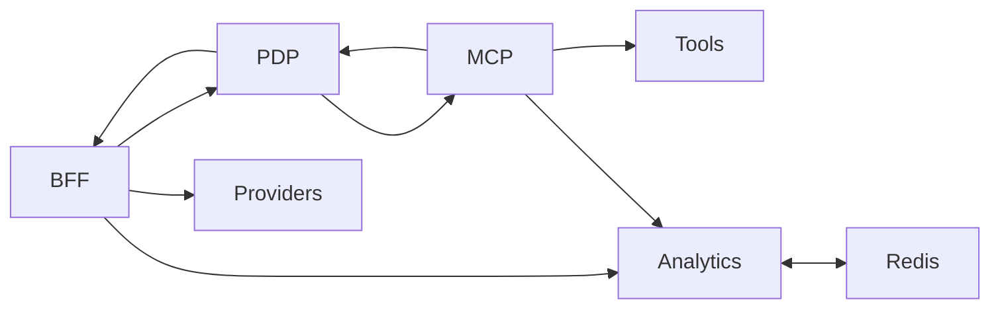

### Goal
Use PDP policies to define daily/monthly budgets and have PDP check current spend (hot in Redis via Analytics) to allow/deny.

### Minimal design (safe, incremental)

- Policy authoring (PDP)
  - Add a typed constraint to policies:
    - Bucket key: constraints.spend_budget
    - Fields:
      - scope: "tenant" | "project" | "user"
      - period: "daily" | "monthly"
      - limit_usd: number
      - subject_selector? (optional) to override subject used for the budget (e.g., tenant vs user)
  - Example YAML:
    ```yaml
    rules:
      - effect: permit
        resource: "llm:*"
        action: "invoke"
        on_permit:
          constraints:
            spend_budget:
              scope: "user"
              period: "monthly"
              limit_usd: 25.0
    ```
  - Merge rule: if multiple policies apply, take the most restrictive (minimum limit_usd per period/scope).

- PDP evaluation flow
  - Inputs from PEP (BFF/MCP) in request.context:
    - tenant_id (for attribution; derive from PDP/peps if known)
    - budget_scope (optional; else use constraints.spend_budget.scope)
    - budget_period (optional; else use constraints.spend_budget.period)
    - budget_subject_id (optional; else default:
      - scope=tenant → subject_id=None
      - scope=user → subject_id=canonical user ARN
      - scope=project → subject_id=project_id)
    - estimated_cents (PEP-supplied preflight estimate; BFF computes from tokens; MCP computes tool cost)
  - Note: category-scoped budgets require the category to be visible to PDP. If the BFF classifier uses `policy_export.labels_allowlist`, only allowlisted labels are exported as `context.category_*`. Ensure the allowlist includes the categories you intend to budget on. See `ms_bff_spike/docs/bff_ai_prompt_classifier.md`.
  - PDP PIP “BudgetState”:
    - Source of truth: Analytics runtime API
      - GET /api/v1/analytics/budgets/state?tenant_id=...&scope=...&subject_id?=...&period=...
      - Response: { limit_usd?, consumed_usd, remaining_usd }
    - Fallback (optional): direct Redis with keys
      - Limit: analytics:budget:limit:{tenant}:{scope}:{sid_or_“_”}:{period}
      - State: analytics:budget:state:{tenant}:{scope}:{sid_or_“_”}:{period}:{pkey}
  - PDP logic:
    - If no spend_budget constraint → skip (allow other checks to decide).
    - Resolve effective (scope, period, subject_id, tenant_id) from constraint + context.
    - Fetch state (with 250–500ms timeout). Tiny in-memory TTL cache (≤2s) keyed by tenant/scope/subject/period.
    - If limit_usd is null/absent → treat as unlimited (allow).
    - If remaining_usd ≤ 0 → decision=false (deny: budget_exhausted).
    - If estimated_cents present and estimated_cents/100.0 > remaining_usd → decision=false (deny: budget_insufficient_for_request).
    - Otherwise decision=true and return constraints.spend_snapshot:
      - { scope, period, limit_cents, consumed_cents, remaining_cents, decision_basis: “pdp_budget_check_v1” }
  - Category pending semantics:
    - If `context.policy_snapshot.category_pending == true`, PDP SHOULD skip category‑scoped pools (treat category as absent) or evaluate against an `uncategorized` pool when explicitly configured. Overall/provider/model pools still apply.
    - If `context.category` is present (inline), include category pool in evaluation as usual (most‑restrictive wins).
  - Failure policy:
    - prod: fail-closed if Analytics is unavailable (deny with reason “budget_check_unavailable”).
    - dev/test: fail-open (return allow + constraints note).

- PEP (BFF/MCP) changes
  - Include context to PDP:
    - tenant_id
    - estimated_cents (BFF: _ENF.estimate_cents; MCP: tool cost*100)
    - Optional: override budget_scope/period/subject_id if needed
  - Keep existing hold/debit; PDP becomes the early gate. On PDP deny return 402 “budget insufficient” (or 403 “policy denied” with reason) consistently.
  - No change to receipt emission; continue to emit; Analytics will settle spend and update hot state.

- Analytics (no change)
  - Continues to maintain:
    - Limits per (tenant, scope, subject_id, period)
    - Consumed counters by period (daily YYYYMMDD, monthly YYYYMM)
  - PDP reads live via HTTP; no new write paths needed.

- Config and ops
  - PDP env:
    - ANALYTICS_URL (e.g., http://analytics:8090)
    - PDP_BUDGET_MODE: “enforce” | “advisory” | “off” (advisory returns constraints.spend_snapshot but doesn’t deny)
    - PDP_BUDGET_CACHE_TTL_MS=1500
  - Timeouts:
    - Analytics GET timeout ≤ 300ms; overall PIP ≤ 500ms; deny on timeout in enforce mode.

### Request/response examples

- PEP → PDP request (excerpt):
```json
{
  "subject": {"type":"agent","id":"agent:svc-123:for:pairwise-abc"},
  "action": {"name":"invoke"},
  "resource": {"type":"llm:openai:chat","properties":{"model":"gpt-4o-mini"}},
  "context": {
    "tenant_id": "acme",
    "estimated_cents": 180,
    "budget_scope": "user",
    "budget_period": "monthly",
    "budget_subject_id": "auth:account:empowernow:alice"
  }
}
```

- PDP → PEP response (excerpt on allow):
```json
{
  "decision": true,
  "context": {
    "constraints": {
      "spend_snapshot": {
        "scope":"user","period":"monthly",
        "limit_cents": 2500,
        "consumed_cents": 1320,
        "remaining_cents": 1180,
        "decision_basis": "pdp_budget_check_v1"
      }
    },
    "decision_id": "..."
  }
}
```

- Deny case:
```json
{
  "decision": false,
  "context": {
    "reason": "budget_insufficient_for_request",
    "constraints": {
      "spend_snapshot": { "remaining_cents": 90, "limit_cents": 1000, "period":"daily","scope":"user" }
    }
  }
}
```

### Edge cases and semantics

- Multiple spend_budget constraints across policies:
  - Merge by min(limit_usd) per (scope, period). PDP evaluates against the merged result.
- Missing tenant_id:
  - Derive from PDP policy data_scope or from PEP (headers/jwt) if present. If unknown, use “default”.
- Daily vs monthly:
  - PDP picks the constraint’s period. If both daily and monthly constraints apply, evaluate both; deny if any remaining is insufficient (most-restrictive).
- Consistency:
  - PDP check is a pre-gate; final spend is enforced by PEP hold/debit and will be reflected in receipts/Analytics. Tiny race is acceptable for minimal step.

### Implementation map (small, surgical)

- PDP:
  - Add constraints catalog for spend_budget.{scope,period,limit_usd}.
  - Add BudgetState PIP (HTTP client to Analytics); 2s in-memory cache.
  - Extend evaluator:
    - After constraints merge, if spend_budget present, call PIP and possibly flip decision=false; include spend_snapshot in context.
  - Config switches (mode, timeouts, analytics URL).
- PEP:
  - Pass estimated_cents + tenant_id; optional budget_* hints; normalize deny to 402 on budget.

This provides policy-defined daily/monthly budgets with PDP-controlled allow/deny using the live spend state, without replacing current PEP budget holds. It’s minimal, reversible, and keeps Analytics as the single source of budget truth.

---

### Implementation status (shipped)

- PDP
  - `spend_budget` constraint validated in constraints catalog; most-restrictive merge implemented.
  - `BudgetState` PIP queries Analytics with a short in-memory TTL cache; evaluates overall/provider/model/category pools and returns `spend_snapshot`.
  - Deny reasons normalized (e.g., `budget_insufficient_for_request`), surfaced to PEPs.
- PEPs (BFF & MCP)
  - Pass `tenant_id`, `estimated_cents`, derived `provider`/`model`, and optional `category` (inline via header/body or lazy).
  - Map PDP budget denials to HTTP 402; include `spend_snapshot` in responses and category fields in receipts.
- Analytics
  - Maintains per-user and per-user+category counters; exposes `budgets/state`, `budgets/state/bulk`, `budgets/limits`, and receipts endpoints.
  - Subject namespacing pattern supports category/provider/model pools without API churn (Option A).
- Tests
  - PDP evaluation tests, BFF endpoint tests for 402 budget denials (BFF-only), Analytics unit tests for category counters.

### PEP context mapping (reference)

```
context = {
  "tenant_id": "<tenant>",
  "estimated_cents": <int>,
  "provider": "openai" | "anthropic" | ...,
  "model": "gpt-4o-mini" | ...,
  "category": "dev" | "entertainment" | ...,
  "x-category-mode": "inline" | "lazy"
}
```

---

## AI Spend at a glance (Mermaid)



### Extension: Provider/Model/Category budgets (v1.x)

Goal: allow separate spend pools (limits) per provider, model, or prompt “category” (e.g., entertainment vs development), enforced by PDP using live Analytics state.

#### Policy schema (PDP)

- Extend `constraints.spend_budget` with optional selectors:
  - `category: string` (e.g., "dev", "entertainment")
  - `provider: string` (e.g., "openai", "anthropic")
  - `model: string` (e.g., "gpt-4o-mini")
- Examples:
  ```yaml
  rules:
    - effect: permit
      resource: "llm:*"
      action: "invoke"
      on_permit:
        constraints:
          # Overall monthly user budget
          spend_budget: { scope: "user", period: "monthly", limit_usd: 50.0 }

    - effect: permit
      resource: "llm:openai:*"
      action: "invoke"
      on_permit:
        constraints:
          # Provider-specific tighter cap
          spend_budget: { scope: "user", period: "monthly", limit_usd: 20.0, provider: "openai" }

    - effect: permit
      resource: "llm:openai:chat"
      action: "invoke"
      on_permit:
        constraints:
          # Model/category specific (most-restrictive wins at eval)
          spend_budget: { scope: "user", period: "monthly", limit_usd: 10.0, model: "gpt-4o-mini" }
          spend_budget: { scope: "user", period: "monthly", limit_usd: 8.0, category: "entertainment" }
  ```

- Merge rule remains “most-restrictive” per distinct selector. PDP evaluates all applicable budgets and denies if any remaining is insufficient.

#### Categorization

- PEP provides `context.category` when available.
  - MVP sources:
    - UI header `X-Prompt-Category: dev|entertainment|...` (trusted internal apps)
    - Static mapping by route or tenant policy.
  - Future: Prompt Journal + classifier updates category asynchronously and can flow into subsequent calls via session.
  - Fallback: `category = "uncategorized"` (optional pool) or simply omit to only enforce overall/model/provider limits.

#### PEP → PDP context (additions)

- Existing: `tenant_id`, `estimated_cents`.
- New (optional): `category`, `provider`, `model`.
  - BFF derives provider/model from its provider registry/config and request payload.
  - MCP derives provider/tool → `provider = tool_vendor`, `model = tool_id` (or omit model for tools).

#### PDP PIP BudgetState changes

- PDP evaluates budgets in parallel for each applicable selector:
  1) Overall pool: (scope, subject, period)
  2) Provider pool (if `provider` present)
  3) Model pool (if `model` present)
  4) Category pool (if `category` present)

- Deny if any pool has `remaining_usd <= 0` or `remaining_usd < estimated_cents/100.0`.
- Return a consolidated `spend_snapshot` with per-pool snapshots for observability:
  ```json
  {
    "spend_snapshot": {
      "overall": {"scope":"user","period":"monthly","remaining_cents": 1180},
      "provider": {"name":"openai","remaining_cents": 900},
      "model": {"name":"gpt-4o-mini","remaining_cents": 400},
      "category": {"name":"dev","remaining_cents": 800},
      "decision_basis": "pdp_budget_check_v1_multi"
    }
  }
  ```

#### Analytics keying (minimal, non-breaking)

- Option A (MVP – no API changes): namespace `subject_id` to encode category/provider/model for additional pools:
  - `subject_id = "<canonical>|cat:<category>"`
  - `subject_id = "<canonical>|prov:<provider>"`
  - `subject_id = "<canonical>|model:<model>"`
  - Reuse existing `PUT /budgets/limit` and `GET /budgets/state` with these derived `subject_id`s.

- Option B (follow-up): first-class scopes
  - Add scopes `user_category`, `user_provider`, `user_model` (and tenant variants) to Analytics APIs and Redis keys.

MVP recommendation: Option A to avoid API/schema churn; add a thin helper in PDP PIP to build namespaced `subject_id` variants.

#### Receipts and attribution

- Continue to emit receipts unchanged; include hints in `policy_snapshot` for `provider`, `model`, `category` when present so Analytics can attribute cost to category pools post-hoc (when mirroring to CH).

#### Observability

- PDP metrics:
  - `pdp_budget_checks_total{pool=overall|provider|model|category, outcome}`
  - `pdp_budget_denies_total{reason}`
- PEP metrics (BFF/MCP):
  - `llm_budget_denied_total{reason}` (BFF); MCP does not emit budget-denied metrics

#### Rollout & compatibility

- Phase 1 (MVP): overall pool only (already designed).
- Phase 2: enable category/provider/model with Option A namespacing; add policy constraints and PEP context fields.
- Phase 3: promote to Option B first-class scopes if needed.

#### Security & performance

- PDP PIP calls remain bounded (≤ 4 HTTP GETs per decision) with 2s in-memory cache and ≤ 500ms budget.
- Fail-closed in `enforce` mode; `advisory` returns snapshots without deny.
- Category label is treated as policy/PEP-supplied metadata; do not derive from raw content on PDP.

---

### Developer TODO (implementation)

1) PDP – DSL & merge
   - Add `spend_budget.{scope, period, limit_usd, provider?, model?, category?}` to constraints catalog.
   - Extend merge: group by (scope, period, provider?, model?, category?) and pick min(limit_usd).

2) PDP – PIP BudgetState
   - Implement helper to fetch Analytics state for multiple pools in parallel; 2s TTL cache; 300ms per-call timeout.
   - Build namespaced `subject_id` for Option A pools.
   - Compose `spend_snapshot` response structure and deny logic.

3) PEP (BFF)
   - Include `tenant_id`, `estimated_cents`, `provider`, `model`, and optional `category` in PDP context.
   - Enforce PDP deny → 402 budget insufficient; keep current hold/settle.
   - (Separate task) Enforce per-call `spend.*` caps/consent if present in constraints (parity with MCP).

4) PEP (MCP Gateway)
   - Pass `provider` (tool vendor), `model` (tool id or omit), and optional `category` to PDP.
   - Keep existing idempotent debit and per-call caps/consent enforcement.

5) Analytics – admin/ops
   - Document Option A namespacing patterns for budgets.
   - Add helper scripts/CLI to set limits for category/provider/model pools using namespaced `subject_id`s.

6) Receipts
   - Add optional `policy_tags` to receipt payload: `{ provider, model, category }` from PDP constraints/context for attribution (no behavior change).

7) Tests
   - PDP unit: merge behavior and multi-pool evaluation.
   - PDP integration: deny on insufficient category pool while overall pool remains.
   - BFF/MCP integration: context propagation and consistent 402 mapping.

8) Docs & runbooks
   - Update policy authoring guide with provider/model/category examples.
   - Add budgets cookbook (overall vs category/provider/model) and Option A/B guidance.
