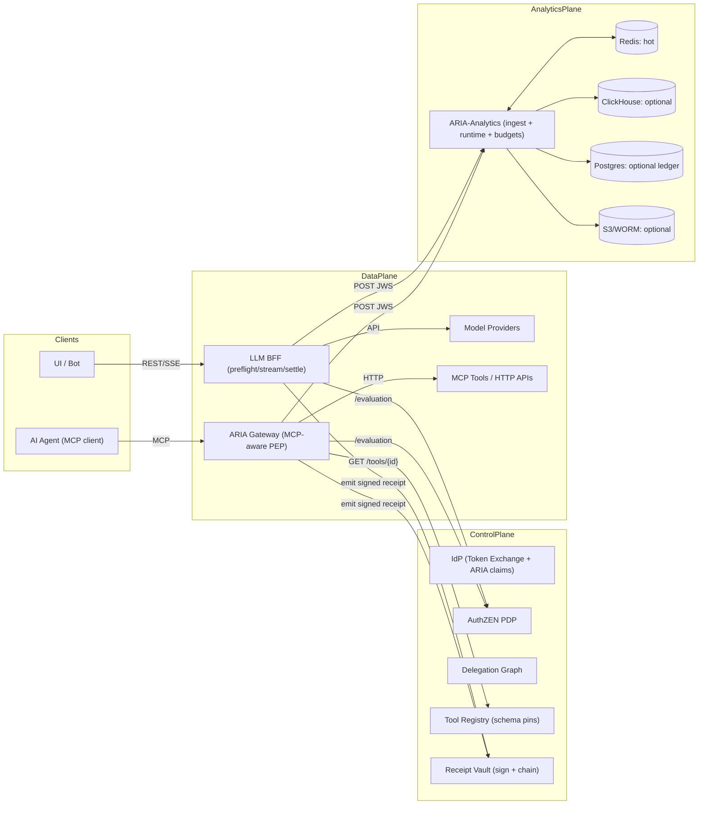

Perfect — here’s a **drop‑in, receipt‑centric replacement** for your previous **ARIA‑Analytics** design, aligned with the new **ARIA v1** system (IdP + PDP + Membership + ARIA Gateway + BFF + Tool Registry + Receipt Vault). It keeps your producer API shape (batch ingest), but **shifts the system of record to signed receipts** and adds a lean, fully runnable core (FastAPI + httpx + Redis), with optional hooks for ClickHouse/Postgres you can turn on later.

---

## 0) What changed (quick scan)

* **Receipts become the ground truth.** BFF and ARIA Gateway already emit **JWS receipts** (via Receipt Vault). Analytics ingests and verifies those receipts, tracks hash‑chains per agent, and derives usage/spend from the receipt body.
* **Budgets:** keep **passport budgets** enforced in Gateway/BFF (Redis). Analytics provides **tenant/project/user budgets** (optional) for spend governance + dashboards; exposes a runtime “hot state” for stream‑time tripwires if you want them.
* **Membership-aware context:** parse `policy_snapshot.data_scope` to associate events with tenants/projects (no PII).
* **Identity‑chaining ready:** store lineage digests for any future OAuth chaining receipts (when you turn that flag on).

Everything else (event envelopes, producer contracts, pricing catalog, exports) stays familiar, but now rides on top of receipts.

---

## 1) Big picture (ARIA v1 + Analytics)



**Why receipts:** you already sign a minimal, tamper‑evident fact per action (policy snapshot, hashes, usage). Analytics simply **verifies, enriches, and derives cost/budgets** — fewer moving parts and easier for audit.

---

## 2) Data contracts (wire + derived)

### 2.1 Receipt batch ingest

```json
POST /api/v1/analytics/receipts:batch
{
  "jwss": ["<JWS string 1>", "<JWS string 2>", "..."],
  "source": "aria|bff"   // optional producer hint
}
```

Each receipt body matches your v1 shape (tool/model resource, policy snapshot, params hash, usage, prev\_hash). Analytics verifies **RS256** with Receipt Vault’s public key.

### 2.2 Event envelope (kept, for non‑receipt signals)

If you still emit “classic” events (content filter, PDP decision), keep using the existing **`/v1/events:batch`** with the same envelope (lightly updated to add `policy_version`/`constraints_schema` parity).

### 2.3 Derived facts (Analytics internal)

* `usage_fact`: `{ tenant_id, aria_request_id|call_id, agent_id, resource.type, resource.id, input_tokens?, output_tokens?, cost_usd, occurred_at }`
* `chain_state`: `{ agent_id, last_hash }` (for hash‑chain continuity)
* `budget_state`: `{ scope, subject_id, period, consumed_micros }` in Redis (optional PG mirror)

---

## 3) Service layout (repo)

```
repo/
├─ analytics/
│  ├─ main.py                    # FastAPI app: receipt ingest, events ingest, budgets/runtime
│  ├─ receipt_verifier.py        # JWS verify + chain check
│  ├─ pricing.py                 # simple token pricing engine (pluggable)
│  ├─ runtime.py                 # Redis state: hot counters, budgets, chain head
│  ├─ clients/
│  │  └─ tool_registry_client.py # optional: cost_per_call lookup for tools
│  └─ requirements.txt
└─ docker-compose.yml            # +analytics service (see bottom)
```

> The code below **runs as‑is** with Redis only. ClickHouse/Postgres/S3 are optional (left as “bolt‑on” with TODOs).

---

## 4) Code — Analytics (runnable core)

### 4.1 `analytics/requirements.txt`

```
fastapi==0.110.*
uvicorn[standard]==0.30.*
pyjwt==2.8.*
httpx==0.27.*
redis==5.0.*
python-ulid==2.7.*
orjson==3.10.*
```

### 4.2 `analytics/receipt_verifier.py`

```python
# analytics/receipt_verifier.py
import jwt, hashlib, time
from typing import Tuple, Dict, Any

class ReceiptVerifier:
    def __init__(self, public_key_pem: str):
        self._pub = public_key_pem

    def decode_verify(self, jws: str) -> Dict[str, Any]:
        """
        Verify RS256 JWS signed by Receipt Vault and return payload dict.
        """
        return jwt.decode(jws, self._pub, algorithms=["RS256"])

    @staticmethod
    def jws_hash(jws: str) -> str:
        return hashlib.sha256(jws.encode("utf-8")).hexdigest()
```

### 4.3 `analytics/pricing.py`

```python
# analytics/pricing.py
from decimal import Decimal
from typing import Optional

DEFAULT_PRICES = {
    # illustrative, replace with catalog or env
    ("openai", "gpt-4o-mini"): {"in_per_1k_usd": "0.0005", "out_per_1k_usd": "0.0015"},
    ("openai", "gpt-4.1"):     {"in_per_1k_usd": "0.0030", "out_per_1k_usd": "0.0060"},
}

class Pricing:
    def __init__(self, prices: dict | None = None):
        self._p = prices or DEFAULT_PRICES

    def quote_tokens_usd(self, vendor: str, model: str,
                         in_tokens: int, out_tokens: int) -> float:
        p = self._p.get((vendor, model))
        if not p:
            return 0.0
        pin = Decimal(p["in_per_1k_usd"]); pout = Decimal(p["out_per_1k_usd"])
        usd = (pin * Decimal(in_tokens) + pout * Decimal(out_tokens)) / Decimal(1000)
        return float(usd.quantize(Decimal("0.000001")))
```

### 4.4 `analytics/runtime.py`

```python
# analytics/runtime.py
import json, time
from typing import Optional
from redis.asyncio import Redis

class RuntimeState:
    def __init__(self, r: Redis):
        self.r = r

    # -------- chain heads (per agent)
    async def get_chain_head(self, agent_id: str) -> str:
        return (await self.r.get(f"analytics:chain:last:{agent_id}") or b"0"*64).decode()

    async def set_chain_head(self, agent_id: str, new_hash: str):
        await self.r.set(f"analytics:chain:last:{agent_id}", new_hash, ex=7*86400)

    # -------- usage / spend (hot counters, per tenant daily)
    async def add_usage_usd(self, tenant_id: str, usd: float, ts: int):
        day = time.strftime("%Y%m%d", time.gmtime(ts))
        key = f"analytics:usage:tenant:{tenant_id}:day:{day}"
        await self.r.incrbyfloat(key, usd)
        await self.r.expire(key, 40*3600)

    async def add_request_cost_usd(self, call_id: str, usd: float):
        await self.r.setex(f"analytics:req:{call_id}:cost_usd", 6*3600, usd)

    async def get_tenant_daily_usd(self, tenant_id: str) -> float:
        day = time.strftime("%Y%m%d", time.gmtime())
        val = await self.r.get(f"analytics:usage:tenant:{tenant_id}:day:{day}")
        return float(val or 0.0)

    # -------- budgets (optional governance, independent from passport budgets)
    async def set_budget_limit(self, tenant_id: str, scope: str, subject_id: str | None,
                               period: str, limit_usd: float):
        sid = subject_id or "_"
        await self.r.set(f"analytics:budget:limit:{tenant_id}:{scope}:{sid}:{period}",
                         json.dumps({"limit_usd": limit_usd}), ex=365*86400)

    async def get_budget_limit(self, tenant_id: str, scope: str, subject_id: str | None,
                               period: str) -> dict | None:
        sid = subject_id or "_"
        raw = await self.r.get(f"analytics:budget:limit:{tenant_id}:{scope}:{sid}:{period}")
        return json.loads(raw) if raw else None

    async def add_budget_spend(self, tenant_id: str, scope: str, subject_id: str | None,
                               period: str, usd: float, ts: int):
        sid = subject_id or "_"
        if period == "daily":
            p = time.strftime("%Y%m%d", time.gmtime(ts))
        elif period == "monthly":
            p = time.strftime("%Y%m", time.gmtime(ts))
        else:
            p = "alltime"
        key = f"analytics:budget:state:{tenant_id}:{scope}:{sid}:{period}:{p}"
        await self.r.incrbyfloat(key, usd)
        await self.r.expire(key, 90*86400)

    async def get_budget_state(self, tenant_id: str, scope: str, subject_id: str | None,
                               period: str) -> dict:
        sid = subject_id or "_"
        if period == "daily":
            p = time.strftime("%Y%m%d", time.gmtime())
        elif period == "monthly":
            p = time.strftime("%Y%m", time.gmtime())
        else:
            p = "alltime"
        key = f"analytics:budget:state:{tenant_id}:{scope}:{sid}:{period}:{p}"
        consumed = float(await self.r.get(key) or 0.0)
        limit = await self.get_budget_limit(tenant_id, scope, subject_id, period)
        limit_usd = (limit or {}).get("limit_usd", None)
        remaining = (None if limit_usd is None else max(limit_usd - consumed, 0.0))
        return {"period_key": p, "consumed_usd": consumed, "limit_usd": limit_usd, "remaining_usd": remaining}
```

### 4.5 `analytics/clients/tool_registry_client.py` (optional tool pricing)

```python
# analytics/clients/tool_registry_client.py
import httpx

class ToolRegistryClient:
    def __init__(self, base_url: str, timeout: float = 1.5):
        self.base = base_url.rstrip("/")
        self.http = httpx.AsyncClient(timeout=timeout)

    async def get_tool(self, tool_id: str) -> dict:
        r = await self.http.get(f"{self.base}/tools/{tool_id}")
        r.raise_for_status()
        return r.json()
```

### 4.6 `analytics/main.py`

```python
# analytics/main.py
from fastapi import FastAPI, HTTPException, Header
from pydantic import BaseModel
from typing import List, Optional, Dict, Any
from datetime import datetime, timezone
import os, time, ulid, httpx, orjson
from redis.asyncio import from_url as redis_from_url

from receipt_verifier import ReceiptVerifier
from pricing import Pricing
from runtime import RuntimeState
from clients.tool_registry_client import ToolRegistryClient

app = FastAPI(title="ARIA-Analytics (receipt-centric v1)")

# --- Env
REDIS_URL = os.getenv("REDIS_URL", "redis://redis:6379/0")
RECEIPT_PUBLIC_KEY_PEM = os.getenv("RECEIPT_PUBLIC_KEY_PEM")  # required
TOOL_REGISTRY_URL = os.getenv("REGISTRY_URL", "http://tool-registry:8081")

if not RECEIPT_PUBLIC_KEY_PEM:
    raise RuntimeError("RECEIPT_PUBLIC_KEY_PEM must be set for receipt verification.")

# --- Globals
rv = ReceiptVerifier(RECEIPT_PUBLIC_KEY_PEM)
pricing = Pricing()
registry = ToolRegistryClient(TOOL_REGISTRY_URL)

@app.on_event("startup")
async def startup():
    app.state.redis = await redis_from_url(REDIS_URL)
    app.state.rt = RuntimeState(app.state.redis)

# --- Models
class ReceiptBatch(BaseModel):
    jwss: List[str]
    source: Optional[str] = None  # "aria" | "bff" (hint only)

class EventsBatch(BaseModel):
    events: List[dict]  # legacy/non-receipt signals (content filter, PDP)

def _now_iso() -> str:
    return datetime.now(timezone.utc).isoformat()

def _first_tenant_from_policy(policy_snapshot: dict | None) -> Optional[str]:
    if not policy_snapshot: return None
    ds = policy_snapshot.get("data_scope") if isinstance(policy_snapshot, dict) else None
    tids = (ds or {}).get("tenant_ids") if isinstance(ds, dict) else None
    if tids and isinstance(tids, list) and len(tids) > 0:
        return str(tids[0])
    return None

async def _derive_cost_usd_from_receipt(payload: Dict[str, Any]) -> float:
    """
    Priority:
      1) If receipt contains 'usage.cost_usd' -> trust it.
      2) If resource is 'model' and tokens available -> price via catalog.
      3) If resource is 'tool' and registry has cost_per_call -> use it.
      4) else -> 0.0
    """
    usage = payload.get("usage") or {}
    if "cost_usd" in usage and usage["cost_usd"] is not None:
        return float(usage["cost_usd"])

    res = payload.get("resource") or {}
    rtype, rid = res.get("type"), res.get("id")
    if rtype == "model":
        meta = payload.get("policy_snapshot") or {}
        # allow provider hints via policy if you add them; else set sensible defaults
        vendor = (meta.get("provider") or "openai").lower()
        model = rid or "gpt-4o-mini"
        it = int(usage.get("input_tokens") or 0)
        ot = int(usage.get("output_tokens") or 0)
        return await _price_model(vendor, model, it, ot)

    if rtype == "tool" and rid:
        try:
            tmeta = await registry.get_tool(rid)
            cpc = float(tmeta.get("cost_per_call") or 0.0)
            return cpc
        except Exception:
            return 0.0

    return 0.0

async def _price_model(vendor: str, model: str, in_tok: int, out_tok: int) -> float:
    return pricing.quote_tokens_usd(vendor, model, in_tok, out_tok)

# --- Ingest: Receipts (primary)
@app.post("/api/v1/analytics/receipts:batch")
async def ingest_receipts(batch: ReceiptBatch, x_idempotency_key: Optional[str] = Header(None)):
    accepted = 0
    results = []
    rt: RuntimeState = app.state.rt

    for jws in batch.jwss:
        try:
            payload = rv.decode_verify(jws)
        except Exception as e:
            # hard fail to protect store
            raise HTTPException(400, f"invalid_receipt: {str(e)}")

        # Required fields
        agent_id = payload.get("agent_id")
        call_id = payload.get("call_id")
        resource = payload.get("resource") or {}
        policy_snapshot = payload.get("policy_snapshot") or {}
        prev_hash = payload.get("prev_hash") or "0"*64

        if not agent_id or not call_id or not resource:
            raise HTTPException(400, "missing core fields in receipt")

        # Chain continuity check (per-agent) — advisory metric; do not reject
        last = await rt.get_chain_head(agent_id)
        chain_ok = (last == prev_hash)
        jws_hash = rv.jws_hash(jws)
        await rt.set_chain_head(agent_id, jws_hash)

        # Derive tenant_id from policy snapshot (data_scope) if present
        tenant_id = _first_tenant_from_policy(policy_snapshot) or "default"

        # Cost derivation (use usage.cost_usd if supplied by producer)
        try:
            cost_usd = await _derive_cost_usd_from_receipt(payload)
        except Exception:
            cost_usd = 0.0

        # Update running hot state
        ts = int(time.time())
        await rt.add_usage_usd(tenant_id, cost_usd, ts)
        await rt.add_request_cost_usd(call_id, cost_usd)

        # Optional governance budgets (per tenant/project/user)
        # Example: track daily spend at tenant scope
        await rt.add_budget_spend(tenant_id, scope="tenant", subject_id=None, period="daily", usd=cost_usd, ts=ts)
        await rt.add_budget_spend(tenant_id, scope="tenant", subject_id=None, period="monthly", usd=cost_usd, ts=ts)

        # (Optional) Push to OLAP/ledger (ClickHouse/Postgres) — add here.

        accepted += 1
        results.append({"call_id": call_id, "agent_id": agent_id, "chain_ok": chain_ok, "cost_usd": cost_usd})

    return {"accepted": accepted, "results": results, "received_at": _now_iso()}

# --- Ingest: legacy/non-receipt events (kept for PDP/content filter logs)
@app.post("/api/v1/analytics/events:batch")
async def ingest_events(batch: EventsBatch, x_idempotency_key: Optional[str] = Header(None)):
    # Minimal stub: you can sink to ClickHouse here. We only ack for now.
    # Sanitization tip: never store token bodies; scrub known keys at producers.
    return {"accepted": len(batch.events), "received_at": _now_iso()}

# --- Runtime APIs for BFF/Gateway tripwires and dashboards

class BudgetSetBody(BaseModel):
    tenant_id: str
    scope: str            # 'tenant' | 'project' | 'user'
    subject_id: Optional[str] = None
    period: str           # 'daily' | 'monthly'
    limit_usd: float

@app.put("/api/v1/analytics/budgets/limit")
async def set_budget_limit(body: BudgetSetBody):
    await app.state.rt.set_budget_limit(body.tenant_id, body.scope, body.subject_id, body.period, body.limit_usd)
    return {"ok": True}

@app.get("/api/v1/analytics/budgets/state")
async def get_budget_state(tenant_id: str, scope: str, subject_id: Optional[str] = None, period: str = "monthly"):
    state = await app.state.rt.get_budget_state(tenant_id, scope, subject_id, period)
    return state

@app.get("/api/v1/analytics/runtime/hot")
async def runtime_hot(tenant_id: str):
    usd = await app.state.rt.get_tenant_daily_usd(tenant_id)
    return {"tenant_id": tenant_id, "daily_spend_usd": usd, "ts": _now_iso()}
```

---

## 5) Producer wiring (one‑liners)

**ARIA Gateway/BFF** — right after you call `Receipt Vault` and get `{ jws, hash }`:

```python
# after receipt emission in ARIA or BFF
try:
    await httpx.AsyncClient(timeout=1.5).post(
        f"{os.getenv('ANALYTICS_URL','http://analytics:8090')}/api/v1/analytics/receipts:batch",
        json={"jwss": [rec_json["jws"]], "source": "aria"}  # or "bff"
    )
except Exception:
    # non-blocking: analytics failure must not break request path
    pass
```

No schema change to your existing receipt payloads is needed.

---

## 6) Docker Compose (add the service)

Append this to your existing `docker-compose.yml`:

```yaml
  analytics:
    build: ./analytics
    ports: ["8090:8090"]
    environment:
      - REDIS_URL=redis://redis:6379/0
      - REGISTRY_URL=http://tool-registry:8081
      - RECEIPT_PUBLIC_KEY_PEM=${RECEIPT_PUBLIC_KEY_PEM}
    command: uvicorn analytics.main:app --host 0.0.0.0 --port 8090
    depends_on: [redis, tool-registry]
```

> **Keys:** Use the **public** part of your Receipt Vault key for `RECEIPT_PUBLIC_KEY_PEM`.
> **Security:** Keep Analytics internal; protect via network policy/mTLS if exposed.

---

## 7) What Analytics computes (receipt‑first)

* **Integrity:** Validates Receipt JWS; checks **hash‑chain continuity** per agent (`prev_hash` vs last seen hash). Reports `chain_ok` in ingest response and exposes metrics (easy to add).
* **Attribution:** Extracts `tenant_id` from `policy_snapshot.data_scope.tenant_ids[0]`.
* **Spend:** Uses `usage.cost_usd` if present or prices by tokens/model; falls back to tool `cost_per_call` (from Tool Registry) when appropriate.
* **Hot counters:** Keeps daily spend per `tenant_id` and per‑request cost (for stream tripwires or UX).
* **Budgets (optional governance):** Simple **daily/monthly** counters by tenant/project/user scope in Redis, with `PUT /v1/budgets/limit` + `GET /v1/budgets/state`. (This is **in addition to** passport budgets enforced by Gateway/BFF.)

> You can later back your budgets/ledger with **Postgres** and your events with **ClickHouse/S3**; the receipt ingest path stays the same.

---

## 8) Security & privacy

* **No token bodies** are accepted in this path; receipts contain policy snapshots, hashes, and usage — safe by construction.
* **Fail‑closed ingest:** invalid JWS → 400; we don’t store unverifiable data.
* **Row isolation:** derive tenant from constraints snapshot; keep PII out (user ids are absent in receipts).
* **Chain evidence:** last hash stored per agent; you can export chain heads per period for audit.

---

## 9) Observability (ready knobs)

Expose Prometheus counters/gauges in `analytics/main.py` if you want (omitted for brevity):

* `aria_analytics_receipts_total{source,outcome}`
* `aria_analytics_chain_breaks_total`
* `aria_analytics_spend_usd_total{tenant}`
* `aria_analytics_budget_consumed_usd{tenant,period}`

Trace each ingest with OpenTelemetry `traceparent` if you propagate it.

---

## 10) Acceptance tests (what to prove today)

1. **Receipt ingest + chain:** Send two receipts for the same `agent_id` with the second `prev_hash` = first `hash` → `chain_ok=true` twice. Flip `prev_hash` to a wrong value → `chain_ok=false` in response.
2. **Spend derivation:** For a BFF model receipt with `usage.input_tokens=1000` and `output_tokens=500`, verify `daily_spend_usd` increments by the priced amount (or by `usage.cost_usd` if supplied).
3. **Budget state:** `PUT /v1/budgets/limit` a monthly cap, ingest receipts summing above the cap, verify `GET /v1/budgets/state` shows `remaining_usd=0.0`. (Enforcement is still on BFF/Gateway; Analytics just reports.)
4. **Tool call cost:** For a tool receipt, set `cost_per_call` in Tool Registry; ingest the receipt and verify spend increments by that fixed amount.

---

## 11) Optional OLAP/ledger bolt‑ons (unchanged interfaces)

If/when you turn them on:

* **ClickHouse**: mirror each **verified receipt** into an `events` table; materialize `usage_facts` from receipt `usage`.
* **Postgres**: append a **spend\_ledger** row per receipt with cost; maintain **budget\_state** transactional counters for strong governance.
* **S3/WORM**: export daily Parquet of receipts + a manifest with SHA‑256 chain (root hash over file list).

> Your previous DDLs/map apply with “receipt” as the golden record. Keep the same dashboards/queries — only the ingestion path changes.

---

## 12) Why this is a drop‑in

* **Producers don’t change shape**: they already emit a receipt; they now POST that JWS to Analytics (one line).
* **Downstream APIs preserved**: `/v1/events:batch` still exists for PDP/content filter events; `/v1/budgets/state` semantics are compatible with your prior tripwire loop.
* **Less to maintain**: no separate “usage truth” competing with receipts; all spend/audit derives from the signed receipt.

---

### Appendix A — Minimal “producer helper” (BFF/ARIA)

```python
# simple helper you can embed in BFF/ARIA
import httpx, os

async def emit_receipt_to_analytics(jws: str, source: str):
    url = os.getenv("ANALYTICS_URL", "http://analytics:8090")
    try:
        async with httpx.AsyncClient(timeout=1.5) as c:
            await c.post(f"{url}/api/v1/analytics/receipts:batch", json={"jwss": [jws], "source": source})
    except Exception:
        pass  # non-blocking
```

---

### Appendix B — Example receipt body (unchanged)

```json
{
  "id": "e7b3b6f9-8d0a-4b7b-927f-7c2fd149e98e",
  "ts": "2025-08-10T15:43:12.251Z",
  "agent_id": "agent:svc-123:for:9a7b1c2d3e4f5a6b",
  "call_id": "79dfe9b6-5d0e-4b6e-ae9a-d68a1f0c0e0f",
  "resource": {"type":"model","id":"gpt-4o-mini"},
  "decision": "Allow",
  "policy_snapshot": {"tokens":{"max_output":1024},"egress":{"allow":["api.openai.com:443"]},
                      "data_scope":{"tenant_ids":["acme"]}},
  "schema_hash": null,
  "params_hash": null,
  "usage": {"input_tokens": 466, "output_tokens": 927, "cost_usd": 0.0042},
  "reason": null,
  "prev_hash": "0000...0000"
}
```

---

## TL;DR

This replacement makes **Receipts → Analytics** the shortest, cleanest path to **spend, audit, and integrity** in ARIA v1. It’s drop‑in, runs today on **FastAPI + httpx + Redis**, and leaves you a clean runway to plug in **ClickHouse/Postgres/S3** without changing producers or contracts.
