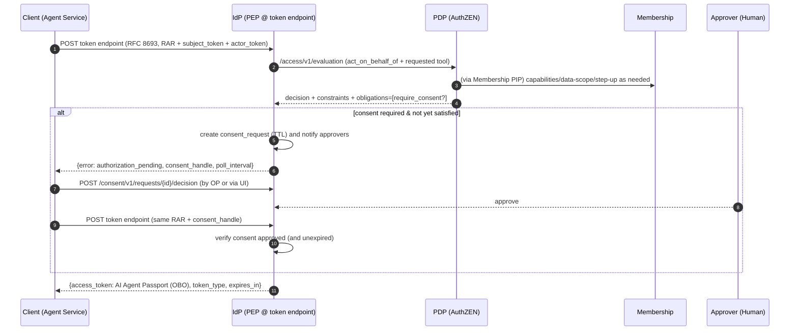
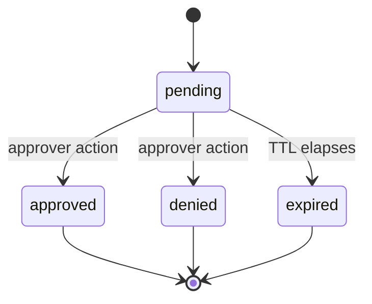

# IdP PDP Obligation Processing

> **Why at the IdP?** In your architecture the IdP is already the “translation layer” that turns RAR + token‑exchange into an **AI Agent Passport** (OBO token). That makes it the **natural PEP** for obligations that must be satisfied **before issuance** (e.g., human consent, step‑up), while still keeping **synchronous constraints** at the PEPs that actually call tools/LLMs. This mirrors the “constraints = synchronous; obligations = async/secondary” split you laid out in the white paper (esp. the diagrams and discussion around **Constraint vs. Obligation Processing**).&#x20;

---

## 1) What this adds (overview)

**New behavior at the IdP token‑exchange endpoint** (OBO + RAR):

1. **Pre‑decision**
   IdP calls **PDP (AuthZEN)** with subject (agent), resource/action (from RAR), and context (amount, geo, etc.).

2. **Constraints**
   If the PDP returns constraints that the IdP can enforce locally (e.g., *per‑issuance budget hold*), the IdP enforces them synchronously or rejects. (Most operational constraints still get enforced downstream at ARIA/BFF per your v1.)

3. **Obligations**
   If the PDP returns an obligation like **`require_consent`**, the IdP acts as a **PEP** for it:

   * If no valid consent exists ⇒ **create a consent request**, notify approvers (stub), and return a **standards‑friendly error** to the client:
     `error=authorization_pending` + a **`consent_handle`** the client can poll (device‑flow‑style), or a **`verification_uri(_complete)`** if the client can launch a browser.
   * If the client retries with an approved handle ⇒ token is issued.
   * If consent denied/expired ⇒ `access_denied`/`expired_token` (with details).

This implements the “**dual enforcement model**” from your paper (fast path for constraints, asynchronous path for obligations) and keeps RAR/OBO fully intact.&#x20;

---

## 2) Key flows (mermaid)

### 2.1 Token‑exchange with JIT consent (happy path)



### 2.2 Consent state machine



---

## 3) Data contracts (wire shapes)

### 3.1 PDP obligation (example shape returned to IdP)

```json
{
  "id": "require_consent",
  "type": "just_in_time_consent",
  "criticality": "high",
  "attributes": {
    "amount_cents": 125000,
    "threshold_cents": 100000,
    "approver_roles": ["delegator","manager"],
    "channels": ["email","slack"],
    "ttl_sec": 600,
    "reason": "One-time flight booking over $1,000"
  }
}
```

> This lines up with the “**Obligation Preparer**” box and obligation processing flows in your white paper (pages with the PEP and obligation diagrams).&#x20;

### 3.2 IdP error when consent is needed (device‑flow‑like)

```json
{
  "error": "authorization_pending",
  "error_description": "Consent required by policy before token issuance.",
  "consent_handle": "cons_01HZYV7N9J2E5JQ5PHX6QK3J7Y",
  "poll_interval": 3,
  "verification_uri": "https://idp.example.com/consent/cons_01HZYV7...",
  "verification_uri_complete": "https://idp.example.com/consent/cons_01HZYV7...?user_code=ABCD-1234"
}
```

### 3.3 Consent record (stored by IdP)

```json
{
  "id": "cons_01HZYV7N9J2E5JQ5PHX6QK3J7Y",
  "state": "pending | approved | denied | expired",
  "ttl_sec": 600,
  "created_at": "2025-08-27T19:12:33Z",
  "updated_at": "2025-08-27T19:12:33Z",
  "user_id": "user:123",
  "agent_id": "agent:svc-123:for:pairwise_abc",
  "rar": { "...": "original authorization_details" },
  "obligation": { "...": "require_consent payload" },
  "approver": null,
  "decision_reason": null
}
```

---

## 4) Policy example (YAML DSL) — thresholds → consent

Below is a minimal rule fragment that implements your “**under X permit; X–Y require consent; >Y deny**” policy. It uses the **obligation** shape above and a numeric comparison on the request context (e.g., `context.attributes.amount_cents`):

```yaml
id: "payments_policy_q3"
version: "1.0"
rules:
  - id: "pay_under_1k"
    action: "payment.create"
    effect: "permit"
    allowIf: "context.attributes.amount_cents <= 100000"

  - id: "pay_1k_to_5k_require_consent"
    action: "payment.create"
    effect: "permit"
    allowIf: >
      context.attributes.amount_cents > 100000 &&
      context.attributes.amount_cents <= 500000
    on_permit:
      obligations:
        - id: require_consent
          type: just_in_time_consent
          attributes:
            threshold_cents: 100000
            amount_cents: "{{ context.attributes.amount_cents }}"
            approver_roles: ["delegator","manager"]
            channels: ["email","slack"]
            ttl_sec: 600
            reason: "Payment over $1k requires consent"

  - id: "deny_over_5k"
    action: "payment.create"
    effect: "deny"
    allowIf: "context.attributes.amount_cents > 500000"
```

---

## 5) Drop‑in code (FastAPI) — IdP PEP + JIT Consent

> **What you get:** a tiny, runnable IdP module that (1) calls a PDP, (2) enforces obligations for consent, and (3) issues your **AI Agent Passport** (OBO) once consent is satisfied.

### 5.1 Layout

```
idp_pep/
├─ app.py               # FastAPI app: /oauth/aria/token + consent endpoints
├─ pdp_client.py        # AuthZEN client
├─ consent.py           # Consent store + helpers (Redis)
├─ jwt_utils.py         # Passport minting + pairwise helpers
└─ requirements.txt
```

### 5.2 `requirements.txt`

```txt
fastapi==0.110.*
uvicorn[standard]==0.30.*
httpx==0.27.*
pyjwt==2.8.*
redis==5.0.*
pydantic==1.10.*
python-ulid==2.7.*
```

### 5.3 `jwt_utils.py`

```python
# idp_pep/jwt_utils.py
import os, time, json, hashlib, jwt
from typing import Dict, Any

ISSUER = os.getenv("ARIA_ISSUER", "https://idp.example.com")
IDP_PRIVATE_KEY = os.getenv("IDP_PRIVATE_KEY_PEM", "")
IDP_KID = os.getenv("IDP_KID", "idp-aria-001")
PAIRWISE_SALT = os.getenv("ARIA_PAIRWISE_SALT", "dev-salt")

def sign_jwt(payload: Dict[str, Any]) -> str:
    if not IDP_PRIVATE_KEY:
        raise RuntimeError("IDP_PRIVATE_KEY_PEM not configured")
    return jwt.encode(payload, IDP_PRIVATE_KEY, algorithm="RS256",
                      headers={"kid": IDP_KID, "alg": "RS256", "typ": "JWT"})

def pairwise(user_id: str, service_id: str) -> str:
    raw = f"pairwise:v1:{user_id}:{service_id}:{PAIRWISE_SALT}".encode()
    return "pairwise:" + hashlib.sha256(raw).hexdigest()[:16]

def mint_agent_passport(*, user_id: str, service_id: str, tools: list[str],
                        schema_pins: Dict[str, Dict[str, str]] | None,
                        budget: Dict[str, Any] | None,
                        plan_jws: str | None,
                        audience: str = "aria.gateway",
                        jkt: str | None = None) -> str:
    now = int(time.time())
    pw = pairwise(user_id, service_id)
    agent_id = f"agent:{service_id}:for:{pw.split(':')[1]}"
    passport = {
        "iss": ISSUER,
        "sub": pw,
        "aud": audience,
        "iat": now,
        "exp": now + 3600,
        "jti": hashlib.sha256(f"{now}:{user_id}:{service_id}".encode()).hexdigest()[:32],
        "act": {"sub": agent_id},
        "authorization_details": [{
            "type": "aria_agent_delegation",
            "tools": tools,
            "locations": []
        }],
        "aria": {
            "bound_sub": pw,
            "tenant": "default",
            "schema_pins": schema_pins or {},
            "call_id": hashlib.sha256(f"{now}:{agent_id}".encode()).hexdigest()[:32],
            "max_steps": 20,
            "plan_contract_jws": plan_jws,
            "budget": budget or {"initial": 100.0, "currency": "USD"}
        }
    }
    if jkt:
        passport["cnf"] = {"jkt": jkt}
    return sign_jwt(passport)
```

### 5.4 `pdp_client.py`

```python
# idp_pep/pdp_client.py
import httpx
from typing import Dict, Any

class PDPClient:
    def __init__(self, base_url: str, timeout: float = 1.5):
        self._c = httpx.AsyncClient(base_url=base_url.rstrip("/"), timeout=timeout)

    async def evaluate(self, subject: Dict[str, Any], action: Dict[str, Any],
                       resource: Dict[str, Any], context: Dict[str, Any]) -> Dict[str, Any]:
        body = {"subject": subject, "action": action, "resource": resource, "context": context}
        r = await self._c.post("/access/v1/evaluation", json=body)
        r.raise_for_status()
        return r.json()
```

### 5.5 `consent.py`

```python
# idp_pep/consent.py
import os, json, time, ulid
from typing import Dict, Any, Optional, Tuple
from redis.asyncio import from_url, Redis

CONSENT_TTL_DEFAULT = int(os.getenv("CONSENT_TTL_SEC", "600"))
PUBLIC_BASE = os.getenv("PUBLIC_BASE_URL", "https://idp.example.com")

class ConsentStore:
    def __init__(self, redis: Redis):
        self.r = redis

    @staticmethod
    def new_id() -> str:
        return f"cons_{ulid.ULID().str}"

    async def create(self, *, user_id: str, agent_id: str, rar: Dict[str, Any],
                     obligation: Dict[str, Any], ttl_sec: int | None = None) -> Dict[str, Any]:
        cid = self.new_id()
        now = int(time.time())
        ttl = ttl_sec or obligation.get("attributes", {}).get("ttl_sec") or CONSENT_TTL_DEFAULT
        rec = {
            "id": cid,
            "state": "pending",
            "ttl_sec": ttl,
            "created_at": now,
            "updated_at": now,
            "user_id": user_id,
            "agent_id": agent_id,
            "rar": rar,
            "obligation": obligation,
            "approver": None,
            "decision_reason": None
        }
        await self.r.setex(f"consent:{cid}", ttl, json.dumps(rec))
        rec["verification_uri"] = f"{PUBLIC_BASE}/consent/{cid}"
        rec["verification_uri_complete"] = rec["verification_uri"]  # add user_code if you generate one
        return rec

    async def get(self, cid: str) -> Optional[Dict[str, Any]]:
        raw = await self.r.get(f"consent:{cid}")
        return json.loads(raw) if raw else None

    async def decide(self, cid: str, *, approved: bool, approver: str, reason: str | None = None) -> Optional[Dict[str, Any]]:
        key = f"consent:{cid}"
        raw = await self.r.get(key)
        if not raw:
            return None
        rec = json.loads(raw)
        rec["state"] = "approved" if approved else "denied"
        rec["updated_at"] = int(time.time())
        rec["approver"] = approver
        rec["decision_reason"] = reason
        ttl = await self.r.ttl(key)
        if ttl and ttl > 0:
            await self.r.setex(key, ttl, json.dumps(rec))
        else:
            await self.r.set(key, json.dumps(rec))  # no TTL
        return rec
```

### 5.6 `app.py` (token exchange + consent endpoints)

```python
# idp_pep/app.py
from fastapi import FastAPI, HTTPException, Request, Body
from pydantic import BaseModel
from typing import Dict, Any, Optional, List
import os, json, httpx
from redis.asyncio import from_url as redis_from_url

from pdp_client import PDPClient
from consent import ConsentStore
from jwt_utils import mint_agent_passport

PDP_URL = os.getenv("PDP_URL", "http://pdp:8000")
ARIA_AUDIENCE = os.getenv("ARIA_AUDIENCE", "aria.gateway")
REDIS_URL = os.getenv("REDIS_URL", "redis://redis:6379/0")

app = FastAPI(title="IdP PEP – Token Exchange + JIT Consent")

@app.on_event("startup")
async def startup():
    app.state.redis = await redis_from_url(REDIS_URL)
    app.state.pdp = PDPClient(PDP_URL)
    app.state.consents = ConsentStore(app.state.redis)
    app.state.http = httpx.AsyncClient(timeout=2.0)

# ------------ Models ------------
class AuthorizationDetails(BaseModel):
    type: str
    tools: List[str] = []
    locations: List[str] = []
    schema_pins: Dict[str, Dict[str, str]] = {}
    budget: Dict[str, Any] = {}
    plan: Optional[Dict[str, Any]] = None
    # optional domain context for PDP decisions (amount, geo, etc.)
    context: Dict[str, Any] = {}

class TokenExchangeRequest(BaseModel):
    grant_type: str = "urn:ietf:params:oauth:grant-type:token-exchange"
    subject_token: str
    subject_token_type: str = "urn:ietf:params:oauth:token-type:access_token"
    actor_token: str
    actor_token_type: str = "urn:ietf:params:oauth:token-type:access_token"
    audience: str = ARIA_AUDIENCE
    authorization_details: Optional[List[AuthorizationDetails]] = None
    request_uri: Optional[str] = None
    consent_handle: Optional[str] = None
    tenant: str = "default"

# ------------ Stubs for your infra ------------
async def introspect_or_decode(token: str) -> Dict[str, Any]:
    # TODO replace with your IdP’s introspection/validation
    try:
        import jwt
        return jwt.decode(token, options={"verify_signature": False})
    except Exception:
        return {"sub": "user:123", "client_id": "svc-123"}

async def membership_check(user_id: str, agent_id: str) -> Dict[str, Any]:
    # TODO call Membership later; return budget, max_steps, status
    return {"status": "active", "budget": 100.0, "max_steps": 20}

# ------------ Helpers ------------
def pick_first_rar(rars: Optional[List[AuthorizationDetails]]) -> AuthorizationDetails | None:
    if not rars:
        return None
    for ad in rars:
        if ad.type in ("aria_agent_delegation", "urn:aria:params:oauth:authorization-details:ai:agent"):
            return ad
    return rars[0]

def extract_consent_obligation(obligations: List[Dict[str, Any]]) -> Dict[str, Any] | None:
    for ob in obligations or []:
        if ob.get("id") == "require_consent" or ob.get("type") == "just_in_time_consent":
            return ob
    return None

# ------------ OAuth Token Exchange with PEP obligations ------------
@app.post("/oauth/aria/token")
async def aria_token_exchange(req: TokenExchangeRequest, request: Request):
    if req.grant_type != "urn:ietf:params:oauth:grant-type:token-exchange":
        raise HTTPException(400, "unsupported_grant_type")

    # decode inbound tokens (user + service)
    sub_claims = await introspect_or_decode(req.subject_token)
    act_claims = await introspect_or_decode(req.actor_token)
    user_id = sub_claims.get("sub") or "user:unknown"
    service_id = act_claims.get("client_id") or "svc-unknown"

    rar = pick_first_rar(req.authorization_details)
    if not rar:
        raise HTTPException(400, "authorization_details_required")

    # Check membership/delegation
    agent_id = f"agent:{service_id}:for:pairwise"
    deleg = await membership_check(user_id, agent_id)
    if deleg.get("status") != "active":
        raise HTTPException(403, "consent_required")  # or more specific

    # 1) Ask PDP for decision (AuthZEN)
    subject = {"type": "agent", "id": agent_id, "properties": {"bound_user": user_id}}
    action  = {"name": "execute"}
    resource= {"type": "tool", "id": rar.tools[0] if rar.tools else "unknown"}
    context = {"capability": resource["id"], "attributes": rar.context}

    pdp_out = await app.state.pdp.evaluate(subject, action, resource, context)
    if not pdp_out.get("decision"):
        # PDP deny
        return {"error": "access_denied", "error_description": "PDP denied."}

    ctx = (pdp_out.get("context") or {})
    obligations = ctx.get("obligations") or []
    consent_ob = extract_consent_obligation(obligations)

    # 2) Handle consent obligation at the IdP (PEP)
    if consent_ob:
        # If client presents a consent_handle, check it
        if req.consent_handle:
            rec = await app.state.consents.get(req.consent_handle)
            if not rec:
                return {"error": "invalid_request", "error_description": "Unknown consent_handle"}
            if rec["state"] == "approved":
                # ok to continue (fall through to mint token)
                pass
            elif rec["state"] == "denied":
                return {"error": "access_denied", "error_description": "Consent denied by approver."}
            else:
                return {
                    "error": "authorization_pending",
                    "error_description": "Consent still pending",
                    "consent_handle": rec["id"],
                    "poll_interval": 3
                }
        else:
            # Create consent request and return pending
            consent = await app.state.consents.create(
                user_id=user_id, agent_id=agent_id, rar=json.loads(rar.json()), obligation=consent_ob
            )
            # TODO: send notifications (email/slack) based on consent_ob["attributes"]["channels"]
            return {
                "error": "authorization_pending",
                "error_description": "Consent required by policy before token issuance.",
                "consent_handle": consent["id"],
                "poll_interval": 3,
                "verification_uri": consent["verification_uri"],
                "verification_uri_complete": consent["verification_uri_complete"]
            }

    # 3) If we got here: constraints passed and obligations satisfied ⇒ mint OBO “AI Agent Passport”
    token = mint_agent_passport(
        user_id=user_id,
        service_id=service_id,
        tools=rar.tools,
        schema_pins=rar.schema_pins,
        budget={"initial": deleg.get("budget", 10.0), "currency": "USD"},
        plan_jws=None,
        audience=req.audience
    )
    return {"access_token": token, "token_type": "Bearer", "expires_in": 3600}

# ------------ Approver API (your UI/BPM can call these) ------------
class ConsentDecision(BaseModel):
    approved: bool
    approver: str
    reason: Optional[str] = None

@app.get("/consent/v1/requests/{cid}")
async def get_consent(cid: str):
    rec = await app.state.consents.get(cid)
    if not rec:
        raise HTTPException(404, "not_found")
    return rec

@app.post("/consent/v1/requests/{cid}/decision")
async def decide_consent(cid: str, body: ConsentDecision):
    rec = await app.state.consents.decide(cid, approved=body.approved, approver=body.approver, reason=body.reason)
    if not rec:
        raise HTTPException(404, "not_found")
    return rec
```

> **Run:**
> `uvicorn idp_pep.app:app --host 0.0.0.0 --port 8082`

---

## 5) Implementation in the current EmpowerNow codebase (IdP + PDP + Membership)

The following uses your existing services and endpoints; no new IdP route is added.

- IdP (token exchange PEP)
  - Location: `IdP/src/services/token_exchange_service.py` (+ existing `routes/consent.py`).
  - Behavior:
    - Call PDP for authorization decisions (including obligations) during RFC 8693 token exchange.
    - If PDP returns a `require_consent` obligation, create/read a consent record and return `error=authorization_pending` with a `consent_handle` from the same token endpoint. When approved, proceed to mint the token.
    - Continue emitting ARIA extensions (plan JWS, schema pins, budget/max_steps) and `cnf.jkt` when DPoP-bound, as already implemented.

- PDP (AuthZEN) with Membership PIP
  - Keep `POST /access/v1/evaluation` and the PIP registry. Enable the `membership_service_pip` in `pip_registry.yaml`.
  - The Membership PIP should write into decision context on permit:
    - `context.identity_chain.allowed_audiences`, `context.identity_chain.allowed_scopes`, optionally `context.identity_chain.max_token_ttl_seconds`.
    - `context.constraints.data_scope.tenant_ids`, `context.constraints.data_scope.row_filter_sql`, `context.constraints.data_scope.column_mask`.
    - Optionally `context.aria_extensions.budget` and `context.aria_extensions.max_steps` if policy owns them.

- Membership service (Neo4j)
  - Keep existing PIP surface mounted under `/api/v1/pip/membership`:
    - `capabilities`, `delegations`, `data-scope`, `step-up`, `chain-eligibility` with the response shapes already implemented in `src/api/routes_modules/routes_pip.py`.

- Configuration (PIP registry)
  - `pdp/config/pip_registry.yaml` (exact path resolved via `get_config_path()`):
    - `name: membership_service_pip`
    - `enabled: true`
    - `settings.base_url: http://membership:8003`
    - `settings.prefix: /api/v1/pip/membership`
    - `settings.timeout: 0.8`

- Testing (targeted)
  - PDP: Assert that, when Membership returns chain eligibility, evaluation responses include `context.identity_chain.*`; and that `context.constraints.data_scope.row_filter_sql` appears when data-scope is returned.
  - IdP: Existing tests cover `aria_extensions` and `cnf.jkt`. Optionally add a case verifying PDP-fed `budget/max_steps` are propagated when RAR omits them.

### Service changes summary

- PDP
  - Enable/configure `membership_service_pip` in pip_registry (`base_url: http://membership:8003`, `prefix: /api/v1/pip/membership`, `timeout: 0.8`).
  - Ensure the PIP runs for execution decisions (agent invokes tool/model) and populates:
    - `context.identity_chain.allowed_audiences`, `context.identity_chain.allowed_scopes`, `context.identity_chain.max_token_ttl_seconds` (optional)
    - `context.constraints.data_scope.tenant_ids`, `context.constraints.data_scope.row_filter_sql`, `context.constraints.data_scope.column_mask`

- Membership
  - Keep existing PIP endpoints/shapes under `/api/v1/pip/membership/*` (no changes needed).
  - Optional: include `budget/max_steps` only if PDP policy expects them; otherwise PDP/IdP derive from RAR/policy.

### Data residency (short vs long‑term)

- Short‑term consent (pending state): stored in the IdP’s Redis as an opaque, bound, single‑use record with TTL. Used only to pause/resume token exchange.
- Long‑term authorization (the grant): represented as delegations/capabilities in the Membership service (Neo4j) and governed by PDP policy. The IdP should not persist long‑term authorization state.
- Audit trail: emit consent/approval receipts to the Receipt Vault (and optionally stream to Postgres/analytics) for reporting and compliance. The Redis consent record is ephemeral.
- Goal: keep the IdP stateless beyond Redis TTL; avoid duplicating graph state in the IdP.

## 6) How this fits your fabric (and the paper)

* **IdP as Translation/PEP:** Your IdP converts **RAR + OBO** into the **AI Agent Passport** and now enforces **obligations** (like consent) **before issuance**. This reflects the doc’s “IdP as translation layer” and “PEPs distributed in business services + MCP” (the IdP is one of those PEPs).&#x20;
* **Constraints vs Obligations:** Synchronous limits (budget caps, schema pins) remain at ARIA/BFF for runtime enforcement; **obligations** like consent are prepared by PDP and **fulfilled by the IdP** (or other PEPs) off the hot path—exactly the dual model in your white paper diagrams.&#x20;
* **Membership Graph:** Delegation/budget/tenant still come from **Membership** (Neo4j), which the IdP consults prior to issuance and the PDP consumes via its PIP for consistent constraints/eligibility.
* **Receipts:** You can emit a **receipt** after token issuance and/or after consent is approved (your Receipt Vault JWS).
* **Standards:** Everything stays inside **RFC 8693 Token Exchange** + **RFC 9396 RAR** + **AuthZEN** protocol. The only non‑standard bit is the **error body for `authorization_pending`**—intentionally mirrored on OAuth Device Flow so clients have an easy mental model.

---

## 7) Minimal cURL walkthrough

1. **Initial request (will require consent):**

```bash
curl -sS $IDP_TOKEN_ENDPOINT \
  -H "Content-Type: application/json" \
  -d '{
    "subject_token":"<user>",
    "actor_token":"<service>",
    "authorization_details":[{
      "type":"aria_agent_delegation",
      "tools":["mcp:payments:create"],
      "context":{"amount_cents":125000}
    }]
  }'
# -> { "error":"authorization_pending", "consent_handle":"cons_...", "verification_uri": "...", "poll_interval": 3 }
```

2. **Approver approves:**

```bash
curl -sS -X POST http://localhost:8082/consent/v1/requests/cons_.../decision \
  -H "Content-Type: application/json" \
  -d '{"approved":true,"approver":"manager:alice","reason":"ok"}'
```

3. **Client retries with handle:**

```bash
curl -sS $IDP_TOKEN_ENDPOINT \
  -H "Content-Type: application/json" \
  -d '{
    "subject_token":"<user>",
    "actor_token":"<service>",
    "authorization_details":[{"type":"aria_agent_delegation","tools":["mcp:payments:create"],"context":{"amount_cents":125000}}],
    "consent_handle":"cons_..."
  }'
# -> { "access_token": "eyJhbGciOiJSUzI1NiIs...", "token_type": "Bearer", "expires_in": 3600 }
```

---

## 8) Security & operational notes

* **Fail‑closed:** if consent not approved within TTL ⇒ `expired`; client must request again.
* **Auditability:** store `obligation` + `rar` snapshot with the consent record; emit a **receipt** when consent granted and again when token issued.
* **Step‑Up MFA:** you can add another obligation `step_up_mfa` → if not satisfied, return `interaction_required` or your device‑flow‑style `authorization_pending` with a **MFA verification URI**.
* **Rate limits & replay:** rate‑limit consent creation per agent/user and cache prior approvals for the same **RAR fingerprint** if policy allows.
* **Standards hygiene:** if you prefer not to overload token‑exchange with `authorization_pending`, you can **front‑channel** via **PAR + JARM** for consent (your IdP already supports both), then finish with token‑exchange after the front‑channel completes.

---

## 9) Why this matches your June paper

* You explicitly call out **graph + policy split**, **constraints vs obligations**, and **PEPs embedded where it makes sense** (including the MCP server and business services). This IdP PEP design takes that exact approach and specializes it for **just‑in‑time consent during token issuance**—without derailing your v1 enforcement at ARIA/BFF. (See the architecture/flow diagrams and the obligation processing charts in the white paper.)&#x20;

---

### TL;DR

* **PDP** decides; **IdP** enforces **pre‑issuance obligations** like **consent**; **ARIA/BFF** keep enforcing runtime constraints.
* The code above is **runnable** and **drop‑in**. Replace the PDP/Membership stubs with your production clients and wire your notification/UI for approvers.
* The overall design **aligns 1:1 with your earlier ARIA model** (relationships, constraints/obligations, receipts), and keeps everything **standards‑centric**.

---

## 10) Must‑fix improvements (before rollout)

- Opaque, bound, single‑use consent_handle
  - Generate 128‑bit random handle ids (ULID ok, add entropy).
  - Store in Redis with TTL: `{ id, state, client_id, subject, actor, rar_fp, obligation_id, created_at, expires_at }`.
  - Bind on read: reject if any bound attribute differs; burn (delete) on approval/expiry.

- Device‑flow error semantics at token endpoint
  - For pending: HTTP 400 body:
    ```json
    {
      "error": "authorization_pending",
      "interval": 3,
      "consent_handle": "h_3q2x9...",
      "verification_uri": "https://idp.example.com/consent",
      "verification_uri_complete": "https://idp.example.com/consent?user_code=ABCD-1234"
    }
    ```
  - Use `slow_down` when rate‑limiting polling, `expired_token` on TTL expiry, `access_denied` when decision = false.
  - Note: legacy `poll_interval` may be emitted for back‑compat; prefer `interval`.

- RAR fingerprinting & no‑downgrade
  - Canonicalize and hash `authorization_details` JSON; persist `rar_fp` in consent record and require match at mint.
  - Echo `rar_fp` in JWT under `aria_extensions.rar_fp`.
  - Helper:
    ```python
    def rar_fingerprint(authz_details: list[dict]) -> str:
        import hashlib, json
        canon = json.dumps(authz_details, sort_keys=True, separators=(",", ":"))
        return "sha256:" + hashlib.sha256(canon.encode()).hexdigest()
    ```

- State machine + idempotency
  - States: `PENDING → APPROVED | DENIED | EXPIRED | REVOKED`.
  - `POST /consent/v1/requests/{cid}/decision` is idempotent (support `Idempotency-Key`); return stored final state on retries.

- Decision continuity & audit
  - Include `aria_extensions.consent_tx_id` and `aria_extensions.rar_fp` in the minted token.
  - Optionally snapshot `obligation` or JWS of it in the consent record; emit an approval receipt to the Receipt Vault.

- UI and channel security
  - `verification_uri_complete` includes short‑lived, single‑use `user_code`.
  - Never mutate state via GET; decisions must be POST with CSRF protection when browser flows are used.

- Tracing & rate limiting
  - Propagate `correlation_id`, `call_id`, `consent_handle` across IdP ↔ PDP ↔ UI.
  - Per‑client consent creation limits; exponential backoff for polling; map to `slow_down`.

Code snippets (IdP)

- Opaque handle record (creation)
  ```python
  cid = ulid.new().str  # or os.urandom(16).hex()
  record = {
    "id": cid, "state": "pending", "created_at": now(), "expires_at": now()+ttl,
    "client_id": client_id, "subject": sub, "actor": act, "rar_fp": rar_fp,
    "obligation": {"id": "require_consent", **attrs}
  }
  await redis.setex(f"consent:{cid}", ttl, json.dumps(record))
  ```

- Handle validation before mint
  ```python
  rec = await redis.get(f"consent:{cid}")
  assert rec and rec["state"] == "approved"
  assert rec["client_id"] == client_id
  assert rec["subject"]   == sub
  assert rec["actor"]     == act
  assert rec["rar_fp"]    == rar_fp
  await redis.delete(f"consent:{cid}")  # single‑use
  ```

---

## 11) Developer TODO checklist (IdP)

- TokenExchangeService
  - [ ] Add obligation dispatcher; route `require_consent` to pending/approval logic.
  - [ ] Compute `rar_fp` from `authorization_details`; store in consent record and enforce on mint.
  - [ ] Emit device‑flow errors (`authorization_pending`, `slow_down`, `expired_token`, `access_denied`) with `interval`.
  - [ ] Add `aria_extensions.consent_tx_id` and `aria_extensions.rar_fp` to minted JWT.
  - [ ] Propagate and log `correlation_id`, `call_id`, `consent_handle`.

- ConsentStore (Redis)
  - [ ] Implement create/get/decide with TTL, bound attributes, and single‑use burn.
  - [ ] Enforce idempotent decisions (support `Idempotency-Key`).

- Consent API
  - [ ] GET `/consent/v1/requests/{cid}` (returns record).
  - [ ] POST `/consent/v1/requests/{cid}/decision` with `{ approved, approver, reason? }` (idempotent, POST‑only).
  - [ ] Generate `verification_uri` and `verification_uri_complete` with short‑lived `user_code`.

- Settings & limits
  - [ ] Add `CONSENT_TTL_SEC`, `CONSENT_RATE_LIMIT`, `CONSENT_VERIFICATION_BASE_URL` to settings.
  - [ ] Add polling backoff → map to `slow_down`.

- Metrics & audit
  - [ ] Counters: `authorization_pending_total{obligation}`, `consent_requests_total`, `consent_decisions_total{approved,denied}`.
  - [ ] Histograms: `consent_duration_seconds`, `mint_latency_seconds`.
  - [ ] Emit receipt to Receipt Vault on approval (optional in v1).

- Tests
  - [ ] Pending → approved → mint success.
  - [ ] Pending → denied → `access_denied`.
  - [ ] Expired handle → `expired_token` (or new pending on recreate).
  - [ ] `rar_fp` mismatch → deny.
  - [ ] Rate‑limit/poll backoff → `slow_down`.

---

## 12) Should‑add improvements (next sprint)

- Consent Grant JWS caching: short‑TTL reusable grant scoped to `client_id, subject, actor, rar_fp`.
- Budget holds as constraints (synchronous) vs. obligations; fail closed if hold fails.
- Multi‑obligation choreography: if both `require_consent` and `step_up_mfa`, return a single pending step first; avoid multiple handles at once.
- DPoP replay cache/backoff hardening per client and richer tracing across IdP ↔ PDP ↔ UI.

---

## 13) Go/No‑Go gate (ship criteria)

- [ ] IdP returns device‑flow compliant errors for pending flows (`authorization_pending`, `slow_down`, `expired_token`, `access_denied`) with `interval` and opaque `consent_handle`.
- [ ] Consent handle is opaque, bound to `(client_id, subject_sub, actor_sub, rar_fp, aud)`, single‑use, TTL‑bounded, and burned on decision.
- [ ] RAR fingerprint enforced (no‑downgrade) and echoed as `aria_extensions.rar_fp`; `aria_extensions.consent_tx_id` present on approved mints.
- [ ] PDP Membership PIP populates `context.identity_chain.*` and `context.constraints.data_scope.*` for execution decisions.
- [ ] Tests and dashboards in this doc are green (pending→approved, denied, expired, rar_fp mismatch, slow_down/backoff, single‑use replay).

---

## 14) Metrics to wire immediately

- `idp.authorization_pending_total{obligation="require_consent"}`
- `idp.consent_decisions_total{result}`
- `idp.consent_duration_seconds` (approval latency)
- `idp.rarpfp_mismatch_total`
- `idp.token_exchange_denied_total{reason}`

Dashboards: pending age histogram; approval/deny rate by client; slow_down frequency; consent creation rate; error rates.

---

## 15) Test plan (acceptance)

- Pending → approved → mint success (happy path)
- Pending → denied → `access_denied`
- Expired handle → `expired_token` (or new handle on recreation)
- `rar_fp` mismatch at mint → `access_denied`
- Excess polling → `slow_down` with increased interval
- Replay: second use of same approved handle → `access_denied`
- Concurrency: two approvals racing → exactly one consumes (atomic)

- IdP: Medium risk
  - Why: Changes touch the token endpoint (new device-flow errors), add Redis-backed consent handles, RAR fingerprint “no-downgrade,” new consent endpoints, and an obligation dispatcher. Mistakes here can block issuance or weaken security (handle replay/binding).
  - Mitigations: Feature-flag obligation processing; fail-closed with clear OAuth errors; bind and single-use handles; Redis TTL + circuit breaker; rate-limit/poll backoff (slow_down); canary rollout; targeted tests (pending→approved/denied/expired, rar_fp mismatch, replay, concurrency).

- PDP: Low–medium risk
  - Why: Enabling `membership_service_pip` for execution decisions adds outbound calls and expands decision context (identity_chain.*, constraints.data_scope.*). Risks are mainly latency/availability and policy regressions if PIP timeouts aren’t handled.
  - Mitigations: Short timeouts (≤0.8s), retries capped, small TTL cache, guarded use of fields (additive, not required to permit unless policy says), pip_registry flag gating, canary.

- Membership: Low risk
  - Why: Endpoints already exist with the expected shapes; no code changes required. Main effect is higher read RPS from PDP.
  - Mitigations: Add per-endpoint rate limits, lightweight response paths, observability on 5xx/latency; validate indexes for data-scope queries.

- Receipt/audit (if used): Low risk
  - Why: Emitting consent receipts is additive. Ensure async fire-and-forget with backpressure and clear fallbacks (don’t block token mint on receipt write).

---

## 16) Who may approve: policy‑driven and PDP‑checked

**Short answer:** often yes, but not always — and the choice is policy‑driven and enforced by the PDP.

### What “must be the user” means (and when it’s required)

- **Token subject is always the requesting user**: OBO tokens remain bound to the original user (pairwise), regardless of who approved.
- **Who may approve** depends on capability and risk:
  - **Subject‑only consent (default for personal actions/data)**
    - Examples: send mail as me; access my files; post as me.
    - **Approver must be the same user** (or a registered delegate).
    - Policy hint: `approver_roles: ["delegator","registered_delegate"]`.
  - **Role‑based consent (enterprise operations)**
    - Examples: pay invoice; book travel on team card; modify corp resources.
    - **Approver can be someone else** with authority (manager, cost‑center owner).
    - Token remains bound to the original user; approval only gates issuance.
    - Policy hint: `approver_roles: ["manager","cost_center_owner"]`.
  - **Dual/chained approvals (high risk)**
    - Examples: large spend; production changes.
    - Require both user and a role‑based approver (v1.1+ if needed).

> Don’t hard‑code “must be the user” in the IdP. Let policy declare approver classes per capability/context and let the PDP decide.

### Encode approver policy in the obligation

```json
{
  "id": "require_consent",
  "attributes": {
    "criticality": "high",
    "approver_roles": ["delegator","manager","registered_delegate"],
    "ttl_sec": 600,
    "reason": "Flight booking over $1k"
  }
}
```

For subject‑only, use `approver_roles: ["delegator"]`. For manager‑only, omit `delegator` if truly required (rare).

### Authorize the approver via PDP (least‑privilege)

On POST decision, call the PDP before flipping state:

- **Subject**: logged‑in approver’s `sub` (from IdP session)
- **Action**: `approve_consent`
- **Resource**: `consent_request:{id}`
- **Context**: bound tuple + obligation attributes

```json
{
  "tenant_id": "t-123",
  "client_id": "svc-abc",
  "subject_sub": "user:original",
  "actor_sub": "agent:svc-abc:for:pairwise",
  "aud": "aria.gateway",
  "rar_fp": "sha256:...",
  "jkt": "...",
  "obligation": { "approver_roles": ["delegator","manager"] }
}
```

- If PDP returns deny → 403.
- If permit → record decision and proceed.

### Bind, step‑up, and record securely

- Enforce step‑up per obligation criticality (map to required ACR/max_age).
- Bind and verify the tuple `(tenant_id, client_id, subject_sub, actor_sub, rar_fp, aud, jkt?)`.
- Persist `approver_sub`, `approver_acr`, `approver_auth_time`; burn handle on consume.

### Token subject remains the user

- The minted OBO token remains bound to the original user. Approver identity gates issuance only.

### Policy examples

```yaml
rules:
  - id: act_as_me_requires_my_consent
    action: tool.execute
    effect: permit
    when: resource.tool_id in ["mcp:mail:send","mcp:drive:read"]
    on_permit:
      obligations:
        - id: require_consent
          attributes:
            approver_roles: ["delegator"]
            ttl_sec: 900
            criticality: medium
```

```yaml
rules:
  - id: travel_spend_over_1k
    action: tool.execute
    effect: permit
    when: resource.tool_id == "mcp:travel:book" && context.attributes.amount_cents > 100000
    on_permit:
      obligations:
        - id: require_consent
          attributes:
            approver_roles: ["manager","cost_center_owner"]
            ttl_sec: 600
            criticality: high
```

### IdP decision endpoint (pseudocode)

```python
@app.post("/consent/v1/requests/{cid}/decision")
async def decide(cid, body, session_user):
    rec = await consents.get(cid)
    # PDP authorization of the approver
    pdp_decision = await pdp.evaluate(
        subject={"type": "person", "id": session_user.sub},
        action={"name": "approve_consent"},
        resource={"type": "consent_request", "id": cid},
        context={
            "tenant_id": rec["tenant_id"],
            "client_id": rec["client_id"],
            "subject_sub": rec["subject_sub"],
            "actor_sub": rec["actor_sub"],
            "aud": rec["aud"],
            "rar_fp": rec["rar_fp"],
            "jkt": rec.get("jkt"),
            "obligation": rec["obligation"],
        },
    )
    if not pdp_decision["decision"]:
        raise HTTPException(403, "access_denied")

    await consents.consume_and_set_state(
        cid, approved=body.approved, approver_sub=session_user.sub
    )
    return {"state": "approved" if body.approved else "denied"}
```

### Tests that matter

- **Subject‑only**: same user approves → 200; different user → 403
- **Manager‑only**: manager approves → 200; delegator attempts → 403
- **Delegate**: registered delegate (graph edge) → 200
- **Step‑up**: max_age exceeded requires MFA/WebAuthn
- **Atomicity**: concurrent approvals → exactly one success; other sees consumed

### TL;DR

- **Default**: personal “act as me” → `approver_roles: ["delegator"]`.
- **Enterprise**: manager/owner can approve; token still bound to user.
- **IdP duties**: verify session, authorize approver via PDP, enforce handle binding, mint only after approval.