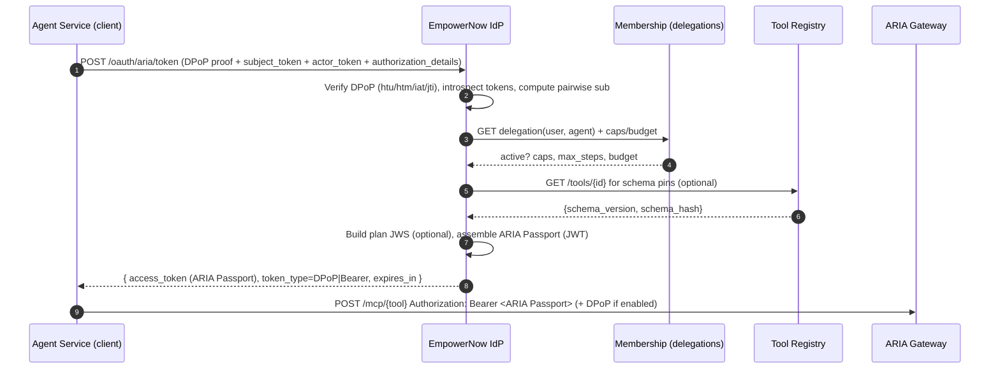

Below is a **drop‑in, EmpowerNow IdP update** that adds ARIA v1 support **without breaking** your existing OAuth/OIDC stack (RAR, PAR, JARM, DPoP, OBO already present). It keeps your normal authZ code paths and introduces a **minimal extension surface**:

* a **token‑exchange grant** that mints **ARIA Passports** (JWT) for agents,
* **RAR** (authorization_details) as the way to ask for tools/capabilities,
* optional **PAR+JARM** for interactive delegation,
* **DPoP‑bound** passports (feature‑flag) and **OBO semantics** via RFC 8693,
* pairwise **user→service agent** identity, **plan contracts**, **schema pins**, **hard budgets** baked into the token.

Everything below is developer‑to‑developer: diagrams, data models, and **runnable FastAPI stubs** you can drop next to your current IdP code. Replace only the parts you need.

---

## IdP alignment (implemented)

This section summarizes what is already implemented in the EmpowerNow IdP and how it maps to the design below. Prefer this as the source of truth for current behavior; the rest of this document includes generic stubs which are not used in production IdP.

- Token issuance stays at `POST /api/oidc/token` using RFC 8693 Token Exchange. We do not add a new `/oauth/aria/token` route.
- RAR is ingested via `authorization_details` (and PAR if enabled). Supported types include:
  - `aria_agent_delegation`
  - `urn:aria:params:oauth:authorization-details:ai:agent`
  - `urn:aria:params:oauth:authorization-details:delegation`
- Discovery advertises the above types and `jwks_uri` points to `/.well-known/jwks.json`. Both `/jwks` and `/.well-known/jwks.json` serve the same keys.
- DPoP (RFC 9449) is enforced for FAPI clients at the token endpoint; DPoP replay is cached (TTL from feature flags). When DPoP is present, minted tokens include `cnf.jkt`.
- Plan proposals are signed into a JWS via `PlanContractService` and attached as `aria_extensions.plan_jws`.
- Tool schema pins are pulled from the Tool Registry and attached to both the corresponding RAR entries and aggregated under `aria_extensions.schema_pins`.
- Optional pairwise identifiers are emitted behind the feature flag `feature_flags.aria_pairwise_sub`. When enabled, `sub` and `act.sub` are pairwise for the audience sector.
- New documentation endpoints:
  - `GET /aria-metadata`: capability and feature flag snapshot
  - `GET /aria-claims`: documents claims including ARIA extensions and DPoP confirmation

---

## Deep‑dive: What changed in your IdP (developer reference)

This section explains every change we shipped in the IdP, why it matters for AI agents, and where the code lives. Use it as the authoritative map when maintaining or auditing the implementation.

### A) Endpoints and discovery
- JWKS
  - What: Expose both `/jwks` and `/.well-known/jwks.json` and include the plan‑signing public key when configured.
  - Why: OIDC/OAuth verifiers expect a well‑known JWKS; plan verification can be performed by downstream consumers when the key is distinct.
  - Code: `src/api/oidc/endpoints/jwks.py`
- Discovery metadata
  - What: Advertises `authorization_details_types_supported` for ARIA (`aria_agent_delegation`, URNs), DPoP capability, and identity chaining endpoints when enabled.
  - Why: Enables client auto‑configuration and standards alignment (RAR, DPoP, discovery‐driven feature use).
  - Code: `src/api/oidc/endpoints/discovery.py`
- ARIA docs
  - What: `GET /aria-metadata` and `GET /aria-claims` summarize feature flags and claims schema.
  - Why: First‑class documentation surface for AI agent contracts (plan JWS, pins, budgets, pairwise, DPoP confirmation).
  - Code: `src/api/oidc/endpoints/aria.py`
- Identity chaining endpoints (feature‑flagged)
  - What: `POST /oauth/identity-assertion` (mint Identity Assertion JWT); `POST /oauth/identity-chain/token` (brokered exchange).
  - Why: Enables OAuth identity chaining in delegated or brokered mode for SaaS APIs.
  - Code: `src/api/oidc/endpoints/identity_chain.py`

### B) Token issuance and claims
- Token Exchange (RFC 8693)
  - `handle_token_exchange` enforces token binding rules for FAPI clients; issues ARIA claims in `aria_extensions` and `cnf.jkt` when DPoP is present.
  - Code: `src/api/oidc/grant_handlers.py`, `src/services/token_exchange_service.py`
- ARIA extensions (authoritative shape)
  - Fields: `call_id`, `schema_pins`, `plan_jws`, `budget`, `max_steps`, `user_bound_instance`, optional `pairwise_subject`.
  - Why: Declarative, verifiable contract for AI agent execution (schema integrity, step discipline, spend controls).
  - Code: `src/services/token_exchange_service.py`, `src/models/authorization_details.py`, `src/services/tool_registry_client.py`, `src/services/plan_contract_service.py`
- DPoP binding (RFC 9449)
  - What: When DPoP is used at the token endpoint, minted JWTs include `cnf.jkt`; refresh and exchange flows enforce binding for FAPI.
  - Code: `src/api/oidc/grant_handlers.py`, `src/api/middleware/dpop_nonce_middleware.py`

### C) Identity chaining (IdP side)
- Identity Assertion service
  - What: `IdentityAssertionService` validates subject/actor tokens and mints short‑TTL (≤300s) Identity Assertion JWTs with pairwise `sub` and `act.sub`.
  - Code: `src/services/identity_assertion_service.py`
- PDP enforcement for chaining
  - What: Both assertion and broker endpoints enforce `constraints.identity_chain.allowed_audiences/scopes` from PDP.
  - Code: `src/api/oidc/endpoints/identity_chain.py`
- Metrics
  - What: `identity_chain_assertion_requests_total`, `identity_chain_assertion_duration_seconds`, `identity_chain_broker_requests_total`, `identity_chain_broker_duration_seconds`.
  - Code: `src/metrics/prometheus.py`

### D) Pairwise identity
- Helper: `pairwise(identifier, sector_identifier, secret=None)` → `pwa:<b64url>`
  - Why: Per‑audience privacy for users and agents.
  - Code: `src/utils/identity_utils.py`
- Feature flag: `feature_flags.aria_pairwise_sub` controls issuance of pairwise `sub` and `act.sub` for ARIA flows.

### E) Settings and environment variables
- JWT/keys
  - `settings.jwt.private_key`, `settings.jwt.public_key`, `settings.jwt.algorithm`
  - Inline PEM is accepted or file path; tests set `JWT__PUBLIC_KEY` automatically.
- Plan signing
  - `settings.plan.signing_key`, `settings.plan.key_id` (env: `PLAN_SIGNING_KEY`, `PLAN_KEY_ID`)
- Token binding
  - `settings.token_binding.enforce_for_fapi` (env: `TOKEN_BINDING_ENFORCE_FOR_FAPI`)
  - `settings.token_binding.allow_mtls_alternative` (env: `TOKEN_BINDING_ALLOW_MTLS_ALTERNATIVE`)
- Tool Registry
  - `settings.tool_registry_url` for schema pins
- Identity chaining
  - `settings.identity_chain.enabled` (env precedence: `IDENTITY_CHAIN_ENABLED`; back‑compat `ENABLE_IDENTITY_CHAINING` if explicit not set)
  - `settings.identity_chain.assertion_ttl` (env precedence: `IDENTITY_CHAIN_ASSERTION_TTL` takes priority over `CHAIN_ASSERTION_TTL`)
  - `settings.identity_chain.broker_enabled`

### F) Security model (what it buys you)
- DPoP binding and replay prevention (nonce/JTI cache) prevent token theft replay.
- Pairwise subjects reduce linkability across relying parties.
- Plan JWS ensures step discipline; schema pins ensure tool request/response shape integrity.
- PDP gates (RAR, identity_chain) centralize authorization decisions; IdP enforces, ARIA consumes.

### G) Quick‑start: cURL examples
Mint Identity Assertion (delegated mode):
```
curl -s -X POST "$IDP_BASE/oauth/identity-assertion" \
  -H "Content-Type: application/json" \
  -d '{
        "subject_token":"<ARIA_passport>",
        "actor_token":null,
        "audience":"https://graph.microsoft.com",
        "scope":"User.Read"
      }'
```
Brokered exchange at downstream AS:
```
curl -s -X POST "$IDP_BASE/oauth/identity-chain/token" \
  -H "Content-Type: application/json" \
  -d '{
        "subject_token":"<ARIA_passport>",
        "actor_token":null,
        "audience":"https://graph.microsoft.com",
        "scope":"User.Read",
        "token_endpoint":"https://login.microsoftonline.com/common/oauth2/v2.0/token",
        "client_auth": {"method":"client_secret_post","client_id":"...","client_secret":"..."}
      }'
```

---

## Reference: ARIA claim fields (JWT)

- `aria_extensions.call_id` (string, UUID): Idempotent budget and receipt correlation key.
- `aria_extensions.schema_pins` (object): `{ tool_id: {schema_version, schema_hash} }` for integrity and rollout windows.
- `aria_extensions.plan_jws` (string|null): Signed plan step contract; used for step validation.
- `aria_extensions.budget` (object): `{ initial, currency }`; may be sourced from PDP context.
- `aria_extensions.max_steps` (int): Maximum steps allowed; may be sourced from PDP.
- `cnf.jkt` (string, base64url): JWK thumbprint when token is DPoP‑bound.

---

### Authoritative ARIA token claim shape (IdP JWT)

The IdP extends standard JWTs with `authorization_details` (RFC 9396) and an `aria_extensions` object:

```json
{
  "iss": "https://idp.ocg.labs.empowernow.ai",
  "sub": "auth:account:empowernow:alice",
  "aud": "service-client",
  "exp": 1735689600,
  "iat": 1735686000,
  "jti": "be0bfe61-2c36-4b72-9d8a-34a5f3c2a108",
  "act": { "sub": "agent:service-client:for:auth:account:empowernow:alice" },
  "authorization_details": [ { "type": "aria_agent_delegation", "tools": ["mcp:flights:search"], "actions": ["execute"], "schema_pins": {"mcp:flights:search": {"schema_version": "1.2.0", "schema_hash": "sha256:..."}} } ],
  "aria_extensions": {
    "user_bound_instance": true,
    "service_provider": "service:service-client",
    "token_lifetime": 3600,
    "call_id": "79dfe9b6-5d0e-4b6e-ae9a-d68a1f0c0e0f",
    "pairwise_subject": true,
    "budget": {"initial": 100.0, "currency": "USD"},
    "max_steps": 20,
    "schema_pins": { "mcp:flights:search": {"schema_version":"1.2.0","schema_hash":"sha256:..."} },
    "plan_jws": "eyJhbGciOiJSUzI1NiIsImtpZCI6IjEifQ..."
  },
  "cnf": { "jkt": "0ZcOCORZNYy-DWpqq30jZyJGHTN0d2HglBV3uiguA4I" }
}
```

Notes:
- `cnf.jkt` appears when DPoP is used at issuance; otherwise it is omitted.
- When the pairwise feature is enabled, `sub` and `act.sub` are pairwise identifiers for the sector (audience).
- `budget` and `max_steps` may also be sourced from PDP context when not provided by RAR.

### Configuration (IdP settings)

- Tool Registry base URL: `settings.tool_registry_url` (env: none; configure in YAML)
- Plan signing: `settings.plan.signing_key` and `settings.plan.key_id` (env: `PLAN_SIGNING_KEY`, `PLAN_KEY_ID`)
- Token signing: `settings.token.signing_key`, `settings.token.key_id` (env: `TOKEN_SIGNING_KEY`, `TOKEN_KEY_ID`)
- Token binding (DPoP) enforcement flags under `settings.token_binding`:
  - `enforce_for_fapi` (env: `TOKEN_BINDING_ENFORCE_FOR_FAPI`)
  - `allow_mtls_alternative` (env: `TOKEN_BINDING_ALLOW_MTLS_ALTERNATIVE`)
- Feature flags (YAML under `feature_flags`):
  - `aria_pairwise_sub`
  - `feature_dpop_jti_cache`
  - `dpop_jti_ttl_seconds`

---

## 0) What changes (punch list)

1. **New grant handler**: `/oauth/aria/token` (RFC 8693 Token Exchange profile) issuing **ARIA Passports**.
2. **RAR ingestion**: accept `authorization_details` (type = `aria_agent_delegation`) inline or by **PAR** (`request_uri`).
3. **OBO mapping**: `subject_token` (user) + `actor_token` (service/agent host) → JWT `act.sub` and `pairwise` subject.
4. **Optional DPoP** at the token endpoint: verify proof; mint **DPoP‑bound** access tokens with `cnf.jkt`.
5. **JARM** for interactive delegation (front‑channel): your `/authorize` signs a JARM JWT. Code below demonstrates how to sign.
6. **JWKS exposure** for both the **Passport** and **Plan JWS** signing keys.

Everything else (PDP, ARIA Gateway, BFF, Registry, Receipt Vault) is unchanged from your ARIA v1.

---

## 1) Flows (mermaid)

### 1.1 Back‑channel **Token Exchange** (DPoP, OBO, RAR → ARIA Passport)



### 1.2 Interactive **PAR + JARM** (optional UI delegation)

```mermaid
sequenceDiagram
  participant UI as Browser (User)
  participant RP as Agent Service (client)
  participant IDP as EmpowerNow IdP
  participant MEM as Membership

  RP->>IDP: POST /oauth/par (authorization_details=RAR, redirect_uri, state)
  IDP-->>RP: { request_uri, expires_in }
  UI->>IDP: GET /authorize?client_id...&request_uri=...&response_mode=jwt
  IDP->>MEM: Preview delegations/caps; prompt user
  UI-->>IDP: Consent (grant)
  IDP-->>RP: 302 redirect with JARM (signed JWT containing code+state)
  RP->>IDP: POST /oauth/token (code → user access token)
  RP->>IDP: POST /oauth/aria/token (subject_token from user, actor_token of service, same RAR)
  IDP-->>RP: ARIA Passport (JWT)
```

---

## 2) Data contracts

### 2.1 `authorization_details` (RAR) — **type: `aria_agent_delegation`**

```json
{
  "type": "aria_agent_delegation",
  "tools": ["mcp:flights:search", "mcp:flights:book"],
  "locations": ["https://tools.example.com/mcp/flights"],
  "schema_pins": {
    "mcp:flights:search": {"schema_version":"1.2.0","schema_hash":"sha256:..."},
    "mcp:flights:book":   {"schema_version":"1.2.0","schema_hash":"sha256:..."}
  },
  "budget": {"initial": 100.00, "currency": "USD"},
  "plan": {
    "steps": [
      {"tool":"mcp:flights:search", "params":{"q":"SFO"}, "cost":0.5},
      {"tool":"mcp:flights:book",   "params":{"pnr":"..."}, "cost":42.0}
    ]
  }
}
```

> Can be supplied inline at `/oauth/aria/token` or indirectly via **PAR** (`request_uri`).

### 2.2 ARIA Passport (unchanged + **optional DPoP cnf**)

```json
{
  "iss": "https://idp.empowernow.com",
  "sub": "pairwise:9a7b1c2d3e4f5a6b",
  "aud": "aria.gateway",
  "exp": 1735689600,
  "iat": 1735686000,
  "jti": "be0bfe61-2c36-4b72-9d8a-34a5f3c2a108",
  "act": {"sub": "agent:svc-123:for:9a7b1c2d3e4f5a6b"},
  "authorization_details": [{ "...": "as above" }],
  "aria": {
    "bound_sub": "pairwise:9a7b1c2d3e4f5a6b",
    "tenant": "acme",
    "schema_pins": { "...": "as above" },
    "plan_contract_jws": "<JWS or null>",
    "call_id": "79dfe9b6-5d0e-4b6e-ae9a-d68a1f0c0e0f",
    "budget": {"initial": 100.00, "currency": "USD"},
    "max_steps": 20
  },
  "cnf": { "jkt": "base64url(SHA256(JWK_thumbprint))" }  // present if DPoP-bound
}
```

---

## 3) Drop‑in repo layout (IdP module only)

```
idp/
├─ requirements.txt
├─ main.py                 # FastAPI: PAR, authorize(JARM), ARIA token exchange, JWKS
├─ dpop.py                 # DPoP proof verification + jkt calc + replay cache
├─ par_store.py            # in‑memory/Redis PAR storage
├─ plan.py                 # plan JWS builder (unchanged patterns)
├─ utils.py                # pairwise, jwk helpers, jwks endpoint
```

---

## 4) Runnable code (FastAPI stubs)

> Uses Redis only for DPoP replay cache + PAR store. Replace the Membership/Registry calls with your production clients.

### 4.1 `idp/requirements.txt`

```
fastapi==0.110.*
uvicorn[standard]==0.30.*
pyjwt==2.8.*
cryptography==42.*
redis==5.0.*
httpx==0.27.*
pydantic==1.10.*
python-ulid==2.7.*
```

### 4.2 `idp/utils.py`

```python
import os, json, time, hashlib
import jwt
from typing import Dict, Any

PAIRWISE_SALT = os.getenv("ARIA_PAIRWISE_SALT", "dev-salt")
ISSUER = os.getenv("ARIA_ISSUER", "https://idp.empowernow.com")
IDP_PRIVATE_KEY = os.getenv("IDP_PRIVATE_KEY_PEM")  # RSA or EC
IDP_PUBLIC_KEY = os.getenv("IDP_PUBLIC_KEY_PEM")
IDP_KID = os.getenv("IDP_KID", "idp-aria-001")

AUTHZ_PRIVATE_KEY = os.getenv("AUTHZ_RESPONSE_PRIVATE_KEY_PEM", IDP_PRIVATE_KEY)
AUTHZ_KID = os.getenv("AUTHZ_KID", "idp-jarm-001")

def pairwise(user_id: str, service_id: str) -> str:
    raw = f"pairwise:v1:{user_id}:{service_id}:{PAIRWISE_SALT}".encode()
    return "pairwise:" + hashlib.sha256(raw).hexdigest()[:16]

def sign_jwt(payload: Dict[str, Any], kind: str = "access") -> str:
    kid = AUTHZ_KID if kind == "jarm" else IDP_KID
    return jwt.encode(payload, IDP_PRIVATE_KEY, algorithm="RS256",
                      headers={"alg":"RS256","kid": kid,"typ":"JWT"})

def jwks() -> Dict[str, Any]:
    # Minimal JWKS from PEM (demo only). In prod, serve your managed JWKS.
    from cryptography.hazmat.primitives import serialization
    from cryptography.hazmat.primitives.asymmetric import rsa
    from cryptography.hazmat.backends import default_backend
    from cryptography.hazmat.primitives.serialization import load_pem_private_key
    key = load_pem_private_key(IDP_PRIVATE_KEY.encode(), password=None)
    pub = key.public_key()
    numbers = pub.public_numbers()
    n = numbers.n.to_bytes((numbers.n.bit_length()+7)//8, 'big')
    e = numbers.e.to_bytes((numbers.e.bit_length()+7)//8, 'big')
    import base64
    def b64u(b: bytes) -> str: return base64.urlsafe_b64encode(b).rstrip(b"=").decode()
    return {"keys":[{"kty":"RSA","kid":IDP_KID,"alg":"RS256","use":"sig","n":b64u(n),"e":b64u(e)}]}
```

### 4.3 `idp/plan.py`

```python
import time, json, hashlib
from typing import Dict, Any
from .utils import sign_jwt

def canonical_hash(obj: dict) -> str:
    return "sha256:" + hashlib.sha256(json.dumps(obj, sort_keys=True).encode()).hexdigest()

def sign_plan(plan: dict, agent_id: str) -> str:
    steps = []
    total = 0.0
    for i, s in enumerate(plan.get("steps", [])):
        pf = canonical_hash(s.get("params", {}))
        cost = float(s.get("cost", 0))
        total += cost
        steps.append({"index": i, "tool": s["tool"], "params_fingerprint": pf, "max_cost": cost})
    payload = {
        "plan_id": hashlib.sha256(json.dumps(plan, sort_keys=True).encode()).hexdigest()[:16],
        "agent_id": agent_id,
        "total_budget": round(total, 2),
        "steps": steps,
        "created_at": time.strftime("%Y-%m-%dT%H:%M:%SZ", time.gmtime()),
        "expires_at": time.strftime("%Y-%m-%dT%H:%M:%SZ", time.gmtime(time.time()+3600)),
    }
    return sign_jwt(payload)
```

### 4.4 `idp/par_store.py`

```python
import os, json, time, ulid
from typing import Dict, Any
from redis.asyncio import Redis, from_url

REDIS_URL = os.getenv("REDIS_URL", "redis://redis:6379/0")

class PARStore:
    def __init__(self, redis: Redis): self.r = redis

    @staticmethod
    def make_uri() -> str:
        return f"urn:ietf:params:oauth:request_uri:{ulid.ULID().str}"

    async def put(self, obj: Dict[str, Any], ttl: int = 120) -> str:
        uri = self.make_uri()
        await self.r.setex(f"par:{uri}", ttl, json.dumps(obj))
        return uri

    async def get(self, uri: str) -> Dict[str, Any] | None:
        raw = await self.r.get(f"par:{uri}")
        return json.loads(raw) if raw else None
```

### 4.5 `idp/dpop.py`

```python
import base64, json, time, hashlib
import jwt
from typing import Tuple, Dict, Any
from redis.asyncio import Redis

DPoP_MAX_SKEW = 300  # seconds

def b64u(data: bytes) -> str:
    return base64.urlsafe_b64encode(data).rstrip(b"=").decode()

def jwk_thumbprint_b64u(jwk: Dict[str, Any]) -> str:
    """
    RFC 7638 JWK thumbprint (SHA-256), normalized member order:
    - RSA: {"e","kty","n"}; EC: {"crv","kty","x","y"}
    """
    if jwk.get("kty") == "RSA":
        canonical = json.dumps({"e": jwk["e"], "kty": "RSA", "n": jwk["n"]}, separators=(",", ":"), sort_keys=True)
    elif jwk.get("kty") == "EC":
        canonical = json.dumps({"crv": jwk["crv"], "kty": "EC", "x": jwk["x"], "y": jwk["y"]},
                               separators=(",", ":"), sort_keys=True)
    else:
        raise ValueError("unsupported kty for thumbprint")
    return b64u(hashlib.sha256(canonical.encode()).digest())

async def verify_dpop_proof(redis: Redis, proof: str, method: str, htu: str) -> Tuple[bool, str]:
    """
    Verify DPoP proof JWT at the token endpoint.
    Returns (ok, jkt_b64u) if valid, else (False, "").
    """
    try:
        header = jwt.get_unverified_header(proof)
        if header.get("typ") != "dpop+jwt":
            return False, ""
        jwk = header.get("jwk")
        if not jwk:
            return False, ""
        # Use the embedded JWK public key to verify the JWT
        key = jwt.algorithms.RSAAlgorithm.from_jwk(json.dumps(jwk)) \
              if jwk.get("kty") == "RSA" else jwt.algorithms.ECAlgorithm.from_jwk(json.dumps(jwk))
        body = jwt.decode(proof, key=key, algorithms=[header["alg"]], options={"verify_aud": False})
        if body.get("htm") != method:
            return False, ""
        if body.get("htu") != htu:
            return False, ""
        iat = int(body.get("iat", 0))
        now = int(time.time())
        if abs(now - iat) > DPoP_MAX_SKEW:
            return False, ""
        jti = body.get("jti")
        if not jti:
            return False, ""
        # Replay cache
        key_jti = f"dpop:jti:{jti}"
        if await redis.get(key_jti):
            return False, ""
        await redis.setex(key_jti, DPoP_MAX_SKEW, "1")
        # Return JWK thumbprint
        jkt = jwk_thumbprint_b64u(jwk)
        return True, jkt
    except Exception:
        return False, ""
```

### 4.6 `idp/main.py`

```python
from fastapi import FastAPI, Request, HTTPException, Header, Depends
from pydantic import BaseModel
from typing import Optional, Dict, Any, List
import os, time, uuid, json, httpx
from redis.asyncio import from_url as redis_from_url

from .utils import pairwise, sign_jwt, jwks, ISSUER, IDP_PRIVATE_KEY
from .plan import sign_plan
from .par_store import PARStore
from .dpop import verify_dpop_proof

app = FastAPI(title="EmpowerNow IdP – ARIA extensions")

REDIS_URL = os.getenv("REDIS_URL", "redis://redis:6379/0")
ARIA_AUDIENCE = os.getenv("ARIA_AUDIENCE", "aria.gateway")
ENABLE_DPOP = os.getenv("ENABLE_DPOP", "true").lower() == "true"

@app.on_event("startup")
async def startup():
    app.state.redis = await redis_from_url(REDIS_URL)
    app.state.par = PARStore(app.state.redis)
    app.state.http = httpx.AsyncClient(timeout=2.0)

# --- JWKS (for ARIA Passport + JARM)
@app.get("/.well-known/jwks.json")
async def well_known_jwks():
    return jwks()

# ---- Models
class AuthorizationDetails(BaseModel):
    type: str
    tools: List[str]
    locations: List[str] = []
    schema_pins: Dict[str, Dict[str, str]] = {}
    budget: Dict[str, Any] = {}
    plan: Optional[Dict[str, Any]] = None

class ARIATokenRequest(BaseModel):
    grant_type: str = "urn:ietf:params:oauth:grant-type:token-exchange"
    subject_token: str
    subject_token_type: str = "urn:ietf:params:oauth:token-type:access_token"
    actor_token: str
    actor_token_type: str = "urn:ietf:params:oauth:token-type:access_token"
    audience: str = ARIA_AUDIENCE
    resource: Optional[str] = None
    authorization_details: Optional[List[AuthorizationDetails]] = None
    request_uri: Optional[str] = None
    tenant: str = "default"

# ---- Stubs for your existing infra (replace)
async def introspect_or_decode(token: str) -> Dict[str, Any]:
    # Replace with your IdP/AS validation. For demo, accept unsigned.
    try:
        import jwt
        return jwt.decode(token, options={"verify_signature": False})
    except Exception:
        return {"sub": "user:123", "client_id": "svc-123"}

async def get_delegation(user_id: str, agent_id: str) -> dict | None:
    # Replace with Membership
    return {"status":"active","capabilities":["mcp:flights:search","mcp:flights:book"],"budget":100.0,"max_steps":20}

async def fetch_tool_pins(authz_details: AuthorizationDetails) -> Dict[str, Dict[str, str]]:
    # If schema_pins not provided, you may populate from Tool Registry
    if authz_details.schema_pins:
        return authz_details.schema_pins
    # demo default
    return {t: {"schema_version":"1.2.0","schema_hash":"sha256:deadbeef"} for t in authz_details.tools}

# ---- PAR (pushed authorization requests)
class PARBody(BaseModel):
    authorization_details: List[AuthorizationDetails]
    redirect_uri: Optional[str] = None
    state: Optional[str] = None
    response_mode: Optional[str] = "jwt"  # JARM
    client_id: Optional[str] = None

@app.post("/oauth/par")
async def par_push(body: PARBody):
    # Validate client + contents as per your policies
    uri = await app.state.par.put(json.loads(body.json()), ttl=120)
    return {"request_uri": uri, "expires_in": 120}

# ---- Authorize (JARM demo)
@app.get("/oauth/authorize")
async def authorize(request_uri: str, client_id: str, redirect_uri: str, state: Optional[str] = None):
    # Fetch PAR object
    par = await app.state.par.get(request_uri)
    if not par:
        raise HTTPException(400, "invalid_request_uri")
    # Here you would authenticate the user & show consent for RAR
    # Emit JARM: { code, state, iss, aud, exp }
    code = str(uuid.uuid4())
    claims = {
        "iss": ISSUER, "aud": client_id, "exp": int(time.time())+180,
        "code": code, "state": par.get("state") or state, "iat": int(time.time())
    }
    jarm_jwt = sign_jwt(claims, kind="jarm")
    # In production: 302 redirect to redirect_uri with response=JWT or response_mode=jwt param
    return {"response": jarm_jwt, "redirect_to": redirect_uri}

# ---- ARIA Token Exchange (main entry)
@app.post("/oauth/aria/token")
async def aria_token_exchange(req: ARIATokenRequest, request: Request,
                              dpop: Optional[str] = Header(None, alias="DPoP")):
    # 1) (Optional) DPoP proof at token endpoint
    jkt = None
    if ENABLE_DPOP and dpop:
        ok, jkt = await verify_dpop_proof(app.state.redis, dpop, "POST", str(request.url))
        if not ok:
            raise HTTPException(401, "invalid_dpop_proof")

    # 2) Validate grant + tokens
    if req.grant_type != "urn:ietf:params:oauth:grant-type:token-exchange":
        raise HTTPException(400, "unsupported_grant_type")
    sub_claims = await introspect_or_decode(req.subject_token)
    act_claims = await introspect_or_decode(req.actor_token)

    user_id = sub_claims.get("sub") or sub_claims.get("uid") or "user:unknown"
    service_id = act_claims.get("client_id") or act_claims.get("azp") or "svc-unknown"

    # 3) Authorization details (RAR): inline or via PAR
    rar = None
    if req.authorization_details:
        # pick first aria_agent_delegation
        for ad in req.authorization_details:
            if ad.type == "aria_agent_delegation":
                rar = ad
                break
    if not rar and req.request_uri:
        par = await app.state.par.get(req.request_uri)
        if not par:
            raise HTTPException(400, "invalid_request_uri")
        for ad in par.get("authorization_details", []):
            if ad.get("type") == "aria_agent_delegation":
                rar = AuthorizationDetails(**ad)
                break
    if not rar:
        raise HTTPException(400, "authorization_details_required")

    # 4) Pairwise subject + agent_id
    pw = pairwise(user_id, service_id)
    agent_id = f"agent:{service_id}:for:{pw.split(':')[1]}"

    # 5) Verify user→agent delegation & budget with Membership
    delegation = await get_delegation(user_id, agent_id)
    if not delegation or delegation["status"] != "active":
        raise HTTPException(403, "consent_required")

    # 6) Schema pins
    schema_pins = await fetch_tool_pins(rar)

    # 7) Optional: Plan contract JWS
    plan_jws = sign_plan(rar.plan, agent_id) if rar.plan else None

    # 8) Assemble ARIA Passport
    now = int(time.time())
    passport = {
        "iss": ISSUER,
        "sub": pw,
        "aud": req.audience or ARIA_AUDIENCE,
        "iat": now,
        "exp": now + 3600,
        "jti": str(uuid.uuid4()),
        "act": {"sub": agent_id},
        "authorization_details": [json.loads(rar.json())],
        "aria": {
            "bound_sub": pw,
            "tenant": req.tenant,
            "schema_pins": schema_pins,
            "call_id": str(uuid.uuid4()),
            "max_steps": delegation.get("max_steps", 20),
            "plan_contract_jws": plan_jws,
            "budget": {"initial": delegation.get("budget", 10.0), "currency": "USD"}
        }
    }
    if jkt:
        passport["cnf"] = {"jkt": jkt}

    return {
        "access_token": sign_jwt(passport),
        "token_type": "DPoP" if jkt else "Bearer",
        "expires_in": 3600,
        "agent_id": agent_id
    }
```

---

## 5) Configuration flags (safe defaults)

| Var                              | Default                      | Purpose                                      |
| -------------------------------- | ---------------------------- | -------------------------------------------- |
| `ARIA_ISSUER`                    | `https://idp.empowernow.com` | `iss` in ARIA Passports & JARM               |
| `ARIA_AUDIENCE`                  | `aria.gateway`               | Passport `aud`                               |
| `ENABLE_DPOP`                    | `true`                       | Enforce DPoP at `/oauth/aria/token`          |
| `IDP_PRIVATE_KEY_PEM`            | —                            | RSA/EC key (PEM) for signing Passports/Plans |
| `AUTHZ_RESPONSE_PRIVATE_KEY_PEM` | —                            | (optional) separate JARM key                 |
| `IDP_KID` / `AUTHZ_KID`          | ids                          | JWKS key ids                                 |
| `ARIA_PAIRWISE_SALT`             | `dev-salt`                   | Pairwise subject salt                        |
| `REDIS_URL`                      | `redis://redis:6379/0`       | DPoP replay + PAR store                      |

---

## 6) Security considerations (what this adds/changes)

* **DPoP at token endpoint**: proof (`DPoP` header) bound to the minted token via `cnf.jkt`. Replay cache (Redis) on `jti`.
* **OBO**: Proper `act.sub` from `actor_token` and pairwise `sub` from `subject_token`×`service_id`.
* **RAR‑first**: you accept only `authorization_details.type = aria_agent_delegation` for ARIA; ignore unrecognized RAR types here.
* **PAR**: stores the RAR (no secrets) for 120s; JARM signs front‑channel result (avoid code leakage).
* **JWKS** exposed for verifiers (ARIA Gateway, Analytics, customers).

> **Fail‑closed**: no RAR → 400; inactive delegation → 403; invalid DPoP → 401; audience mismatch → deny (add if you enforce `aud` strictly).

---

## 7) Interop notes (how this plugs into ARIA v1)

* **ARIA Gateway** already expects Passports shaped like above. If you flip `ENABLE_DPOP=true`, Gateway can still accept the token as a Bearer JWT while you roll out PoP verification later (PEP DPoP was deferred in your v1 scope).
* **BFF** flow unchanged. If you want DPoP on model calls, do it later at the BFF ingress.
* **Membership** is the single source of truth for delegation/budget; the IdP extension never invents budgets/caps.

---

## 8) Acceptance tests (quick)

1. **OBO & pairwise:** Send `subject_token` with `sub=u-1`, `actor_token` with `client_id=svc-1` → `sub` in Passport starts with `pairwise:`, `act.sub=agent:svc-1:for:<pairwise>`.
2. **RAR required:** Omit `authorization_details` and `request_uri` → 400.
3. **DPoP happy path:** Provide valid DPoP proof → response `token_type=DPoP` and Passport has `cnf.jkt`.
4. **DPoP replay:** Reuse same proof (same `jti`) → 401.
5. **PAR+JARM:** POST `/oauth/par` → `request_uri`; GET `/oauth/authorize` returns JARM JWT; decode and verify `iss/aud/exp`.

---

## 9) Minimal docker‑compose add‑on

```yaml
services:
  idp:
    build: ./idp
    environment:
      - REDIS_URL=redis://redis:6379/0
      - ARIA_ISSUER=https://idp.empowernow.com
      - ARIA_AUDIENCE=aria.gateway
      - ENABLE_DPOP=true
      - ARIA_PAIRWISE_SALT=${PAIRWISE_SALT}
      - IDP_PRIVATE_KEY_PEM=${IDP_PRIVATE_KEY_PEM}
      - IDP_KID=idp-aria-001
    command: uvicorn idp.main:app --host 0.0.0.0 --port 8082
    ports: ["8082:8082"]
```

---

## 10) Threat model deltas (STRIDE highlights)

* **Spoofing**: DPoP proof bound to token (`cnf.jkt`); front‑channel uses **JARM** (signed) to prevent parameter tampering.
* **Tampering**: RAR is parsed server‑side (from PAR or request JSON); schema pins from Tool Registry prevent “shape drift”.
* **Repudiation**: Passport `jti`, Plan JWS `kid`, and downstream **Receipts** (Vault) close the loop.
* **Info disclosure**: IdP never stores prompts/params; only schema pins/budgets/caps. No raw OIDC assertions in logs or PAR store.
* **DOS**: PAR/DPoP replay caches TTL‑bound; rate‑limit `/oauth/aria/token` per client/tenant.

---

### TL;DR

* **Keep your IdP**; add this **one token‑exchange handler** that understands **RAR/PAR/JARM/DPoP/OBO** and **mints ARIA Passports** exactly as your ARIA v1 expects.
* It’s **backwards‑compatible** (can run with `DPoP=false`) and **forward‑compatible** (PoP at PEP later).
* Code above is **runnable**; swap the Membership/Registry stubs with your real clients and you’re done.
