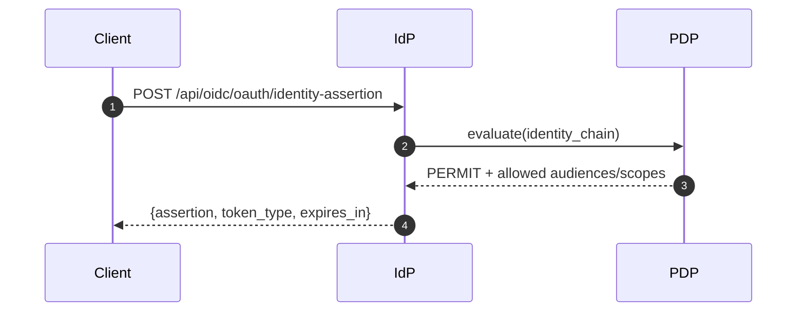

## EmpowerNow IdP — ARIA v1/v1.1 extensions (developer guide)

### TL;DR
- Adds AI‑agent aware token issuance via RFC 8693 Token Exchange with rich RAR (RFC 9396) and optional DPoP (RFC 9449).
- New identity chaining endpoints (feature‑flagged) to mint short‑lived Identity Assertion JWTs and an optional brokered exchange.
- Discovery and JWKS updated; ARIA claims added to issued JWTs (plan/pins/budget/pairwise); DPoP `cnf.jkt` emitted when bound.
- First‑class documentation endpoints and Prometheus metrics for identity chaining.

### Where this lives in the IdP
- Endpoints: `src/api/oidc/endpoints/*` (JWKS, discovery, aria docs, identity chain)
- Token issuance: `src/api/oidc/grant_handlers.py`, `src/services/token_exchange_service.py`
- Identity chaining service: `src/services/identity_assertion_service.py`
- Settings: `src/config/settings.py`, helpers in `src/utils/settings_helpers.py`
- Metrics: `src/metrics/prometheus.py`

## Architecture (OIDC surface + chaining)
```mermaid
flowchart LR
  subgraph IdP
    D[Discovery /.well-known/openid-configuration]
    J[/.well-known/jwks.json]
    T[/api/oidc/token\nRFC 8693 Token Exchange]
    A1[/api/oidc/oauth/identity-assertion\nIdentity Assertion (JWT)]
    A2[/api/oidc/oauth/identity-chain/token\nBrokered exchange]
  end
  D --> J
  D --> T
  D --> A1
  D --> A2
```

## Supported standards and value for AI agents
- RFC 8693 Token Exchange (OBO): User→agent delegation with clean `act.sub`, enables scoped agent passes.
- RFC 9396 RAR (Rich Authorization Requests): Tool‑level capabilities (ids/actions), schema pins, plan references.
- RFC 9449 DPoP: Binds tokens to a client's key; IdP emits `cnf.jkt` to signal PoP.
- OIDC Discovery + JWKS: Client self‑discovery and key retrieval; JWKS includes plan key when configured.
- JARM (JWT Authorization Response Mode): Optional (deferred in this release); supported in design, not required by ARIA v1.

## Endpoints (new/updated)

### Discovery (updated)
- Adds:
  - `authorization_details_types_supported`: `aria_agent_delegation`, URN variants
  - DPoP advertising (if configured)
  - Identity chaining: `identity_assertion_endpoint`, `identity_chain_broker_endpoint`, `identity_chain_supported`, `identity_chain_client_auth_methods_supported`

### JWKS (updated)
- Path: `/jwks` and `/.well-known/jwks.json`
- May include plan‑signing public key (distinct KID) when configured.

### POST /api/oidc/oauth/identity-assertion
- Purpose: Mint short‑lived Identity Assertion JWT for delegated identity chaining.
- Request (JSON):
  - `grant_type` (default `urn:ietf:params:oauth:grant-type:identity-assertion`)
  - `subject_token` (string, required)
  - `actor_token` (string, optional)
  - `audience` (string, required)
  - `scope` (string, optional; space‑delimited)
- PDP enforcement: Denies if `audience`/`scope` not in `constraints.identity_chain`.
- Response (200 JSON):
  - `assertion` (JWT)
  - `token_type = urn:ietf:params:oauth:token-type:jwt`
  - `expires_in` (≤ configured `assertion_ttl`, max 300s)
- Errors: 400 (invalid/unsupported), 403 (identity_chain denied), 404 (feature disabled)

### POST /api/oidc/oauth/identity-chain/token
- Purpose: Brokered exchange — IdP exchanges the assertion at the SaaS AS and returns an access token.
- Request (JSON):
  - `subject_token`, `actor_token?`, `audience`, `scope?`
  - `token_endpoint` (string, required)
  - `client_auth` (object) — currently `method: client_secret_post` supported
  - `grant_urn` (default `urn:ietf:params:oauth:grant-type:identity-assertion`)
- PDP enforcement: Same as above.
- Response: `{access_token, expires_in, ...}` from downstream AS.
- Errors: 400 (auth method unsupported), 403 (denied), 404 (feature disabled)

## Issued JWTs (Token Exchange) — ARIA extensions
- Top‑level: standard JWT claims + `authorization_details` (RAR) + optional `cnf.jkt` when DPoP present.
- `aria_extensions` (authoritative shape):
  - `call_id` (UUID)
  - `schema_pins` (map tool_id → {schema_version, schema_hash})
  - `plan_jws` (JWS) — signed plan contract
  - `budget` ({initial, currency}) and `max_steps` (int)
  - `user_bound_instance` (bool)
  - optional `pairwise_subject` (bool)
- DPoP `cnf.jkt`: Base64url SHA‑256 JWK thumbprint of binding key.

## Example: Identity Assertion flow (sequence)


## Settings and environment
- `identity_chain.enabled` (env: `IDENTITY_CHAIN_ENABLED`; back‑compat `ENABLE_IDENTITY_CHAINING` if explicit not set)
- `identity_chain.assertion_ttl` (env: `IDENTITY_CHAIN_ASSERTION_TTL` takes precedence over `CHAIN_ASSERTION_TTL`)
- `identity_chain.broker_enabled` (YAML)
- `tool_registry_url` (YAML)
- `plan.signing_key`/`plan.key_id` (env: `PLAN_SIGNING_KEY`, `PLAN_KEY_ID`)
- `token_binding.enforce_for_fapi` (env) and `token_binding.allow_mtls_alternative` (env)
- JWT keys: `jwt.private_key`, `jwt.public_key` (inline PEM or file paths)

## Metrics (Prometheus)
- `identity_chain_assertion_requests_total{result}`
- `identity_chain_assertion_duration_seconds`
- `identity_chain_broker_requests_total{result,auth_method}`
- `identity_chain_broker_duration_seconds`

## Security and privacy
- PoP binding (DPoP) and replay cache; `cnf.jkt` signals bound tokens.
- Pairwise subjects protect user privacy across sectors (audiences).
- Plan JWS and schema pins protect step/order and request/response shapes.
- PDP centrally controls allowed audiences/scopes for chaining.

## API examples
Mint assertion:
```
POST /api/oidc/oauth/identity-assertion
{
  "subject_token":"<ARIA_passport>",
  "audience":"https://graph.microsoft.com",
  "scope":"User.Read"
}
```
Brokered exchange:
```
POST /api/oidc/oauth/identity-chain/token
{
  "subject_token":"<ARIA_passport>",
  "audience":"https://graph.microsoft.com",
  "scope":"User.Read",
  "token_endpoint":"https://login.microsoftonline.com/common/oauth2/v2.0/token",
  "client_auth": {"method":"client_secret_post","client_id":"...","client_secret":"..."}
}
```

## Tests (acceptance subset)
- `src/tests/test_settings_identity_chain.py`
- `src/tests/test_identity_assertion_service.py`
- `src/tests/test_identity_assertion_endpoint.py`
- `src/tests/test_identity_broker_endpoint.py`
- `src/tests/test_discovery_identity_chain.py`

## Compatibility and rollout
- Feature‑flagged; defaults to disabled.
- No disruption to existing OIDC/OAuth flows; Token Exchange remains at `/api/oidc/token`.
- Recommended rollout: enable in dev; delegated mode first; one low‑risk tool with PDP constraints enabled.


