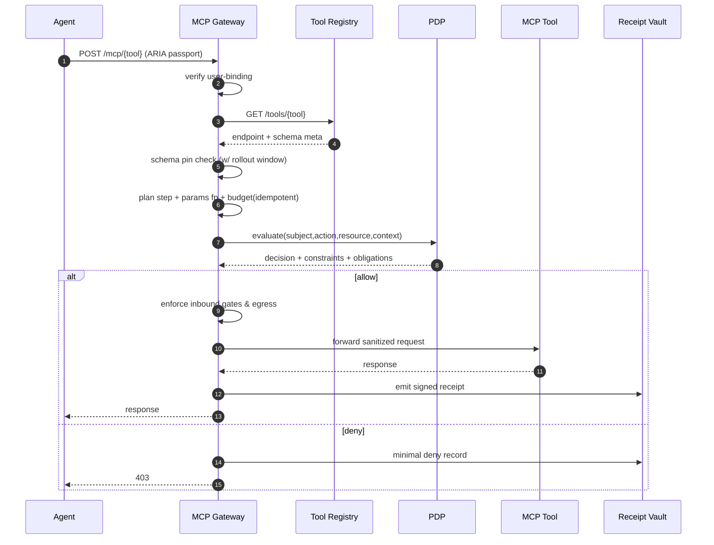
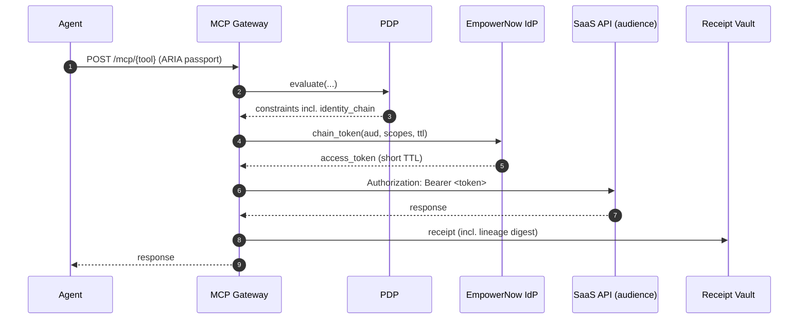

Below is a **clean, v1‑aligned redesign** of the **MCP Gateway (ARIA)** service that reflects the “lean market‑wedge” scope and removes/de‑scopes the items we agreed to defer. It is developer‑to‑developer, includes diagrams, contracts, and code that fits into the repo from the overall design.

> **What changed vs. older drafts**
>
> * ✅ **Keep**: user‑bound agent identity; **schema pins** (no vendor signatures); **plan contracts + idempotent budget**; **AuthZEN PDP** rich constraints; **params/egress/data‑scope** enforcement; **receipts**; **optional** OAuth identity chaining behind a **feature flag**.
> * ❌ **Remove/Defer**: **vendor‑signed attestations** (pins only), **Merkle capability proofs** (use PDP/RAR + allowlists), **context‑root/DPoP binding** (only include a simple request digest in receipts if desired, **no gating**), **BDNA gating** (telemetry only).

---

# MCP Gateway (ARIA) — v1 Revised Design

## 1) Scope & Non‑Goals

**Scope (v1)**

* Terminate *agent→tool* (MCP) calls and act as a **PEP**.
* Verify **user‑bound agent identity** and **schema pin**.
* Enforce **plan contracts** (step & params fingerprint) and **budget** (idempotent).
* Call **PDP (AuthZEN)** → get **constraints** & **obligations**; **enforce** constraints; **execute** obligations on permit.
* Apply **inbound gates** (redaction, rails injection, param allowlist, byte/tokens caps).
* Apply **egress pinning** and **optional outbound leak guard**.
* Emit **tamper‑evident receipts**; tee analytics.

**Non‑Goals**

* No LLM provider proxying (that’s BFF).
* No vendor‑signed schema attestations in v1.
* No capability Merkle proofs; capability is a **policy construct**.
* No DPoP/context‑root binding gates in v1 (optional **request digest** in receipts only).
* No BDNA denials; telemetry only if instrumented.

---

## 2) High‑Level Responsibilities

1. **Authenticate/Bind** — Validate ARIA passport audience, actor chain, pairwise **user‑binding**.
2. **Schema Pin** — Verify tool’s `{schema_version, schema_hash}` against **Tool Registry** with **1‑version rollout window**.
3. **Plan+Budget** — Enforce **plan step** + **params fingerprint** and perform **idempotent budget debit**.
4. **PDP Decision** — Call PDP `/access/v1/evaluation`, obtain **constraints** and **obligations**.
5. **Enforce** — Inbound gates (redaction/rails/allowlist/tokens), **egress allowlist**, **data‑scope** shaping.
6. **Forward** — Call downstream tool (MCP server/API).
7. **Obligations** — On permit, **emit receipt**, optional **KMS anchor**, **tee analytics**; on deny, write minimal deny record.
8. **(Optional)** OAuth **identity chaining** for SaaS tools if **feature‑flagged** and allowed by PDP.

---

## 3) Architecture (Service‑local)

```mermaid
graph TB
  subgraph "MCP Gateway (ARIA)"
    Rcv["HTTP ingress /mcp/{tool}"]
    Auth["Passport verify + user-binding"]
    Pin["Schema pin check"]
    Plan["Plan step + params fp + budget (idempotent)"]
    PDP["PDP evaluate (AuthZEN)"]
    Gates["Inbound gates (redact/rails/allowlist/tokens)"]
    Egress["Egress allowlist pinning"]
    Chain["(FF) Identity chaining\n(EmpowerNow IdP)"]
    Fwd["Forward to Tool (MCP)"]
    Out["Outbound leak guard (optional)"]
    Rcpt["Obligations: receipt, analytics, (anchor)"]
  end
  Rcv-->Auth-->Pin-->Plan-->PDP-->Gates-->Egress-->Chain-->Fwd-->Out-->Rcpt
```



---

## 4) Interfaces & Contracts

### 4.1 Ingress API (Gateway)

* **POST** `/mcp/{tool_id}`

  * **Headers**

    * `Authorization: Bearer <ARIA Passport JWT>` (aud = `aria.gateway`)
    * `X-ARIA-Consent: <cents>` — optional spend consent
    * `X-ARIA-MFA: ok` — if PDP `step_up.mfa_required` is true
  * **Body** (generic tool envelope)

    ```json
    {
      "args": { "param1": "value", "amount": "12.34" },
      "instruction": "optional freeform instruction",
      "sql": "optional SQL for db-like tools"
    }
    ```
  * **Response**: downstream tool’s JSON (sanitized), or error.

* **GET** `/healthz` — liveness

* **GET** `/readyz` — readiness

* **GET** `/metrics` — Prometheus

### 4.2 Tool Registry

* **GET** `/tools/{tool_id}` → `endpoint`, `schema_version`, `schema_hash`, `previous_*`, `updated_at`, `risk_tier`, `auth_mode` (`api_key|oauth_chaining|none`), optional `oauth_audience`, `oauth_scopes[]`.

### 4.3 PDP (AuthZEN)

* **POST** `/access/v1/evaluation`
  **Request**: standard `{ subject, action, resource, context }`.

  **Response (v1)**: **nested first‑party mode** (keeps repo‑wide shape)

  ```json
  {
    "decision": true,
    "context": {
      "constraints": {
        "tokens": { "max_input": 6000, "max_output": 1500, "max_stream": 4096 },
        "egress": { "allow": ["tools.example.com:443"] },
        "prompt_rules": {
          "disallowed_phrases": ["ignore all previous","system override"],
          "url_allowlist": ["*.corp.example"],
          "block_markdown_external_links": true,
          "block_system_prompt_leakage": true
        },
        "params": { "allowlist": { "amount": ["^\\d+(\\.\\d{1,2})?$"] } },
        "spend": { "max_cents": 5000, "consent_threshold_cents": 2000 },
        "data_scope": { "tenant_ids": ["acme"], "row_filter_sql": "tenant_id='acme'" },
        "step_up": { "mfa_required": false },
        "identity_chain": {
          "allowed_audiences": ["graph.microsoft.com"],
          "allowed_scopes": ["doc.read","doc.list"],
          "max_token_ttl_seconds": 300,
          "claim_allowlist": ["sub","groups","act.sub"],
          "require_dpop": false, "require_mtls": false
        }
      },
      "obligations": [
        {"id":"emit_receipt"},
        {"id":"tee_analytics","attributes":{"include":["usage","filters","limits"]}}
      ],
      "policy_version": "2025-08-10.3",
      "constraints_schema": "aria.constraints.v1",
      "ttl_ms": 1500
    }
  }
  ```

  > **Compatibility**: MCP‑GW supports top‑level rich mode too (feature flag `PDP_TOPLEVEL=true`) and normalizes internally.

### 4.4 EmpowerNow IdP (feature‑flagged)

* **POST** `/idp/chain/token`

  ```json
  { "subject_token":"<ARIA passport>", "audience":"graph.microsoft.com", "scopes":["doc.read"], "requested_ttl":300 }
  ```

  → `{ "access_token": "...", "expires_in": 280, "aud": "...", "scope":"..." }`

---

## 5) Enforcement Pipeline

### 5.1 Authentication & Binding

* Verify JWT `aud=aria.gateway`, `exp`, `iss` (IdP JWKS in prod).
* **Pairwise user‑binding**: `aria.bound_sub` must equal `sub` and match `act.sub` suffix (`agent:svc:for:<pairwise>`).

### 5.2 Schema Pin

* Compare ARIA passport `aria.schema_pins[tool_id]` to **Tool Registry**.
* Accept **exact match**; else accept **previous\_version/hash** if within **4h** rollout window.

### 5.3 Plan & Budget

* If `plan_contract_jws` present → verify **current step** tool id and **params fingerprint**; **deny on mismatch**.
* **Budget debit**: idempotent using `seen(call_id)`; on repeated retries debit is 0.

### 5.4 PDP Decision

* Build `subject=agent`, `action="execute"`, `resource=tool{schema_hash}`, `context={"budget_remaining": <usd>, "capability": tool_id}`.
* **Do not** merge/modify constraints in the PEP. Treat PDP output as authoritative.

### 5.5 Inbound Gates

* **Redaction**: `redaction.patterns[]` → mask matching secrets/PII in `args`, `instruction`.
* **Rails injection**: `inject_system_prefix/suffix` (if present) → wrap `instruction`.
* **Params allowlist**: `params.allowlist` regex checks by key.
* **Byte/token caps**: enforce `tokens.max_input` or `byte_cap`; truncate or reject per policy.
* **Data scope**: attach `row_filter_sql` in `_aria` envelope for downstream.

### 5.6 Egress

* Derive host from tool `endpoint`; **must** match `egress.allow[]` (host\[:port] or wildcard suffix). Reject redirects to non‑allowlisted hosts.

### 5.7 Forwarding

* **Headers**: `X-Delegator-ID: <user sub>`, `X-Agent-ID: <agent id>`, `X-Call-ID: <call id>`
* **Body**: sanitized payload.

### 5.8 Optional Outbound Leak Guard

* If configured, scan response for `redaction.patterns` or forbidden URLs; redact/summarize before returning.

### 5.9 Obligations (on Permit)

* **emit\_receipt**: signed, hash‑chained JWS stored in **Receipt Vault**.
* **tee\_analytics**: emit structured event with constraints fingerprint (hash), budget, timings.
* **anchor\_receipt\_kms**: optional (per PDP obligation) daily anchor.

> **Deny path**: emit minimal deny record (unsigned or signed minimal receipt) with reason code.

---

## 6) OAuth Identity Chaining (Feature‑flagged)

* **When**: Tool registry `auth_mode='oauth_chaining'` **and** PDP `constraints.identity_chain` present **and** `IDENTITY_CHAINING_ENABLED=true`.
* **Flow**:

  1. Validate **audience** ∈ `allowed_audiences`; intersect **scopes** with `allowed_scopes`.
  2. Request token from **EmpowerNow IdP** with clamped `ttl ≤ max_token_ttl_seconds`.
  3. Pin **egress** to audience host; call tool with `Authorization: Bearer <token>`.
  4. Add lineage digest (no token body) to analytics/receipts.
* **Failure**: If required by tool but flag off → `403 identity_chaining_disabled` (unless explicit fallback configured).

---

## 7) Data Contracts

### 7.1 Receipt Payload (JWS)

```json
{
  "id": "uuid",
  "ts": "2025-08-10T15:43:12Z",
  "agent_id": "agent:svc:for:pairwise",
  "call_id": "uuid",
  "resource": {"type":"tool","id":"mcp:flights:search"},
  "decision": "Allow|Deny",
  "policy_snapshot": { "...constraints..." },       // or { "etag":"...", "version":"..." }
  "schema_hash": "sha256:...",
  "params_hash": "sha256:...",                      // canonical(args,instruction,sql)
  "usage": null,                                    // present if tool reports usage
  "identity_chain": { "aud":"...", "jti_sha256":"..." }, // only if chaining used
  "prev_hash": "sha256:...",                        // chain tip per agent
  "reason": null                                    // set on deny
}
```

---

## 8) Configuration (env or YAML)

```yaml
service:
  name: aria-mcp-gw
pdp:
  url: http://pdp:8000/access/v1/evaluation
  timeout_ms: 1200
  mode: nested            # 'nested' (context.constraints) | 'toplevel'
registry:
  url: http://tool-registry:8081
receipts:
  vault_url: http://receipt-vault:8084
  daily_anchor: false
identity_chaining:
  enabled: false
  empowernow_idp_url: https://empower.now/idp
  ttl_skew_seconds: 45
egress:
  redirect_policy: "deny" # 'deny' | 'follow_if_allowed'
limits:
  request_bytes_max: 1_000_000
  pdp_cache_ttl_ms: 1500
observability:
  metrics: otel
  log_level: info
```

---

## 9) Module Layout (service‑local)

```
aria-mcp-gw/
├─ app.py                     # FastAPI entry, route wiring
├─ pdp_client.py              # AuthZEN client + normalize (nested/toplevel)
├─ registry_client.py         # Tool registry
├─ empower_client.py          # (FF) identity chaining broker
├─ receipts.py                # Receipt emitter
├─ budget.py                  # Idempotent debit
├─ plan.py                    # Plan verify (params fingerprint)
├─ enforce/
│  ├─ inbound.py              # redaction, rails, params allowlist, caps, data_scope
│  └─ outbound.py             # leak guard (optional)
├─ security.py                # passport verify + user binding
├─ egress.py                  # host pinning, redirect policy
└─ config.py                  # env/yaml load
```

---

## 10) Core Code (selected, runnable stubs)

> These stubs are drop‑in compatible with the repo structure from the overall design. Replace JWKS, timeouts, and error handling for production.

### 10.1 `security.py`

```python
import jwt
from fastapi import HTTPException

def decode_passport(token: str) -> dict:
    # In production: verify with IdP JWKS + aud=aria.gateway
    return jwt.decode(token, options={"verify_signature": False})

def verify_user_binding(passport: dict) -> None:
    try:
        bound = passport["aria"]["bound_sub"]
        user_sub = passport["sub"]
        agent_id = passport["act"]["sub"]
        if ":for:" not in agent_id:
            raise ValueError("bad agent id")
        agent_bound = agent_id.split(":for:")[1]
        pairwise = bound.split(":")[-1]
        if not (bound == user_sub and agent_bound == pairwise):
            raise ValueError("binding mismatch")
    except Exception as e:
        raise HTTPException(403, f"user binding violation: {e}")
```

### 10.2 `plan.py`

```python
import jwt, json, hashlib

def params_fingerprint(obj: dict) -> str:
    return "sha256:" + hashlib.sha256(json.dumps(obj, sort_keys=True).encode()).hexdigest()

def verify_plan_step(plan_jws: str, step_idx: int, tool: str, params: dict) -> bool:
    plan = jwt.decode(plan_jws, options={"verify_signature": False})
    steps = plan.get("steps", [])
    if step_idx >= len(steps): return False
    st = steps[step_idx]
    return st["tool"] == tool and st["params_fingerprint"] == params_fingerprint(params)
```

### 10.3 `budget.py`

```python
from typing import Tuple
import aioredis

async def debit_budget(redis: aioredis.Redis, call_id: str, agent_id: str, cost: float) -> Tuple[bool, float, float]:
    # idempotent debit keyed by call_id
    seen_key = f"budget:seen:{call_id}"
    if await redis.get(seen_key):
        remaining = float(await redis.get(f"budget:{agent_id}") or 0.0)
        return True, 0.0, remaining

    budget_key = f"budget:{agent_id}"
    async with redis.pipeline(transaction=True) as pipe:
        while True:
            try:
                await pipe.watch(budget_key)
                cur_raw = await pipe.get(budget_key)
                current = float(cur_raw.decode()) if cur_raw else 0.0
                if cost > current:
                    await pipe.reset(); return False, 0.0, current
                pipe.multi()
                pipe.set(budget_key, current - cost, ex=86400)
                pipe.setex(seen_key, 600, "1")
                await pipe.execute()
                return True, cost, current - cost
            except aioredis.WatchError:
                continue
```

### 10.4 `enforce/inbound.py`

```python
import re, json, hashlib
from fastapi import HTTPException

def redact(obj: dict, patterns: list[dict]) -> dict:
    s = json.dumps(obj)
    for p in patterns or []:
        rx = re.compile(p["regex"])
        s = rx.sub("[REDACTED]", s)
    return json.loads(s)

def inject_rails(instruction: str|None, prefix: str|None, suffix: str|None) -> str|None:
    if instruction is None: return None
    pre = (prefix or "")
    suf = (suffix or "")
    return f"{pre}{instruction}{suffix}"

def enforce_params_allowlist(args: dict, allowlist: dict, tool: str) -> None:
    for k, pats in (allowlist or {}).items():
        if k not in args: continue
        val = str(args[k])
        if not any(re.search(p, val) for p in (pats or [])):
            raise HTTPException(400, f"{tool}.{k} value rejected by allowlist")

def enforce_caps(bytes_len: int, max_bytes: int|None) -> None:
    if max_bytes is not None and bytes_len > max_bytes:
        raise HTTPException(413, "request too large")

def attach_data_scope(payload: dict, row_filter_sql: str|None) -> dict:
    if row_filter_sql:
        payload.setdefault("_aria", {})["row_filter_sql"] = row_filter_sql
    return payload

def canonical_params_hash(body: dict) -> str:
    return "sha256:" + hashlib.sha256(json.dumps(body, sort_keys=True).encode()).hexdigest()
```

### 10.5 `egress.py`

```python
from fastapi import HTTPException
from urllib.parse import urlparse

def check_egress(endpoint: str, allow: list[str]) -> None:
    host = urlparse(endpoint).netloc  # host[:port]
    ok = (host in allow) or any(host.endswith(p.lstrip("*")) for p in allow)
    if not ok:
        raise HTTPException(403, "egress denied")
```

### 10.6 `pdp_client.py`

```python
import httpx

class PDPClient:
    def __init__(self, base: str, mode: str = "nested", timeout: float = 1.2):
        self.http = httpx.AsyncClient(timeout=timeout)
        self.base = base.rstrip("/")
        self.mode = mode  # 'nested' | 'toplevel'

    async def evaluate(self, payload: dict) -> tuple[bool, dict, list]:
        r = await self.http.post(self.base, json=payload)
        r.raise_for_status()
        data = r.json()
        if self.mode == "nested":
            dec = data.get("decision", False)
            ctx = data.get("context") or {}
            return dec, ctx.get("constraints") or {}, ctx.get("obligations") or []
        else:
            return data.get("decision", False), data.get("constraints") or {}, data.get("obligations") or []
```

### 10.7 `registry_client.py`

```python
import httpx
class RegistryClient:
    def __init__(self, base: str, timeout: float = 1.2):
        self.http = httpx.AsyncClient(timeout=timeout); self.base = base.rstrip("/")
    async def get_tool(self, tool_id: str) -> dict:
        r = await self.http.get(f"{self.base}/tools/{tool_id}"); r.raise_for_status(); return r.json()
```

### 10.8 `receipts.py`

```python
import httpx, time

class ReceiptEmitter:
    def __init__(self, vault_url: str):
        self.http = httpx.AsyncClient(timeout=1.2)
        self.vault = vault_url.rstrip("/")
    async def emit(self, payload: dict, prev_hash: str) -> dict:
        payload = {**payload, "prev_hash": prev_hash, "ts": payload.get("ts") or time.strftime("%Y-%m-%dT%H:%M:%SZ", time.gmtime())}
        r = await self.http.post(f"{self.vault}/v1/receipts/sign", json={"payload": payload})
        r.raise_for_status(); return r.json()
```

### 10.9 `empower_client.py` (feature‑flagged)

```python
import httpx

class EmpowerClient:
    def __init__(self, base: str, timeout: float = 1.5):
        self.http = httpx.AsyncClient(timeout=timeout); self.base = base.rstrip("/")
    async def chain_token(self, subject_token: str, audience: str, scopes: list[str], ttl: int) -> dict:
        r = await self.http.post(f"{self.base}/idp/chain/token", json={
            "subject_token": subject_token, "audience": audience, "scopes": scopes, "requested_ttl": ttl
        })
        r.raise_for_status(); return r.json()
```

### 10.10 `app.py` (FastAPI entry)

```python
from fastapi import FastAPI, Request, Header, HTTPException
import os, time, json, aioredis, httpx, uuid

from security import decode_passport, verify_user_binding
from registry_client import RegistryClient
from pdp_client import PDPClient
from receipts import ReceiptEmitter
from budget import debit_budget
from plan import verify_plan_step
from enforce.inbound import (redact, inject_rails, enforce_params_allowlist,
                             enforce_caps, attach_data_scope, canonical_params_hash)
from egress import check_egress
from empower_client import EmpowerClient

app = FastAPI(title="ARIA MCP Gateway v1")

REGISTRY_URL = os.getenv("REGISTRY_URL", "http://tool-registry:8081")
PDP_URL = os.getenv("PDP_URL", "http://pdp:8000/access/v1/evaluation")
RECEIPTS_URL = os.getenv("RECEIPT_VAULT_URL", "http://receipt-vault:8084")
IDENTITY_CHAINING = os.getenv("IDENTITY_CHAINING_ENABLED", "false").lower() == "true"
EMPOWER_URL = os.getenv("EMPOWERNOW_IDP_URL", "https://empower.now/idp")
PDP_MODE = os.getenv("PDP_MODE", "nested")  # nested|toplevel

registry = RegistryClient(REGISTRY_URL)
pdp = PDPClient(PDP_URL, mode=PDP_MODE)
receipts = ReceiptEmitter(RECEIPTS_URL)
empower = EmpowerClient(EMPOWER_URL)

@app.on_event("startup")
async def startup():
    app.state.redis = await aioredis.from_url(os.getenv("REDIS_URL", "redis://redis:6379"))

@app.post("/mcp/{tool_id}")
async def invoke_tool(tool_id: str, request: Request, authorization: str = Header(...)):
    # 1) Passport & binding
    token = authorization.replace("Bearer ", "")
    passport = decode_passport(token)
    verify_user_binding(passport)
    aria = passport["aria"]; agent_id = passport["act"]["sub"]; call_id = aria["call_id"]

    # 2) Schema pin
    pins = aria.get("schema_pins") or {}
    pin = pins.get(tool_id)
    if not pin:
        raise HTTPException(403, "no schema pin for tool")
    meta = await registry.get_tool(tool_id)
    now = time.time()
    match = (pin["schema_version"] == meta["schema_version"] and pin["schema_hash"] == meta["schema_hash"])
    if not match:
        prior = (pin["schema_version"] == meta.get("previous_version") and pin["schema_hash"] == meta.get("previous_hash")
                 and now - meta.get("updated_at", 0) < 4*3600)
        if not prior:
            raise HTTPException(403, "schema pin mismatch")

    # 3) Read body & plan/budget
    body = await request.json()
    step_key = f"call:{call_id}:step"
    if aria.get("plan_contract_jws"):
        step = int(await app.state.redis.get(step_key) or 0)
        if not verify_plan_step(aria["plan_contract_jws"], step, tool_id, body.get("args", {})):
            raise HTTPException(403, "plan step violation")
    # cost model (flat or from registry)
    cost = float(meta.get("cost_per_call", 0.01))
    ok, debited, remaining = await debit_budget(app.state.redis, call_id, agent_id, cost)
    if not ok: raise HTTPException(402, "budget exceeded")

    # 4) PDP decision
    decision, constraints, obligations = await pdp.evaluate({
        "subject": {"type":"agent","id":agent_id,"properties":{"bound_user": passport["sub"]}},
        "action": {"name":"execute"},
        "resource": {"type":"tool","id":tool_id,"properties": {"schema_hash": pin["schema_hash"]}},
        "context": {"budget_remaining": remaining, "capability": tool_id}
    })
    if not decision: raise HTTPException(403, "PDP denied")

    # 5) Inbound gates
    pr = constraints.get("prompt_rules") or {}
    red = (constraints.get("redaction") or {}).get("patterns") or []
    byte_cap = None  # or from tokens/bytes policy if present
    args = body.get("args", {})
    instruction = body.get("instruction")
    sql = body.get("sql")

    # redact secrets
    body_redacted = redact({"args": args, "instruction": instruction, "sql": sql}, red)
    args = body_redacted.get("args", {}); instruction = body_redacted.get("instruction"); sql = body_redacted.get("sql")

    # rails injection
    instruction = inject_rails(instruction, pr.get("inject_system_prefix"), pr.get("inject_system_suffix"))

    # params allowlist
    enforce_params_allowlist(args, (constraints.get("params") or {}).get("allowlist"), tool_id)

    # bytes/tokens caps (simplified: byte length)
    enforce_caps(len(json.dumps(body_redacted)), None)

    # data scope
    row_sql = (constraints.get("data_scope") or {}).get("row_filter_sql")
    if row_sql: body_redacted = attach_data_scope(body_redacted, row_sql)

    # 6) Egress pinning
    check_egress(meta["endpoint"], (constraints.get("egress") or {}).get("allow", []))

    # 7) (Optional) Identity chaining
    downstream_headers = {"X-Delegator-ID": passport["sub"], "X-Agent-ID": agent_id, "X-Call-ID": call_id}
    if meta.get("auth_mode") == "oauth_chaining":
        if not IDENTITY_CHAINING:
            raise HTTPException(403, "identity_chaining_disabled")
        ic = constraints.get("identity_chain") or {}
        aud = meta.get("oauth_audience")
        scopes = [s for s in (meta.get("oauth_scopes") or []) if s in (ic.get("allowed_scopes") or [])]
        if aud not in set(ic.get("allowed_audiences") or []):
            raise HTTPException(403, "audience denied")
        ttl = int(ic.get("max_token_ttl_seconds") or 300)
        tok = await empower.chain_token(subject_token=token, audience=aud, scopes=scopes, ttl=ttl)
        downstream_headers["Authorization"] = f"Bearer {tok['access_token']}"
        downstream_headers["X-Identity-Chain-Aud"] = tok.get("aud", aud)

    # 8) Forward
    async with httpx.AsyncClient(timeout=15.0) as http:
        r = await http.post(meta["endpoint"], json={"args": args, "instruction": instruction, "sql": sql}, headers=downstream_headers)
    r.raise_for_status()
    resp_json = r.json()

    # 9) Advance plan step on success
    if aria.get("plan_contract_jws"):
        step = int(await app.state.redis.get(step_key) or 0)
        await app.state.redis.set(step_key, step+1, ex=3600)

    # 10) Receipt
    params_hash = canonical_params_hash({"args": args, "instruction": instruction, "sql": sql})
    prev = await app.state.redis.get(f"receipt:last:{agent_id}") or b"0"*64
    payload = {
      "id": str(uuid.uuid4()), "call_id": call_id, "agent_id": agent_id,
      "resource": {"type":"tool","id":tool_id}, "decision": "Allow",
      "policy_snapshot": constraints, "schema_hash": pin["schema_hash"], "params_hash": params_hash,
      "usage": None
    }
    rec = await receipts.emit(payload, prev_hash=(prev.decode() if isinstance(prev,bytes) else prev))
    await app.state.redis.set(f"receipt:last:{agent_id}", rec["hash"], ex=86400)

    return resp_json
```

---

## 11) Sequences

### 11.1 Normal Tool Call



### 11.2 With Identity Chaining (FF)



---

## 12) Errors & Reasons

| HTTP | code                         | When                                    |
| ---- | ---------------------------- | --------------------------------------- |
| 401  | `invalid_token`              | Passport invalid/expired                |
| 403  | `user_binding_violation`     | Pairwise binding failed                 |
| 403  | `schema_pin_mismatch`        | Pin ≠ registry (+rollout window failed) |
| 403  | `plan_step_violation`        | Plan tool/params mismatch               |
| 402  | `budget_exceeded`            | Debit failed                            |
| 403  | `pdp_denied`                 | PDP decision = false                    |
| 403  | `egress_denied`              | Host not in allowlist                   |
| 403  | `identity_chaining_disabled` | Tool requires chaining but FF off       |
| 400  | `param_allowlist_reject`     | Param value mismatch                    |
| 413  | `request_too_large`          | Byte/token caps exceeded                |
| 502  | `tool_upstream_error`        | Tool returned non‑2xx                   |

> **Receipts** include the **reason** string for auditability on denies.

---

## 13) Observability

* **Metrics**

  * `mcp.requests_total{tool,decision}`
  * `mcp.denies_total{reason}`
  * `mcp.pdp.latency_ms`, `mcp.tool.latency_ms`
  * `mcp.egress.denied_total`, `mcp.params.rejected_total`
  * `mcp.identity_chain.used_total`, `mcp.identity_chain.fail_total`
  * `mcp.receipt.emit_ms`, `mcp.receipt.errors_total`
* **Logs**: structured JSON; include `call_id`, `agent_id`, `tool_id`, `policy_etag` or constraints hash; **never** include secrets or token bodies.
* **Tracing**: propagate `X-Call-ID`, `X-Agent-ID`.

---

## 14) Security & Privacy

* **Fail‑closed** on all control plane lookups (PDP/Registry/Vault).
* **No token bodies** in logs/receipts; lineage uses **digests** (e.g., SHA‑256 of `jti`).
* **Redirects**: disabled unless `egress.redirect_policy=follow_if_allowed` and target host still allow‑listed.
* **Rate limits** per agent and per tool (not shown in stubs; recommended with Redis leaky‑bucket).
* **Secrets** in payload are **redacted** before logging/receipt hashing.

---

## 15) Test Plan (v1)

1. **Cross‑user isolation** — agent for user A cannot access B’s resources; binding denies.
2. **Plan deviation** — tool order or params → `plan_step_violation`; deny with receipt reason.
3. **Budget enforcement** — low budget triggers `402 budget_exceeded`; idempotency verified on retries.
4. **Schema drift** — registry version change; within 4h rollout → allow; after → deny.
5. **Param allowlist** — regex mismatch → 400 with reason; receipt on deny contains reason.
6. **Egress pinning** — endpoint host not in allowlist → deny.
7. **Identity chaining (FF)** — tool configured but FF off → `identity_chaining_disabled`; when on, audience/scope clamp works and lineage is recorded.
8. **Receipt chain** — `prev_hash` continuity per agent across calls.

---

## 16) Backlog (v1.x+)

* **Vendor‑signed schema attestations** (registry JWKS).
* **Context‑root + DPoP binding** (PoP‑style context anchoring).
* **Merkle capability proofs** for very large delegation sets.
* **BDNA step‑up gating** once precision/recall validated.
* **Policy‑driven row/column lineage tagging** in receipts.

---

### TL;DR

This MCP Gateway design **exactly matches the lean ARIA v1 wedge**: **policy‑driven authorization at the agent/tool boundary**, **hard spend and plan enforcement**, **MCP‑aware request shaping and egress pinning**, and **provable receipts**—with **OAuth chaining** available as a **feature‑flagged addon** rather than core complexity. The provided code stubs plug straight into the repository layout from the overall design.
