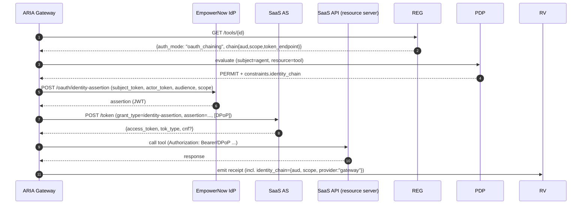
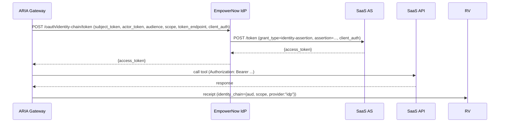

Below is a **drop‑in addendum (v1.1)** that fully implements **OAuth “Identity Chaining”** for EmpowerNow, layered on top of your already‑shipped ARIA v1 IdP + ARIA Gateway. It’s **developer‑to‑developer**, with diagrams, data contracts, config flags, and **complete runnable stubs**. You can enable chaining per‑tool behind a feature flag without breaking existing flows.

---

## 0) TL;DR (what this adds)

* **Two additive IdP endpoints** (behind a flag):

  * `POST /oauth/identity-assertion` → **mint an Identity Assertion JWT** (attests user identity for a target audience).
  * `POST /oauth/identity-chain/token` → **optional broker**: IdP exchanges that assertion at a downstream AS (SaaS) and returns an access token.
* **ARIA Gateway support** for chaining in **two modes**:

  1. **Delegated mode (recommended)**: ARIA requests assertion from IdP, exchanges **itself** at the SaaS token endpoint, and calls the tool using its **own** DPoP key (keeps Proof‑of‑Possession continuity).
  2. **Brokered mode**: IdP performs the exchange and returns the SaaS token to ARIA (simpler, but PoP continuity is limited).
* **Tool Registry extensions**: `auth_mode: "oauth_chaining"` + `chain{audience, scope, token_endpoint, client_auth}`.
* **PDP constraints** already present (`identity_chain.allowed_audiences/scopes`) are honored at runtime.
* **Receipts** include an `identity_chain` section (audience, scopes, provider, token hash).

Everything is **opt‑in** via `ENABLE_IDENTITY_CHAINING`.

Note: For a complete developer reference to the IdP changes, detailed endpoint semantics, settings/env, metrics, and examples, see `________newdesign10_idp_docs.md`.

---

## 1) Where it fits (Identity Fabric view)

```mermaid
flowchart LR
  subgraph Fabric
    IDP[EmpowerNow IdP<br/>OIDC/OAuth + RAR/PAR/JARM/DPoP +<br/>NEW: Identity Assertion + Broker]
    PDP[(PDP: AuthZEN)]
    MEM[(Membership: Neo4j/OpenFGA)]
    REG[Tool Registry]
    RV[(Receipt Vault)]
  end
  subgraph Data Plane
    ARIA[ARIA Gateway (MCP PEP)<br/>NEW: ChainClient + DPoP]
    TOOL[SaaS API / Resource Server]
    AS[SaaS Authorization Server]
  end

  ARIA -->|/evaluation| PDP
  PDP --> MEM
  ARIA --> REG
  ARIA --> RV

  %% Chaining paths
  ARIA -->|1) Delegated: /oauth/identity-assertion| IDP
  IDP -->|assertion (JWT)| ARIA
  ARIA -->|grant exchange| AS
  ARIA -->|Bearer/DPoP| TOOL

  %% Broker path
  ARIA -.->|2) Brokered: /oauth/identity-chain/token| IDP
  IDP -.->|access_token| ARIA
```

**Why two modes?** Some SaaS ASes require DPoP or MTLS at **token** and **resource** calls. If IdP performs the exchange with its own PoP key, ARIA can’t use that key at the resource. **Delegated mode** lets ARIA control PoP end‑to‑end.

---

## 2) Flows (sequence diagrams)

### 2.1 Delegated mode (recommended)



### 2.2 Brokered mode (optional)



---

## 3) Data contracts

### 3.1 Identity Assertion (JWT, issued by EmpowerNow IdP)

Minimal, draft‑aligned claim set:

```json
{
  "iss": "https://idp.empowernow.com",
  "sub": "pairwise:9a7b1c2d3e4f5a6b",          // per-user pairwise (sector: audience)
  "aud": "https://graph.microsoft.com",        // downstream audience
  "iat": 1735686000,
  "exp": 1735686300,                           // short TTL (e.g., 300s)
  "jti": "d8c3f2ad-0191-4e89-90b0-42a5f2e5ca1e",
  "act": {"sub": "agent:svc-123:for:9a7b1c2d3e4f5a6b"},
  "scp": ["User.Read"]                         // optional, from PDP allowlist
}
```

### 3.2 Tool Registry entry (extended)

```json
{
  "id": "mcp:m365:graph",
  "endpoint": "https://graph.microsoft.com/v1.0/me",
  "schema_version": "1.0.0",
  "schema_hash": "sha256:...",
  "auth_mode": "oauth_chaining",
  "risk_tier": "high",
  "chain": {
    "token_endpoint": "https://login.microsoftonline.com/common/oauth2/v2.0/token",
    "audience": "https://graph.microsoft.com",
    "scope": "User.Read",
    "client_auth": {
      "method": "client_secret_post",
      "client_id": "YOUR_APP_ID",
      "client_secret": "YOUR_SECRET"
    },
    "mode": "delegated"  // "delegated" | "brokered"
  }
}
```

> If **Tool Registry is disabled**, you can also pass chain config inside `authorization_details[].chain` (RAR). ARIA will prefer registry, then RAR.

### 3.3 PDP constraint (already supported; ensure policy emits)

```json
"identity_chain": {
  "allowed_audiences": ["https://graph.microsoft.com"],
  "allowed_scopes": ["User.Read","Calendars.Read"],
  "max_token_ttl_seconds": 300,
  "require_dpop": false
}
```

### 3.4 Receipt addition (hash‑chained JWS payload)

```json
"identity_chain": {
  "provider": "gateway",              // "gateway" or "idp"
  "audience": "https://graph.microsoft.com",
  "scopes": ["User.Read"],
  "token_hash": "sha256:3f7b...",
  "ttl_s": 300
}
```

---

## 4) Config & feature flags

| Key                          | Default           | Where     | Notes                                                           |
| ---------------------------- | ----------------- | --------- | --------------------------------------------------------------- |
| `ENABLE_IDENTITY_CHAINING`   | `false`           | IdP, ARIA | Global gate                                                     |
| `CHAIN_ASSERTION_TTL`        | `300`             | IdP       | Assertion lifetime (seconds)                                    |
| `CHAIN_TOKEN_CACHE_TTL`      | `300`             | ARIA      | Cache downstream tokens if you choose                           |
| `CHAIN_MODE_DEFAULT`         | `delegated`       | ARIA      | Fallback if registry lacks `chain.mode`                         |
| `IDP_BASE`                   | `http://idp:8082` | ARIA      | IdP base URL                                                    |
| `CHAIN_DPOP_PRIVATE_KEY_PEM` | *(unset)*         | ARIA      | Optional DPoP private key for **delegated** exchange & RS calls |
| `PDP_URL`                    | …                 | ARIA      | Already present                                                 |
| `REGISTRY_URL`               | …                 | ARIA      | Already present                                                 |

---

## 5) Code (drop‑in)

### 5.1 IdP — **Identity Assertion** (+ optional **Broker**)

**`idp/identity_chain.py`**

```python
import os, time, uuid
from typing import Optional, Dict, Any
from pydantic import BaseModel
from fastapi import HTTPException
from .utils import sign_jwt, pairwise, ISSUER

CHAIN_ASSERTION_TTL = int(os.getenv("CHAIN_ASSERTION_TTL", "300"))
ENABLE_IDENTITY_CHAINING = os.getenv("ENABLE_IDENTITY_CHAINING", "false").lower() == "true"

# ---- Request models
class IdentityAssertionGrant(BaseModel):
    grant_type: str = "urn:ietf:params:oauth:grant-type:identity-assertion"
    subject_token: str
    actor_token: Optional[str] = None
    audience: str
    scope: Optional[str] = None

class ChainBrokerRequest(BaseModel):
    subject_token: str
    actor_token: Optional[str] = None
    audience: str
    scope: Optional[str] = None
    token_endpoint: str
    client_auth: Dict[str, Any]   # {method, client_id, client_secret | private_key_jwt | mtls...}
    grant_urn: str = "urn:ietf:params:oauth:grant-type:identity-assertion"

async def _introspect(token: str) -> Dict[str, Any]:
    # TODO: replace with your production introspection/validation
    import jwt
    try:
        return jwt.decode(token, options={"verify_signature": False})
    except Exception:
        return {"sub": "user:unknown", "client_id": "svc-unknown"}

async def mint_identity_assertion(user_sub: str, agent_id: str, audience: str, scope: Optional[str]) -> str:
    now = int(time.time())
    claims = {
        "iss": ISSUER,
        "sub": user_sub,
        "aud": audience,
        "iat": now,
        "exp": now + CHAIN_ASSERTION_TTL,
        "jti": str(uuid.uuid4()),
        "act": {"sub": agent_id},
    }
    if scope:
        claims["scp"] = [s for s in scope.split(" ") if s]
    return sign_jwt(claims)

async def handle_identity_assertion(req: IdentityAssertionGrant):
    if not ENABLE_IDENTITY_CHAINING:
        raise HTTPException(404, "feature_disabled")

    sub_claims = await _introspect(req.subject_token)
    user_id = sub_claims.get("sub")
    if not user_id:
        raise HTTPException(400, "invalid_subject_token")

    if req.actor_token:
        act_claims = await _introspect(req.actor_token)
        service_id = act_claims.get("client_id") or act_claims.get("azp")
    else:
        service_id = "svc-implicit"

    pw = pairwise(user_id, req.audience)  # sector: audience
    agent_id = f"agent:{service_id}:for:{pw.split(':')[1]}"
    return await mint_identity_assertion(pw, agent_id, req.audience, req.scope)

async def handle_broker(req: ChainBrokerRequest, http):
    if not ENABLE_IDENTITY_CHAINING:
        raise HTTPException(404, "feature_disabled")

    ia = await handle_identity_assertion(IdentityAssertionGrant(
        subject_token=req.subject_token, actor_token=req.actor_token,
        audience=req.audience, scope=req.scope
    ))

    form = {"grant_type": req.grant_urn, "assertion": ia, "audience": req.audience}
    if req.scope:
        form["scope"] = req.scope

    # Client auth (extend as needed)
    if req.client_auth.get("method") == "client_secret_post":
        form["client_id"] = req.client_auth["client_id"]
        form["client_secret"] = req.client_auth["client_secret"]

    resp = await http.post(req.token_endpoint, data=form, headers={"Accept": "application/json"})
    resp.raise_for_status()
    return resp.json()
```

**`idp/main.py` (add endpoints)**

```python
# ... existing imports ...
from .identity_chain import IdentityAssertionGrant, ChainBrokerRequest, handle_identity_assertion, handle_broker

@app.post("/oauth/identity-assertion")
async def identity_assertion(req: IdentityAssertionGrant):
    jwt_ = await handle_identity_assertion(req)
    return {"assertion": jwt_, "token_type": "urn:ietf:params:oauth:token-type:jwt", "expires_in": CHAIN_ASSERTION_TTL}

@app.post("/oauth/identity-chain/token")
async def identity_chain_token(req: ChainBrokerRequest):
    out = await handle_broker(req, app.state.http)
    return out
```

> These endpoints are **additive**; your `/api/oidc/token` stays as‑is.

---

### 5.2 ARIA Gateway — **ChainClient + DPoP** and main hook

**`aria/util/dpop.py`** (DPoP generator for delegated exchange & RS calls)

```python
import os, json, time, base64, hashlib, uuid
from typing import Dict
from cryptography.hazmat.primitives import serialization, hashes
from cryptography.hazmat.primitives.asymmetric import ec, rsa, padding

PRIVATE_KEY_PEM = os.getenv("CHAIN_DPOP_PRIVATE_KEY_PEM", None)

def _load_private_key():
    if not PRIVATE_KEY_PEM:
        return None
    return serialization.load_pem_private_key(PRIVATE_KEY_PEM.encode(), password=None)

def _b64u(b: bytes) -> str:
    return base64.urlsafe_b64encode(b).rstrip(b"=").decode()

def _jwk_thumbprint(jwk: Dict[str, str]) -> str:
    if jwk["kty"] == "RSA":
        canonical = json.dumps({"e": jwk["e"], "kty": "RSA", "n": jwk["n"]}, separators=(",", ":"), sort_keys=True)
    else:
        canonical = json.dumps({"crv": jwk["crv"], "kty": "EC", "x": jwk["x"], "y": jwk["y"]}, separators=(",", ":"), sort_keys=True)
    return _b64u(hashlib.sha256(canonical.encode()).digest())

def _public_jwk(key) -> Dict[str, str]:
    if isinstance(key, rsa.RSAPrivateKey):
        public = key.public_key().public_numbers()
        n = _b64u(public.n.to_bytes((public.n.bit_length()+7)//8, 'big'))
        e = _b64u(public.e.to_bytes((public.e.bit_length()+7)//8, 'big'))
        return {"kty":"RSA", "n":n, "e":e}
    elif isinstance(key, ec.EllipticCurvePrivateKey):
        public = key.public_key().public_numbers()
        x = _b64u(public.x.to_bytes((public.x.bit_length()+7)//8, 'big'))
        y = _b64u(public.y.to_bytes((public.y.bit_length()+7)//8, 'big'))
        crv = {256:"P-256",384:"P-384",521:"P-521"}[key.key_size]
        return {"kty":"EC", "crv":crv, "x":x, "y":y}
    else:
        raise ValueError("unsupported key")

def make_dpop_header(method: str, htu: str) -> Dict[str, str]:
    """
    Create DPoP header for the given HTTP method and URL.
    Returns {"DPoP": "<jwt>"} or {} if no key configured.
    """
    key = _load_private_key()
    if not key:
        return {}
    jwk = _public_jwk(key)
    header = {"typ":"dpop+jwt", "alg":"ES256" if isinstance(key, ec.EllipticCurvePrivateKey) else "RS256", "jwk": jwk}
    now = int(time.time())
    payload = {"htu": htu, "htm": method, "iat": now, "jti": str(uuid.uuid4())}
    import jwt
    token = jwt.encode(payload, key, algorithm=header["alg"], headers=header)
    return {"DPoP": token}, _jwk_thumbprint(jwk)
```

**`aria/clients/chain_client.py`**

```python
import os, httpx, json, hashlib
from typing import Optional, Dict, Any, Tuple
from ..util.dpop import make_dpop_header

IDP_BASE = os.getenv("IDP_BASE", "http://idp:8082")
CHAIN_MODE_DEFAULT = os.getenv("CHAIN_MODE_DEFAULT", "delegated")
CHAIN_TOKEN_CACHE_TTL = int(os.getenv("CHAIN_TOKEN_CACHE_TTL", "300"))

class ChainClient:
    def __init__(self, timeout: float = 3.0):
        self.http = httpx.AsyncClient(timeout=timeout)

    @staticmethod
    def _sha256_hex(s: str) -> str:
        return hashlib.sha256(s.encode()).hexdigest()

    async def get_assertion(self, subject_token: str, actor_token: str, audience: str, scope: Optional[str]) -> str:
        body = {"subject_token": subject_token, "actor_token": actor_token, "audience": audience}
        if scope: body["scope"] = scope
        r = await self.http.post(f"{IDP_BASE}/oauth/identity-assertion", json=body)
        r.raise_for_status()
        return r.json()["assertion"]

    async def exchange_delegated(self, assertion: str, audience: str, scope: Optional[str], token_endpoint: str) -> Dict[str, Any]:
        form = {"grant_type":"urn:ietf:params:oauth:grant-type:identity-assertion","assertion": assertion, "audience": audience}
        if scope: form["scope"] = scope
        # Optional DPoP at token endpoint (only if you configured a key)
        headers = {"Accept":"application/json"}
        dpop_hdr, _ = make_dpop_header("POST", token_endpoint)
        headers.update(dpop_hdr)
        r = await self.http.post(token_endpoint, data=form, headers=headers)
        r.raise_for_status()
        return r.json()

    async def exchange_brokered(self, subject_token: str, actor_token: str, audience: str, scope: Optional[str],
                                token_endpoint: str, client_auth: Dict[str, Any]) -> Dict[str, Any]:
        body = {"subject_token":subject_token, "actor_token":actor_token, "audience":audience,
                "scope":scope, "token_endpoint":token_endpoint, "client_auth":client_auth}
        r = await self.http.post(f"{IDP_BASE}/oauth/identity-chain/token", json=body)
        r.raise_for_status()
        return r.json()

    async def get_access_token(self, mode: str, subject_token: str, actor_token: str,
                               chain_cfg: Dict[str, Any]) -> Tuple[str, Optional[str]]:
        """
        Returns (access_token, jkt_or_none). If DPoP used at token endpoint and AS echoes cnf, you may need to carry PoP.
        """
        audience = chain_cfg["audience"]; scope = chain_cfg.get("scope")
        token_endpoint = chain_cfg["token_endpoint"]
        if mode == "delegated":
            assertion = await self.get_assertion(subject_token, actor_token, audience, scope)
            out = await self.exchange_delegated(assertion, audience, scope, token_endpoint)
            return out.get("access_token"), (out.get("cnf") or {}).get("jkt")
        else:
            out = await self.exchange_brokered(subject_token, actor_token, audience, scope,
                                               token_endpoint, chain_cfg["client_auth"])
            return out.get("access_token"), (out.get("cnf") or {}).get("jkt")
```

**`aria/main.py` (hook inside `/mcp/{tool_id}`)**

```python
# ... existing imports ...
from .clients.chain_client import ChainClient
from .util.dpop import make_dpop_header

ENABLE_IDENTITY_CHAINING = os.getenv("ENABLE_IDENTITY_CHAINING","false").lower()=="true"
CHAIN_MODE_DEFAULT = os.getenv("CHAIN_MODE_DEFAULT","delegated")
chain_client = ChainClient()

def _resolve_chain_config(tool_meta: dict, rar_chain: dict | None) -> tuple[dict | None, str]:
    if tool_meta.get("auth_mode") == "oauth_chaining":
        cfg = tool_meta.get("chain") or {}
        mode = (cfg.get("mode") or CHAIN_MODE_DEFAULT).lower()
        return cfg, mode
    if rar_chain:
        return rar_chain, (rar_chain.get("mode") or CHAIN_MODE_DEFAULT).lower()
    return None, CHAIN_MODE_DEFAULT

@app.post("/mcp/{tool_id}")
async def mcp(tool_id: str, request: Request, authorization: str = Header(...)):
    # ... existing ARIA passport verification, PDP, egress, shaped params, etc ...
    passport = jwt.decode(authorization.replace("Bearer ", ""), options={"verify_signature": False})
    rar = (passport.get("authorization_details") or [None])[0] or {}
    rar_chain = rar.get("chain")

    tool_meta = await registry.get_tool(tool_id)

    extra_headers = {}
    id_chain_snapshot = None

    if ENABLE_IDENTITY_CHAINING:
        chain_cfg, mode = _resolve_chain_config(tool_meta, rar_chain)
        if chain_cfg:
            audience = chain_cfg["audience"]
            scope = chain_cfg.get("scope")
            # Policy gate: ensure PDP allowed
            ic = (constraints or {}).get("identity_chain") or {}
            if ic and (audience not in set(ic.get("allowed_audiences", []))):
                raise HTTPException(403, "identity_chain.audience_not_allowed")
            if ic and scope:
                not_allowed = [s for s in scope.split() if s not in set(ic.get("allowed_scopes", []))]
                if not_allowed: raise HTTPException(403, "identity_chain.scope_not_allowed")

            # Acquire downstream token
            subject_token = authorization.replace("Bearer ", "")
            actor_token = subject_token  # Your policy can differentiate; using same passport is fine
            access_token, jkt = await chain_client.get_access_token(mode, subject_token, actor_token, chain_cfg)

            # Authorization for RS call
            extra_headers["Authorization"] = f"Bearer {access_token}"
            # Optional DPoP at RS (if ARIA configured with PoP key)
            rs_dpop_hdr, _ = make_dpop_header("POST", tool_meta["endpoint"])
            extra_headers.update(rs_dpop_hdr)

            # For receipt
            id_chain_snapshot = {
                "provider": "gateway" if mode=="delegated" else "idp",
                "audience": audience,
                "scopes": scope.split() if scope else [],
                "token_hash": "sha256:" + hashlib.sha256(access_token.encode()).hexdigest(),
                "ttl_s": int((ic or {}).get("max_token_ttl_seconds") or 0)
            }

    # Forward to tool
    async with httpx.AsyncClient(timeout=15.0) as http:
        r = await http.post(tool_meta["endpoint"], json=shaped,
                            headers={"X-Delegator-ID": passport["sub"], "X-Agent-ID": agent_id, **extra_headers})
    r.raise_for_status()
    resp_json = r.json()

    # Emit receipt (add identity_chain if present)
    payload = {
        "id": str(uuid.uuid4()),
        "call_id": call_id,
        "agent_id": agent_id,
        "resource": {"type":"tool","id":tool_id},
        "decision": "Allow",
        "policy_snapshot": constraints,
        "schema_hash": schema_pin["schema_hash"],
        "params_hash": canonical_params_hash(shaped),
        "usage": None
    }
    if id_chain_snapshot:
        payload["identity_chain"] = id_chain_snapshot

    prev = await app.state.redis.get(f"receipt:last:{agent_id}") or b"0"*64
    rec = await receipts.emit({**payload, "_prev_hash": prev.decode() if isinstance(prev,bytes) else prev})
    await app.state.redis.set(f"receipt:last:{agent_id}", rec["hash"], ex=86400)

    return resp_json
```

> The hook respects the PDP `identity_chain` constraint and only runs when **registry** or **RAR** asks for chaining.

---

### 5.3 Tool Registry — example entry & unchanged server

If you already deployed the Registry service from ARIA v1, no code changes are required beyond **data**. Insert entries like the JSON in §3.2.

---

### 5.4 PDP — already emits `identity_chain` (no API change)

If needed, ensure your policy writes:

```python
constraints["identity_chain"] = {
    "allowed_audiences": audiences_from_membership_or_policy,
    "allowed_scopes": scopes_from_membership_or_policy,
    "max_token_ttl_seconds": 300,
    "require_dpop": False
}
```

---

### 5.5 Membership — (unchanged surface)

Your existing endpoint from the earlier add‑on suffices:

```
GET /membership/v1/chain-eligibility?user_id=...&agent_id=...&tool_id=...
→ [{audience:"https://graph.microsoft.com", scopes:["User.Read"]}]
```

PDP consumes it to construct the constraint above.

---

### 5.6 Tests (happy‑path)

**`tests/test_identity_chaining.py`** (pseudo‑unit showing glue)

```python
import asyncio, jwt
from aria.clients.chain_client import ChainClient

async def test_delegated_flow(monkeypatch):
    cc = ChainClient()

    class FakeHTTP:
        async def post(self, url, data=None, json=None, headers=None):
            class R:
                def raise_for_status(self): return None
                def json(self):
                    if "identity-assertion" in url:
                        return {"assertion": jwt.encode({"sub":"pairwise:abc"}, "secret", algorithm="none")}
                    elif "token" in url and "idp" not in url:
                        return {"access_token": "at-downstream"}
            return R()
    cc.http = FakeHTTP()
    at, jkt = await cc.get_access_token("delegated", "subtok", "acttok", {
        "audience":"https://graph.microsoft.com",
        "scope":"User.Read",
        "token_endpoint":"https://login.microsoftonline.com/common/oauth2/v2.0/token"
    })
    assert at == "at-downstream"
```

---

## 6) Observability & receipts

* **Receipts** already exist; we added `identity_chain` snapshot (audience, scopes, provider, token hash).
* **Metrics**: add counters

  * `aria.chain.requests_total{mode}`
  * `aria.chain.failures_total{reason}`
  * `aria.chain.tokens_issued_total{audience}`
* **Logs**: never log raw downstream tokens; only the **sha256**.

---

## 7) Docker compose deltas

```yaml
services:
  idp:
    environment:
      - ENABLE_IDENTITY_CHAINING=true
      - CHAIN_ASSERTION_TTL=300

  aria:
    environment:
      - ENABLE_IDENTITY_CHAINING=true
      - CHAIN_MODE_DEFAULT=delegated
      - IDP_BASE=http://idp:8082
      # Optional PoP at token/RS:
      # - CHAIN_DPOP_PRIVATE_KEY_PEM=${ARIA_CHAIN_DPOP_PRIVATE_KEY_PEM}
```

---

## 8) Security notes & hardening

* **Fail‑closed**: If PDP does not allow the requested audience/scope, ARIA denies before token acquisition.
* **Short TTL**: keep `CHAIN_ASSERTION_TTL ≤ 300s`. Cache tokens ≤ policy TTL.
* **PoP continuity**: Prefer **delegated mode** so ARIA uses its own DPoP key for both token exchange and RS calls.
* **Key mgmt**: If enabling DPoP in ARIA, store `CHAIN_DPOP_PRIVATE_KEY_PEM` in KMS/HSM; rotate regularly.
* **Audit**: Receipts + Analytics can reconstruct chain decisions without storing token bodies.

---

## 9) Backward compatibility

* With `ENABLE_IDENTITY_CHAINING=false`, everything behaves exactly like v1.
* You can enable chaining **per tool** by setting `auth_mode: "oauth_chaining"` in the registry (or by passing `authorization_details[].chain` in RAR).

---

## 10) What to wire first (minimal rollout)

1. Add the **two IdP endpoints** and flip `ENABLE_IDENTITY_CHAINING=true` in **dev**.
2. Enable **delegated mode** for a single low‑risk tool entry in the **Registry**.
3. Verify PDP emits `identity_chain` for that tool/audience/scope.
4. Run the **delegated** happy path; inspect **receipts** for the `identity_chain` section.
5. (Optional) Try **brokered** mode and compare.

---

**That’s the complete addendum.** It gives you end‑to‑end identity chaining with a minimal surface area, flexible deployment (delegated vs brokered), strong policy gates, and PoP‑ready plumbing—without disturbing your v1 contracts.
