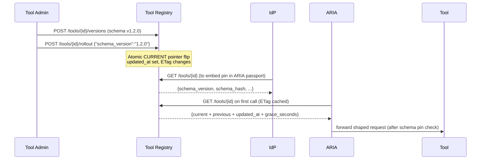

Below is a **drop‑in, production‑ready Tool Registry v1** that cleanly fits the **EmpowerNow Identity Fabric** and plugs straight into your **ARIA Gateway**, **IdP**, and **PDP** from the ARIA v1 design. It’s a **separate microservice** (FastAPI + SQLAlchemy + SQLite/Postgres), purpose‑built for **schema pins, atomic version flips, rollout grace windows, ETags**, and an **optional signed “schema pin” JWS** for downstream integrity.

---

## 0) Where this fits (Identity Fabric view)

The Tool Registry is a **catalog** of MCP/HTTP tools. It’s **not** identity/graph data (that’s Membership), and **not** policy (that’s PDP). It enables **verifiable request shaping** by giving the control plane a **hash‑pinned interface** to every tool an agent may call.

### Why V1 is needed

* **IdP** (with RAR/PAR/JARM/DPoP/OBO support) issues **ARIA passports**. During token exchange it **pins** tool schemas via this registry and embeds `{schema_version, schema_hash}` per tool into the token.
* **ARIA Gateway** enforces runtime: it fetches current metadata and **verifies the pin** (exact match or **previous version** within a **rollout grace window**), then applies constraints and egress controls.
* **PDP** doesn’t need registry data to decide; it relies on **Membership** for capabilities/tenancy and the gateway for schema‑pin verification.
* **Receipts** store the registry’s **policy snapshot + schema hash** for audit.

This separation keeps failure domains tight (catalog read QPS ≫ graph) and allows **CDN/ETag caching** for hot paths.

---

## 1) Architecture & flows

### 1.1 Landscape (EmpowerNow Identity Fabric)

```mermaid
flowchart LR
  subgraph Clients
    AG[AI Agent (MCP client)]
    HU[Human UI]
  end

  subgraph ControlPlane
    IDP[EmpowerNow IdP<br/>(RAR, PAR, JARM, DPoP, OBO)]
    PDP[AuthZEN PDP]
    MEM[Membership (Neo4j/OpenFGA)]
    REG[Tool Registry (this service)]
    RV[Receipt Vault]
  end

  subgraph DataPlane
    ARIA[ARIA Gateway (MCP-aware PEP)]
    BFF[LLM BFF]
    TOOLS[MCP Tools / HTTP APIs]
    LLMs[Model Providers]
  end

  HU -->|REST/SSE| BFF
  AG -->|MCP| ARIA
  ARIA -->|HTTP| TOOLS
  BFF -->|API| LLMs

  ARIA -->|/evaluation| PDP
  BFF  -->|/evaluation| PDP
  PDP  -->|PIPs| MEM

  IDP -->|token exchange + schema pins| REG
  ARIA -->|"GET /tools/{id}"| REG
  ARIA -->|emit receipts| RV
  BFF  -->|emit receipts| RV
```

### 1.2 Publish → Flip → Runtime



---

## 2) Data model (catalog)

**Entities**

* **Tool** (`id`, `risk_tier`, `auth_mode`, `grace_seconds`, `cost_per_call`, `current_version_id`, `current_set_at`)
* **ToolVersion** (`tool_id`, `schema_version`, `schema_hash`, `endpoint`, `schema_json`, `created_at`)

**Key guarantees**

* Exactly **one CURRENT version** per tool (atomic pointer flip).
* **Schema hash** = `sha256(canonical_json(schema_json))`.
* **Rollout grace**: gateway may accept **previous** version for `grace_seconds` after `current_set_at`.
* **ETag** on GET /tools/{id} = SHA‑256 of the response body → **conditional GET** friendly.

---

## 3) API surface (stable for v1)

* `GET /tools/{tool_id}` → **current + previous** metadata (used by IdP & ARIA).
  Returns:

  ```json
  {
    "id":"mcp:flights:search",
    "endpoint":"https://.../search",
    "schema_version":"1.2.0",
    "schema_hash":"sha256:...",
    "previous_version":"1.1.9",
    "previous_hash":"sha256:...",
    "updated_at":1735670000,
    "grace_seconds":14400,
    "risk_tier":"med",
    "auth_mode":"api_key",
    "cost_per_call":0.05
  }
  ```

  Headers: `ETag`, `Cache-Control: public, max-age=60`.

* `HEAD /tools/{tool_id}` → same ETag/CC headers, empty body.

* `GET /tools/{tool_id}/versions` → list versions.

* `GET /pins/{tool_id}` or `GET /tools/{tool_id}/pin` → minimal pin payload:
  `{"schema_version":"1.2.0","schema_hash":"sha256:...","updated_at":1735670000,"grace_seconds":14400}`
  Add `?format=jws` to receive a signed JWS (if signing key configured).

**Admin (write) endpoints** *(protected; see Security)*:

* `POST /tools` → create tool.
* `POST /tools/{tool_id}/versions` → add version (with schema & endpoint).
* `POST /tools/{tool_id}/rollout` → set CURRENT by `schema_version`.

---

## 4) Drop‑in code (FastAPI + SQLAlchemy)

> Files are shown with paths under `tool_registry/`. They run as‑is with SQLite for local dev (or Postgres in prod).

### 4.1 `tool_registry/main.py`

```python
# tool_registry/main.py
from fastapi import FastAPI, HTTPException, Request, Header, Response, Depends
from pydantic import BaseModel, Field
from typing import Optional, List, Dict, Any, Tuple
from datetime import datetime, timezone
import os, json, hashlib

from sqlalchemy import (
    create_engine, MetaData, Table, Column, String, Integer, Float, Text,
    DateTime, ForeignKey, UniqueConstraint, select, insert, update, func
)
from sqlalchemy.engine import Engine
from sqlalchemy.exc import IntegrityError
from sqlalchemy.pool import StaticPool

import jwt  # PyJWT

# ----------------------------
# Config
# ----------------------------
REGISTRY_DB_URL = os.getenv("REGISTRY_DB_URL", "sqlite:///./registry.db")
ADMIN_TOKEN = os.getenv("ADMIN_TOKEN", "dev-admin")              # local dev guard
GRACE_SECONDS_DEFAULT = int(os.getenv("GRACE_SECONDS_DEFAULT", "14400"))
PIN_SIGNING_KEY_PEM = os.getenv("PIN_SIGNING_KEY_PEM")           # optional RS256 PEM
PIN_JWS_KID = os.getenv("PIN_JWS_KID", "tr-001")
ISSUER = os.getenv("TOOL_REGISTRY_ISSUER", "https://tool-registry.local")

# ----------------------------
# DB bootstrap
# ----------------------------
engine: Engine
if REGISTRY_DB_URL.startswith("sqlite"):
    # sqlite needs check_same_thread=False for FastAPI multi-thread
    engine = create_engine(
        REGISTRY_DB_URL,
        connect_args={"check_same_thread": False},
        poolclass=StaticPool if REGISTRY_DB_URL.endswith(":memory:") else None,
        future=True,
    )
else:
    engine = create_engine(REGISTRY_DB_URL, future=True)

meta = MetaData()

tools = Table(
    "tools", meta,
    Column("id", String, primary_key=True),
    Column("risk_tier", String, nullable=True),
    Column("auth_mode", String, nullable=False, default="api_key"),
    Column("grace_seconds", Integer, nullable=False, default=GRACE_SECONDS_DEFAULT),
    Column("cost_per_call", Float, nullable=True),
    Column("current_version_id", Integer, ForeignKey("tool_versions.id"), nullable=True),
    Column("current_set_at", DateTime(timezone=True), nullable=True),
    Column("created_at", DateTime(timezone=True), nullable=False, server_default=func.now()),
    Column("updated_at", DateTime(timezone=True), nullable=False, server_default=func.now(), onupdate=func.now()),
)

tool_versions = Table(
    "tool_versions", meta,
    Column("id", Integer, primary_key=True, autoincrement=True),
    Column("tool_id", String, ForeignKey("tools.id"), nullable=False),
    Column("schema_version", String, nullable=False),
    Column("schema_hash", String, nullable=False),
    Column("endpoint", String, nullable=False),
    Column("schema_json", Text, nullable=True),  # canonical JSON stored as text
    Column("created_at", DateTime(timezone=True), nullable=False, server_default=func.now()),
    UniqueConstraint("tool_id", "schema_version", name="uq_tool_version")
)

with engine.begin() as conn:
    meta.create_all(conn)

# ----------------------------
# Helpers
# ----------------------------
def utcnow() -> datetime:
    return datetime.now(timezone.utc)

def canonical_json(obj: Any) -> str:
    """Deterministic dump suitable for hashing."""
    if isinstance(obj, str):
        # assume already JSON text
        try:
            parsed = json.loads(obj)
            return json.dumps(parsed, separators=(",", ":"), sort_keys=True)
        except Exception:
            return json.dumps(obj, separators=(",", ":"), sort_keys=True)
    return json.dumps(obj, separators=(",", ":"), sort_keys=True)

def schema_hash_of(obj: Any) -> str:
    canon = canonical_json(obj)
    return "sha256:" + hashlib.sha256(canon.encode("utf-8")).hexdigest()

def etag_for_payload(payload: Dict[str, Any]) -> str:
    body = canonical_json(payload)
    return hashlib.sha256(body.encode("utf-8")).hexdigest()

def admin_guard(authorization: Optional[str]) -> None:
    if not ADMIN_TOKEN:
        return
    # Simple dev guard; replace with JWT/OPA/mTLS as needed
    token = (authorization or "").replace("Bearer ", "")
    if token != ADMIN_TOKEN:
        raise HTTPException(401, "admin auth required")

def sign_pin_jws(payload: Dict[str, Any]) -> Optional[str]:
    if not PIN_SIGNING_KEY_PEM:
        return None
    headers = {"alg": "RS256", "kid": PIN_JWS_KID, "typ": "JWT"}
    to_sign = {
        "iss": ISSUER,
        "iat": int(utcnow().timestamp()),
        **payload
    }
    return jwt.encode(to_sign, PIN_SIGNING_KEY_PEM, algorithm="RS256", headers=headers)

# ----------------------------
# Pydantic models
# ----------------------------
class ToolCreate(BaseModel):
    id: str
    risk_tier: Optional[str] = "low"
    auth_mode: str = "api_key"  # "api_key" | "oauth_chaining"
    grace_seconds: Optional[int] = None
    cost_per_call: Optional[float] = None

class ToolVersionCreate(BaseModel):
    schema_version: str
    endpoint: str
    schema: Dict[str, Any] | List[Any] | str = Field(default_factory=dict)
    activate: bool = False

class RolloutRequest(BaseModel):
    schema_version: str

class ToolVersionOut(BaseModel):
    id: int
    tool_id: str
    schema_version: str
    schema_hash: str
    endpoint: str
    created_at: datetime

class ToolMetaOut(BaseModel):
    id: str
    endpoint: str
    schema_version: str
    schema_hash: str
    previous_version: Optional[str] = None
    previous_hash: Optional[str] = None
    updated_at: int                      # epoch secs of CURRENT pointer
    grace_seconds: int
    risk_tier: Optional[str] = None
    auth_mode: str
    cost_per_call: Optional[float] = None

class PinOut(BaseModel):
    schema_version: str
    schema_hash: str
    updated_at: int
    grace_seconds: int

# ----------------------------
# Query helpers
# ----------------------------
def _fetch_current_and_prev(conn, tool_id: str) -> Tuple[Optional[dict], Optional[dict], Optional[dict]]:
    t = conn.execute(select(tools).where(tools.c.id == tool_id)).mappings().first()
    if not t:
        return None, None, None
    cur = None
    prev = None
    if t["current_version_id"]:
        cur = conn.execute(select(tool_versions).where(tool_versions.c.id == t["current_version_id"])).mappings().first()
        prev = conn.execute(
            select(tool_versions)
            .where((tool_versions.c.tool_id == tool_id) & (tool_versions.c.id != t["current_version_id"]))
            .order_by(tool_versions.c.created_at.desc())
        ).mappings().first()
    else:
        # No CURRENT yet; pick latest as "previous" (exposed as None current if truly empty)
        prev = conn.execute(
            select(tool_versions)
            .where(tool_versions.c.tool_id == tool_id)
            .order_by(tool_versions.c.created_at.desc())
        ).mappings().first()
    return t, cur, prev

def _meta_payload(tool_row: dict, cur: dict | None, prev: dict | None) -> Dict[str, Any]:
    if not cur:
        raise HTTPException(404, "tool has no CURRENT version")
    return {
        "id": tool_row["id"],
        "endpoint": cur["endpoint"],
        "schema_version": cur["schema_version"],
        "schema_hash": cur["schema_hash"],
        "previous_version": prev["schema_version"] if prev else None,
        "previous_hash": prev["schema_hash"] if prev else None,
        "updated_at": int((tool_row["current_set_at"] or tool_row["updated_at"]).timestamp()),
        "grace_seconds": int(tool_row["grace_seconds"] or GRACE_SECONDS_DEFAULT),
        "risk_tier": tool_row["risk_tier"],
        "auth_mode": tool_row["auth_mode"],
        "cost_per_call": tool_row["cost_per_call"],
    }

# ----------------------------
# FastAPI app
# ----------------------------
app = FastAPI(title="Tool Registry v1", version="1.0.0")

@app.get("/healthz")
def healthz():
    return {"ok": True, "ts": int(utcnow().timestamp())}

# ---- Admin endpoints
@app.post("/tools", status_code=201)
def create_tool(body: ToolCreate, authorization: Optional[str] = Header(None)):
    admin_guard(authorization)
    with engine.begin() as conn:
        try:
            conn.execute(insert(tools).values(
                id=body.id,
                risk_tier=body.risk_tier,
                auth_mode=body.auth_mode,
                grace_seconds=body.grace_seconds or GRACE_SECONDS_DEFAULT,
                cost_per_call=body.cost_per_call,
                current_version_id=None,
                current_set_at=None
            ))
        except IntegrityError:
            raise HTTPException(409, "tool already exists")
    return {"id": body.id}

@app.post("/tools/{tool_id}/versions", response_model=ToolVersionOut, status_code=201)
def add_version(tool_id: str, body: ToolVersionCreate, authorization: Optional[str] = Header(None)):
    admin_guard(authorization)
    with engine.begin() as conn:
        t = conn.execute(select(tools).where(tools.c.id == tool_id)).first()
        if not t:
            raise HTTPException(404, "tool not found")

        h = schema_hash_of(body.schema)
        canon = canonical_json(body.schema)
        try:
            res = conn.execute(insert(tool_versions).values(
                tool_id=tool_id,
                schema_version=body.schema_version,
                schema_hash=h,
                endpoint=body.endpoint,
                schema_json=canon
            ))
            ver_id = res.inserted_primary_key[0]
        except IntegrityError:
            raise HTTPException(409, "schema_version already exists for tool")

        if body.activate:
            conn.execute(update(tools)
                .where(tools.c.id == tool_id)
                .values(current_version_id=ver_id, current_set_at=utcnow()))

        row = conn.execute(select(tool_versions).where(tool_versions.c.id == ver_id)).mappings().first()
        return {
            "id": row["id"], "tool_id": row["tool_id"], "schema_version": row["schema_version"],
            "schema_hash": row["schema_hash"], "endpoint": row["endpoint"], "created_at": row["created_at"]
        }

@app.post("/tools/{tool_id}/rollout")
def rollout(tool_id: str, body: RolloutRequest, authorization: Optional[str] = Header(None)):
    admin_guard(authorization)
    with engine.begin() as conn:
        ver = conn.execute(
            select(tool_versions).where(
                (tool_versions.c.tool_id == tool_id) & (tool_versions.c.schema_version == body.schema_version)
            )
        ).mappings().first()
        if not ver:
            raise HTTPException(404, "schema_version not found for tool")

        conn.execute(update(tools)
            .where(tools.c.id == tool_id)
            .values(current_version_id=ver["id"], current_set_at=utcnow()))
    return {"id": tool_id, "current": body.schema_version}

# ---- Read endpoints (IdP / ARIA hot path)
@app.get("/tools/{tool_id}", response_model=ToolMetaOut)
def get_tool(tool_id: str, request: Request, response: Response):
    with engine.begin() as conn:
        t, cur, prev = _fetch_current_and_prev(conn, tool_id)
        if not t:
            raise HTTPException(404, "tool not found")
        if not cur:
            raise HTTPException(404, "tool has no CURRENT version")

        payload = _meta_payload(t, cur, prev)
        etag = etag_for_payload(payload)
        inm = request.headers.get("if-none-match")
        response.headers["ETag"] = etag
        response.headers["Cache-Control"] = "public, max-age=60"
        if inm and inm == etag:
            response.status_code = 304
            return Response(status_code=304)
        return payload

@app.head("/tools/{tool_id}")
def head_tool(tool_id: str, response: Response):
    with engine.begin() as conn:
        t, cur, prev = _fetch_current_and_prev(conn, tool_id)
        if not t or not cur:
            raise HTTPException(404, "tool not found or no CURRENT version")
        payload = _meta_payload(t, cur, prev)
        response.headers["ETag"] = etag_for_payload(payload)
        response.headers["Cache-Control"] = "public, max-age=60"
    return Response(status_code=200)

@app.get("/tools/{tool_id}/versions", response_model=List[ToolVersionOut])
def list_versions(tool_id: str):
    with engine.begin() as conn:
        rows = conn.execute(
            select(tool_versions).where(tool_versions.c.tool_id == tool_id).order_by(tool_versions.c.created_at.desc())
        ).mappings().all()
    return [
        {"id": r["id"], "tool_id": r["tool_id"], "schema_version": r["schema_version"],
         "schema_hash": r["schema_hash"], "endpoint": r["endpoint"], "created_at": r["created_at"]}
        for r in rows
    ]

@app.get("/pins/{tool_id}", response_model=PinOut)
@app.get("/tools/{tool_id}/pin", response_model=PinOut)
def pin(tool_id: str, format: Optional[str] = None):
    with engine.begin() as conn:
        t, cur, prev = _fetch_current_and_prev(conn, tool_id)
        if not t or not cur:
            raise HTTPException(404, "tool not found or no CURRENT version")
        payload = {
            "schema_version": cur["schema_version"],
            "schema_hash": cur["schema_hash"],
            "updated_at": int((t["current_set_at"] or t["updated_at"]).timestamp()),
            "grace_seconds": int(t["grace_seconds"] or GRACE_SECONDS_DEFAULT),
        }
        if format == "jws":
            j = sign_pin_jws({"tool_id": tool_id, **payload})
            if not j:
                raise HTTPException(501, "pin signing not configured")
            # Return compact JWS as text
            return Response(content=j, media_type="application/jwt")
        return payload

# ---- Dev seed (optional)
@app.on_event("startup")
def maybe_seed():
    if os.getenv("REGISTRY_AUTOCREATE_SAMPLE", "false").lower() != "true":
        return
    with engine.begin() as conn:
        # create tool if missing
        t = conn.execute(select(tools).where(tools.c.id == "mcp:flights:search")).first()
        if not t:
            conn.execute(insert(tools).values(
                id="mcp:flights:search", risk_tier="med", auth_mode="api_key",
                grace_seconds=GRACE_SECONDS_DEFAULT, cost_per_call=0.05
            ))
        # add v1.1.9 & v1.2.0 if missing
        for v, endpoint in [("1.1.9", "https://tools.example.com/mcp/flights/search"),
                            ("1.2.0", "https://tools.example.com/mcp/flights/search")]:
            exists = conn.execute(select(tool_versions).where(
                (tool_versions.c.tool_id == "mcp:flights:search") & (tool_versions.c.schema_version == v)
            )).first()
            if not exists:
                sh = schema_hash_of({"type": "object", "title": "search", "version": v})
                canon = canonical_json({"type": "object", "title": "search", "version": v})
                res = conn.execute(insert(tool_versions).values(
                    tool_id="mcp:flights:search", schema_version=v, schema_hash=sh,
                    endpoint=endpoint, schema_json=canon
                ))
                if v == "1.2.0":
                    conn.execute(update(tools)
                                 .where(tools.c.id == "mcp:flights:search")
                                 .values(current_version_id=res.inserted_primary_key[0], current_set_at=utcnow()))
```

### 4.2 `tool_registry/requirements.txt`

```
fastapi==0.110.*
uvicorn[standard]==0.30.*
SQLAlchemy==2.0.*
PyJWT==2.8.*
```

> If you want `/.well-known/jwks.json`, add `cryptography` and a tiny JWKS handler (omitted to keep v1 lean). The signed **pin JWS** already enables integrity if you configure `PIN_SIGNING_KEY_PEM`.

### 4.3 `tool_registry/Dockerfile`

```dockerfile
FROM python:3.11-slim
WORKDIR /app
COPY requirements.txt .
RUN pip install --no-cache-dir -r requirements.txt
COPY . .
ENV REGISTRY_DB_URL=sqlite:////app/registry.db
EXPOSE 8081
CMD ["uvicorn", "main:app", "--host", "0.0.0.0", "--port", "8081"]
```

---

## 5) Compose (drop‑in)

Add/replace the existing registry service in your compose:

```yaml
tool-registry:
  build: ./tool_registry
  ports: ["8081:8081"]
  environment:
    - REGISTRY_DB_URL=sqlite:////data/registry.db   # or postgres://...
    - ADMIN_TOKEN=${REGISTRY_ADMIN_TOKEN:-dev-admin}
    - GRACE_SECONDS_DEFAULT=14400
    # Optional signing for /pins?format=jws
    # - PIN_SIGNING_KEY_PEM=${PIN_SIGNING_KEY_PEM}
    # - PIN_JWS_KID=tr-001
    - TOOL_REGISTRY_ISSUER=https://tool-registry.local
    - REGISTRY_AUTOCREATE_SAMPLE=true
  volumes:
    - registry-data:/data
  command: uvicorn main:app --host 0.0.0.0 --port 8081

volumes:
  registry-data:
```

**No changes** are required in ARIA/IdP/BFF code paths—their clients and request shapes remain the same.

---

## 6) Admin operations (publish & flip)

Create a tool:

```bash
curl -X POST http://localhost:8081/tools \
  -H "Authorization: Bearer dev-admin" \
  -H "Content-Type: application/json" \
  -d '{"id":"mcp:billing:pay","risk_tier":"high","auth_mode":"oauth_chaining","grace_seconds":14400,"cost_per_call":0.10}'
```

Publish a version (and activate):

```bash
curl -X POST http://localhost:8081/tools/mcp:billing:pay/versions \
  -H "Authorization: Bearer dev-admin" -H "Content-Type: application/json" \
  -d @- <<'JSON'
{
  "schema_version": "1.0.0",
  "endpoint": "https://tools.example.com/mcp/billing/pay",
  "schema": {"type":"object","title":"pay","properties":{"amount":{"type":"string"}}},
  "activate": true
}
JSON
```

Flip current to a new version later:

```bash
curl -X POST http://localhost:8081/tools/mcp:billing:pay/rollout \
  -H "Authorization: Bearer dev-admin" \
  -H "Content-Type: application/json" \
  -d '{"schema_version":"1.1.0"}'
```

Fetch metadata (IdP/ARIA hot path) with ETag:

```bash
curl -i http://localhost:8081/tools/mcp:billing:pay
# Next time:
curl -i http://localhost:8081/tools/mcp:billing:pay -H 'If-None-Match: <ETAG_FROM_PREV>'
```

Get a signed pin (optional):

```bash
curl 'http://localhost:8081/pins/mcp:billing:pay?format=jws'
```

---

## 7) How ARIA + IdP use this (unchanged call sites)

* **IdP**: when issuing an ARIA passport, call `GET /tools/{id}` for each requested tool and **embed** `{schema_version, schema_hash}` into `aria.schema_pins[...]`.
* **ARIA Gateway**: call the same endpoint to fetch `{current, previous, updated_at, grace_seconds}`; enforce the **pin** (exact or previous within grace) before egressing to the tool.
* **PDP**: no direct need—capabilities/tenancy come from **Membership**.

---

## 8) Security, caching & ops

**Auth (admin writes):**

* V1 uses a simple bearer **ADMIN\_TOKEN** for write endpoints (create/publish/rollout).
  In prod, replace with:

  * mTLS from CI/CD publisher, or
  * OAuth2 access tokens verified against EmpowerNow IdP (DPoP optional), or
  * An OPA sidecar policy check.

**Read endpoints** are **public to the fabric** (IdP/ARIA) and cacheable:

* Strong **ETag** + `Cache-Control: public, max-age=60`
* Safe to front with internal CDN; 304s keep QPS low.

**Integrity:**

* **schema\_hash** is canonical and deterministic.
* Optional **pin JWS** lets IdP embed signed pins in passports or receipts.

**Rollouts:**

* `grace_seconds` (default 4h) is returned and included in ARIA’s check.
  Admins flip `CURRENT` atomically via `/rollout`.

**Observability:**

* Add ingress logs (no schema bodies), app metrics via a sidecar if needed.

---

## 9) Acceptance checks (what to verify)

* **Schema pin flow:** flip CURRENT → IdP passports carry new `{version, hash}` → ARIA accepts both new and previous within grace → after grace expires, ARIA denies previous pins.
* **ETag caching:** second GET with `If-None-Match` returns **304**.
* **Signed pins (optional):** `/pins/{id}?format=jws` outputs a compact JWS; receipts include the pin (or its hash).
* **Failure modes:** unknown tool or no CURRENT version → 404; duplicate version → 409; admin auth missing → 401.

---

## 10) Why this is a clean drop‑in

* **Same hot‑path response shape** as your earlier stub:

  * `id, endpoint, schema_version, schema_hash, previous_version, previous_hash, updated_at, risk_tier, auth_mode`
* Adds **grace\_seconds**, **ETag**, and **pin JWS** without breaking any caller.
* Keeps **Membership** out of the catalog path and lets IdP/ARIA do **pure reads** with strong caching.

If you want, I can also provide a tiny **pytest** that:

1. creates a tool,
2. publishes 2 versions,
3. flips CURRENT,
4. asserts `previous_*` and `updated_at` behavior, and
5. checks `If-None-Match` returns 304.
