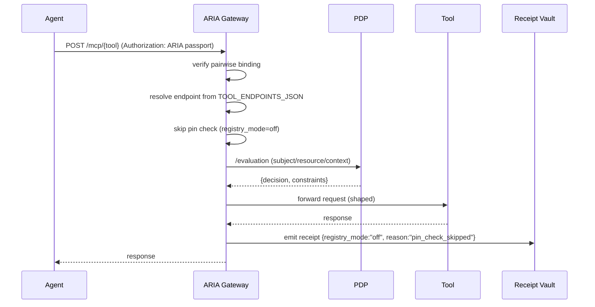

**Short answer:**
Yes—you can treat the **Tool Registry** as a **feature‑flagged component**. The rest of the ARIA v1 stack (IdP, ARIA Gateway, PDP, BFF, Receipt Vault) can still run with the registry **disabled** or in **advisory** mode. You’ll keep functionality (agents can call tools, budgets enforced, PDP decisions, receipts), but you’ll **lose schema‑pin guarantees** (drift protection and rollout grace checks). Below is a complete drop‑in plan with diagrams, flags, code deltas, and risk guardrails.

---

## 0) Modes (how the flag works)

| Mode                   | Env settings (primary)                                                            | Behavior at runtime                                                                                                                      | Security posture                                                   |
| ---------------------- | --------------------------------------------------------------------------------- | ---------------------------------------------------------------------------------------------------------------------------------------- | ------------------------------------------------------------------ |
| **strict** *(default)* | `ENABLE_TOOL_REGISTRY=true`, `ARIA_SCHEMA_PIN_MODE=strict`                        | IdP embeds pins from Registry. ARIA fetches metadata and **enforces** exact match (or *previous within grace*). Schema drift → **deny**. | **Strong** (schema integrity + rollout windows)                    |
| **advisory**           | `ENABLE_TOOL_REGISTRY=true`, `ARIA_SCHEMA_PIN_MODE=advisory`                      | ARIA tries to verify. Mismatch or Registry outage → **allow** but mark receipt with `pin_verified=false` + metric/alert.                 | **Moderate** (observability, no hard stop)                         |
| **off**                | `ENABLE_TOOL_REGISTRY=false`, `ARIA_SCHEMA_PIN_MODE=off` (+ optional static maps) | IdP can omit pins or use **static pins**; ARIA **skips pin checks** and uses **static tool endpoints** (env map).                        | **Weak** for schema integrity (budget, PDP, egress still enforced) |

> Optional safety belt (recommended):
> `ALLOW_HIGH_RISK_WITHOUT_REGISTRY=false` → even in `advisory|off`, **deny** any `risk_tier=high` tools unless the registry is online (or an override allowlist is set).

---

## 1) Where the flag sits (fabric view)

```mermaid
flowchart LR
  subgraph Control Plane
    IDP[EmpowerNow IdP]
    PDP[AuthZEN PDP]
    MEM[Membership (Neo4j)]
    REG[(Tool Registry)]
    RV[Receipt Vault]
  end
  subgraph Data Plane
    ARIA[ARIA Gateway]
    TOOLS[MCP/HTTP Tools]
  end

  IDP -- pins (strict/advisory) --> REG
  ARIA -- verify + endpoint (strict/advisory) --> REG
  ARIA -- receipts --> RV
  PDP -- constraints --> ARIA
  ARIA -- egress --> TOOLS

  classDef on fill:#0b8457,stroke:#0a6;
  classDef off fill:#aaa,stroke:#666,color:#222;

  class REG on;
```

**Flagged states:**

* **strict**/**advisory**: arrows to **REG** active.
* **off**: Registry box turns **gray**, ARIA + IdP use **static maps** and skip pin checks.

---

## 2) Drop‑in code changes (minimal and contained)

Below are deltas you can paste into your existing services to introduce the feature flag and its behavior. Everything else in your stack remains unchanged.

### 2.1 ARIA Gateway — add flag & fallbacks

**File:** `aria/main.py` (additions/changes marked)

```python
# ... existing imports ...
import os, time, json, hashlib, jwt, httpx, aioredis, logging
from typing import Optional, Dict, Any

log = logging.getLogger("aria")

PDP_URL = os.environ.get("PDP_URL", "http://pdp:8000")
RECEIPT_VAULT = os.environ.get("RECEIPT_VAULT_URL", "http://receipt-vault:8084")

# --- Feature flags & fallbacks
ENABLE_TOOL_REGISTRY = os.environ.get("ENABLE_TOOL_REGISTRY", "true").lower() == "true"
ARIA_SCHEMA_PIN_MODE = os.environ.get("ARIA_SCHEMA_PIN_MODE", "strict").lower()  # strict|advisory|off
ALLOW_HIGH_RISK_WITHOUT_REGISTRY = os.environ.get("ALLOW_HIGH_RISK_WITHOUT_REGISTRY", "false").lower() == "true"
REGISTRY_URL = os.environ.get("REGISTRY_URL", "http://tool-registry:8081")

# optional static maps when registry is off or down
STATIC_ENDPOINTS = json.loads(os.environ.get("TOOL_ENDPOINTS_JSON", "{}"))
STATIC_PINS = json.loads(os.environ.get("STATIC_TOOL_PINS_JSON", "{}"))
REGISTRY_GRACE_SECONDS_DEFAULT = int(os.environ.get("REGISTRY_GRACE_SECONDS_DEFAULT", "14400"))
DEFAULT_RISK_TIER = os.environ.get("DEFAULT_TOOL_RISK_TIER", "med")
DEFAULT_AUTH_MODE = os.environ.get("DEFAULT_TOOL_AUTH_MODE", "api_key")
DEFAULT_COST_PER_CALL = float(os.environ.get("DEFAULT_COST_PER_CALL", "0.05"))

# registry client is created only if enabled
registry = None
if ENABLE_TOOL_REGISTRY:
    from clients.tool_registry_client import ToolRegistryClient
    registry = ToolRegistryClient(REGISTRY_URL)

# --- helper to resolve tool meta with graceful fallback
async def resolve_tool_meta(tool_id: str) -> Dict[str, Any]:
    """
    Returns a dict with at least: endpoint, schema_version?, schema_hash?, previous_*, updated_at, grace_seconds, risk_tier, auth_mode, cost_per_call
    """
    # 1) try registry if enabled
    if ENABLE_TOOL_REGISTRY and registry:
        try:
            meta = await registry.get_tool(tool_id)
            # ensure grace_seconds present for verification
            meta.setdefault("grace_seconds", REGISTRY_GRACE_SECONDS_DEFAULT)
            return meta
        except Exception as e:
            if ARIA_SCHEMA_PIN_MODE == "strict":
                log.error("ToolRegistry error (strict): %s", e)
                raise
            log.warning("ToolRegistry error (%s) – falling back: %s", ARIA_SCHEMA_PIN_MODE, e)

    # 2) fallback to static maps
    endpoint = STATIC_ENDPOINTS.get(tool_id)
    if not endpoint and ARIA_SCHEMA_PIN_MODE == "strict":
        raise HTTPException(503, "tool endpoint unavailable (registry required)")
    # best-effort defaults
    now = int(time.time())
    return {
        "id": tool_id,
        "endpoint": endpoint or "",                       # empty -> will fail on forward if unset
        "schema_version": (STATIC_PINS.get(tool_id) or {}).get("schema_version"),
        "schema_hash": (STATIC_PINS.get(tool_id) or {}).get("schema_hash"),
        "previous_version": None,
        "previous_hash": None,
        "updated_at": now,
        "grace_seconds": REGISTRY_GRACE_SECONDS_DEFAULT,
        "risk_tier": DEFAULT_RISK_TIER,
        "auth_mode": DEFAULT_AUTH_MODE,
        "cost_per_call": DEFAULT_COST_PER_CALL,
    }

async def verify_schema_pin_regime(tool_id: str, schema_pin: Optional[Dict[str, str]], tool_meta: Dict[str, Any]) -> tuple[bool, str]:
    """
    Returns (ok, reason). Honors ARIA_SCHEMA_PIN_MODE and risk-tier guard.
    """
    mode = ARIA_SCHEMA_PIN_MODE
    risk = (tool_meta.get("risk_tier") or DEFAULT_RISK_TIER).lower()

    # gating for high-risk tools when registry is off
    if mode in ("advisory", "off") and risk == "high" and not ALLOW_HIGH_RISK_WITHOUT_REGISTRY and ENABLE_TOOL_REGISTRY is False:
        return False, "registry_off_high_risk_denied"

    if mode == "off":
        return True, "pin_check_skipped"

    # advisory/strict path
    if not schema_pin:
        if mode == "strict":
            return False, "missing_schema_pin"
        return True, "missing_pin_advisory"

    # if we have no current metadata (e.g., registry down & no static pin), advisory passes with reason
    current_v = tool_meta.get("schema_version"); current_h = tool_meta.get("schema_hash")
    if not current_v or not current_h:
        return (mode != "strict", "no_current_meta")

    if schema_pin.get("schema_version") == current_v and schema_pin.get("schema_hash") == current_h:
        return True, "pin_exact"

    # previous within grace?
    prev_v = tool_meta.get("previous_version"); prev_h = tool_meta.get("previous_hash")
    updated_at = int(tool_meta.get("updated_at") or 0)
    within_grace = (time.time() - updated_at) <= int(tool_meta.get("grace_seconds") or REGISTRY_GRACE_SECONDS_DEFAULT)
    if prev_v and prev_h and within_grace and \
       schema_pin.get("schema_version") == prev_v and schema_pin.get("schema_hash") == prev_h:
        return True, "pin_previous_within_grace"

    if mode == "strict":
        return False, "pin_mismatch"
    return True, "pin_mismatch_advisory"

# ... existing FastAPI app and endpoints ...

@app.post("/mcp/{tool_id}")
async def mcp(tool_id: str, request: Request, authorization: str = Header(...)):
    token = authorization.replace("Bearer ", "")
    passport = jwt.decode(token, options={"verify_signature": False})
    # pairwise binding as before...
    if not verify_user_binding(passport):
        raise HTTPException(403, "user binding violation")

    aria = passport["aria"]
    agent_id = passport["act"]["sub"]
    call_id = aria["call_id"]

    # resolve tool meta (registry or static)
    tool_meta = await resolve_tool_meta(tool_id)

    # schema pin (may be missing when registry is off)
    schema_pin = (aria.get("schema_pins") or {}).get(tool_id)
    ok, pin_reason = await verify_schema_pin_regime(tool_id, schema_pin, tool_meta)
    if not ok:
        raise HTTPException(403, f"schema pin check failed: {pin_reason}")

    # request body
    body = await request.json()

    # plan + budget enforcement as before...
    # cost default falls back from tool_meta when registry is off
    cost = float(tool_meta.get("cost_per_call", DEFAULT_COST_PER_CALL))
    ok_budget, debited, remaining = await debit_budget(app.state.redis, call_id, agent_id, cost)
    if not ok_budget:
        raise HTTPException(402, "budget exceeded")

    # PDP evaluation (unchanged) ...
    pdp_out = await pdp.evaluate(
        subject={"type":"agent","id":agent_id,"properties":{"bound_user":passport["sub"]}},
        action={"name":"execute"},
        resource={"type":"tool","id":tool_id,"properties":{"schema_hash": (schema_pin or {}).get("schema_hash")}},
        context={"budget_remaining": remaining, "capability": tool_id}
    )
    if not pdp_out.get("decision"):
        raise HTTPException(403, "PDP denied")
    constraints = (pdp_out.get("context") or {}).get("constraints", {})

    # enforce constraints & egress (unchanged) ...
    await enforce_preconditions(constraints, request)
    await enforce_egress(tool_meta, constraints)
    shaped = enforce_params_allowlist(body, constraints)

    # Forward to tool (endpoint may come from static map)
    if not tool_meta.get("endpoint"):
        raise HTTPException(503, "tool endpoint not configured")
    async with httpx.AsyncClient(timeout=15.0) as http:
        r = await http.post(tool_meta["endpoint"], json=shaped,
                            headers={"X-Delegator-ID": passport["sub"], "X-Agent-ID": agent_id})
    r.raise_for_status()
    resp_json = r.json()

    # Step advance (if plan) ...

    # Emit receipt (annotate registry mode + pin result)
    payload = {
        "id": str(uuid.uuid4()),
        "call_id": call_id,
        "agent_id": agent_id,
        "resource": {"type":"tool","id":tool_id},
        "decision": "Allow",
        "policy_snapshot": {**constraints, "registry_mode": ARIA_SCHEMA_PIN_MODE},
        "schema_hash": (schema_pin or {}).get("schema_hash"),
        "params_hash": canonical_params_hash(shaped),
        "usage": None,
        "reason": pin_reason
    }
    prev = await app.state.redis.get(f"receipt:last:{agent_id}") or b"0"*64
    rec = await receipts.emit({**payload, "_prev_hash": prev.decode() if isinstance(prev,bytes) else prev})
    await app.state.redis.set(f"receipt:last:{agent_id}", rec["hash"], ex=86400)

    return resp_json
```

**What changed?**

* New flags & static maps.
* `resolve_tool_meta()` gracefully falls back when the registry is unavailable or disabled.
* `verify_schema_pin_regime()` implements **strict/advisory/off** semantics + a **high‑risk guard**.
* Receipts include `registry_mode` and `reason` so audit shows what happened.

---

### 2.2 IdP — optional pin embedding fallback

**File:** `idp/main.py` (change just the pin fetch path)

```python
# ... existing imports ...
ENABLE_TOOL_REGISTRY = os.environ.get("ENABLE_TOOL_REGISTRY", "true").lower() == "true"
TOOL_REGISTRY_URL = os.getenv("TOOL_REGISTRY_URL", "http://tool-registry:8081")
STATIC_TOOL_PINS = json.loads(os.environ.get("STATIC_TOOL_PINS_JSON", "{}"))

http = httpx.AsyncClient(timeout=1.5)

async def get_tool_pin(tool_id: str) -> dict | None:
    if ENABLE_TOOL_REGISTRY:
        r = await http.get(f"{TOOL_REGISTRY_URL.rstrip('/')}/tools/{tool_id}")
        r.raise_for_status()
        meta = r.json()
        return {"schema_version": meta.get("schema_version"), "schema_hash": meta.get("schema_hash")}
    # registry disabled -> use static pins if provided (or return None)
    return STATIC_TOOL_PINS.get(tool_id)

# ... in aria_token_exchange() where schema_pins are built ...
schema_pins = {}
for t in req.requested_tools:
    pin = await get_tool_pin(t)
    if pin:  # if registry is off and static pin missing, we simply omit
        schema_pins[t] = pin

passport = {
  # ... as before ...
  "aria": {
    # ...
    "schema_pins": schema_pins or {},   # may be empty when registry off
    # ...
  }
}
```

**Behavior:**

* With registry **on**, IdP pins from live catalog.
* With registry **off**, IdP **optionally** embeds pins from `STATIC_TOOL_PINS_JSON`; if none, the passport simply carries an **empty** pin map. ARIA will honor `ARIA_SCHEMA_PIN_MODE`.

---

## 3) Compose toggles (one‑line changes)

* **Strict (default):** leave as‑is; keep `tool-registry` service up.
* **Advisory:** keep the service, but allow traffic on mismatch:

  ```yaml
  environment:
    - ENABLE_TOOL_REGISTRY=true
    - ARIA_SCHEMA_PIN_MODE=advisory
  ```
* **Off (fully disable service):** remove `tool-registry` from compose (or stop it), and set:

  ```yaml
  aria:
    environment:
      - ENABLE_TOOL_REGISTRY=false
      - ARIA_SCHEMA_PIN_MODE=off
      - TOOL_ENDPOINTS_JSON={"mcp:flights:search":"https://tools.example.com/mcp/flights/search"}
      - STATIC_TOOL_PINS_JSON={"mcp:flights:search":{"schema_version":"1.2.0","schema_hash":"sha256:deadbeef"}}
      - DEFAULT_COST_PER_CALL=0.05
      - DEFAULT_TOOL_RISK_TIER=med
      - ALLOW_HIGH_RISK_WITHOUT_REGISTRY=false   # recommended
  idp:
    environment:
      - ENABLE_TOOL_REGISTRY=false
      - STATIC_TOOL_PINS_JSON={"mcp:flights:search":{"schema_version":"1.2.0","schema_hash":"sha256:deadbeef"}}
  ```

---

## 4) What still works when the registry is **off**

* **Identity & delegation:** pairwise agent identities via IdP; Membership‑backed capability checks via PDP.
* **Budgets & plans:** plan contracts, idempotent debits, hard budgets.
* **Policy constraints:** PDP decisions, parameter allowlists, egress allowlists.
* **Receipts:** signed, hash‑chained receipts; they will record `registry_mode=off` and `reason=pin_check_skipped`.
* **Tool routing:** via `TOOL_ENDPOINTS_JSON` static map.

**What you lose**

* **Schema drift protection:** no authoritative `{schema_version, schema_hash}` verification.
* **Graceful rollouts:** no “current/previous within grace” logic from catalog timestamps.
* **Risk‑tier aware denies on catalog content:** unless you enforce `ALLOW_HIGH_RISK_WITHOUT_REGISTRY=false`.

---

## 5) Observability & tripwires you should add

* **Counters:**

  * `aria.registry.mode{mode}` (gauge or info metric label)
  * `aria.schema_pin.mismatch_total{mode,tool_id}`
  * `aria.registry.fallback_total{reason}`
* **Receipts:** we already attach `policy_snapshot.registry_mode` and `reason`.
* **Alerts:** if running in **advisory**, alert on sustained mismatches for any tool.

---

## 6) Quick diagram of runtime with registry **off**



---

## 7) Acceptance tests you can add

1. **Registry off path**

* Set `ENABLE_TOOL_REGISTRY=false`, provide `TOOL_ENDPOINTS_JSON`.
* Call `/mcp/{tool}` and verify:

  * response 200,
  * receipt has `policy_snapshot.registry_mode == "off"` and `reason == "pin_check_skipped"`.

2. **Advisory mismatch path**

* Keep registry on, but pass a passport pin that’s old.
* Expect 200 (not 403), receipt `reason == "pin_mismatch_advisory"` and metric incremented.

3. **High‑risk guard**

* Set tool’s `risk_tier` to `high` (or default), run with `ENABLE_TOOL_REGISTRY=false` and `ALLOW_HIGH_RISK_WITHOUT_REGISTRY=false`.
* Expect **403** with reason `registry_off_high_risk_denied`.

---

## 8) Recommendation

* Run **strict** in production.
* Use **advisory** briefly during migrations or registry upgrades.
* Reserve **off** for **air‑gapped demos, POCs, or incident break‑glass**—and combine with:

  * curated **static endpoints**,
  * **static pins** where possible,
  * `ALLOW_HIGH_RISK_WITHOUT_REGISTRY=false`.

---

### TL;DR

* The **Tool Registry** can be **feature‑flagged**.
* With the drop‑in changes above, your stack continues to function when it’s **advisory** or **off**, but you trade away **schema‑pin integrity**.
* All changes are **backward‑compatible** and require **no API shape changes** to IdP, ARIA, PDP, or BFF.
