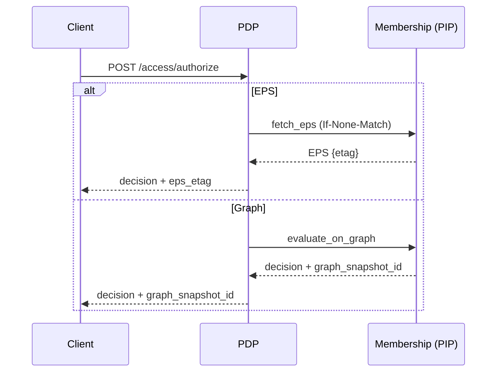

# PDP Authorization API Reference

## POST /access/authorize
Evaluate an authorization decision.

### Request Body
```json
{
  "subject": {"type": "user", "id": "test", "properties": {}},
  "action": {"name": "read"},
  "resource": {
    "type": "form",
    "id": "all",
    "properties": {"pdp_application": "app-eps", "system": "FormsService"}
  },
  "context": {
    "timestamp": "2025-01-24T10:30:00Z",
    "ip_address": "192.168.1.100",
    "user_agent": "Mozilla/5.0",
    "session_id": "sess_12345",
    "request_id": "req_67890"
  }
}
```

Notes:
- `resource.properties.pdp_application` selects the application scope; if omitted, boundary falls back to global only
- `context` is optional; fields may be used by policies (conditions/obligations)

### Response Body
```json
{
  "decision": true,
  "context": {
    "id": "uuid",
    "reason_admin": {"en": "..."},
    "reason_user": {"en": "..."},
    "constraints": [
      {"id": "spend_user_daily", "type": "spend_budget", "parameters": {"scope": "user", "period": "daily", "limit_usd": 5.0}}
    ],
    "extended": {
      "timestamp": "2025-09-13T20:40:50.191Z",
      "correlation_id": "uuid",
      "policies": [
        {"policy_id": "TestPolicy", "policy_name": "Test Policy", "effect": "permit"}
      ],
      "decision_factors": [
        {"factor": "policy_allowed", "policy_id": "TestPolicy", "impact": "permit"}
      ]
    },
    "provenance": {
      "eps_etag": "W/\"...\"",
      "graph_snapshot_id": null
    }
  }
}
```

### Provenance
- EPS mode: `provenance.eps_etag` present; `graph_snapshot_id` null
- Graph‑Eval mode: `provenance.graph_snapshot_id` present

### Evaluation Mode Selection
Environment flags impacting behavior:
- `GRAPH_EVAL_ENABLED`: gates graph evaluation path
- `EVALUATION_MODE`: default `eps|graph`
- `GRAPH_EVAL_APPS`: per‑app override list (comma‑separated)

### Decision Receipts
Receipts are emitted asynchronously and not returned in the HTTP response. See `docs/operations/governance_auditability.md`.

Receipt minimal shape:
```json
{
  "event_type": "decision_receipt",
  "data": {
    "decision_id": "...",
    "eps_etag": "W/\"...\"",
    "graph_snapshot_id": null,
    "policy_refs": ["policy:...@rev"],
    "degraded": false,
    "correlation_id": "..."
  }
}
```

### Error Responses
- 400: malformed request body
- 401/403: authentication/authorization at API gateway (if enabled)
- 500: server error; see logs with `correlation_id`

### Examples
- EPS decision with constraints (see Quickstart)
- Graph‑Eval permit with `graph_snapshot_id`


